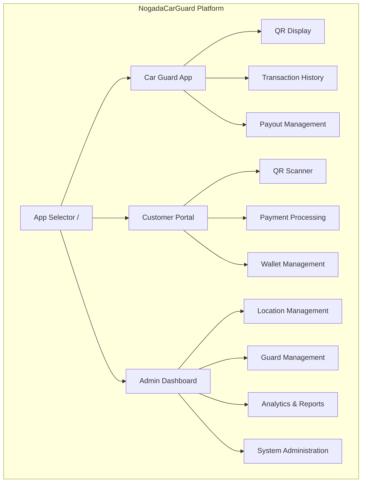
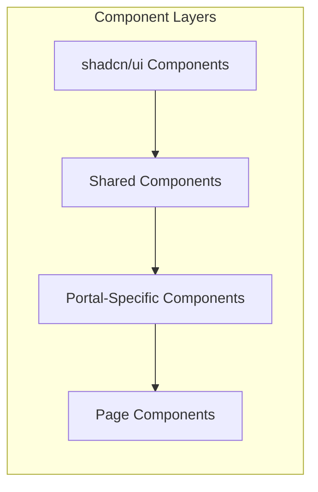

# Claude AI Assistant Guide for NogadaCarGuard

This document provides comprehensive guidance for Claude AI (claude.ai/code) when working with the NogadaCarGuard project.

## Project Overview

**NogadaCarGuard** is a multi-portal car guard tipping system built with React, TypeScript, and Vite. The platform consists of three integrated applications:

1. **Car Guard App** - Mobile-friendly QR-based tip collection interface
2. **Customer Portal** - Customer-facing tipping and payment interface  
3. **Admin Dashboard** - Comprehensive management and analytics platform

## Essential Commands

### Development
```bash
# Install dependencies
npm install

# Start development server (port 8080, binds to all interfaces)
npm run dev

# The dev server will be accessible at:
# - http://localhost:8080
# - http://[your-ip]:8080 (for network testing)
```

### Build & Preview
```bash
# Production build
npm run build

# Development build (with dev optimizations)
npm run build:dev

# Preview production build
npm run preview
```

### Code Quality
```bash
# Run ESLint
npm run lint

# Note: TypeScript checking is relaxed (noImplicitAny: false)
# Consider running manual type checks if needed
```

## File Structure & Important Paths

### Source Code Organization
```
src/
├── components/          # Feature-based component organization
│   ├── admin/          # Admin-specific components
│   │   ├── charts/     # Data visualization components
│   │   ├── AdminHeader.tsx
│   │   ├── AdminSidebar.tsx
│   │   ├── FilterSection.tsx
│   │   └── StatsCard.tsx
│   ├── car-guard/      # Car guard app components
│   │   ├── BottomNavigation.tsx
│   │   └── QRCodeDisplay.tsx
│   ├── customer/       # Customer portal components
│   │   └── CustomerNavigation.tsx
│   ├── shared/         # Shared across all portals
│   │   ├── NogadaLogo.tsx
│   │   └── TippaLogo.tsx
│   └── ui/             # 50+ shadcn/ui components
├── pages/              # Page components by portal
│   ├── admin/          # 14 admin pages
│   ├── car-guard/      # 6 car guard pages
│   └── customer/       # 7 customer pages
├── data/               # Mock data and TypeScript interfaces
│   └── mockData.ts     # Complete mock data with helper functions
├── hooks/              # Custom React hooks
│   ├── use-mobile.tsx  # Mobile detection
│   └── use-toast.ts    # Toast notifications
├── lib/                # Utilities
│   └── utils.ts        # cn() and other helpers
├── App.tsx             # Main app with routing
├── main.tsx           # React bootstrap
└── index.css          # Global styles
```

### Configuration Files
```
C:\IonicProjects\NogadaCarGuard\
├── vite.config.ts      # Vite configuration (port 8080, path aliases)
├── tailwind.config.ts  # Tailwind with tippa color palette
├── tsconfig.json       # TypeScript config (relaxed settings)
├── eslint.config.js    # ESLint configuration
├── components.json     # shadcn/ui configuration
├── package.json        # Dependencies and scripts
└── postcss.config.js   # PostCSS configuration
```

## Architecture Overview

### Multi-Portal Architecture


### Component Architecture


## Development Workflow

### 1. Feature Development
```bash
# 1. Create feature branch
git checkout -b feature/your-feature-name

# 2. Start dev server
npm run dev

# 3. Make changes following patterns:
# - Use existing shadcn/ui components from src/components/ui/
# - Follow portal-specific component patterns
# - Use TypeScript interfaces from mockData.ts
# - Apply Tailwind classes with tippa color palette

# 4. Test your changes
# - Navigate to appropriate portal (/car-guard, /customer, /admin)
# - Test responsive behavior
# - Verify routing works correctly

# 5. Run linting
npm run lint

# 6. Build to verify
npm run build
```

### 2. Component Creation Pattern
```typescript
// Example: Creating a new admin component
// File: src/components/admin/YourComponent.tsx

import { Card, CardContent, CardHeader, CardTitle } from "@/components/ui/card";
import { cn } from "@/lib/utils";

interface YourComponentProps {
  className?: string;
  // Add your props
}

export function YourComponent({ className, ...props }: YourComponentProps) {
  return (
    <Card className={cn("", className)}>
      <CardHeader>
        <CardTitle>Your Title</CardTitle>
      </CardHeader>
      <CardContent>
        {/* Your content */}
      </CardContent>
    </Card>
  );
}
```

### 3. Adding Routes
```typescript
// In src/App.tsx, add your route to the appropriate portal section

// For admin routes:
<Route path="admin" element={<AdminLayout />}>
  <Route path="your-route" element={<YourPage />} />
</Route>

// For car guard routes:
<Route path="car-guard" element={<CarGuardLayout />}>
  <Route path="your-route" element={<YourPage />} />
</Route>

// For customer routes:
<Route path="customer" element={<CustomerLayout />}>
  <Route path="your-route" element={<YourPage />} />
</Route>
```

## Key Configuration Details

### Vite Configuration (`vite.config.ts`)
```typescript
{
  plugins: [react({ plugins: [["@swc/plugin-react-refresh", {}]] })],
  resolve: {
    alias: {
      "@": path.resolve(__dirname, "./src"),
    },
  },
  server: {
    host: "::",  // Binds to all interfaces
    port: 8080,  // Custom port
    open: true   // Opens browser on start
  }
}
```

### TypeScript Configuration (`tsconfig.json`)
```json
{
  "compilerOptions": {
    "target": "ES2020",
    "module": "ESNext",
    "jsx": "react-jsx",
    "strict": false,           // Relaxed type checking
    "noImplicitAny": false,    // Allows implicit any
    "strictNullChecks": false, // Relaxed null checks
    "paths": {
      "@/*": ["./src/*"]       // Path alias
    }
  }
}
```

### Tailwind Configuration (`tailwind.config.ts`)
- Custom `tippa` color palette for branding
- shadcn/ui theme variables in CSS custom properties
- Typography plugin for rich text
- Animation utilities included

## Data Models & Mock Data

### Key TypeScript Interfaces
```typescript
// From src/data/mockData.ts

interface CarGuard {
  id: string;
  name: string;
  email: string;
  phone: string;
  balance: number;
  pendingTips: number;
  qrCode: string;
  locationId: string;
  managerId?: string;
  status: 'active' | 'inactive';
  bankDetails?: BankDetails;
  joinedDate: string;
}

interface Customer {
  id: string;
  name: string;
  email: string;
  phone: string;
  walletBalance: number;
  totalTipped: number;
  joinedDate: string;
}

interface Tip {
  id: string;
  guardId: string;
  customerId: string;
  amount: number;
  date: string;
  time: string;
  status: 'pending' | 'completed' | 'failed';
  paymentMethod: 'wallet' | 'card' | 'cash';
}

interface Transaction {
  id: string;
  guardId: string;
  type: 'tip' | 'payout' | 'airtime' | 'electricity' | 'voucher';
  amount: number;
  date: string;
  time: string;
  status: 'pending' | 'completed' | 'failed';
  reference: string;
  description: string;
}
```

### Helper Functions Available
```typescript
// Utility functions from mockData.ts
getTipsByGuardId(guardId: string): Tip[]
getTipsByCustomerId(customerId: string): Tip[]
getPayoutsByGuardId(guardId: string): Payout[]
getGuardsByManagerId(managerId: string): CarGuard[]
getGuardsByLocationId(locationId: string): CarGuard[]
getManagersByLocationId(locationId: string): Manager[]
getTransactionsByGuardId(guardId: string): Transaction[]

// Formatting utilities
formatCurrency(amount: number): string  // Returns "R 123.45"
formatDate(date: string): string        // Returns "Aug 25, 2025"
formatTime(time: string): string        // Returns "2:30 PM"
formatDateTime(date: string, time: string): string
```

## Component Patterns

### Using shadcn/ui Components
```typescript
// Always import from @/components/ui/
import { Button } from "@/components/ui/button";
import { Input } from "@/components/ui/input";
import { Label } from "@/components/ui/label";
import {
  Card,
  CardContent,
  CardDescription,
  CardFooter,
  CardHeader,
  CardTitle,
} from "@/components/ui/card";

// Use with Tailwind classes
<Button className="w-full" variant="default" size="lg">
  Click Me
</Button>
```

### Form Handling Pattern
```typescript
// Using React Hook Form + Zod
import { useForm } from "react-hook-form";
import { zodResolver } from "@hookform/resolvers/zod";
import * as z from "zod";

const formSchema = z.object({
  email: z.string().email(),
  password: z.string().min(8),
});

type FormData = z.infer<typeof formSchema>;

function MyForm() {
  const form = useForm<FormData>({
    resolver: zodResolver(formSchema),
  });
  
  const onSubmit = (data: FormData) => {
    // Handle form submission
  };
  
  return (
    <form onSubmit={form.handleSubmit(onSubmit)}>
      {/* Form fields */}
    </form>
  );
}
```

### Layout Patterns

#### Admin Layout (with Sidebar)
```typescript
// Uses SidebarProvider pattern
<SidebarProvider>
  <div className="min-h-screen flex w-full">
    <AdminSidebar />
    <main className="flex-1">
      <AdminHeader />
      <Outlet /> {/* Page content */}
    </main>
  </div>
</SidebarProvider>
```

#### Car Guard Layout (with Bottom Navigation)
```typescript
// Mobile-first with bottom navigation
<div className="min-h-screen bg-background">
  <Outlet /> {/* Page content */}
  <BottomNavigation />
</div>
```

#### Customer Layout (with Top Navigation)
```typescript
// Standard top navigation
<div className="min-h-screen bg-background">
  <CustomerNavigation />
  <main className="container mx-auto px-4 py-8">
    <Outlet /> {/* Page content */}
  </main>
</div>
```

## Testing Approach

### Current State
- No test files currently exist in the project
- No testing framework configured
- Mock data available for development testing

### Recommended Testing Setup
```bash
# TO BE IMPLEMENTED
# Install testing dependencies
npm install -D vitest @testing-library/react @testing-library/jest-dom

# Add test script to package.json
"scripts": {
  "test": "vitest",
  "test:ui": "vitest --ui",
  "test:coverage": "vitest --coverage"
}
```

## Deployment Considerations

### Build Output
```bash
# Production build creates dist/ folder
npm run build

# Output structure:
dist/
├── index.html
├── assets/
│   ├── index-[hash].js
│   ├── index-[hash].css
│   └── vendor-[hash].js
└── [public assets]
```

### Environment Variables
Currently, no environment variables are configured. For production:

```bash
# Create .env files for different environments
.env.development
.env.production
.env.staging

# Access in code
const API_URL = import.meta.env.VITE_API_URL;
```

### Deployment Checklist
- [ ] Run `npm run build`
- [ ] Test build with `npm run preview`
- [ ] Configure environment variables
- [ ] Set up proper API endpoints (replace mock data)
- [ ] Configure authentication
- [ ] Set up monitoring
- [ ] Configure CDN for static assets
- [ ] Set up SSL certificates

## Common Tasks

### Adding a New Portal Page
1. Create page component in `src/pages/[portal-name]/`
2. Add route in `src/App.tsx`
3. Update navigation component if needed
4. Add to appropriate portal layout

### Updating Mock Data
1. Edit `src/data/mockData.ts`
2. Update TypeScript interfaces if needed
3. Update helper functions if relationships change
4. Test affected components

### Customizing Theme
1. Edit `tailwind.config.ts` for color changes
2. Update CSS variables in `src/index.css` for shadcn/ui
3. Use `tippa-*` color classes for brand consistency

### Working with QR Codes
```typescript
import QRCode from "react-qr-code";

<QRCode
  value={`nogada://tip/${guardId}`}
  size={256}
  level="H"
  className="w-full h-full"
/>
```

## Performance Optimization

### Current Optimizations
- Vite with SWC for fast compilation
- Code splitting by route
- Lazy loading for portal components
- Tailwind CSS purging unused styles

### Recommendations
- Implement React.memo for heavy components
- Use React Query for server state caching
- Implement virtual scrolling for long lists
- Optimize images with proper formats and sizes

## Troubleshooting

### Common Issues

#### Port 8080 Already in Use
```bash
# Find process using port
netstat -ano | findstr :8080

# Kill process or change port in vite.config.ts
```

#### TypeScript Errors Not Showing
- TypeScript is configured with relaxed settings
- Run explicit type check if needed:
```bash
npx tsc --noEmit
```

#### Build Failures
```bash
# Clear cache and rebuild
rm -rf node_modules dist
npm install
npm run build
```

#### Component Not Rendering
- Check route configuration in App.tsx
- Verify import paths use `@/` alias
- Check for console errors
- Verify component export (named vs default)

## Best Practices

### Code Organization
1. Keep components small and focused
2. Use portal-specific folders for portal components
3. Share common components in `shared/` folder
4. Use shadcn/ui components as base building blocks

### State Management
1. Use React Query for server state
2. Use React Hook Form for form state
3. Use context for portal-specific global state
4. Keep component state local when possible

### Styling
1. Use Tailwind utility classes
2. Apply `tippa-*` colors for branding
3. Use `cn()` utility for conditional classes
4. Keep custom CSS minimal

### Type Safety
1. Define interfaces for all data structures
2. Use type inference where possible
3. Avoid `any` type despite relaxed config
4. Export/import types explicitly

---
**Document Information:**
- **Last Updated**: 2025-08-25
- **Status**: Active
- **Owner**: Development Team
- **Purpose**: AI Assistant guidance for development tasks