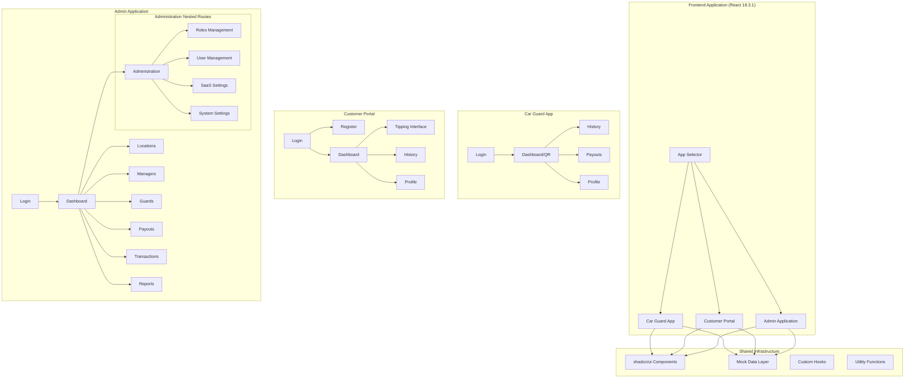
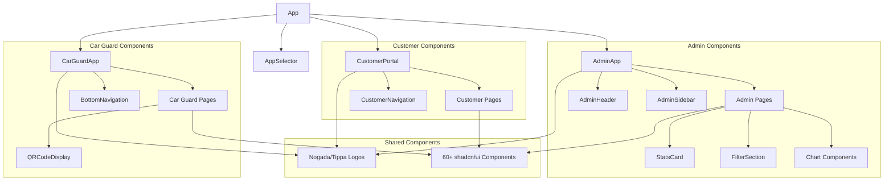
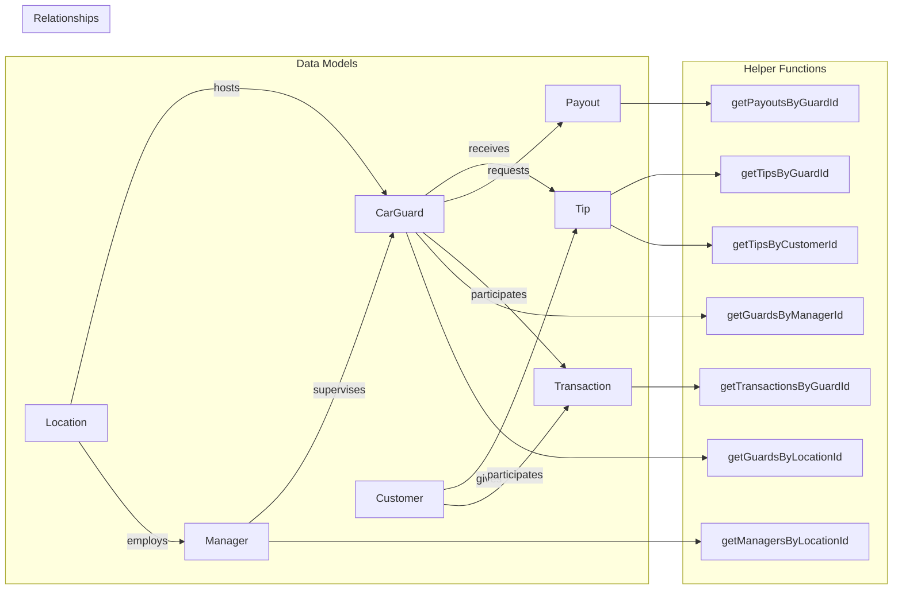

# Architecture Analysis

## System Architecture Overview

NogadaCarGuard implements a **multi-portal single-page application (SPA)** architecture, serving three distinct user types through a unified React codebase. The system uses modern React patterns with TypeScript for type safety and shadcn/ui for consistent component design.

## High-Level Architecture



## Routing Architecture

### React Router v6 Nested Structure

The application uses **React Router v6** with nested routing to create clear separation between portals while sharing common infrastructure.

```typescript
// Route Structure
<Routes>
  <Route path="/" element={<AppSelector />} />
  
  {/* Car Guard App Routes */}
  <Route path="/car-guard" element={<CarGuardApp />}>
    <Route index element={<CarGuardLogin />} />
    <Route path="dashboard" element={<CarGuardDashboard />} />
    <Route path="history" element={<CarGuardHistory />} />
    <Route path="payouts" element={<CarGuardPayouts />} />
    <Route path="profile" element={<CarGuardProfile />} />
  </Route>

  {/* Customer Portal Routes */}
  <Route path="/customer" element={<CustomerPortal />}>
    <Route index element={<CustomerLogin />} />
    <Route path="register" element={<CustomerRegister />} />
    <Route path="dashboard" element={<CustomerDashboard />} />
    <Route path="tip/:guardId" element={<CustomerTipping />} />
    <Route path="history" element={<CustomerHistory />} />
    <Route path="profile" element={<CustomerProfile />} />
  </Route>

  {/* Admin Application Routes */}
  <Route path="/admin" element={<AdminApp />}>
    <Route index element={<AdminLogin />} />
    <Route path="dashboard" element={<AdminDashboard />} />
    <Route path="locations" element={<AdminLocations />} />
    <Route path="managers" element={<AdminManagers />} />
    <Route path="guards" element={<AdminGuards />} />
    <Route path="payouts" element={<AdminPayouts />} />
    <Route path="transactions" element={<AdminTransactions />} />
    <Route path="reports" element={<AdminReports />} />
    
    {/* Nested Administration Routes */}
    <Route path="administration" element={<AdminAdministration />}>
      <Route path="roles" element={<AdminRoles />} />
      <Route path="users" element={<AdminUsers />} />
      <Route path="saas" element={<AdminSaaS />} />
      <Route path="settings" element={<AdminSettings />} />
    </Route>
  </Route>
  
  <Route path="*" element={<NotFound />} />
</Routes>
```

### Route Benefits
- **Clear Separation**: Each portal has isolated routes and state
- **Nested Layouts**: Shared headers, sidebars, and navigation per portal
- **Deep Linking**: Direct access to specific portal features
- **Breadcrumbs**: Natural hierarchical navigation structure

## Component Architecture

### Component Hierarchy



### Component Design Patterns

#### 1. Container/Presentation Pattern
```typescript
// Container Component (Data Logic)
export function AdminDashboard() {
  const [stats, setStats] = useState(mockStats)
  const [filters, setFilters] = useState(defaultFilters)
  
  return (
    <div className="space-y-6">
      <StatsCard stats={stats} />
      <FilterSection filters={filters} onFilterChange={setFilters} />
    </div>
  )
}

// Presentation Component (UI Only)
interface StatsCardProps {
  stats: Statistics
}

export function StatsCard({ stats }: StatsCardProps) {
  return (
    <Card className="p-6">
      <div className="grid grid-cols-1 md:grid-cols-4 gap-4">
        {/* Statistics display */}
      </div>
    </Card>
  )
}
```

#### 2. Compound Component Pattern (shadcn/ui)
```typescript
// Usage of compound components
<Card>
  <CardHeader>
    <CardTitle>Title</CardTitle>
    <CardDescription>Description</CardDescription>
  </CardHeader>
  <CardContent>
    {/* Content */}
  </CardContent>
  <CardFooter>
    {/* Footer */}
  </CardFooter>
</Card>
```

#### 3. Hook-Based State Management
```typescript
// Custom hook pattern
export function useIsMobile() {
  const [isMobile, setIsMobile] = useState(false)
  
  useEffect(() => {
    const checkIsMobile = () => {
      setIsMobile(window.innerWidth < 768)
    }
    
    checkIsMobile()
    window.addEventListener('resize', checkIsMobile)
    
    return () => window.removeEventListener('resize', checkIsMobile)
  }, [])
  
  return isMobile
}
```

## State Management Architecture

### React Query Integration

The application uses **TanStack Query (React Query) v5.56.2** for server state management, though currently configured for mock data patterns.

```typescript
// Query setup pattern (ready for API integration)
import { useQuery } from '@tanstack/react-query'

export function useCarGuards() {
  return useQuery({
    queryKey: ['carGuards'],
    queryFn: async () => {
      // Mock data return (ready for API replacement)
      return mockCarGuards
    },
    staleTime: 5 * 60 * 1000, // 5 minutes
    cacheTime: 10 * 60 * 1000, // 10 minutes
  })
}
```

### Local State Patterns

```typescript
// Form state with React Hook Form + Zod
import { useForm } from 'react-hook-form'
import { zodResolver } from '@hookform/resolvers/zod'
import { z } from 'zod'

const loginSchema = z.object({
  guardId: z.string().min(1, 'Guard ID is required'),
  password: z.string().min(6, 'Password must be at least 6 characters'),
})

export function LoginForm() {
  const form = useForm<z.infer<typeof loginSchema>>({
    resolver: zodResolver(loginSchema),
    defaultValues: {
      guardId: '',
      password: '',
    },
  })

  const onSubmit = (values: z.infer<typeof loginSchema>) => {
    // Handle login logic
  }

  return (
    <Form {...form}>
      {/* Form JSX */}
    </Form>
  )
}
```

## Data Flow Architecture

### Mock Data Relationships



### Data Access Patterns

```typescript
// Relationship-based data fetching
export const getGuardsByManagerId = (managerId: string): CarGuard[] => {
  return mockCarGuards.filter(guard => guard.managerId === managerId)
}

export const getTipsByGuardId = (guardId: string): Tip[] => {
  return mockTips.filter(tip => tip.guardId === guardId)
}

// Utility functions for data formatting
export const formatCurrency = (amount: number): string => {
  return `R${Math.abs(amount).toFixed(2)}`
}

export const formatDateTime = (dateString: string): string => {
  return `${formatDate(dateString)} ${formatTime(dateString)}`
}
```

## UI Architecture

### shadcn/ui Component System

The application leverages **60+ pre-built components** from shadcn/ui, providing:

#### Component Categories
- **Layout**: Card, Sheet, Sidebar, Tabs, Resizable
- **Forms**: Form, Input, Select, Checkbox, Radio Group, Switch
- **Navigation**: Button, Dropdown Menu, Breadcrumb, Pagination
- **Feedback**: Alert, Toast, Dialog, Hover Card, Tooltip
- **Data Display**: Table, Badge, Avatar, Progress, Chart
- **Overlays**: Modal, Popover, Context Menu, Command Palette

#### Design System Integration
```typescript
// Consistent styling with Tailwind + shadcn/ui
<Card className="p-6 shadow-lg">
  <CardHeader>
    <CardTitle className="text-2xl font-bold text-tippa-primary">
      Dashboard
    </CardTitle>
  </CardHeader>
  <CardContent className="space-y-4">
    <Button variant="default" size="lg" className="w-full">
      Primary Action
    </Button>
  </CardContent>
</Card>
```

### Responsive Design Architecture

```typescript
// Mobile-first responsive patterns
const isMobile = useIsMobile()

return (
  <div className={cn(
    "grid gap-4",
    isMobile ? "grid-cols-1" : "grid-cols-1 md:grid-cols-2 lg:grid-cols-3"
  )}>
    {/* Responsive content */}
  </div>
)
```

## Portal-Specific Architectures

### Car Guard App
- **Mobile-First Design**: Optimized for touch interactions
- **Bottom Navigation**: Tab-based navigation for mobile UX
- **QR Code Integration**: Central QR code display and scanning
- **Offline-Ready**: Local state management for network interruptions

### Customer Portal
- **Progressive Web App**: Web app with mobile capabilities
- **Top Navigation**: Desktop-style navigation with responsive collapse
- **Payment Integration**: Tipping interface with confirmation flows
- **Transaction History**: Detailed transaction tracking

### Admin Application
- **Desktop-First**: Complex dashboard with detailed data views
- **Sidebar Navigation**: Persistent navigation with collapsible sections
- **Data Visualization**: Charts and graphs using Recharts
- **Role-Based Access**: Nested administration routes for system management

## Performance Architecture

### Build Optimization
- **Vite 5.4.1**: Fast development builds with HMR
- **SWC Compilation**: Rust-based TypeScript compilation
- **Code Splitting**: Route-based splitting for optimal loading
- **Tree Shaking**: Unused code elimination

### Runtime Optimization
- **React 18 Features**: Concurrent rendering and suspense
- **Memo Patterns**: Component memoization for expensive renders
- **Lazy Loading**: Route-based lazy loading for code splitting

---

**Document Information**
- **Version**: 1.0.0
- **Last Updated**: 2025-08-25
- **Architecture Pattern**: Multi-Portal SPA
- **Primary Framework**: React 18.3.1 with TypeScript 5.5.3
- **Stakeholders**: Technical Architects, Senior Developers, System Designers
- **Next Review**: 2025-09-25