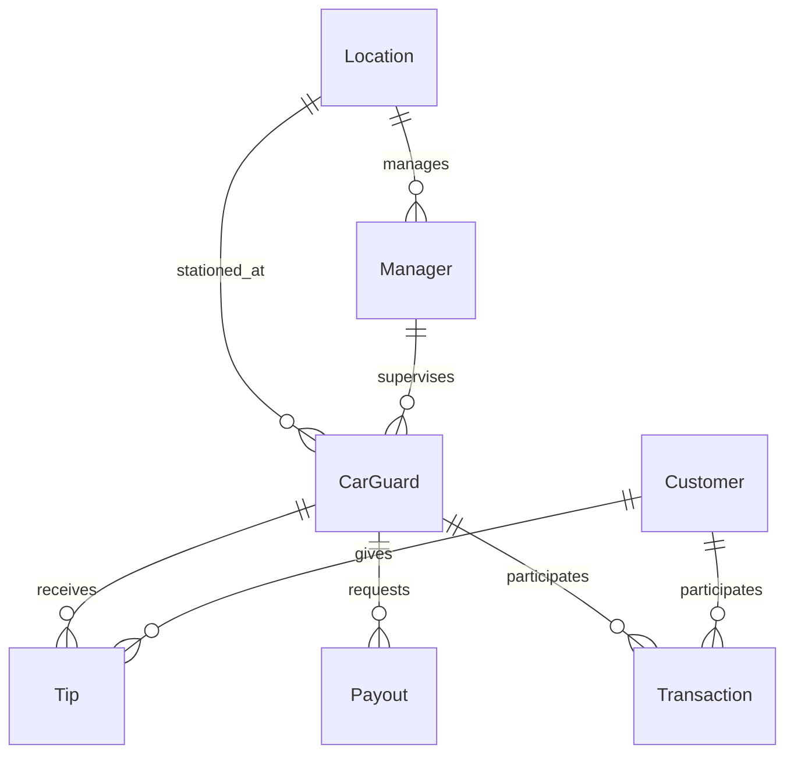

# Codebase Overview

## Project Structure

The NogadaCarGuard project consists of **167 total files** with **101 TypeScript/JavaScript source files**, organized in a feature-driven architecture supporting three distinct portals.

### Root Directory Structure

```
NogadaCarGuard/
├── src/                          # Source code (101 files)
│   ├── components/               # React components (75+ components)
│   ├── pages/                    # Page components (20 pages)
│   ├── data/                     # Mock data and types
│   ├── hooks/                    # Custom React hooks
│   └── lib/                      # Utility functions
├── wiki/                         # Documentation
├── public/                       # Static assets
└── Configuration files           # Vite, TypeScript, Tailwind, ESLint
```

## Source Code Organization

### Components Architecture (`src/components/`)

The component structure follows a **portal-based organization pattern** with shared UI components:

```
components/
├── admin/                        # Admin portal components (6 components)
│   ├── AdminHeader.tsx
│   ├── AdminSidebar.tsx
│   ├── FilterSection.tsx
│   ├── StatsCard.tsx
│   └── charts/                   # Data visualization (2 components)
│       ├── LocationPerformanceChart.tsx
│       └── TipVolumeChart.tsx
├── car-guard/                    # Car guard app components (2 components)
│   ├── BottomNavigation.tsx
│   └── QRCodeDisplay.tsx
├── customer/                     # Customer portal components (1 component)
│   └── CustomerNavigation.tsx
├── shared/                       # Cross-portal components (2 components)
│   ├── NogadaLogo.tsx
│   └── TippaLogo.tsx
└── ui/                          # shadcn/ui base components (60+ components)
    ├── accordion.tsx
    ├── alert-dialog.tsx
    ├── button.tsx
    ├── card.tsx
    ├── form.tsx
    ├── table.tsx
    └── ... (55+ more components)
```

### Pages Structure (`src/pages/`)

**20 page components** organized by portal:

```
pages/
├── AppSelector.tsx               # Root portal selector
├── Index.tsx                     # Landing page
├── NotFound.tsx                  # 404 error page
├── admin/                        # Admin portal pages (13 pages)
│   ├── AdminApp.tsx             # Admin app wrapper
│   ├── AdminDashboard.tsx       # Analytics dashboard
│   ├── AdminLogin.tsx           # Admin authentication
│   ├── AdminLocations.tsx       # Location management
│   ├── AdminManagers.tsx        # Manager management
│   ├── AdminGuards.tsx          # Guard management
│   ├── AdminPayouts.tsx         # Payout processing
│   ├── AdminTransactions.tsx    # Transaction monitoring
│   ├── AdminReports.tsx         # Report generation
│   └── AdminAdministration.tsx  # System administration
│       └── nested routes/        # Roles, Users, SaaS, Settings
├── car-guard/                    # Car guard app pages (6 pages)
│   ├── CarGuardApp.tsx          # Guard app wrapper
│   ├── CarGuardLogin.tsx        # Guard authentication
│   ├── CarGuardDashboard.tsx    # QR code and balance
│   ├── CarGuardHistory.tsx      # Transaction history
│   ├── CarGuardPayouts.tsx      # Payout management
│   └── CarGuardProfile.tsx      # Profile settings
└── customer/                     # Customer portal pages (7 pages)
    ├── CustomerPortal.tsx        # Customer app wrapper
    ├── CustomerLogin.tsx         # Customer authentication
    ├── CustomerRegister.tsx      # Customer registration
    ├── CustomerDashboard.tsx     # Customer dashboard
    ├── CustomerTipping.tsx       # Tipping interface
    ├── CustomerHistory.tsx       # Transaction history
    └── CustomerProfile.tsx       # Profile management
```

## Data Architecture (`src/data/mockData.ts`)

### TypeScript Interfaces

**6 core data models** with comprehensive relationships:

```typescript
interface CarGuard {
  id: string;
  name: string;
  guardId: string;
  location: string;
  locationId?: string;
  balance: number;
  minPayoutThreshold: number;
  qrCode: string;
  managerId?: string;
  phoneNumber?: string;
  bankName?: string;
  accountNumber?: string;
  bankDetails?: string;
}

interface Transaction {
  id: string;
  type: 'tip' | 'withdrawal' | 'purchase' | 'deposit' | 'fee' | 
        'refund' | 'airtime' | 'electricity' | 'payout';
  amount: number;
  guardId?: string;
  guardName?: string;
  customerId?: string;
  customerName?: string;
  managerId?: string;
  timestamp: string;
  location?: string;
  locationId?: string;
  description: string;
  status?: string;
  reference?: string;
}
```

### Data Relationships



### Mock Data Scope

- **3 Car Guards** with complete profiles and bank details
- **3 Customers** with wallet balances
- **5 Tips** across all guards and customers
- **3 Payouts** with different statuses (Issued, Redeemed, Expired)
- **3 Locations** (Mall of Africa, Sandton City, Eastgate Mall)
- **3 Managers** supervising different locations
- **5+ Transactions** covering tip, payout, airtime, and electricity types

## Utility Architecture

### Custom Hooks (`src/hooks/`)

```typescript
// use-mobile.tsx - Responsive design hook
export function useIsMobile() {
  // Breakpoint-based mobile detection
}

// use-toast.ts - Notification management
export const toast = {
  success: (message: string) => void,
  error: (message: string) => void,
  // ... additional toast variants
}
```

### Utility Library (`src/lib/utils.ts`)

```typescript
import { clsx } from "clsx"
import { twMerge } from "tailwind-merge"

// Tailwind class merging utility
export function cn(...inputs: ClassValue[]) {
  return twMerge(clsx(inputs))
}
```

## File Naming Conventions

### Component Naming
- **PascalCase**: `AdminDashboard.tsx`, `QRCodeDisplay.tsx`
- **Feature Prefix**: `AdminHeader.tsx`, `CarGuardLogin.tsx`, `CustomerTipping.tsx`
- **UI Components**: `button.tsx`, `card.tsx`, `form.tsx` (lowercase)

### Directory Naming
- **kebab-case**: `car-guard/`, `admin/`
- **Feature-based**: Components grouped by portal/feature
- **Shared Resources**: `shared/`, `ui/`, `lib/`

### File Extensions
- **Components**: `.tsx` for React components
- **Utilities**: `.ts` for non-component TypeScript
- **Types**: Embedded in `.ts` files, not separate `.d.ts`

## Code Organization Patterns

### Import Structure
```typescript
// External libraries (React, third-party)
import React from 'react'
import { useForm } from 'react-hook-form'

// Internal utilities and hooks
import { cn } from '@/lib/utils'
import { useIsMobile } from '@/hooks/use-mobile'

// Internal components
import { Button } from '@/components/ui/button'
import { AdminHeader } from '@/components/admin/AdminHeader'

// Data and types
import { mockCarGuards, CarGuard } from '@/data/mockData'
```

### Component Patterns
```typescript
// Consistent component structure
export function ComponentName({ prop1, prop2 }: ComponentProps) {
  // Hooks
  const isMobile = useIsMobile()
  
  // State and effects
  const [state, setState] = useState()
  
  // Event handlers
  const handleClick = () => {}
  
  // Render
  return (
    <div className={cn("default-classes", isMobile && "mobile-classes")}>
      {/* Component JSX */}
    </div>
  )
}
```

## Development Patterns

### Path Aliases
- `@/` → `src/` for clean imports
- Configured in `tsconfig.json` and `vite.config.ts`

### TypeScript Configuration
- **Relaxed Settings**: `noImplicitAny: false`, `strictNullChecks: false`
- **JSX**: React 18 JSX transform
- **Module Resolution**: Node.js style with path mapping

### Build Configuration
- **Vite 5.4.1**: Fast development server with HMR
- **SWC**: Rust-based TypeScript/JavaScript compilation
- **Network Binding**: Development server accessible on all interfaces

---

**Document Information**
- **Version**: 1.0.0
- **Last Updated**: 2025-08-25
- **Total Files Analyzed**: 167
- **Source Files**: 101 TypeScript/JavaScript
- **Stakeholders**: Development Team, New Team Members, Code Reviewers
- **Next Review**: 2025-09-25