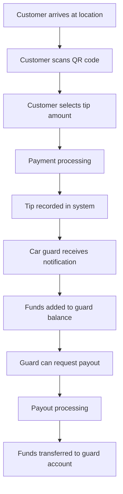

# Business Documentation Overview

This section contains comprehensive business documentation for the NogadaCarGuard platform - a multi-portal car guard tipping and payment management system designed for the South African market.

## Business Model Overview

NogadaCarGuard operates as a digital tipping and payment platform that connects car guards, customers, and location managers through three integrated portals:

- **Car Guard Portal**: Empowers car guards with digital payment acceptance and financial management
- **Customer Portal**: Provides convenient digital tipping with transaction transparency
- **Admin Portal**: Enables location managers and system administrators to oversee operations

## Target Market

**Primary Market**: South African urban centers with active car guard populations
- Shopping centers and malls
- Business districts
- Entertainment venues
- Residential complexes
- Public parking areas

**Market Characteristics**:
- High smartphone penetration (>90% in urban areas)
- Growing digital payment adoption
- Established car guard culture
- Need for financial inclusion solutions

## Revenue Model

### Commission Structure
- **Transaction Fee**: 2.5% on all tips processed
- **Payout Fee**: R5 flat fee per payout transaction
- **Premium Features**: Monthly subscription for advanced analytics (Admin Portal)
- **Partnership Revenue**: Revenue sharing with participating locations

### Value Proposition by Segment

**For Car Guards**:
- Increased income through digital tips
- Financial record keeping and budgeting tools
- Flexible payout options (bank transfer, airtime, electricity)
- Reduced cash handling risks

**For Customers**:
- Cashless convenience
- Transparent tipping process
- Transaction history and receipts
- Enhanced safety (no cash handling)

**For Location Managers**:
- Improved customer experience
- Reduced security concerns
- Analytics and insights
- Quality control through rating systems

## Business Objectives

### Short-term (6 months)
- Onboard 500+ car guards across 50+ locations
- Process 10,000+ monthly transactions
- Achieve 70% customer satisfaction rating
- Establish partnerships with 20+ major locations

### Medium-term (12 months)
- Scale to 2,000+ active car guards
- Process R1M+ monthly transaction volume
- Launch loyalty program features
- Expand to 3 major metropolitan areas

### Long-term (24 months)
- National expansion across all major cities
- Integrate with major payment providers
- Launch B2B solutions for property management
- Achieve profitability and sustainable growth

## Competitive Advantages

1. **Multi-stakeholder Platform**: Addresses needs of all participants in the car guarding ecosystem
2. **Localized Solution**: Built specifically for South African market dynamics
3. **Financial Inclusion Focus**: Supports unbanked/underbanked car guard population
4. **Technology Integration**: QR codes, mobile-first design, real-time processing
5. **Comprehensive Analytics**: Data-driven insights for all stakeholders

## Documentation Structure

| Document | Purpose | Target Audience |
|----------|---------|-----------------|
| [Requirements Management](./requirements-management.md) | Feature specifications and business requirements | Product Managers, Developers |
| [User Stories](./user-stories.md) | User personas and journey mapping | UX Designers, Product Team |
| [Success Metrics](./success-metrics.md) | KPIs and performance measurement | Management, Stakeholders |

## Business Process Flow

## Key Business Rules

### Tipping Rules
- Minimum tip amount: R5
- Maximum tip amount: R200
- Tips are processed in real-time
- 2.5% platform fee deducted from tips

### Payout Rules
- Minimum payout threshold: R50
- Maximum daily payout: R2,000
- Payout processing time: 24-48 hours
- R5 flat fee per payout transaction

### Quality Control
- Customer rating system (1-5 stars)
- Guard performance tracking
- Location-based quality metrics
- Automated fraud detection

---

## Stakeholder Relevance

**Relevant for**: Product Managers, Business Analysts, Executives, Marketing Team  
**Update Frequency**: Monthly  
**Next Review**: [Next review date]

---

**Document Information**  
- **Created**: 2024  
- **Version**: 1.0  
- **Status**: Active  
- **Owner**: Business Team  
- **Approvers**: Product Management, Executive Team