# Requirements Management

This document outlines the comprehensive business and functional requirements for the NogadaCarGuard platform, organized by portal and feature area.

## Requirements Overview

The NogadaCarGuard platform must support three distinct user groups through integrated portals while maintaining security, scalability, and regulatory compliance for the South African market.

## Core Business Requirements

### BR-001: Multi-Portal Architecture
**Priority**: Critical  
**Description**: The system must support three distinct portals with shared backend infrastructure  
**Acceptance Criteria**:
- Car Guard Portal accessible on mobile devices
- Customer Portal optimized for mobile and desktop
- Admin Portal with comprehensive dashboard functionality
- Single sign-on across appropriate portal combinations
- Role-based access control enforcement

### BR-002: Payment Processing
**Priority**: Critical  
**Description**: Secure, real-time payment processing for tips and payouts  
**Acceptance Criteria**:
- Integration with South African payment providers (PayFast, Peach Payments)
- Support for major credit cards and EFT
- Real-time transaction processing
- Transaction limits and fraud detection
- PCI DSS compliance

### BR-003: Financial Inclusion
**Priority**: High  
**Description**: Support for unbanked/underbanked car guard population  
**Acceptance Criteria**:
- Alternative payout methods (airtime, electricity)
- Digital wallet functionality
- Financial literacy resources
- Low-cost payout options
- Multi-language support (English, Afrikaans, Zulu, Xhosa)

## Car Guard Portal Requirements

### CGR-001: QR Code Management
**Priority**: Critical  
**Description**: Dynamic QR code generation and management  
**Requirements**:
- Unique QR codes per guard
- Real-time code regeneration capability
- QR code expiry and security features
- Offline QR code display capability
- Custom branding support

### CGR-002: Balance Management
**Priority**: Critical  
**Description**: Real-time balance tracking and management  
**Requirements**:
- Live balance updates
- Transaction history with filtering
- Balance projections and analytics
- Low balance notifications
- Multi-currency support (preparation for expansion)

### CGR-003: Payout Processing
**Priority**: Critical  
**Description**: Flexible payout options and processing  
**Requirements**:
- Bank transfer payouts (EFT)
- Airtime purchase integration
- Electricity voucher purchases
- Payout scheduling (daily, weekly, monthly)
- Payout history and status tracking

### CGR-004: Performance Analytics
**Priority**: Medium  
**Description**: Personal performance tracking and insights  
**Requirements**:
- Daily/weekly/monthly earnings summaries
- Customer rating analytics
- Location performance comparisons
- Goal setting and tracking
- Performance improvement recommendations

## Customer Portal Requirements

### CPR-001: Tipping Interface
**Priority**: Critical  
**Description**: Intuitive tipping experience  
**Requirements**:
- QR code scanning functionality
- Preset tip amounts (R5, R10, R20, R50)
- Custom tip amount input
- One-tap tipping for returning customers
- Receipt generation and email delivery

### CPR-002: Customer Account Management
**Priority**: High  
**Description**: Customer profile and payment management  
**Requirements**:
- User registration and verification
- Payment method management
- Spending limits and controls
- Transaction history
- Customer support integration

### CPR-003: Guard Discovery
**Priority**: Medium  
**Description**: Location-based guard discovery  
**Requirements**:
- GPS-based guard location
- Guard rating and review system
- Favorite guards functionality
- Location-based recommendations
- Guard availability status

### CPR-004: Loyalty Program
**Priority**: Low  
**Description**: Customer retention through loyalty rewards  
**Requirements**:
- Points-based reward system
- Tier-based benefits
- Special promotions and discounts
- Referral program
- Partner merchant integration

## Admin Portal Requirements

### APR-001: Location Management
**Priority**: Critical  
**Description**: Comprehensive location and guard oversight  
**Requirements**:
- Location registration and configuration
- Guard assignment and management
- Location analytics and reporting
- Quality control monitoring
- Commission and fee management

### APR-002: Financial Management
**Priority**: Critical  
**Description**: Platform financial operations  
**Requirements**:
- Transaction monitoring and reconciliation
- Payout processing and approval
- Fee calculation and collection
- Financial reporting and analytics
- Audit trail maintenance

### APR-003: User Management
**Priority**: High  
**Description**: Platform user administration  
**Requirements**:
- User role management
- Account verification processes
- Suspension and deactivation controls
- Bulk user operations
- Compliance monitoring

### APR-004: Analytics and Reporting
**Priority**: High  
**Description**: Business intelligence and reporting  
**Requirements**:
- Real-time dashboard metrics
- Custom report generation
- Data export capabilities
- Performance benchmarking
- Predictive analytics

## Technical Requirements

### TR-001: Security and Compliance
**Priority**: Critical  
**Requirements**:
- GDPR and POPIA compliance
- PCI DSS Level 1 compliance
- Multi-factor authentication
- Data encryption (at rest and in transit)
- Regular security audits and penetration testing

### TR-002: Performance and Scalability
**Priority**: Critical  
**Requirements**:
- 99.9% uptime SLA
- Sub-3 second page load times
- Support for 10,000+ concurrent users
- Auto-scaling infrastructure
- Global CDN distribution

### TR-003: Integration Requirements
**Priority**: High  
**Requirements**:
- RESTful API architecture
- Webhook support for real-time notifications
- Third-party payment gateway integration
- SMS and email service integration
- Analytics platform integration

### TR-004: Mobile Optimization
**Priority**: Critical  
**Requirements**:
- Progressive Web App (PWA) capabilities
- Offline functionality for core features
- Native mobile app readiness
- Touch-optimized interfaces
- Accessibility compliance (WCAG 2.1 AA)

## Regulatory Requirements

### RR-001: South African Financial Regulations
**Priority**: Critical  
**Requirements**:
- Reserve Bank of South Africa (SARB) compliance
- Financial Intelligence Centre Act (FICA) compliance
- Know Your Customer (KYC) requirements
- Anti-Money Laundering (AML) procedures
- Transaction reporting obligations

### RR-002: Data Protection
**Priority**: Critical  
**Requirements**:
- Protection of Personal Information Act (POPIA) compliance
- Data subject rights implementation
- Privacy policy and terms of service
- Data breach notification procedures
- Data retention and deletion policies

## Feature Prioritization Matrix

```mermaid
graph TD
    A[Critical Features] --> B[QR Code Management]
    A --> C[Payment Processing]
    A --> D[Balance Management]
    A --> E[Security & Compliance]
    
    F[High Priority] --> G[Payout Processing]
    F --> H[User Management]
    F --> I[Location Management]
    F --> J[Analytics Dashboard]
    
    K[Medium Priority] --> L[Performance Analytics]
    K --> M[Guard Discovery]
    K --> N[Customer Ratings]
    K --> O[Bulk Operations]
    
    P[Low Priority] --> Q[Loyalty Program]
    P --> R[Advanced Analytics]
    P --> S[Partner Integration]
    P --> T[Mobile App Features]
```

## Requirements Traceability

| Requirement ID | Epic | User Story | Test Case | Status |
|---------------|------|------------|-----------|---------|
| BR-001 | Multi-Portal | As a user, I can access my portal | TC-001 | In Progress |
| CGR-001 | QR Management | As a guard, I can display my QR code | TC-002 | Complete |
| CPR-001 | Tipping | As a customer, I can tip via QR scan | TC-003 | In Progress |
| APR-001 | Location Mgmt | As an admin, I can manage locations | TC-004 | Planned |

## Change Management Process

### Requirement Change Request
1. **Initiation**: Stakeholder submits change request
2. **Impact Analysis**: Technical and business impact assessment
3. **Approval**: Change advisory board review and approval
4. **Implementation**: Development team updates requirements
5. **Validation**: Stakeholder acceptance and testing
6. **Documentation**: Requirement document updates

### Change Categories
- **Critical**: Security, compliance, or system stability
- **High**: Core functionality or user experience
- **Medium**: Feature enhancement or optimization
- **Low**: Nice-to-have features or minor improvements

## Requirements Validation

### Acceptance Criteria Checklist
- [ ] Requirement is testable and measurable
- [ ] Acceptance criteria are clearly defined
- [ ] Business value is articulated
- [ ] Technical feasibility is confirmed
- [ ] Regulatory compliance is addressed
- [ ] User experience is considered
- [ ] Performance impact is assessed
- [ ] Security implications are reviewed

---

## Stakeholder Relevance

**Relevant for**: Product Managers, Business Analysts, Development Team, QA Team  
**Update Frequency**: Bi-weekly during active development  
**Next Review**: [Next review date]

---

**Document Information**  
- **Created**: 2024  
- **Version**: 1.0  
- **Status**: Active  
- **Owner**: Product Management Team  
- **Approvers**: Business Stakeholders, Technical Leadership