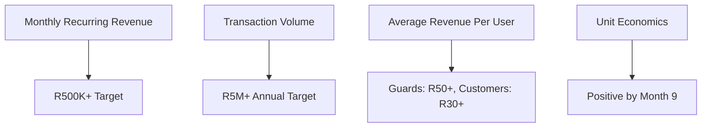

# Success Metrics and KPIs

This document defines the key performance indicators (KPIs), success metrics, and business objectives for the NogadaCarGuard platform across all three portals.

## Executive Summary

NogadaCarGuard's success is measured across five key dimensions:
1. **User Adoption**: Growth in active users across all portals
2. **Transaction Volume**: Payment processing and revenue generation
3. **User Satisfaction**: Experience quality and retention
4. **Operational Efficiency**: Platform performance and cost management
5. **Market Impact**: Social and economic impact in target markets

## Business Objectives & Key Results (OKRs)

### Year 1 Objectives

#### Objective 1: Establish Market Presence
**Key Results**:
- Onboard 1,000+ active car guards
- Partner with 100+ locations
- Process R5M+ in annual transaction volume
- Achieve 60%+ car guard retention rate

#### Objective 2: Achieve Product-Market Fit
**Key Results**:
- Maintain 4.0+ star rating across all portals
- Achieve 70%+ customer satisfaction score
- Generate 50%+ of new users through referrals
- Complete 10,000+ successful tip transactions monthly

#### Objective 3: Build Sustainable Business Model
**Key Results**:
- Achieve positive unit economics by month 9
- Generate R500K+ monthly recurring revenue
- Maintain 95%+ payment success rate
- Keep customer acquisition cost under R150

## Portal-Specific KPIs

### Car Guard Portal KPIs

#### Primary Success Metrics

**User Adoption**:
- Monthly Active Car Guards (MAU): Target 800+ by month 12
- Daily Active Car Guards (DAU): Target 400+ by month 12
- New Guard Registrations: Target 100+ per month
- Guard Onboarding Completion Rate: Target 85%+

**Engagement Metrics**:
- Average Session Duration: Target 5+ minutes
- Sessions per User per Week: Target 15+
- QR Code Views per Day per Guard: Target 20+
- App Open Rate: Target 80%+ weekly

**Revenue Metrics**:
- Average Tips per Guard per Day: Target R120+
- Tips Received Growth Rate: Target 20% month-over-month
- Payout Request Frequency: Track weekly patterns
- Alternative Payout Usage: Target 30%+ adoption

**Satisfaction Metrics**:
- Guard App Store Rating: Target 4.2+ stars
- Guard Net Promoter Score (NPS): Target 50+
- Support Ticket Resolution Time: Target <4 hours
- Feature Request Implementation Rate: Target 60%+

#### Secondary Metrics

**Financial Health**:
- Average Guard Monthly Earnings: Track and improve
- Payout Success Rate: Target 99%+
- Transaction Dispute Rate: Keep below 1%
- Guard Account Balance Growth: Track monthly

**Operational Efficiency**:
- QR Code Generation Time: Target <2 seconds
- Tip Notification Delivery: Target <5 seconds
- App Crash Rate: Keep below 0.1%
- Customer Support Contact Rate: Keep below 5%

### Customer Portal KPIs

#### Primary Success Metrics

**User Adoption**:
- Monthly Active Customers (MAU): Target 5,000+ by month 12
- New Customer Registrations: Target 500+ per month
- Customer Onboarding Completion: Target 75%+
- Return Customer Rate: Target 60%+

**Engagement Metrics**:
- Tips per Customer per Month: Target 8+
- Average Tip Amount: Target R25+
- QR Code Scan Success Rate: Target 95%+
- Repeat Tipping Rate: Target 40%+

**Revenue Metrics**:
- Customer Lifetime Value (CLV): Target R500+
- Average Transaction Size: Target R30+
- Payment Success Rate: Target 98%+
- Revenue per Customer: Target R50+ monthly

**Satisfaction Metrics**:
- Customer App Rating: Target 4.3+ stars
- Customer NPS: Target 60+
- Tipping Process Completion Rate: Target 90%+
- Customer Support Satisfaction: Target 4.5+ stars

#### Secondary Metrics

**User Experience**:
- QR Code Scan Time: Target <10 seconds
- Payment Processing Time: Target <15 seconds
- App Load Time: Target <3 seconds
- Feature Adoption Rate: Track per feature

**Retention & Growth**:
- Monthly Customer Churn Rate: Keep below 10%
- Referral Program Success: Target 20% of new users
- Social Sharing Rate: Target 15%+ of transactions
- Customer Reactivation Rate: Target 25%+

### Admin Portal KPIs

#### Primary Success Metrics

**Business Management**:
- Locations Managed per Admin: Track average
- Guards Managed per Location: Track average
- Admin User Satisfaction: Target 4.0+ stars
- Platform Adoption Rate: Target 80%+ of partners

**Operational Metrics**:
- Transaction Processing Accuracy: Target 99.9%+
- Report Generation Time: Target <30 seconds
- Data Export Success Rate: Target 100%
- System Uptime: Target 99.9%

**Financial Oversight**:
- Payout Processing Time: Target 24-48 hours
- Transaction Reconciliation Accuracy: Target 99.9%+
- Revenue Reporting Accuracy: Target 100%
- Commission Calculation Accuracy: Target 100%

**Quality Control**:
- Guard Performance Monitoring: 100% coverage
- Customer Complaint Resolution: Target 95%+
- Guard Onboarding Completion: Target 90%+
- Location Compliance Rate: Target 100%

## Cross-Platform Success Metrics

### Network Effects
- **Tri-sided Growth**: Balanced growth across all user types
- **Location Density**: Average 8+ guards per location
- **Customer-Guard Matching**: 70%+ customers tip multiple guards
- **Platform Stickiness**: 6-month retention above 60%

### Revenue and Growth Metrics

#### Financial KPIs

**Revenue Targets**:
- Monthly Recurring Revenue (MRR): R500K+ by month 12
- Annual Recurring Revenue (ARR): R6M+ by month 12
- Gross Transaction Volume (GTV): R5M+ annually
- Revenue Growth Rate: 25%+ month-over-month

**Cost Metrics**:
- Customer Acquisition Cost (CAC): <R150 per user
- Lifetime Value to CAC Ratio (LTV:CAC): 3:1 minimum
- Gross Margin: 70%+ target
- Operating Expense Ratio: <40% of revenue

#### Growth Metrics
- User Growth Rate: 20%+ monthly across all portals
- Market Penetration: 10%+ in target locations
- Geographic Expansion: 3 cities by month 12
- Partner Network Growth: 100+ locations by month 12

### Operational Excellence KPIs

#### Technical Performance
- **System Uptime**: 99.9% availability
- **API Response Time**: <500ms average
- **Payment Processing**: <15 seconds end-to-end
- **Mobile Performance**: <3 seconds load time

#### Security and Compliance
- **Security Incidents**: Zero tolerance for data breaches
- **Compliance Score**: 100% regulatory adherence
- **Fraud Rate**: <0.1% of transactions
- **Data Protection**: 100% GDPR/POPIA compliance

#### Customer Support
- **First Response Time**: <2 hours
- **Resolution Time**: <24 hours average
- **Customer Satisfaction**: 4.5+ stars
- **Self-Service Rate**: 70%+ of issues resolved

## Market Impact Metrics

### Social Impact KPIs

**Financial Inclusion**:
- Car Guards with First Bank Account: Track percentage
- Digital Payment Adoption: Monitor usage patterns
- Income Stability Improvement: Measure earnings volatility
- Financial Literacy Engagement: Track resource usage

**Economic Impact**:
- Total Income Generated for Guards: Track cumulative
- Job Security Improvement: Measure retention
- Community Economic Activity: Monitor local impact
- Small Business Support: Track vendor partnerships

### Market Development Metrics

**Geographic Expansion**:
- Cities Served: Target 3 by month 12
- Market Share per City: Track competitive position
- Location Density: Target 100+ active locations
- Urban vs Suburban Penetration: Monitor distribution

**Ecosystem Development**:
- Partner Integration Success: Track API adoption
- Third-party Developer Engagement: Monitor SDK usage
- Industry Recognition: Track awards and mentions
- Regulatory Relationship Quality: Monitor compliance scores

## Success Measurement Framework

### Data Collection Strategy

#### Data Sources
1. **Application Analytics**: User behavior, feature usage
2. **Transaction Data**: Payment processing, financial metrics
3. **Customer Feedback**: Surveys, ratings, support interactions
4. **Market Research**: Competitive analysis, industry benchmarks
5. **Partner Data**: Location performance, guard feedback

#### Reporting Frequency
- **Daily**: Core operational metrics (uptime, transactions)
- **Weekly**: User engagement and retention metrics
- **Monthly**: Financial performance and growth metrics
- **Quarterly**: Strategic objectives and market impact

### Performance Dashboards

#### Executive Dashboard
- Revenue and growth trends
- User acquisition and retention
- Key operational metrics
- Competitive positioning

#### Operational Dashboard
- System performance metrics
- Customer support metrics
- Security and compliance status
- Partner relationship health

#### Product Dashboard
- Feature adoption and usage
- User experience metrics
- Development velocity
- Bug and issue tracking

## Success Criteria by Development Phase

### MVP Launch Success (Months 1-3)
- [ ] 100+ active car guards onboarded
- [ ] 10+ partner locations secured
- [ ] 1,000+ successful transactions processed
- [ ] 4.0+ average app rating maintained
- [ ] 95%+ system uptime achieved

### Growth Phase Success (Months 4-9)
- [ ] 500+ active car guards
- [ ] 50+ partner locations
- [ ] R1M+ monthly transaction volume
- [ ] 60%+ user retention rate
- [ ] Break-even unit economics achieved

### Scale Phase Success (Months 10-12)
- [ ] 1,000+ active car guards
- [ ] 100+ partner locations
- [ ] R2M+ monthly transaction volume
- [ ] 70%+ user retention rate
- [ ] 25%+ monthly revenue growth

## Risk Metrics and Monitoring

### Financial Risk Indicators
- Cash flow runway: Maintain 6+ months
- Revenue concentration: No single location >10%
- Payment failure rate: Keep below 2%
- Fraud loss ratio: Keep below 0.1%

### Operational Risk Indicators
- System downtime: Track incidents and duration
- Security breach risk: Monitor threat indicators
- Regulatory compliance: Track requirement changes
- Competition impact: Monitor market share

### Mitigation Success Metrics
- Risk response time: Target <1 hour for critical
- Business continuity: 99.9% service availability
- Insurance coverage: 100% of identified risks
- Compliance audit results: Pass rate 100%

---

## Stakeholder Relevance

**Relevant for**: Executive Team, Board Members, Investors, Product Management  
**Update Frequency**: Monthly executive reports, quarterly board updates  
**Next Review**: [Next review date]

---

**Document Information**  
- **Created**: 2024  
- **Version**: 1.0  
- **Status**: Active  
- **Owner**: Business Strategy Team  
- **Approvers**: CEO, CFO, Head of Product