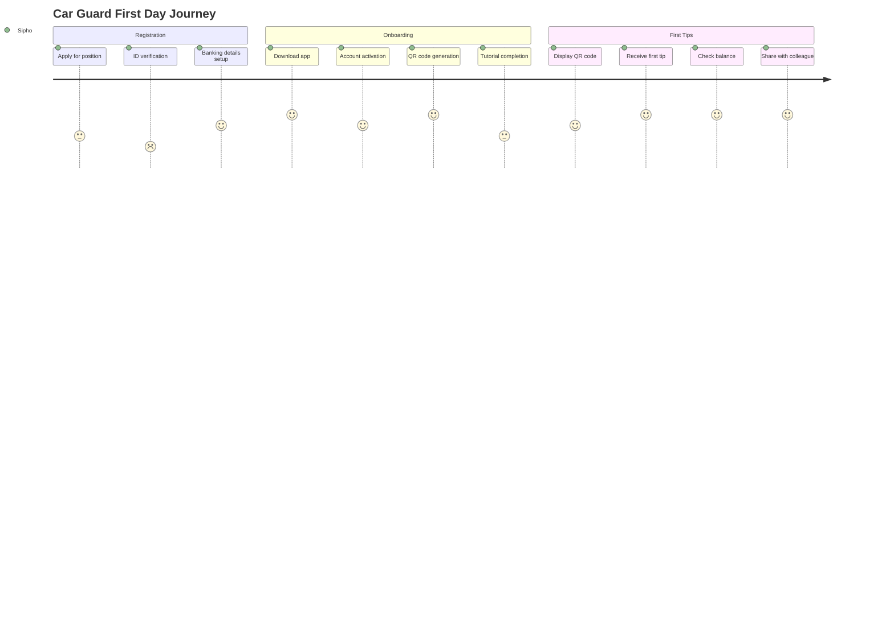
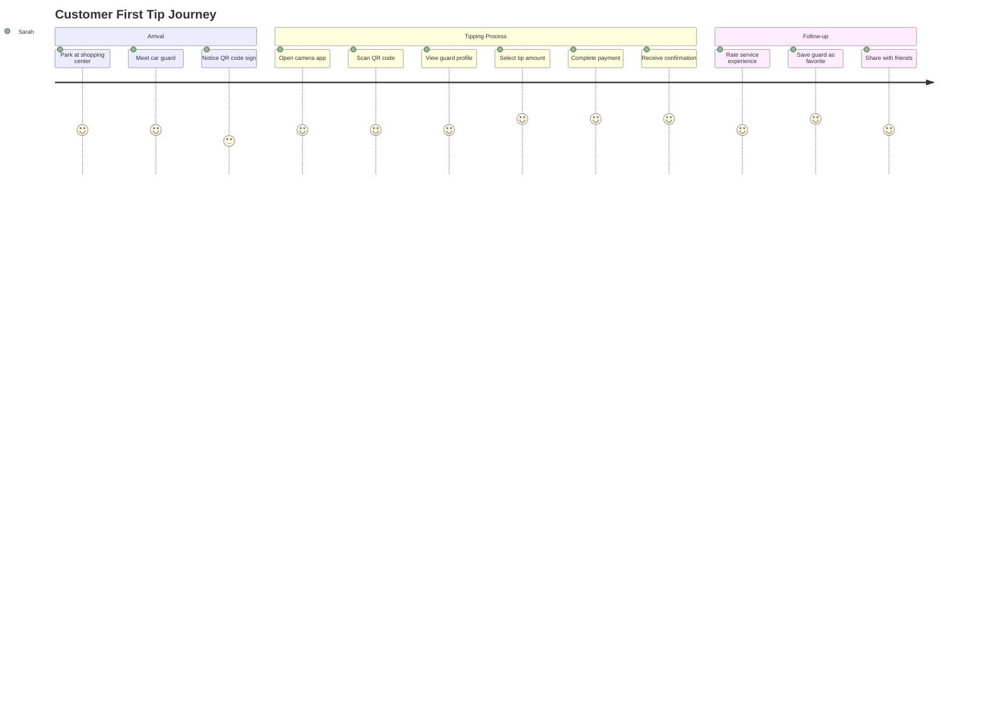
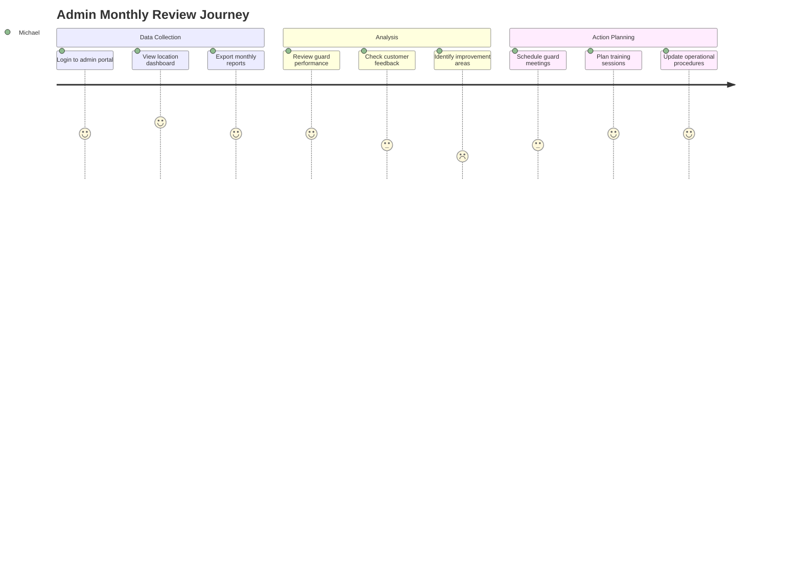

# User Stories and Journey Maps

This document defines user personas, user stories, and detailed journey maps for all three portals of the NogadaCarGuard platform.

## User Personas

### Car Guard Persona: Sipho Mthembu

**Demographics**:
- Age: 35
- Location: Johannesburg, Gauteng
- Education: Grade 10
- Languages: Zulu (native), English (conversational)
- Technology: Smartphone user, basic digital literacy

**Background**:
Sipho has been a car guard for 8 years at a busy shopping center in Sandton. He supports his family of four and sends money home to his mother in KwaZulu-Natal. He currently relies on cash tips, which makes it difficult to save money and track his earnings.

**Goals**:
- Increase daily earnings through digital tips
- Better track and manage income
- Reduce risk of carrying cash
- Access flexible payout options

**Pain Points**:
- Customers often don't carry cash
- Difficulty saving money safely
- No record of earnings for financial planning
- Bank fees are expensive for small transactions

**Technology Comfort**: Medium - uses WhatsApp, basic banking apps

### Customer Persona: Sarah Johnson

**Demographics**:
- Age: 29
- Location: Cape Town, Western Cape
- Occupation: Marketing Manager
- Income: R35,000/month
- Technology: Tech-savvy, cashless lifestyle

**Background**:
Sarah works in the corporate district and frequently visits shopping centers and restaurants. She prefers cashless transactions for convenience and security. She wants to support car guards but often doesn't carry cash.

**Goals**:
- Convenient digital tipping
- Support local service providers
- Track charitable giving for tax purposes
- Ensure tips reach intended recipients

**Pain Points**:
- Rarely carries cash
- Uncertainty about tip amounts
- No way to verify service quality
- Concerns about tip transparency

**Technology Comfort**: High - early adopter, uses multiple apps daily

### Admin Persona: Michael van der Merwe

**Demographics**:
- Age: 42
- Location: Pretoria, Gauteng
- Role: Shopping Center Manager
- Experience: 15 years in retail management
- Technology: Proficient with business systems

**Background**:
Michael manages a large shopping center with 12 car guards. He wants to improve customer experience while ensuring operational efficiency. He needs visibility into car guard performance and customer satisfaction.

**Goals**:
- Improve customer satisfaction
- Monitor guard performance
- Reduce security incidents
- Generate revenue insights

**Pain Points**:
- Limited visibility into guard-customer interactions
- Difficulty managing guard quality
- No data on customer satisfaction
- Administrative overhead for guard management

**Technology Comfort**: High - uses various management systems daily

## Epic User Stories

### Car Guard Portal Epics

#### Epic 1: Digital Tip Reception
**As a car guard, I want to receive digital tips so that I can increase my income and reduce cash handling risks.**

**User Stories**:

**CG-001**: QR Code Display
```
As a car guard,
I want to display my unique QR code to customers
So that they can easily tip me digitally

Acceptance Criteria:
- QR code is prominently displayed on my dashboard
- QR code includes my name and location
- Code works reliably when scanned by customers
- I can regenerate the code if needed
```

**CG-002**: Tip Notifications
```
As a car guard,
I want to receive instant notifications when I receive tips
So that I can thank customers and track my earnings in real-time

Acceptance Criteria:
- Notification appears within 5 seconds of tip
- Notification includes customer rating (if provided)
- Sound alert can be toggled on/off
- Notification history is accessible
```

**CG-003**: Balance Tracking
```
As a car guard,
I want to see my current balance and recent transactions
So that I can manage my finances effectively

Acceptance Criteria:
- Current balance prominently displayed
- Transaction history shows last 30 days
- Filtering by date range available
- Balance updates in real-time
```

#### Epic 2: Payout Management
**As a car guard, I want flexible payout options so that I can access my earnings according to my needs.**

**CG-004**: Bank Transfer Payouts
```
As a car guard,
I want to transfer my earnings to my bank account
So that I can save money and make large purchases

Acceptance Criteria:
- Support for all major South African banks
- Minimum R50 payout amount
- Processing time clearly communicated (24-48 hours)
- Payout fee (R5) clearly displayed
- Confirmation of successful transfer
```

**CG-005**: Alternative Payouts
```
As a car guard,
I want to convert earnings to airtime or electricity vouchers
So that I can manage household expenses efficiently

Acceptance Criteria:
- Support for all major mobile networks
- Municipality electricity voucher support
- Instant voucher delivery via SMS
- Transaction receipt provided
- Competitive rates displayed
```

### Customer Portal Epics

#### Epic 3: Easy Tipping Experience
**As a customer, I want to tip car guards digitally so that I can support them without needing cash.**

**CP-001**: QR Code Scanning
```
As a customer,
I want to scan a car guard's QR code to initiate tipping
So that I can quickly and securely leave a tip

Acceptance Criteria:
- QR scanner works in various lighting conditions
- Guard information displays after scanning
- Previous interaction history shown (if any)
- Secure connection established
```

**CP-002**: Tip Amount Selection
```
As a customer,
I want to select from preset tip amounts or enter a custom amount
So that I can tip appropriately for the service received

Acceptance Criteria:
- Preset amounts: R5, R10, R20, R50
- Custom amount input with min R5, max R200
- Recommended tip amount based on service type
- Total amount including fees clearly displayed
```

**CP-003**: Payment Processing
```
As a customer,
I want to complete payment quickly and securely
So that I can tip efficiently without delays

Acceptance Criteria:
- Support for major credit/debit cards
- Saved payment methods for returning users
- One-tap payment for frequent tippers
- Payment confirmation within 10 seconds
```

#### Epic 4: Customer Account Management
**As a customer, I want to manage my account and view transaction history so that I can track my spending and support.**

**CP-004**: Transaction History
```
As a customer,
I want to view my tipping history
So that I can track my spending and remember good service

Acceptance Criteria:
- Chronological list of all tips
- Filter by guard, location, or date
- Export functionality for tax purposes
- Receipt access for each transaction
```

### Admin Portal Epics

#### Epic 5: Location Management
**As an admin, I want to manage car guards and locations so that I can ensure quality service delivery.**

**AD-001**: Guard Management
```
As an admin,
I want to register and manage car guards at my location
So that I can maintain service quality and compliance

Acceptance Criteria:
- Guard registration with ID verification
- Assignment to specific location zones
- Performance monitoring dashboard
- Suspension and reactivation controls
```

**AD-002**: Location Analytics
```
As an admin,
I want to view analytics for my location
So that I can make data-driven decisions about operations

Acceptance Criteria:
- Daily/weekly/monthly transaction summaries
- Guard performance rankings
- Customer satisfaction metrics
- Revenue trends and projections
```

## User Journey Maps

### Car Guard Journey: First Day Setup



### Customer Journey: First Tip Experience



### Admin Journey: Monthly Performance Review



## User Story Mapping

### Car Guard Portal Features by Priority

**Must Have (MVP)**:
- QR code display and management
- Real-time balance tracking
- Basic payout to bank account
- Transaction history
- Tip notifications

**Should Have (V2)**:
- Alternative payout methods (airtime/electricity)
- Performance analytics
- Goal setting and tracking
- Multi-language support
- Offline QR code access

**Could Have (V3)**:
- Social features (guard network)
- Financial literacy resources
- Integration with savings products
- Referral program
- Advanced analytics

### Customer Portal Features by Priority

**Must Have (MVP)**:
- QR code scanning
- Tip amount selection
- Payment processing
- Basic account management
- Transaction history

**Should Have (V2)**:
- Guard ratings and reviews
- Favorite guards
- Loyalty program basics
- Enhanced payment options
- Receipt management

**Could Have (V3)**:
- Location-based guard discovery
- Social sharing features
- Merchant partnerships
- Advanced loyalty rewards
- Charity integration

### Admin Portal Features by Priority

**Must Have (MVP)**:
- Guard registration and management
- Basic location analytics
- Transaction monitoring
- Payout processing
- User role management

**Should Have (V2)**:
- Advanced reporting and analytics
- Customer feedback management
- Bulk operations
- Commission management
- Quality control tools

**Could Have (V3)**:
- Predictive analytics
- Automated guard scheduling
- Integration with POS systems
- Advanced business intelligence
- Multi-location management

## Acceptance Criteria Templates

### Standard Acceptance Criteria Format
```
Given [context/precondition]
When [action/event]
Then [expected outcome]
And [additional outcomes]

Definition of Done:
- [ ] Feature meets acceptance criteria
- [ ] Unit tests written and passing
- [ ] Integration tests passing
- [ ] Security review completed
- [ ] Performance criteria met
- [ ] Documentation updated
- [ ] Stakeholder approval obtained
```

### User Experience Criteria
- Response time under 3 seconds
- Mobile-responsive design
- Accessibility compliance (WCAG 2.1 AA)
- Error handling with user-friendly messages
- Offline functionality where applicable

### Security Criteria
- Data encryption in transit and at rest
- Authentication and authorization checks
- Input validation and sanitization
- Audit logging for sensitive operations
- GDPR/POPIA compliance

---

## Stakeholder Relevance

**Relevant for**: UX Designers, Product Managers, Development Team, QA Team  
**Update Frequency**: Sprint-based updates during development  
**Next Review**: [Next review date]

---

**Document Information**  
- **Created**: 2024  
- **Version**: 1.0  
- **Status**: Active  
- **Owner**: Product Design Team  
- **Approvers**: Product Management, UX Leadership