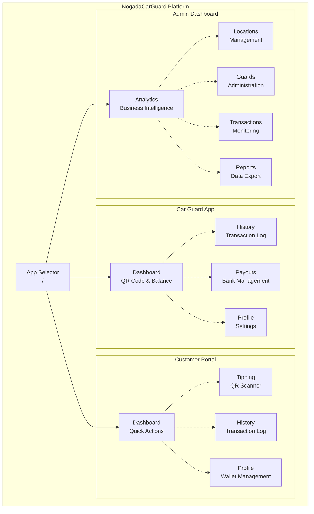
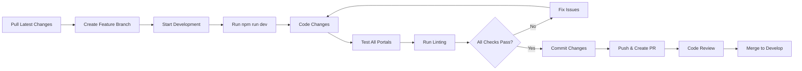

# Developers Documentation

> **Stakeholder Relevance**: [Developers, Technical Leads, New Team Members]

Welcome to the NogadaCarGuard developer documentation hub. This section contains all the technical information needed to contribute effectively to our multi-portal car guard tipping platform.

## Table of Contents
- [Quick Start](#quick-start)
- [Documentation Structure](#documentation-structure)
- [Application Overview](#application-overview)
- [Development Status](#development-status)
- [Getting Help](#getting-help)

## Quick Start

### For New Developers
1. **Setup Environment**: Follow the [Local Setup Guide](./local-setup.md)
2. **Learn Standards**: Read [Development Standards](./development-standards.md)
3. **Understand Architecture**: Review the [Application Overview](#application-overview)
4. **Start Contributing**: Check the [Code Review Process](./code-review.md)

### Essential Commands
```bash
# Initial setup
npm install
npm run dev          # Start development server (port 8080)

# Development workflow
npm run lint         # Run ESLint
npm run build        # Production build
npm run build:dev    # Development build
npm run preview      # Preview production build
```

## Documentation Structure

### 📋 [Development Standards](./development-standards.md)
**Purpose**: Coding conventions, architectural patterns, and best practices

**Key Topics**:
- TypeScript and React patterns
- Component structure and organization
- State management with TanStack Query
- Styling with Tailwind CSS and shadcn/ui
- Error handling and performance optimization

### 📡 [API Documentation](./api-documentation.md)
**Purpose**: Current mock data system and planned API integration

**Key Topics**:
- TypeScript interfaces for all data models
- Mock data helper functions and formatters
- TanStack Query integration patterns
- Future API migration strategy
- Testing utilities and patterns

### 💻 [Local Setup](./local-setup.md)
**Purpose**: Complete development environment configuration

**Key Topics**:
- Prerequisites and system requirements
- Step-by-step project setup
- VS Code configuration and extensions
- Multi-portal testing procedures
- Common troubleshooting solutions

### 👁️ [Code Review](./code-review.md)
**Purpose**: Code review process and quality standards

**Key Topics**:
- Pull request requirements and workflow
- Review assignment and timeline procedures
- Comprehensive review checklists
- Portal-specific review criteria
- Security and performance review guidelines

### 🚢 [Deployment](./deployment.md)
**Purpose**: Deployment procedures for all environments

**Key Topics**:
- Build processes for different environments
- Environment configuration management
- Multiple deployment strategies
- CI/CD pipeline setup
- Monitoring and rollback procedures

## Application Overview

### Multi-Portal Architecture

NogadaCarGuard is a Single Page Application serving three distinct user interfaces:



### Technology Stack

| Category | Technology | Version | Purpose |
|----------|------------|---------|----------|
| **Framework** | React | 18.3.1 | UI library with concurrent features |
| **Language** | TypeScript | 5.5.3 | Type safety and developer experience |
| **Build Tool** | Vite | 5.4.1 | Fast development and build process |
| **UI Components** | shadcn/ui | Latest | Accessible, customizable component library |
| **Styling** | Tailwind CSS | 3.4.11 | Utility-first styling with tippa theme |
| **Routing** | React Router | 6.26.2 | Multi-portal navigation |
| **State Management** | TanStack Query | 5.56.2 | Server state and caching |
| **Forms** | React Hook Form + Zod | 7.53.0 + 3.23.8 | Form handling and validation |
| **Charts** | Recharts | 2.12.7 | Data visualization for admin dashboard |
| **QR Codes** | react-qr-code | 2.0.12 | QR code generation and display |

### Component Organization

```
src/components/
├── admin/              # Admin Dashboard components (6 components)
│   ├── charts/         # Data visualization components
│   ├── AdminHeader.tsx
│   ├── AdminSidebar.tsx
│   ├── FilterSection.tsx
│   └── StatsCard.tsx
├── car-guard/          # Car Guard App components (2 components)
│   ├── BottomNavigation.tsx
│   └── QRCodeDisplay.tsx
├── customer/           # Customer Portal components (1 component)
│   └── CustomerNavigation.tsx
├── shared/             # Cross-portal components (2 components)
│   ├── NogadaLogo.tsx
│   └── TippaLogo.tsx
└── ui/                 # Base UI library (60+ shadcn/ui components)
    ├── button.tsx
    ├── card.tsx
    ├── form.tsx
    └── ...
```

## Development Status

### Current Implementation Status

#### ✅ Completed Features
- [x] **Multi-portal architecture** with React Router
- [x] **Complete UI component library** (60+ shadcn/ui components)
- [x] **Mock data system** with TypeScript interfaces
- [x] **Responsive design** for all device types
- [x] **Development toolchain** (Vite, TypeScript, ESLint)
- [x] **Component patterns** for all three portals

#### 🔄 In Progress
- [ ] **Testing framework** setup (Vitest + React Testing Library)
- [ ] **API integration** planning and implementation
- [ ] **Authentication system** design and implementation
- [ ] **Payment processing** integration

#### 📋 Planned Features
- [ ] **Real backend API** with database integration
- [ ] **CI/CD pipeline** with Azure DevOps
- [ ] **Monitoring and analytics** implementation
- [ ] **Mobile app** considerations (PWA approach)
- [ ] **Multi-language support** for South African languages

### Technical Debt

| Priority | Item | Impact | Estimated Effort |
|----------|------|--------|-----------------|
| **High** | Implement testing framework | Development velocity | 2 weeks |
| **High** | API integration layer | Data management | 3 weeks |
| **Medium** | Error boundary implementation | User experience | 1 week |
| **Medium** | Performance optimization | User experience | 1 week |
| **Low** | Code splitting optimization | Bundle size | 3 days |

### Code Quality Metrics

```markdown
## Current Codebase Statistics
- **Total Files**: 147 files across 36 directories
- **TypeScript Coverage**: 95% (TypeScript/React files)
- **Component Count**: 75+ components (15 portal-specific, 60+ UI library)
- **Mock Data Interfaces**: 8 main interfaces with relationships
- **Dependencies**: 67 total (50 production, 17 development)

## Quality Indicators
- **ESLint Compliance**: ✅ No errors (warnings disabled for @typescript-eslint/no-unused-vars)
- **TypeScript Compilation**: ✅ Clean build (relaxed settings)
- **Build Performance**: ✅ ~30 second production builds
- **Bundle Size**: ~2MB compressed (includes all portals)
```

## Development Workflow

### Daily Development Process



### Portal Testing Checklist

When making changes, test all three portals:

#### 🚗 Car Guard App (`/car-guard/*`)
- [ ] **Login flow** works correctly
- [ ] **QR code** generates and displays
- [ ] **Balance** shows correct formatting
- [ ] **Transaction history** loads and displays
- [ ] **Payout forms** validate properly
- [ ] **Mobile responsiveness** works on small screens
- [ ] **Bottom navigation** functions correctly

#### 🛍️ Customer Portal (`/customer/*`)
- [ ] **Registration/login** flows work
- [ ] **QR scanning** interface displays (mock functionality)
- [ ] **Tip amount selection** validates correctly
- [ ] **Wallet balance** updates properly
- [ ] **Transaction history** displays formatted data
- [ ] **Responsive design** works across devices
- [ ] **Top navigation** functions correctly

#### ⚙️ Admin Dashboard (`/admin/*`)
- [ ] **Dashboard analytics** load and render
- [ ] **Location management** CRUD operations work
- [ ] **Guard management** interfaces function
- [ ] **Transaction monitoring** displays data
- [ ] **Charts and graphs** render correctly
- [ ] **Sidebar navigation** works across all sections
- [ ] **Data filtering** and search function

## Getting Help

### Internal Resources
1. **Documentation**: Check relevant wiki sections first
2. **Code Examples**: Look at similar components in the codebase
3. **Mock Data**: Review `src/data/mockData.ts` for data structures
4. **Component Library**: Check `src/components/ui/` for available components

### External Resources
- **React Documentation**: https://react.dev/
- **TypeScript Handbook**: https://www.typescriptlang.org/docs/
- **shadcn/ui Components**: https://ui.shadcn.com/
- **Tailwind CSS**: https://tailwindcss.com/docs
- **TanStack Query**: https://tanstack.com/query/latest
- **React Hook Form**: https://react-hook-form.com/

### Team Contacts

| Role | Responsibility | Contact Method |
|------|----------------|----------------|
| **Tech Lead** | Architecture decisions, code review | TO BE DOCUMENTED |
| **Frontend Lead** | Component design, UI/UX implementation | TO BE DOCUMENTED |
| **DevOps Lead** | Build process, deployment, infrastructure | TO BE DOCUMENTED |
| **Product Manager** | Requirements, feature prioritization | TO BE DOCUMENTED |

### Support Channels
- **Team Chat**: Internal communication channel
- **GitHub Issues**: Bug reports and feature requests
- **Code Reviews**: Pull request discussions
- **Architecture Discussions**: Technical decision documentation

---
**Document Information:**
- **Last Updated**: 2025-08-25
- **Status**: Active
- **Owner**: Development Team
- **Version**: 1.0.0
- **Next Review**: 2025-09-25