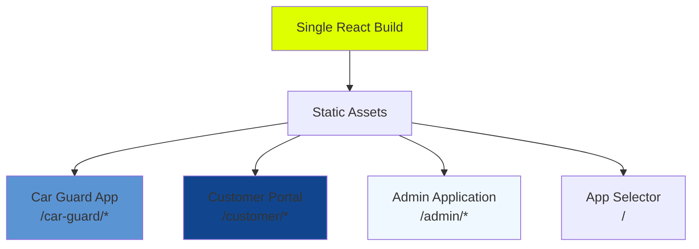
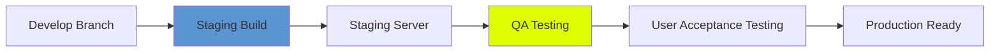
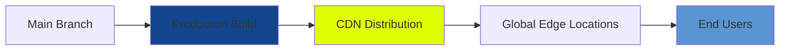

# Deployment Procedures

## Overview

This document outlines the deployment procedures for the **NogadaCarGuard** multi-portal tipping application. The application consists of three integrated portals that are deployed as a single React application with client-side routing.

**Stakeholder Relevance:** 🏗️ DevOps Engineer, 🛠️ Senior Dev, 📊 Project Manager, 🔐 Security Team, 🌐 Full-Stack Dev

---

## Application Architecture

### Single-Page Application (SPA) Deployment

The NogadaCarGuard application is built as a single React SPA that serves three distinct portals:



### Build Output Structure

```
dist/
├── index.html                 # Main HTML entry point
├── assets/
│   ├── index-[hash].js       # Main application bundle (~2MB)
│   ├── index-[hash].css      # Compiled Tailwind CSS (~150KB)  
│   ├── [portal]-[hash].js    # Code-split portal bundles
│   └── [component]-[hash].js # Component-specific bundles
├── favicon.ico
├── robots.txt
└── .htaccess                 # URL rewriting rules (generated)
```

---

## Environment Configuration

### Environment Variables

#### Development Environment
```bash
# .env.development
NODE_ENV=development
VITE_APP_NAME=NogadaCarGuard
VITE_APP_VERSION=1.0.0
VITE_DEVELOPMENT_MODE=true

# API Configuration
VITE_API_BASE_URL=http://localhost:3001/api
VITE_WEBSOCKET_URL=ws://localhost:3001

# Feature Flags
VITE_USE_MOCK_DATA=true
VITE_MOCK_DELAY=500
VITE_DEBUG_MODE=true
```

#### Staging Environment
```bash
# .env.staging  
NODE_ENV=production
VITE_APP_NAME=NogadaCarGuard
VITE_APP_VERSION=1.0.0
VITE_DEVELOPMENT_MODE=false

# API Configuration
VITE_API_BASE_URL=https://staging-api.nogadacarguard.com/api
VITE_WEBSOCKET_URL=wss://staging-api.nogadacarguard.com

# Feature Flags
VITE_USE_MOCK_DATA=false
VITE_DEBUG_MODE=false
VITE_STAGING_MODE=true
```

#### Production Environment
```bash
# .env.production
NODE_ENV=production
VITE_APP_NAME=NogadaCarGuard
VITE_APP_VERSION=1.0.0
VITE_DEVELOPMENT_MODE=false

# API Configuration
VITE_API_BASE_URL=https://api.nogadacarguard.com/api
VITE_WEBSOCKET_URL=wss://api.nogadacarguard.com

# Feature Flags
VITE_USE_MOCK_DATA=false
VITE_DEBUG_MODE=false
VITE_ANALYTICS_ENABLED=true

# Security
VITE_ENABLE_SECURITY_HEADERS=true
VITE_CONTENT_SECURITY_POLICY=strict
```

---

## Build Process

### Development Build

```bash
# Development build with source maps and debugging
npm run build:dev

# Expected output:
# vite build --mode development
# ✓ building for development...
# ✓ 1247 modules transformed.
# dist/index.html                    2.14 kB
# dist/assets/index-abc123.css     147.83 kB │ gzip:  18.45 kB
# dist/assets/index-def456.js     1,847.29 kB │ gzip: 467.23 kB
# ✓ built in 8.43s
```

### Production Build

```bash
# Production build with optimizations
npm run build

# Expected output:
# vite build
# ✓ building for production...
# ✓ 1247 modules transformed.
# dist/index.html                    2.14 kB │ gzip:   1.24 kB
# dist/assets/index-abc123.css     147.83 kB │ gzip:  18.45 kB
# dist/assets/index-def456.js     1,287.42 kB │ gzip: 387.91 kB
# ✓ built in 12.67s
```

### Build Optimization Settings

The `vite.config.ts` includes production optimizations:

```typescript
export default defineConfig(({ mode }) => ({
  build: {
    target: 'es2015',
    outDir: 'dist',
    assetsDir: 'assets',
    sourcemap: mode === 'development',
    minify: mode === 'production' ? 'terser' : false,
    rollupOptions: {
      output: {
        manualChunks: {
          'react-vendor': ['react', 'react-dom'],
          'router': ['react-router-dom'],
          'ui': ['@radix-ui/react-dialog', '@radix-ui/react-dropdown-menu'],
          'charts': ['recharts'],
          'forms': ['react-hook-form', '@hookform/resolvers', 'zod'],
        },
      },
    },
  },
}));
```

---

## Deployment Platforms

### Vercel Deployment (Recommended for Frontend)

#### Setup Process

1. **Connect Repository**
   ```bash
   # Install Vercel CLI
   npm i -g vercel
   
   # Login and link project
   vercel login
   vercel --cwd /path/to/NogadaCarGuard
   ```

2. **Vercel Configuration** (`vercel.json`)
   ```json
   {
     "version": 2,
     "name": "nogada-carguard",
     "builds": [
       {
         "src": "package.json",
         "use": "@vercel/static-build",
         "config": {
           "distDir": "dist"
         }
       }
     ],
     "routes": [
       {
         "src": "/api/(.*)",
         "dest": "https://api.nogadacarguard.com/api/$1"
       },
       {
         "handle": "filesystem"
       },
       {
         "src": "/(car-guard|customer|admin)/(.*)",
         "dest": "/index.html"
       },
       {
         "src": "/(.*)",
         "dest": "/index.html"
       }
     ],
     "env": {
       "VITE_APP_NAME": "NogadaCarGuard",
       "VITE_API_BASE_URL": "https://api.nogadacarguard.com/api"
     }
   }
   ```

3. **Deployment Commands**
   ```bash
   # Deploy to preview
   vercel
   
   # Deploy to production
   vercel --prod
   ```

#### Domain Configuration
```bash
# Add custom domain
vercel domains add nogadacarguard.com
vercel domains add www.nogadacarguard.com

# Set up redirects
# www.nogadacarguard.com → nogadacarguard.com
```

### Netlify Deployment

#### Configuration (`netlify.toml`)
```toml
[build]
  command = "npm run build"
  publish = "dist"

[build.environment]
  NODE_VERSION = "18"
  NPM_VERSION = "9"

[[redirects]]
  from = "/api/*"
  to = "https://api.nogadacarguard.com/api/:splat"
  status = 200

[[redirects]]
  from = "/car-guard/*"
  to = "/index.html"
  status = 200

[[redirects]]
  from = "/customer/*"  
  to = "/index.html"
  status = 200

[[redirects]]
  from = "/admin/*"
  to = "/index.html"
  status = 200

[[redirects]]
  from = "/*"
  to = "/index.html"
  status = 200

[context.production.environment]
  VITE_API_BASE_URL = "https://api.nogadacarguard.com/api"
  VITE_USE_MOCK_DATA = "false"

[context.branch-deploy.environment]
  VITE_API_BASE_URL = "https://staging-api.nogadacarguard.com/api"
  VITE_USE_MOCK_DATA = "true"
```

### AWS S3 + CloudFront Deployment

#### S3 Bucket Setup
```bash
# Create S3 bucket
aws s3 mb s3://nogada-carguard-app

# Enable static website hosting
aws s3 website s3://nogada-carguard-app \
  --index-document index.html \
  --error-document index.html

# Set bucket policy for public read access
```

#### CloudFront Configuration
```json
{
  "Origins": [
    {
      "DomainName": "nogada-carguard-app.s3.amazonaws.com",
      "Id": "S3-nogada-carguard-app",
      "S3OriginConfig": {
        "OriginAccessIdentity": ""
      }
    }
  ],
  "DefaultCacheBehavior": {
    "TargetOriginId": "S3-nogada-carguard-app",
    "ViewerProtocolPolicy": "redirect-to-https",
    "Compress": true,
    "CachePolicyId": "4135ea2d-6df8-44a3-9df3-4b5a84be39ad"
  },
  "CustomErrorResponses": [
    {
      "ErrorCode": 404,
      "ResponseCode": 200,
      "ResponsePagePath": "/index.html"
    },
    {
      "ErrorCode": 403,
      "ResponseCode": 200, 
      "ResponsePagePath": "/index.html"
    }
  ]
}
```

#### Deployment Script
```bash
#!/bin/bash
# deploy-aws.sh

# Build the application
npm run build

# Upload to S3
aws s3 sync dist/ s3://nogada-carguard-app --delete

# Invalidate CloudFront cache
aws cloudfront create-invalidation \
  --distribution-id E1EXAMPLE123456 \
  --paths "/*"

echo "Deployment complete!"
```

---

## CI/CD Pipeline

### GitHub Actions Workflow

#### Production Deployment (`.github/workflows/deploy-production.yml`)
```yaml
name: Deploy to Production

on:
  push:
    branches: [ main ]
  workflow_dispatch:

env:
  NODE_VERSION: '18'

jobs:
  build-and-deploy:
    runs-on: ubuntu-latest
    
    steps:
    - name: Checkout code
      uses: actions/checkout@v4
      
    - name: Setup Node.js
      uses: actions/setup-node@v4
      with:
        node-version: ${{ env.NODE_VERSION }}
        cache: 'npm'
        
    - name: Install dependencies
      run: npm ci
      
    - name: Run linting
      run: npm run lint
      
    - name: Build application
      run: npm run build
      env:
        VITE_API_BASE_URL: ${{ secrets.PROD_API_URL }}
        VITE_USE_MOCK_DATA: false
        
    - name: Deploy to Vercel
      uses: amondnet/vercel-action@v25
      with:
        vercel-token: ${{ secrets.VERCEL_TOKEN }}
        vercel-org-id: ${{ secrets.VERCEL_ORG_ID }}
        vercel-project-id: ${{ secrets.VERCEL_PROJECT_ID }}
        vercel-args: '--prod'
        working-directory: ./
        
    - name: Notify deployment
      uses: 8398a7/action-slack@v3
      with:
        status: ${{ job.status }}
        channel: '#deployments'
        webhook_url: ${{ secrets.SLACK_WEBHOOK }}
```

#### Staging Deployment (`.github/workflows/deploy-staging.yml`)
```yaml
name: Deploy to Staging

on:
  push:
    branches: [ develop, staging ]
  pull_request:
    branches: [ main ]

jobs:
  build-and-deploy:
    runs-on: ubuntu-latest
    
    steps:
    - name: Checkout code
      uses: actions/checkout@v4
      
    - name: Setup Node.js
      uses: actions/setup-node@v4
      with:
        node-version: '18'
        cache: 'npm'
        
    - name: Install dependencies
      run: npm ci
      
    - name: Run linting
      run: npm run lint
      
    - name: Build application  
      run: npm run build:dev
      env:
        VITE_API_BASE_URL: ${{ secrets.STAGING_API_URL }}
        VITE_USE_MOCK_DATA: true
        VITE_STAGING_MODE: true
        
    - name: Deploy to staging
      uses: amondnet/vercel-action@v25
      with:
        vercel-token: ${{ secrets.VERCEL_TOKEN }}
        vercel-org-id: ${{ secrets.VERCEL_ORG_ID }}
        vercel-project-id: ${{ secrets.VERCEL_PROJECT_ID }}
        working-directory: ./
```

### Azure DevOps Pipeline

#### Build Pipeline (`azure-pipelines.yml`)
```yaml
trigger:
  branches:
    include:
    - main
    - develop

pool:
  vmImage: 'ubuntu-latest'

variables:
  nodeVersion: '18.x'

stages:
- stage: Build
  displayName: 'Build Application'
  jobs:
  - job: BuildJob
    displayName: 'Build'
    steps:
    - task: NodeTool@0
      displayName: 'Use Node $(nodeVersion)'
      inputs:
        versionSpec: '$(nodeVersion)'
        
    - script: npm ci
      displayName: 'Install dependencies'
      
    - script: npm run lint
      displayName: 'Run ESLint'
      
    - script: npm run build
      displayName: 'Build application'
      env:
        VITE_API_BASE_URL: $(PROD_API_URL)
        
    - task: PublishBuildArtifacts@1
      displayName: 'Publish build artifacts'
      inputs:
        PathtoPublish: 'dist'
        ArtifactName: 'drop'

- stage: Deploy
  displayName: 'Deploy Application'
  dependsOn: Build
  condition: and(succeeded(), eq(variables['Build.SourceBranch'], 'refs/heads/main'))
  jobs:
  - deployment: DeployJob
    displayName: 'Deploy to Production'
    environment: 'production'
    strategy:
      runOnce:
        deploy:
          steps:
          - script: echo "Deploy to production server"
            displayName: 'Deploy application'
```

---

## Portal-Specific Considerations

### Car Guard App Deployment

The car guard portal is optimized for mobile devices and requires specific considerations:

```nginx
# Nginx configuration for car guard portal
location /car-guard {
    # Mobile-specific caching
    add_header Cache-Control "public, max-age=3600";
    
    # PWA manifest serving
    location /car-guard/manifest.json {
        add_header Content-Type application/manifest+json;
    }
    
    # Service worker
    location /car-guard/sw.js {
        add_header Cache-Control "no-cache";
    }
    
    try_files $uri $uri/ /index.html;
}
```

### Customer Portal Deployment

Customer portal includes payment processing considerations:

```javascript
// Runtime configuration for customer portal
window.CUSTOMER_CONFIG = {
  apiBaseUrl: process.env.VITE_API_BASE_URL,
  paymentProvider: process.env.VITE_PAYMENT_PROVIDER,
  enableWallet: process.env.VITE_ENABLE_WALLET === 'true',
  maxTipAmount: parseInt(process.env.VITE_MAX_TIP_AMOUNT) || 1000,
};
```

### Admin Application Deployment

Admin portal requires additional security considerations:

```nginx
# Admin portal security headers
location /admin {
    # Additional security headers for admin
    add_header X-Frame-Options DENY;
    add_header X-Content-Type-Options nosniff;
    add_header Referrer-Policy strict-origin-when-cross-origin;
    
    # IP whitelist for admin access (optional)
    # allow 192.168.1.0/24;
    # deny all;
    
    try_files $uri $uri/ /index.html;
}
```

---

## Environment-Specific Deployments

### Development Environment

```bash
# Local development deployment
npm run dev

# Accessible at:
# http://localhost:8080/           # App selector
# http://localhost:8080/car-guard  # Car guard app
# http://localhost:8080/customer   # Customer portal  
# http://localhost:8080/admin      # Admin application
```

### Staging Environment



**Staging URL Structure:**
- `https://staging.nogadacarguard.com/`
- `https://staging.nogadacarguard.com/car-guard`
- `https://staging.nogadacarguard.com/customer`
- `https://staging.nogadacarguard.com/admin`

### Production Environment



**Production URL Structure:**
- `https://nogadacarguard.com/`
- `https://nogadacarguard.com/car-guard`
- `https://nogadacarguard.com/customer`
- `https://nogadacarguard.com/admin`

---

## Monitoring and Health Checks

### Application Health Check

```typescript
// src/utils/healthCheck.ts
export interface HealthCheck {
  status: 'healthy' | 'unhealthy';
  timestamp: string;
  version: string;
  environment: string;
  portals: {
    carGuard: boolean;
    customer: boolean;
    admin: boolean;
  };
}

export function performHealthCheck(): HealthCheck {
  return {
    status: 'healthy',
    timestamp: new Date().toISOString(),
    version: import.meta.env.VITE_APP_VERSION || '1.0.0',
    environment: import.meta.env.MODE,
    portals: {
      carGuard: true, // Check if car guard routes load
      customer: true, // Check if customer routes load  
      admin: true,    // Check if admin routes load
    },
  };
}
```

### Deployment Monitoring

```bash
# Health check endpoint for monitoring
curl -f https://nogadacarguard.com/health || exit 1

# Response:
# {
#   "status": "healthy",
#   "timestamp": "2024-01-15T10:30:00Z",
#   "version": "1.0.0",
#   "environment": "production",
#   "portals": {
#     "carGuard": true,
#     "customer": true,
#     "admin": true
#   }
# }
```

### Performance Monitoring

```javascript
// Performance monitoring setup
if (process.env.NODE_ENV === 'production') {
  // Web Vitals tracking
  import('web-vitals').then(({ getCLS, getFID, getFCP, getLCP, getTTFB }) => {
    getCLS(console.log);
    getFID(console.log);
    getFCP(console.log);
    getLCP(console.log);
    getTTFB(console.log);
  });
}
```

---

## Rollback Procedures

### Automatic Rollback

```bash
# Vercel rollback to previous deployment
vercel rollback https://nogada-carguard-abc123.vercel.app

# AWS CloudFront cache invalidation
aws cloudfront create-invalidation \
  --distribution-id E1EXAMPLE123456 \
  --paths "/*"
```

### Manual Rollback Process

1. **Identify Issue**
   - Monitor alerts triggered
   - User reports of functionality issues
   - Performance degradation

2. **Immediate Response**
   ```bash
   # Quick rollback to last known good deployment
   git checkout main
   git reset --hard [last-good-commit-hash]
   git push --force-with-lease origin main
   ```

3. **Verification**
   - Test all three portals functionality
   - Verify mobile responsiveness
   - Confirm API connectivity

4. **Communication**
   - Notify stakeholders
   - Update status page
   - Document incident

---

## Security Considerations

### Content Security Policy (CSP)

```html
<!-- CSP headers for production -->
<meta http-equiv="Content-Security-Policy" content="
  default-src 'self';
  script-src 'self' 'unsafe-eval' 'unsafe-inline';
  style-src 'self' 'unsafe-inline';
  img-src 'self' data: https:;
  font-src 'self' data:;
  connect-src 'self' https://api.nogadacarguard.com wss://api.nogadacarguard.com;
  frame-ancestors 'none';
">
```

### Environment Variable Security

```bash
# Secure environment variables (never commit these)
VITE_API_KEY=prod_key_here
VITE_PAYMENT_SECRET=payment_secret_here
VITE_ANALYTICS_ID=GA_tracking_id

# Public environment variables (safe to commit)
VITE_APP_NAME=NogadaCarGuard
VITE_APP_VERSION=1.0.0
VITE_SUPPORT_EMAIL=support@nogadacarguard.com
```

### HTTPS Configuration

```nginx
# Force HTTPS redirect
server {
    listen 80;
    server_name nogadacarguard.com www.nogadacarguard.com;
    return 301 https://nogadacarguard.com$request_uri;
}

server {
    listen 443 ssl http2;
    server_name nogadacarguard.com;
    
    # SSL configuration
    ssl_certificate /path/to/certificate.crt;
    ssl_certificate_key /path/to/private.key;
    ssl_protocols TLSv1.2 TLSv1.3;
    ssl_ciphers HIGH:!aNULL:!MD5;
    
    # Security headers
    add_header Strict-Transport-Security "max-age=31536000; includeSubDomains" always;
    add_header X-Frame-Options DENY always;
    add_header X-Content-Type-Options nosniff always;
    
    location / {
        root /var/www/nogada-carguard;
        try_files $uri $uri/ /index.html;
    }
}
```

---

## Performance Optimization

### Bundle Analysis

```bash
# Analyze bundle size
npm install -g webpack-bundle-analyzer
webpack-bundle-analyzer dist/assets

# Check for large dependencies
npm install -g bundle-analyzer
bundle-analyzer
```

### Caching Strategy

```nginx
# Nginx caching configuration
location ~* \.(js|css|png|jpg|jpeg|gif|ico|svg)$ {
    expires 1y;
    add_header Cache-Control "public, immutable";
    add_header Vary Accept-Encoding;
    gzip_static on;
}

location ~* \.html$ {
    expires 0;
    add_header Cache-Control "no-cache, no-store, must-revalidate";
}
```

### CDN Configuration

```javascript
// CDN asset loading
const CDN_BASE_URL = 'https://cdn.nogadacarguard.com';

// Configure asset loading
if (process.env.NODE_ENV === 'production') {
  __webpack_public_path__ = `${CDN_BASE_URL}/`;
}
```

---

## Troubleshooting Common Deployment Issues

### Build Failures

```bash
# Clear build cache
rm -rf dist/ node_modules/.vite/
npm ci
npm run build

# Memory issues during build
export NODE_OPTIONS="--max-old-space-size=4096"
npm run build
```

### Routing Issues

Common SPA routing problems:

```nginx
# Fix for React Router (404 on direct URL access)
location / {
    try_files $uri $uri/ /index.html;
}

# Portal-specific routing
location ~ ^/(car-guard|customer|admin) {
    try_files $uri $uri/ /index.html;
}
```

### Environment Variable Issues

```bash
# Debug environment variables in build
echo "API URL: $VITE_API_BASE_URL"
echo "Mock Data: $VITE_USE_MOCK_DATA"

# Verify in built application
grep -r "VITE_API_BASE_URL" dist/assets/
```

---

## Documentation and Support

### Deployment Checklist

**Pre-Deployment:**
- [ ] Code reviewed and approved
- [ ] All tests passing
- [ ] Build successful locally
- [ ] Environment variables configured
- [ ] Security headers configured
- [ ] Performance tested

**Deployment:**
- [ ] Build deployed successfully
- [ ] All portals accessible
- [ ] Mobile responsiveness verified
- [ ] API connectivity tested
- [ ] Error pages working correctly
- [ ] Analytics/monitoring active

**Post-Deployment:**
- [ ] Health checks passing
- [ ] Performance metrics normal
- [ ] No error alerts triggered
- [ ] User acceptance testing passed
- [ ] Documentation updated
- [ ] Team notified

### Support Contacts

- **Development Team**: dev-team@ionic-innovations.com
- **DevOps Team**: devops@ionic-innovations.com  
- **Emergency**: +27 XXX XXX XXXX
- **Slack Channel**: #nogada-deployments

---

## Conclusion

This deployment guide ensures consistent, reliable deployments of the NogadaCarGuard multi-portal application. The procedures cover:

- ✅ Multiple deployment platform options
- ✅ Environment-specific configurations
- ✅ CI/CD pipeline automation
- ✅ Security considerations
- ✅ Performance optimization
- ✅ Monitoring and rollback procedures

Follow this guide for all deployment activities to ensure a smooth, secure, and performant application deployment.

---

**Document Information:**
- **Version:** 1.0
- **Last Updated:** 2025-01-25
- **Maintainer:** DevOps Team
- **Review Cycle:** Monthly
- **Related Documents:** 
  - `/wiki/devops/cicd-pipelines.md`
  - `/wiki/devops/environment-management.md`
  - `/wiki/security/security-standards.md`