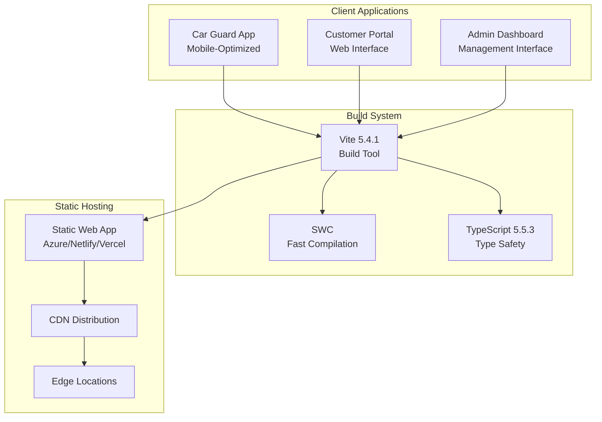

# ⚙️ DevOps Documentation

> **Infrastructure and Operations for NogadaCarGuard**
> 
> Complete DevOps documentation covering infrastructure automation, CI/CD pipelines, monitoring, and environment management for the multi-portal car guard tipping platform.

## 📋 Overview

This section provides comprehensive DevOps documentation for the NogadaCarGuard application, a React/TypeScript/Vite-based multi-portal system. The application builds to static files and consists of three main portals: Car Guard App, Customer Portal, and Admin Dashboard.

### 🏗️ Current Architecture Status

| Component | Status | Technology |
|-----------|--------|------------|
| **Application Type** | ✅ Production Ready | React/TypeScript SPA |
| **Build System** | ✅ Configured | Vite 5.4.1 with SWC |
| **Static Assets** | ✅ Optimized | Static file deployment |
| **CI/CD Pipeline** | 🔄 Planning Phase | Azure DevOps/GitHub Actions |
| **Infrastructure** | 📋 To Be Configured | Static Web App hosting |
| **Monitoring** | 📋 To Be Implemented | Application & infrastructure |

## 📚 Documentation Sections

### 🏭 **[Infrastructure as Code](./infrastructure-as-code.md)**
**Stakeholders**: DevOps Engineers, Platform Engineers, Tech Leads  
**Purpose**: Automate infrastructure provisioning and management

- Infrastructure templates and configurations
- Cloud resource definitions (Azure Static Web Apps)
- Environment provisioning automation
- Resource tagging and cost management
- Security and compliance configurations

### 🔄 **[CI/CD Pipelines](./cicd-pipelines.md)**
**Stakeholders**: DevOps Engineers, Developers, Release Managers  
**Purpose**: Automate build, test, and deployment processes

- Azure DevOps pipeline configurations
- GitHub Actions workflow examples
- Build optimization strategies
- Deployment automation for static web apps
- Environment promotion workflows

### 📊 **[Monitoring & Alerting](./monitoring-alerting.md)**
**Stakeholders**: DevOps Engineers, SREs, Support Teams, Product Owners  
**Purpose**: Ensure system reliability and performance

- Application performance monitoring
- Infrastructure health monitoring
- User experience tracking for three portals
- Alerting strategies and escalation procedures
- Dashboard and visualization setup

### 🌍 **[Environment Management](./environment-management.md)**
**Stakeholders**: DevOps Engineers, Developers, QA Teams, Business Stakeholders  
**Purpose**: Manage multiple deployment environments

- Environment configuration strategies
- Development, staging, and production setups
- Configuration management for multi-portal architecture
- Environment-specific secrets and variables
- Promotion and rollback procedures

## 🚀 Quick Start Guide

### Prerequisites
```bash
# Required tools
node >= 18.0.0
npm >= 8.0.0
git
```

### Local Development
```bash
# Clone repository
git clone https://dev.azure.com/ionic-innovations/NogadaCarGuard/_git/NogadaCarGuard

# Install dependencies
npm install

# Start development server
npm run dev  # Runs on http://localhost:8080

# Build for production
npm run build

# Preview production build
npm run preview
```

### Build Outputs
```
dist/
├── index.html           # Main application entry
├── assets/             
│   ├── *.js            # JavaScript bundles
│   ├── *.css           # Compiled stylesheets
│   └── *.woff2         # Font files
└── vite.svg            # Static assets
```

## 🏗️ Application Architecture



## 🔧 DevOps Tools & Technologies

### Current Stack
| Category | Tool/Service | Version | Status |
|----------|-------------|---------|---------|
| **Source Control** | Azure DevOps Git | Latest | ✅ Active |
| **Build System** | Vite | 5.4.1 | ✅ Configured |
| **Compiler** | SWC | Latest | ✅ Active |
| **Package Manager** | npm | 8+ | ✅ Active |
| **Linting** | ESLint | 9.9.0 | ✅ Configured |

### Planned/Recommended Stack
| Category | Primary Option | Alternative | Purpose |
|----------|---------------|-------------|----------|
| **CI/CD** | Azure DevOps Pipelines | GitHub Actions | Build & Deploy |
| **Hosting** | Azure Static Web Apps | Netlify/Vercel | Static Hosting |
| **CDN** | Azure CDN | Cloudflare | Global Distribution |
| **Monitoring** | Azure Application Insights | DataDog/New Relic | APM & Logging |
| **Alerts** | Azure Monitor | PagerDuty | Incident Management |
| **IaC** | Azure ARM/Bicep | Terraform | Infrastructure |

## 🎯 Portal-Specific Considerations

### 📱 Car Guard App (Mobile-First)
- **Performance**: Critical for mobile users
- **Offline**: Consider PWA capabilities
- **Monitoring**: Mobile-specific metrics

### 🛒 Customer Portal
- **SEO**: Static generation benefits
- **Analytics**: Conversion tracking
- **Security**: Payment processing considerations

### 🎛️ Admin Dashboard
- **Authentication**: Role-based access control
- **Performance**: Data-heavy interfaces
- **Monitoring**: Administrative action tracking

## 🚨 Deployment Considerations

### Static Web App Benefits
- **Zero Server Management**: No backend infrastructure
- **Global CDN**: Automatic edge distribution
- **HTTPS**: Built-in SSL certificates
- **Custom Domains**: Easy domain configuration
- **Rollback**: Instant version switching

### Multi-Portal Routing
- **Client-Side Routing**: React Router handles navigation
- **Path-Based**: `/car-guard/*`, `/customer/*`, `/admin/*`
- **Fallback**: All routes serve `index.html`

## 📊 Key Metrics & KPIs

### Technical Metrics
- **Build Time**: < 2 minutes target
- **Bundle Size**: < 1MB optimized
- **Page Load**: < 3 seconds first contentful paint
- **Uptime**: 99.9% availability target

### Business Metrics
- **User Engagement**: Portal-specific usage
- **Transaction Success**: Payment completion rates
- **Error Rates**: < 0.1% error rate target

## 📞 DevOps Contacts & Responsibilities

| Role | Responsibility | Escalation |
|------|---------------|------------|
| **DevOps Lead** | TO BE ASSIGNED | Infrastructure & deployment |
| **Platform Engineer** | TO BE ASSIGNED | Cloud services & scaling |
| **Release Manager** | TO BE ASSIGNED | Deployment coordination |
| **Monitoring Lead** | TO BE ASSIGNED | Alerting & incident response |

## 🔗 Related Documentation

### Internal Links
- [Development Standards](../developers/development-standards.md)
- [Deployment Guide](../developers/deployment.md)
- [Architecture Overview](../shared/architecture/system-overview.md)
- [Incident Response](../workflows/incident-response.md)

### External Resources
- [Azure Static Web Apps Documentation](https://docs.microsoft.com/en-us/azure/static-web-apps/)
- [Vite Deployment Guide](https://vitejs.dev/guide/static-deploy.html)
- [React Router Deployment](https://reactrouter.com/en/main/guides/deployment)

## 🔄 Recent Updates

| Date | Update | Author | Impact |
|------|--------|--------|--------|
| 2025-08-25 | Initial DevOps documentation created | AI Assistant | Documentation |
| 2025-08-25 | DevOps planning and tool selection | DevOps Team | Planning |

---
**Document Information:**
- **Last Updated**: 2025-08-25
- **Status**: Active
- **Owner**: DevOps Team
- **Version**: 1.0.0
- **Review Cycle**: Monthly
- **Stakeholders**: DevOps Engineers, Developers, Platform Engineers