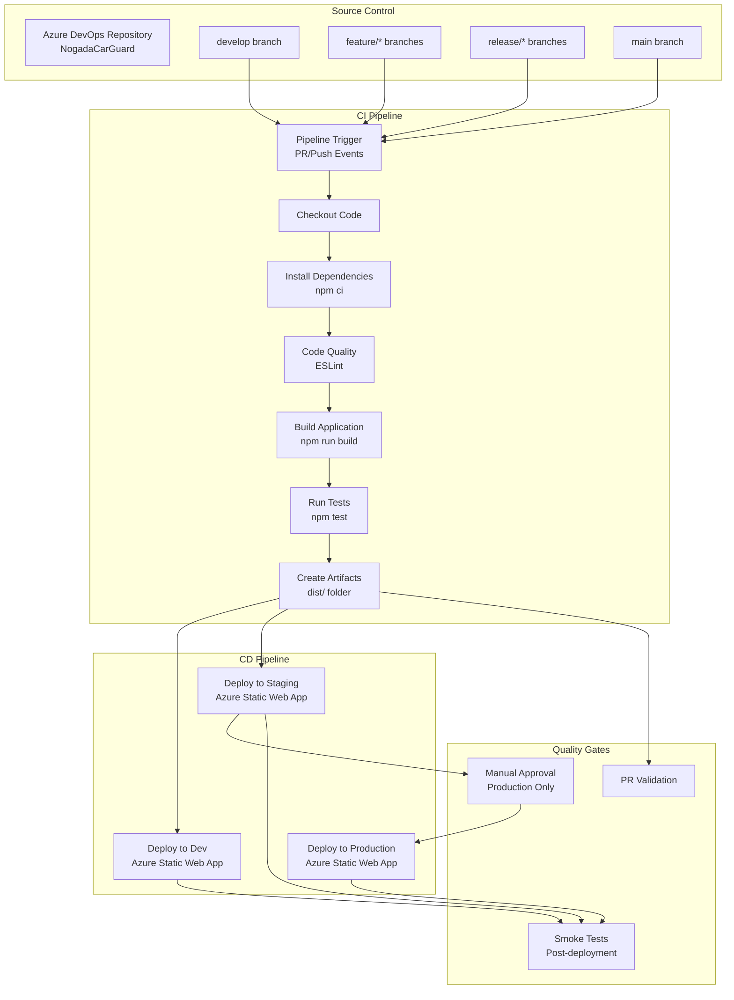
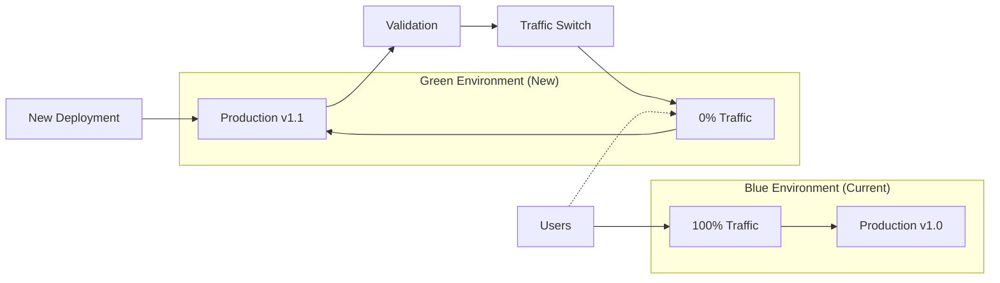
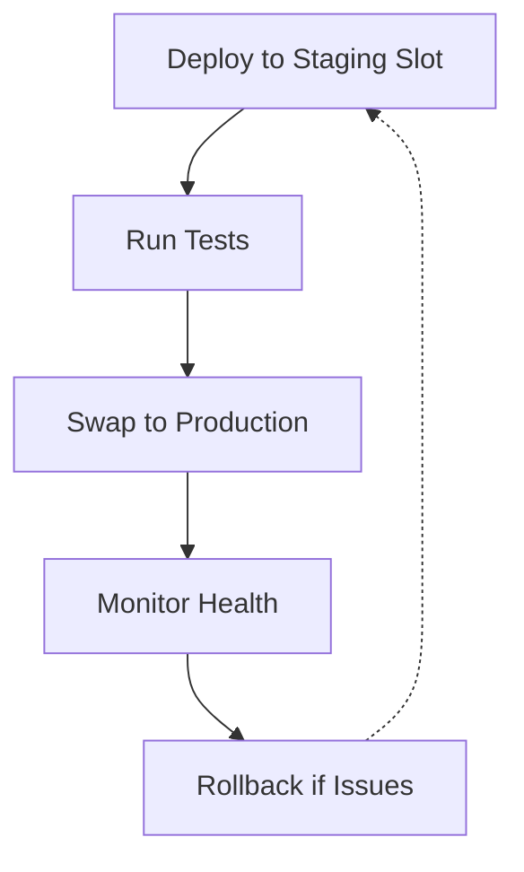

# 🔄 CI/CD Pipelines

> **Continuous Integration and Deployment for NogadaCarGuard**
> 
> Automated build, test, and deployment pipeline configurations for the multi-portal React application with Azure DevOps and GitHub Actions examples.

**Stakeholders**: DevOps Engineers, Developers, Release Managers, Tech Leads

## 📋 Overview

This document provides comprehensive CI/CD pipeline configurations for the NogadaCarGuard application. The pipelines handle automated building, testing, and deployment of the React/TypeScript/Vite application to static web hosting platforms.

### Current Status
- **Repository**: Azure DevOps Git
- **CI/CD Platform**: 🔄 **Planning Phase** - Not yet configured
- **Build System**: Vite 5.4.1 with SWC compiler
- **Deployment Target**: Static web hosting (Azure Static Web Apps recommended)

## 🏗️ Pipeline Architecture



## 🔧 Azure DevOps Pipelines

### Main Pipeline Configuration (azure-pipelines.yml)

```yaml
# Azure DevOps Pipeline for NogadaCarGuard
# Triggers on main, develop, and feature branches

trigger:
  branches:
    include:
      - main
      - develop
      - feature/*
      - release/*

pr:
  branches:
    include:
      - main
      - develop

pool:
  vmImage: 'ubuntu-latest'

variables:
  - group: NogadaCarGuard-Common
  - name: nodeVersion
    value: '18.x'
  - name: npmCacheFolder
    value: $(Pipeline.Workspace)/.npm

stages:
  - stage: Build
    displayName: 'Build and Test'
    jobs:
      - job: BuildJob
        displayName: 'Build Application'
        steps:
          - task: NodeTool@0
            displayName: 'Install Node.js'
            inputs:
              versionSpec: $(nodeVersion)
          
          - task: Cache@2
            displayName: 'Cache npm dependencies'
            inputs:
              key: 'npm | "$(Agent.OS)" | package-lock.json'
              restoreKeys: |
                npm | "$(Agent.OS)"
              path: $(npmCacheFolder)
          
          - script: |
              npm ci --cache $(npmCacheFolder) --prefer-offline
            displayName: 'Install dependencies'
          
          - script: |
              npm run lint
            displayName: 'Run ESLint'
          
          - script: |
              npm run build
            displayName: 'Build application'
            env:
              NODE_ENV: production
          
          # Note: Add test command when tests are implemented
          # - script: |
          #     npm test -- --coverage --watchAll=false
          #   displayName: 'Run tests'
          
          - task: PublishBuildArtifacts@1
            displayName: 'Publish build artifacts'
            inputs:
              pathtoPublish: 'dist'
              artifactName: 'webapp'
              publishLocation: 'Container'
          
          - task: PublishBuildArtifacts@1
            displayName: 'Publish configuration artifacts'
            inputs:
              pathtoPublish: 'staticwebapp.config.json'
              artifactName: 'config'
              publishLocation: 'Container'

  - stage: DeployDev
    displayName: 'Deploy to Development'
    dependsOn: Build
    condition: and(succeeded(), eq(variables['Build.SourceBranch'], 'refs/heads/develop'))
    variables:
      - group: NogadaCarGuard-Dev
    jobs:
      - deployment: DeployDevJob
        displayName: 'Deploy to Dev Environment'
        environment: 'dev'
        strategy:
          runOnce:
            deploy:
              steps:
                - task: AzureStaticWebApp@0
                  displayName: 'Deploy to Azure Static Web App'
                  inputs:
                    app_location: '/'
                    output_location: 'dist'
                    azure_static_web_apps_api_token: $(AZURE_STATIC_WEB_APPS_API_TOKEN_DEV)

  - stage: DeployStaging
    displayName: 'Deploy to Staging'
    dependsOn: Build
    condition: and(succeeded(), or(eq(variables['Build.SourceBranch'], 'refs/heads/main'), startsWith(variables['Build.SourceBranch'], 'refs/heads/release/')))
    variables:
      - group: NogadaCarGuard-Staging
    jobs:
      - deployment: DeployStagingJob
        displayName: 'Deploy to Staging Environment'
        environment: 'staging'
        strategy:
          runOnce:
            deploy:
              steps:
                - task: AzureStaticWebApp@0
                  displayName: 'Deploy to Azure Static Web App'
                  inputs:
                    app_location: '/'
                    output_location: 'dist'
                    azure_static_web_apps_api_token: $(AZURE_STATIC_WEB_APPS_API_TOKEN_STAGING)
                
                - task: PowerShell@2
                  displayName: 'Run smoke tests'
                  inputs:
                    targetType: 'inline'
                    script: |
                      $url = "$(STAGING_URL)"
                      Write-Host "Running smoke tests against $url"
                      
                      # Test main page
                      $response = Invoke-WebRequest -Uri $url -Method Get
                      if ($response.StatusCode -ne 200) {
                        Write-Error "Main page failed with status $($response.StatusCode)"
                        exit 1
                      }
                      
                      # Test portal routes
                      $routes = @("/car-guard", "/customer", "/admin")
                      foreach ($route in $routes) {
                        $routeUrl = "$url$route"
                        $routeResponse = Invoke-WebRequest -Uri $routeUrl -Method Get
                        if ($routeResponse.StatusCode -ne 200) {
                          Write-Error "Route $route failed with status $($routeResponse.StatusCode)"
                          exit 1
                        }
                        Write-Host "✅ Route $route is healthy"
                      }
                      
                      Write-Host "✅ All smoke tests passed"

  - stage: DeployProduction
    displayName: 'Deploy to Production'
    dependsOn: 
      - Build
      - DeployStaging
    condition: and(succeeded(), eq(variables['Build.SourceBranch'], 'refs/heads/main'))
    variables:
      - group: NogadaCarGuard-Production
    jobs:
      - deployment: DeployProductionJob
        displayName: 'Deploy to Production Environment'
        environment: 'production'
        strategy:
          runOnce:
            deploy:
              steps:
                - task: AzureStaticWebApp@0
                  displayName: 'Deploy to Azure Static Web App'
                  inputs:
                    app_location: '/'
                    output_location: 'dist'
                    azure_static_web_apps_api_token: $(AZURE_STATIC_WEB_APPS_API_TOKEN_PROD)
                
                - task: PowerShell@2
                  displayName: 'Run production smoke tests'
                  inputs:
                    targetType: 'inline'
                    script: |
                      $url = "$(PRODUCTION_URL)"
                      Write-Host "Running production smoke tests against $url"
                      
                      # Extended smoke tests for production
                      $routes = @("/", "/car-guard", "/customer", "/admin")
                      foreach ($route in $routes) {
                        $routeUrl = "$url$route"
                        $start = Get-Date
                        $routeResponse = Invoke-WebRequest -Uri $routeUrl -Method Get
                        $end = Get-Date
                        $duration = ($end - $start).TotalMilliseconds
                        
                        if ($routeResponse.StatusCode -ne 200) {
                          Write-Error "Route $route failed with status $($routeResponse.StatusCode)"
                          exit 1
                        }
                        
                        if ($duration -gt 3000) {
                          Write-Warning "Route $route took ${duration}ms (>3s)"
                        }
                        
                        Write-Host "✅ Route $route: ${duration}ms"
                      }
                      
                      Write-Host "✅ Production deployment verified"
```

### Pull Request Pipeline (pr-pipeline.yml)

```yaml
# Pull Request Validation Pipeline
# Runs on PRs to main and develop branches

pr:
  branches:
    include:
      - main
      - develop

pool:
  vmImage: 'ubuntu-latest'

variables:
  nodeVersion: '18.x'
  npmCacheFolder: $(Pipeline.Workspace)/.npm

jobs:
  - job: ValidatePR
    displayName: 'Validate Pull Request'
    steps:
      - task: NodeTool@0
        displayName: 'Install Node.js'
        inputs:
          versionSpec: $(nodeVersion)
      
      - task: Cache@2
        displayName: 'Cache npm dependencies'
        inputs:
          key: 'npm | "$(Agent.OS)" | package-lock.json'
          restoreKeys: |
            npm | "$(Agent.OS)"
          path: $(npmCacheFolder)
      
      - script: |
          npm ci --cache $(npmCacheFolder) --prefer-offline
        displayName: 'Install dependencies'
      
      - script: |
          npm run lint
        displayName: 'Run ESLint'
        continueOnError: false
      
      - script: |
          npm run build
        displayName: 'Validate build'
        env:
          NODE_ENV: production
      
      # Bundle size check
      - task: PowerShell@2
        displayName: 'Check bundle size'
        inputs:
          targetType: 'inline'
          script: |
            $distSize = (Get-ChildItem -Path "dist" -Recurse | Measure-Object -Property Length -Sum).Sum
            $distSizeMB = [Math]::Round($distSize / 1MB, 2)
            
            Write-Host "Bundle size: ${distSizeMB}MB"
            
            if ($distSizeMB -gt 10) {
              Write-Error "Bundle size ${distSizeMB}MB exceeds 10MB limit"
              exit 1
            }
            
            Write-Host "✅ Bundle size check passed"
      
      # Security audit
      - script: |
          npm audit --audit-level=moderate
        displayName: 'Security audit'
        continueOnError: true
      
      # Code quality report
      - task: PublishTestResults@2
        displayName: 'Publish lint results'
        inputs:
          testResultsFormat: 'JUnit'
          testResultsFiles: 'lint-results.xml'
          mergeTestResults: true
        condition: always()
```

## 🐙 GitHub Actions (Alternative)

### Main Workflow (.github/workflows/deploy.yml)

```yaml
name: Build and Deploy NogadaCarGuard

on:
  push:
    branches:
      - main
      - develop
      - 'feature/*'
      - 'release/*'
  pull_request:
    branches:
      - main
      - develop

env:
  NODE_VERSION: '18.x'
  CACHE_DEPENDENCY_PATH: 'package-lock.json'

jobs:
  build:
    name: Build and Test
    runs-on: ubuntu-latest
    
    steps:
      - name: Checkout code
        uses: actions/checkout@v4
        
      - name: Setup Node.js
        uses: actions/setup-node@v4
        with:
          node-version: ${{ env.NODE_VERSION }}
          cache: 'npm'
          cache-dependency-path: ${{ env.CACHE_DEPENDENCY_PATH }}
      
      - name: Install dependencies
        run: npm ci
      
      - name: Run ESLint
        run: npm run lint
      
      - name: Build application
        run: npm run build
        env:
          NODE_ENV: production
      
      # Note: Add when tests are implemented
      # - name: Run tests
      #   run: npm test -- --coverage --watchAll=false
      
      - name: Upload build artifacts
        uses: actions/upload-artifact@v4
        with:
          name: webapp-${{ github.sha }}
          path: dist/
          retention-days: 30
      
      - name: Bundle size check
        run: |
          BUNDLE_SIZE=$(du -sb dist/ | cut -f1)
          BUNDLE_SIZE_MB=$(echo "scale=2; $BUNDLE_SIZE / 1024 / 1024" | bc)
          echo "Bundle size: ${BUNDLE_SIZE_MB}MB"
          
          if (( $(echo "$BUNDLE_SIZE_MB > 10" | bc -l) )); then
            echo "❌ Bundle size ${BUNDLE_SIZE_MB}MB exceeds 10MB limit"
            exit 1
          fi
          
          echo "✅ Bundle size check passed"

  deploy-dev:
    name: Deploy to Development
    needs: build
    runs-on: ubuntu-latest
    if: github.ref == 'refs/heads/develop'
    environment: development
    
    steps:
      - name: Checkout code
        uses: actions/checkout@v4
      
      - name: Download build artifacts
        uses: actions/download-artifact@v4
        with:
          name: webapp-${{ github.sha }}
          path: dist/
      
      - name: Deploy to Azure Static Web Apps
        uses: Azure/static-web-apps-deploy@v1
        with:
          azure_static_web_apps_api_token: ${{ secrets.AZURE_STATIC_WEB_APPS_API_TOKEN_DEV }}
          repo_token: ${{ secrets.GITHUB_TOKEN }}
          action: 'upload'
          app_location: '/'
          output_location: 'dist'

  deploy-staging:
    name: Deploy to Staging
    needs: build
    runs-on: ubuntu-latest
    if: github.ref == 'refs/heads/main' || startsWith(github.ref, 'refs/heads/release/')
    environment: staging
    
    steps:
      - name: Checkout code
        uses: actions/checkout@v4
      
      - name: Download build artifacts
        uses: actions/download-artifact@v4
        with:
          name: webapp-${{ github.sha }}
          path: dist/
      
      - name: Deploy to Azure Static Web Apps
        uses: Azure/static-web-apps-deploy@v1
        with:
          azure_static_web_apps_api_token: ${{ secrets.AZURE_STATIC_WEB_APPS_API_TOKEN_STAGING }}
          repo_token: ${{ secrets.GITHUB_TOKEN }}
          action: 'upload'
          app_location: '/'
          output_location: 'dist'
      
      - name: Run smoke tests
        run: |
          echo "Running smoke tests against staging..."
          
          # Wait for deployment to be ready
          sleep 30
          
          # Test main routes
          for route in "/" "/car-guard" "/customer" "/admin"; do
            url="${{ vars.STAGING_URL }}${route}"
            echo "Testing $url"
            
            response=$(curl -s -o /dev/null -w "%{http_code}" "$url")
            
            if [ "$response" != "200" ]; then
              echo "❌ Route $route failed with status $response"
              exit 1
            fi
            
            echo "✅ Route $route is healthy"
          done
          
          echo "✅ All smoke tests passed"

  deploy-production:
    name: Deploy to Production
    needs: [build, deploy-staging]
    runs-on: ubuntu-latest
    if: github.ref == 'refs/heads/main'
    environment: production
    
    steps:
      - name: Checkout code
        uses: actions/checkout@v4
      
      - name: Download build artifacts
        uses: actions/download-artifact@v4
        with:
          name: webapp-${{ github.sha }}
          path: dist/
      
      - name: Deploy to Azure Static Web Apps
        uses: Azure/static-web-apps-deploy@v1
        with:
          azure_static_web_apps_api_token: ${{ secrets.AZURE_STATIC_WEB_APPS_API_TOKEN_PROD }}
          repo_token: ${{ secrets.GITHUB_TOKEN }}
          action: 'upload'
          app_location: '/'
          output_location: 'dist'
      
      - name: Run production verification
        run: |
          echo "Verifying production deployment..."
          
          # Wait for deployment to propagate
          sleep 60
          
          # Extended production tests
          for route in "/" "/car-guard" "/customer" "/admin"; do
            url="${{ vars.PRODUCTION_URL }}${route}"
            echo "Testing $url"
            
            start=$(date +%s%3N)
            response=$(curl -s -o /dev/null -w "%{http_code}" "$url")
            end=$(date +%s%3N)
            duration=$((end - start))
            
            if [ "$response" != "200" ]; then
              echo "❌ Route $route failed with status $response"
              exit 1
            fi
            
            if [ "$duration" -gt 3000 ]; then
              echo "⚠️ Route $route took ${duration}ms (>3s)"
            fi
            
            echo "✅ Route $route: ${duration}ms"
          done
          
          echo "✅ Production deployment verified"
      
      - name: Notify deployment success
        if: success()
        run: |
          echo "🎉 Production deployment successful!"
          echo "URL: ${{ vars.PRODUCTION_URL }}"
```

### Pull Request Workflow (.github/workflows/pr-check.yml)

```yaml
name: Pull Request Validation

on:
  pull_request:
    branches:
      - main
      - develop

env:
  NODE_VERSION: '18.x'

jobs:
  validate:
    name: Validate Pull Request
    runs-on: ubuntu-latest
    
    steps:
      - name: Checkout code
        uses: actions/checkout@v4
        
      - name: Setup Node.js
        uses: actions/setup-node@v4
        with:
          node-version: ${{ env.NODE_VERSION }}
          cache: 'npm'
          cache-dependency-path: 'package-lock.json'
      
      - name: Install dependencies
        run: npm ci
      
      - name: Run ESLint
        run: npm run lint
      
      - name: Build application
        run: npm run build
        env:
          NODE_ENV: production
      
      - name: Security audit
        run: npm audit --audit-level=moderate
        continue-on-error: true
      
      - name: Bundle analysis
        run: |
          echo "## Bundle Analysis" >> $GITHUB_STEP_SUMMARY
          echo "| File | Size |" >> $GITHUB_STEP_SUMMARY
          echo "|------|------|" >> $GITHUB_STEP_SUMMARY
          
          find dist -name "*.js" -o -name "*.css" | while read file; do
            size=$(du -h "$file" | cut -f1)
            filename=$(basename "$file")
            echo "| $filename | $size |" >> $GITHUB_STEP_SUMMARY
          done
      
      - name: Comment PR
        uses: actions/github-script@v7
        if: github.event_name == 'pull_request'
        with:
          script: |
            const fs = require('fs');
            const path = require('path');
            
            // Get bundle sizes
            const distPath = 'dist';
            const files = fs.readdirSync(distPath, { recursive: true });
            let totalSize = 0;
            
            files.forEach(file => {
              const filePath = path.join(distPath, file);
              if (fs.statSync(filePath).isFile()) {
                totalSize += fs.statSync(filePath).size;
              }
            });
            
            const totalSizeMB = (totalSize / 1024 / 1024).toFixed(2);
            
            const comment = `## 🔍 PR Validation Results
            
            ✅ **Build**: Successful
            ✅ **Linting**: Passed
            ✅ **Bundle Size**: ${totalSizeMB}MB
            
            ### Build Artifacts
            - Total bundle size: ${totalSizeMB}MB
            - Status: ${totalSizeMB < 10 ? '✅ Within limits' : '⚠️ Large bundle'}
            
            ### Next Steps
            - Merge this PR to deploy to staging
            - Staging deployment will trigger on merge to main
            `;
            
            github.rest.issues.createComment({
              issue_number: context.issue.number,
              owner: context.repo.owner,
              repo: context.repo.repo,
              body: comment
            });
```

## 🔧 Pipeline Configuration

### Variable Groups (Azure DevOps)

#### NogadaCarGuard-Common
```yaml
Variables:
  - NODE_VERSION: "18.x"
  - BUILD_CONFIGURATION: "Release"
  - PACKAGE_MANAGER: "npm"
```

#### NogadaCarGuard-Dev
```yaml
Variables:
  - AZURE_STATIC_WEB_APPS_API_TOKEN_DEV: $(DEV_DEPLOYMENT_TOKEN)
  - ENVIRONMENT_NAME: "development"
  - DEV_URL: "https://swa-nogada-dev.azurestaticapps.net"
```

#### NogadaCarGuard-Staging
```yaml
Variables:
  - AZURE_STATIC_WEB_APPS_API_TOKEN_STAGING: $(STAGING_DEPLOYMENT_TOKEN)
  - ENVIRONMENT_NAME: "staging"
  - STAGING_URL: "https://swa-nogada-staging.azurestaticapps.net"
```

#### NogadaCarGuard-Production
```yaml
Variables:
  - AZURE_STATIC_WEB_APPS_API_TOKEN_PROD: $(PROD_DEPLOYMENT_TOKEN)
  - ENVIRONMENT_NAME: "production"
  - PRODUCTION_URL: "https://app.nogadacarguard.com"
```

### GitHub Secrets Configuration

```yaml
Repository Secrets:
  - AZURE_STATIC_WEB_APPS_API_TOKEN_DEV
  - AZURE_STATIC_WEB_APPS_API_TOKEN_STAGING
  - AZURE_STATIC_WEB_APPS_API_TOKEN_PROD

Environment Variables:
  development:
    - DEV_URL: "https://swa-nogada-dev.azurestaticapps.net"
  
  staging:
    - STAGING_URL: "https://swa-nogada-staging.azurestaticapps.net"
  
  production:
    - PRODUCTION_URL: "https://app.nogadacarguard.com"
```

## 🚀 Deployment Strategies

### Blue-Green Deployment


### Rolling Deployment (Static Web Apps)


## 📊 Quality Gates

### Automated Quality Checks
- **Code Linting**: ESLint with TypeScript support
- **Build Validation**: Successful Vite build
- **Bundle Size**: < 10MB total size limit
- **Security Audit**: npm audit for vulnerabilities
- **Smoke Tests**: Basic health checks on deployment

### Manual Approval Gates
- **Production Deployment**: Manual approval required
- **Release Branches**: Automated staging, manual production
- **Emergency Deployments**: Override available with justification

## 🔍 Pipeline Monitoring

### Build Metrics
- **Build Duration**: Target < 5 minutes
- **Success Rate**: Target > 95%
- **Queue Time**: Target < 2 minutes
- **Artifact Size**: Monitor trends

### Deployment Metrics
- **Deployment Time**: Target < 10 minutes
- **Success Rate**: Target > 98%
- **Rollback Rate**: Monitor < 5%
- **MTTR**: Mean time to recovery

## 🚨 Error Handling & Recovery

### Common Failure Scenarios
1. **Dependency Installation Failure**
   - Clear npm cache
   - Retry with fresh dependencies
   - Check for package vulnerabilities

2. **Build Failure**
   - TypeScript compilation errors
   - ESLint failures
   - Missing environment variables

3. **Deployment Failure**
   - Invalid deployment token
   - Static Web App configuration issues
   - DNS/SSL certificate problems

### Recovery Procedures
```bash
# Clear build cache
npm cache clean --force
rm -rf node_modules package-lock.json
npm install

# Manual deployment (emergency)
az staticwebapp deploy \
  --name "swa-nogada-prod" \
  --resource-group "rg-nogada-prod" \
  --source-location "./dist"

# Rollback deployment
az staticwebapp environment set \
  --name "swa-nogada-prod" \
  --environment-name "production" \
  --source-location "./previous-build"
```

## 🔗 Integration Points

### Azure DevOps Integration
- **Repository**: Automatic trigger on push/PR
- **Work Items**: Link builds to user stories
- **Release Notes**: Auto-generated from commits
- **Notifications**: Teams/Slack integration

### Monitoring Integration
- **Application Insights**: Performance tracking
- **Azure Monitor**: Infrastructure health
- **PagerDuty**: Alert escalation
- **StatusPage**: Public status updates

## 📚 Best Practices

### Pipeline Optimization
- **Caching**: npm dependencies and build artifacts
- **Parallel Jobs**: Independent stages run concurrently
- **Artifact Management**: Clean up old artifacts
- **Environment Promotion**: Consistent promotion path

### Security Best Practices
- **Secret Management**: Azure Key Vault/GitHub Secrets
- **Token Rotation**: Regular API token updates
- **Branch Protection**: Require PR reviews
- **Vulnerability Scanning**: Automated security checks

## 🔗 Related Documentation

### Internal Links
- [Infrastructure as Code](./infrastructure-as-code.md)
- [Environment Management](./environment-management.md)
- [Monitoring & Alerting](./monitoring-alerting.md)
- [Deployment Guide](../developers/deployment.md)

### External Resources
- [Azure DevOps Pipelines](https://docs.microsoft.com/en-us/azure/devops/pipelines/)
- [GitHub Actions](https://docs.github.com/en/actions)
- [Azure Static Web Apps CI/CD](https://docs.microsoft.com/en-us/azure/static-web-apps/build-configuration)
- [Vite Deployment Guide](https://vitejs.dev/guide/static-deploy.html)

---
**Document Information:**
- **Last Updated**: 2025-08-25
- **Status**: Planning Phase
- **Owner**: DevOps Team
- **Version**: 1.0.0
- **Review Cycle**: Bi-weekly
- **Stakeholders**: DevOps Engineers, Developers, Release Managers, Tech Leads