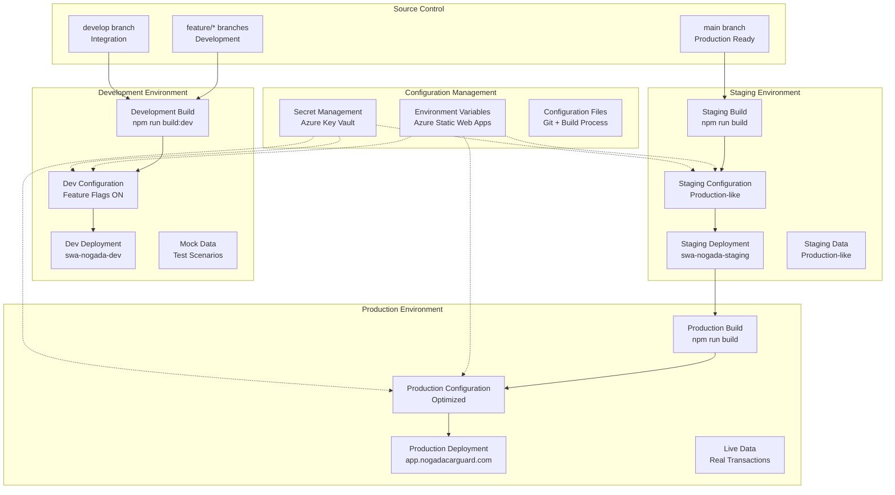
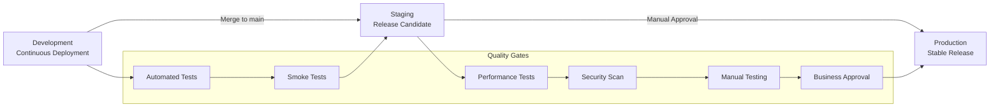

# 🌍 Environment Management

> **Environment Configurations and Management for NogadaCarGuard**
> 
> Comprehensive environment management strategies for the multi-portal React application, covering development, staging, and production environments with configuration management and deployment procedures.

**Stakeholders**: DevOps Engineers, Developers, QA Teams, Business Stakeholders, Platform Engineers

## 📋 Overview

This document outlines environment management strategies for the NogadaCarGuard application. As a React/TypeScript/Vite application with three distinct portals, environment management focuses on configuration consistency, secure secret management, and smooth promotion workflows.

### Environment Philosophy
- **Configuration as Code**: All environment settings versioned and automated
- **Environment Parity**: Minimize differences between environments
- **Progressive Deployment**: Safe promotion path from dev to production
- **Security First**: Secure handling of secrets and sensitive configuration

## 🏗️ Environment Architecture



## 🔧 Environment Configurations

### Environment Matrix

| Aspect | Development | Staging | Production |
|--------|-------------|---------|------------|
| **Branch** | develop/feature/* | main | main |
| **Build Command** | `npm run build:dev` | `npm run build` | `npm run build` |
| **URL** | swa-nogada-dev.azurestaticapps.net | swa-nogada-staging.azurestaticapps.net | app.nogadacarguard.com |
| **Data** | Mock data | Staging data | Live data |
| **Analytics** | Disabled | Enabled (test) | Enabled (production) |
| **Error Tracking** | Console only | Full tracking | Full tracking |
| **Performance Monitoring** | Basic | Full | Full |
| **Security Headers** | Relaxed | Production-like | Strict |
| **CDN** | Basic | Standard | Premium |
| **SSL Certificate** | Wildcard | Wildcard | Custom domain |
| **Backup** | None | Daily | Hourly |
| **Monitoring** | Basic | Standard | Comprehensive |

### Configuration File Structure

```
config/
├── environments/
│   ├── development.json
│   ├── staging.json
│   └── production.json
├── secrets/
│   ├── development.env.example
│   ├── staging.env.example
│   └── production.env.example
└── build/
    ├── dev.config.js
    ├── staging.config.js
    └── production.config.js
```

### Development Environment Configuration

#### config/environments/development.json
```json
{
  "environment": "development",
  "version": "1.0.0-dev",
  "features": {
    "enableDebugMode": true,
    "showMockDataIndicator": true,
    "enablePerformanceDebug": true,
    "bypassAuthentication": false,
    "enableFeatureFlags": true
  },
  "api": {
    "baseUrl": "https://api-dev.nogadacarguard.com",
    "timeout": 10000,
    "retryAttempts": 3,
    "mockMode": true
  },
  "monitoring": {
    "enabled": true,
    "level": "debug",
    "console": true,
    "remoteLogging": false
  },
  "analytics": {
    "enabled": false,
    "trackingId": "",
    "debug": true
  },
  "security": {
    "strictMode": false,
    "allowHttp": true,
    "corsOrigins": ["http://localhost:8080", "http://127.0.0.1:8080"]
  },
  "ui": {
    "theme": "default",
    "showEnvironmentBanner": true,
    "enableDevTools": true
  },
  "portals": {
    "carGuard": {
      "enabled": true,
      "mockQRCodes": true,
      "simulatePayments": true
    },
    "customer": {
      "enabled": true,
      "mockPaymentGateway": true,
      "simulateTransactions": true
    },
    "admin": {
      "enabled": true,
      "showTestData": true,
      "enableDataSeeding": true
    }
  }
}
```

#### Development Environment Variables (.env.development)
```bash
# Development Environment Variables
NODE_ENV=development
VITE_APP_ENV=development
VITE_APP_VERSION=1.0.0-dev

# API Configuration
VITE_API_BASE_URL=https://api-dev.nogadacarguard.com
VITE_API_TIMEOUT=10000
VITE_MOCK_API=true

# Authentication
VITE_AUTH_DOMAIN=dev-auth.nogadacarguard.com
VITE_AUTH_CLIENT_ID=dev_client_id_placeholder

# Payment Gateway (Development Keys)
VITE_PAYMENT_GATEWAY_URL=https://sandbox.paymentgateway.com
VITE_PAYMENT_PUBLIC_KEY=pk_test_development_key

# Monitoring & Analytics
VITE_APPINSIGHTS_CONNECTION_STRING=InstrumentationKey=dev-key-placeholder
VITE_ANALYTICS_TRACKING_ID=
VITE_ERROR_TRACKING_DSN=

# Feature Flags
VITE_FEATURE_QR_SCANNING=true
VITE_FEATURE_MULTI_PAYMENT=true
VITE_FEATURE_ADVANCED_REPORTS=false
VITE_FEATURE_REAL_TIME_NOTIFICATIONS=false

# Development Tools
VITE_SHOW_DEV_TOOLS=true
VITE_ENABLE_LOGGING=true
VITE_DEBUG_MODE=true
```

### Staging Environment Configuration

#### config/environments/staging.json
```json
{
  "environment": "staging",
  "version": "1.0.0-rc",
  "features": {
    "enableDebugMode": false,
    "showMockDataIndicator": false,
    "enablePerformanceDebug": true,
    "bypassAuthentication": false,
    "enableFeatureFlags": true
  },
  "api": {
    "baseUrl": "https://api-staging.nogadacarguard.com",
    "timeout": 8000,
    "retryAttempts": 3,
    "mockMode": false
  },
  "monitoring": {
    "enabled": true,
    "level": "info",
    "console": false,
    "remoteLogging": true
  },
  "analytics": {
    "enabled": true,
    "trackingId": "GA_STAGING_ID",
    "debug": false
  },
  "security": {
    "strictMode": true,
    "allowHttp": false,
    "corsOrigins": ["https://swa-nogada-staging.azurestaticapps.net"]
  },
  "ui": {
    "theme": "default",
    "showEnvironmentBanner": true,
    "enableDevTools": false
  },
  "portals": {
    "carGuard": {
      "enabled": true,
      "mockQRCodes": false,
      "simulatePayments": false
    },
    "customer": {
      "enabled": true,
      "mockPaymentGateway": false,
      "simulateTransactions": false
    },
    "admin": {
      "enabled": true,
      "showTestData": false,
      "enableDataSeeding": false
    }
  }
}
```

### Production Environment Configuration

#### config/environments/production.json
```json
{
  "environment": "production",
  "version": "1.0.0",
  "features": {
    "enableDebugMode": false,
    "showMockDataIndicator": false,
    "enablePerformanceDebug": false,
    "bypassAuthentication": false,
    "enableFeatureFlags": false
  },
  "api": {
    "baseUrl": "https://api.nogadacarguard.com",
    "timeout": 5000,
    "retryAttempts": 3,
    "mockMode": false
  },
  "monitoring": {
    "enabled": true,
    "level": "warn",
    "console": false,
    "remoteLogging": true
  },
  "analytics": {
    "enabled": true,
    "trackingId": "GA_PRODUCTION_ID",
    "debug": false
  },
  "security": {
    "strictMode": true,
    "allowHttp": false,
    "corsOrigins": ["https://app.nogadacarguard.com"]
  },
  "ui": {
    "theme": "default",
    "showEnvironmentBanner": false,
    "enableDevTools": false
  },
  "portals": {
    "carGuard": {
      "enabled": true,
      "mockQRCodes": false,
      "simulatePayments": false
    },
    "customer": {
      "enabled": true,
      "mockPaymentGateway": false,
      "simulateTransactions": false
    },
    "admin": {
      "enabled": true,
      "showTestData": false,
      "enableDataSeeding": false
    }
  }
}
```

## 🔒 Secret Management

### Azure Key Vault Integration

#### Key Vault Configuration (keyvault.bicep)
```bicep
param environmentName string
param keyVaultName string = 'kv-nogada-${environmentName}'

resource keyVault 'Microsoft.KeyVault/vaults@2021-11-01-preview' = {
  name: keyVaultName
  location: resourceGroup().location
  properties: {
    sku: {
      family: 'A'
      name: 'standard'
    }
    tenantId: tenant().tenantId
    accessPolicies: []
    enableRbacAuthorization: true
    enableSoftDelete: true
    softDeleteRetentionInDays: 7
    enablePurgeProtection: false
  }
}

// Secrets for the application
resource apiKey 'Microsoft.KeyVault/vaults/secrets@2021-11-01-preview' = {
  name: 'api-key'
  parent: keyVault
  properties: {
    value: '${environmentName}-api-key-placeholder'
  }
}

resource paymentGatewaySecret 'Microsoft.KeyVault/vaults/secrets@2021-11-01-preview' = {
  name: 'payment-gateway-secret'
  parent: keyVault
  properties: {
    value: '${environmentName}-payment-secret-placeholder'
  }
}

resource databaseConnectionString 'Microsoft.KeyVault/vaults/secrets@2021-11-01-preview' = {
  name: 'database-connection-string'
  parent: keyVault
  properties: {
    value: 'Server=${environmentName}-db.database.windows.net;Database=nogada;'
  }
}

output keyVaultUri string = keyVault.properties.vaultUri
```

#### Secret Access Configuration
```typescript
// src/lib/secrets.ts
interface SecretConfig {
  apiKey: string;
  paymentGatewaySecret: string;
  databaseConnectionString: string;
  authClientSecret: string;
}

class SecretManager {
  private static instance: SecretManager;
  private secrets: SecretConfig | null = null;

  private constructor() {}

  static getInstance(): SecretManager {
    if (!SecretManager.instance) {
      SecretManager.instance = new SecretManager();
    }
    return SecretManager.instance;
  }

  async loadSecrets(): Promise<void> {
    if (this.secrets) return;

    // In production, these would come from Azure Key Vault
    // In development, from environment variables
    this.secrets = {
      apiKey: import.meta.env.VITE_API_KEY || '',
      paymentGatewaySecret: import.meta.env.VITE_PAYMENT_SECRET || '',
      databaseConnectionString: import.meta.env.VITE_DB_CONNECTION || '',
      authClientSecret: import.meta.env.VITE_AUTH_SECRET || ''
    };
  }

  getSecret(key: keyof SecretConfig): string {
    if (!this.secrets) {
      throw new Error('Secrets not loaded. Call loadSecrets() first.');
    }
    return this.secrets[key];
  }
}

export default SecretManager;
```

### Environment-Specific Secrets

#### Development Secrets (Not in Git)
```bash
# .env.development.local (not committed)
VITE_API_KEY=dev_api_key_12345
VITE_PAYMENT_SECRET=sk_test_dev_payment_secret
VITE_DB_CONNECTION=Server=dev-db.database.windows.net;Database=nogada_dev;
VITE_AUTH_SECRET=dev_auth_client_secret

# Third-party service keys
VITE_APPINSIGHTS_CONNECTION_STRING=InstrumentationKey=dev-appinsights-key
VITE_ANALYTICS_TRACKING_ID=
VITE_ERROR_TRACKING_DSN=
```

#### Staging Secrets (Azure Key Vault)
```yaml
# Stored in Azure Key Vault: kv-nogada-staging
Secrets:
  - api-key: "staging_api_key_67890"
  - payment-gateway-secret: "sk_test_staging_payment_secret"
  - database-connection-string: "Server=staging-db.database.windows.net;Database=nogada_staging;"
  - auth-client-secret: "staging_auth_client_secret"
  - appinsights-connection-string: "InstrumentationKey=staging-appinsights-key"
```

#### Production Secrets (Azure Key Vault)
```yaml
# Stored in Azure Key Vault: kv-nogada-prod
Secrets:
  - api-key: "prod_api_key_abcdef"
  - payment-gateway-secret: "sk_live_production_payment_secret"
  - database-connection-string: "Server=prod-db.database.windows.net;Database=nogada_prod;"
  - auth-client-secret: "production_auth_client_secret"
  - appinsights-connection-string: "InstrumentationKey=prod-appinsights-key"
```

## 🔄 Configuration Management

### Build-Time Configuration

#### Vite Configuration (vite.config.ts)
```typescript
import { defineConfig, loadEnv } from 'vite';
import react from '@vitejs/plugin-react-swc';
import path from 'path';

export default defineConfig(({ mode }) => {
  const env = loadEnv(mode, process.cwd(), '');
  
  return {
    plugins: [react()],
    define: {
      __APP_ENV__: JSON.stringify(mode),
      __APP_VERSION__: JSON.stringify(process.env.npm_package_version)
    },
    server: {
      host: '::',
      port: 8080
    },
    build: {
      sourcemap: mode !== 'production',
      minify: mode === 'production',
      rollupOptions: {
        output: {
          manualChunks: {
            vendor: ['react', 'react-dom'],
            router: ['react-router-dom'],
            ui: ['@radix-ui/react-dialog', '@radix-ui/react-dropdown-menu']
          }
        }
      }
    },
    resolve: {
      alias: {
        '@': path.resolve(__dirname, './src')
      }
    }
  };
});
```

#### Environment Configuration Loader
```typescript
// src/lib/config.ts
interface AppConfig {
  environment: string;
  version: string;
  api: {
    baseUrl: string;
    timeout: number;
    retryAttempts: number;
    mockMode: boolean;
  };
  monitoring: {
    enabled: boolean;
    level: string;
    console: boolean;
    remoteLogging: boolean;
  };
  features: {
    enableDebugMode: boolean;
    showMockDataIndicator: boolean;
    enablePerformanceDebug: boolean;
    bypassAuthentication: boolean;
    enableFeatureFlags: boolean;
  };
}

class ConfigManager {
  private static instance: ConfigManager;
  private config: AppConfig | null = null;

  private constructor() {}

  static getInstance(): ConfigManager {
    if (!ConfigManager.instance) {
      ConfigManager.instance = new ConfigManager();
    }
    return ConfigManager.instance;
  }

  async loadConfig(): Promise<void> {
    if (this.config) return;

    const environment = import.meta.env.VITE_APP_ENV || 'development';
    
    try {
      // Load environment-specific configuration
      const configModule = await import(`../config/environments/${environment}.json`);
      this.config = configModule.default;
    } catch (error) {
      console.warn(`Failed to load config for ${environment}, using defaults`);
      this.config = this.getDefaultConfig();
    }
  }

  getConfig(): AppConfig {
    if (!this.config) {
      throw new Error('Configuration not loaded. Call loadConfig() first.');
    }
    return this.config;
  }

  private getDefaultConfig(): AppConfig {
    return {
      environment: 'development',
      version: '1.0.0-dev',
      api: {
        baseUrl: 'http://localhost:3001',
        timeout: 10000,
        retryAttempts: 3,
        mockMode: true
      },
      monitoring: {
        enabled: true,
        level: 'debug',
        console: true,
        remoteLogging: false
      },
      features: {
        enableDebugMode: true,
        showMockDataIndicator: true,
        enablePerformanceDebug: true,
        bypassAuthentication: false,
        enableFeatureFlags: true
      }
    };
  }
}

export default ConfigManager;
```

### Runtime Configuration

#### Feature Flag System
```typescript
// src/lib/featureFlags.ts
interface FeatureFlags {
  enableQRScanning: boolean;
  enableMultiPayment: boolean;
  enableAdvancedReports: boolean;
  enableRealTimeNotifications: boolean;
  enableBetaFeatures: boolean;
}

class FeatureFlagManager {
  private static instance: FeatureFlagManager;
  private flags: FeatureFlags;

  private constructor() {
    this.flags = this.loadFeatureFlags();
  }

  static getInstance(): FeatureFlagManager {
    if (!FeatureFlagManager.instance) {
      FeatureFlagManager.instance = new FeatureFlagManager();
    }
    return FeatureFlagManager.instance;
  }

  private loadFeatureFlags(): FeatureFlags {
    const environment = import.meta.env.VITE_APP_ENV || 'development';
    
    return {
      enableQRScanning: import.meta.env.VITE_FEATURE_QR_SCANNING === 'true',
      enableMultiPayment: import.meta.env.VITE_FEATURE_MULTI_PAYMENT === 'true',
      enableAdvancedReports: import.meta.env.VITE_FEATURE_ADVANCED_REPORTS === 'true',
      enableRealTimeNotifications: import.meta.env.VITE_FEATURE_REAL_TIME_NOTIFICATIONS === 'true',
      enableBetaFeatures: environment === 'development'
    };
  }

  isEnabled(flag: keyof FeatureFlags): boolean {
    return this.flags[flag];
  }

  getAllFlags(): FeatureFlags {
    return { ...this.flags };
  }

  // For development/testing purposes
  setFlag(flag: keyof FeatureFlags, value: boolean): void {
    if (import.meta.env.VITE_APP_ENV === 'development') {
      this.flags[flag] = value;
    } else {
      console.warn('Feature flags can only be modified in development environment');
    }
  }
}

export default FeatureFlagManager;
```

## 🚀 Environment Promotion Workflow

### Promotion Pipeline



### Promotion Checklist

#### Development to Staging
- [ ] All feature development complete
- [ ] Code reviewed and approved
- [ ] Automated tests passing
- [ ] No critical security vulnerabilities
- [ ] Performance benchmarks met
- [ ] Configuration validated
- [ ] Smoke tests passing

#### Staging to Production
- [ ] User acceptance testing complete
- [ ] Performance testing passed
- [ ] Security review approved
- [ ] Business stakeholder approval
- [ ] Rollback plan prepared
- [ ] Monitoring alerts configured
- [ ] Support team notified
- [ ] Documentation updated

## 🔧 Environment-Specific Configurations

### Static Web App Configuration

#### Development (staticwebapp.dev.config.json)
```json
{
  "routes": [
    {
      "route": "/car-guard/*",
      "serve": "/index.html",
      "statusCode": 200
    },
    {
      "route": "/customer/*",
      "serve": "/index.html",
      "statusCode": 200
    },
    {
      "route": "/admin/*",
      "serve": "/index.html",
      "statusCode": 200
    },
    {
      "route": "/*",
      "serve": "/index.html",
      "statusCode": 200
    }
  ],
  "navigationFallback": {
    "rewrite": "/index.html"
  },
  "globalHeaders": {
    "X-Content-Type-Options": "nosniff",
    "X-Frame-Options": "SAMEORIGIN"
  },
  "mimeTypes": {
    ".json": "application/json"
  },
  "auth": {
    "rolesSource": "/api/GetRoles",
    "identityProviders": {
      "azureActiveDirectory": {
        "userDetailsClaim": "http://schemas.xmlsoap.org/ws/2005/05/identity/claims/name",
        "registration": {
          "openIdIssuer": "https://login.microsoftonline.com/{tenant-id}/v2.0",
          "clientIdSettingName": "AZURE_CLIENT_ID",
          "clientSecretSettingName": "AZURE_CLIENT_SECRET"
        }
      }
    }
  }
}
```

#### Production (staticwebapp.config.json)
```json
{
  "routes": [
    {
      "route": "/car-guard/*",
      "serve": "/index.html",
      "statusCode": 200
    },
    {
      "route": "/customer/*",
      "serve": "/index.html",
      "statusCode": 200
    },
    {
      "route": "/admin/*",
      "serve": "/index.html",
      "statusCode": 200,
      "allowedRoles": ["admin"]
    },
    {
      "route": "/api/*",
      "allowedRoles": ["authenticated"]
    },
    {
      "route": "/*",
      "serve": "/index.html",
      "statusCode": 200
    }
  ],
  "navigationFallback": {
    "rewrite": "/index.html",
    "exclude": ["/assets/*", "/api/*"]
  },
  "globalHeaders": {
    "X-Content-Type-Options": "nosniff",
    "X-Frame-Options": "DENY",
    "X-XSS-Protection": "1; mode=block",
    "Strict-Transport-Security": "max-age=31536000; includeSubDomains",
    "Content-Security-Policy": "default-src 'self'; script-src 'self' 'unsafe-inline' 'unsafe-eval' https:; style-src 'self' 'unsafe-inline' https:; img-src 'self' data: https:; font-src 'self' https:; connect-src 'self' https:; frame-ancestors 'none';"
  },
  "mimeTypes": {
    ".json": "application/json",
    ".woff": "font/woff",
    ".woff2": "font/woff2"
  },
  "auth": {
    "rolesSource": "/api/GetRoles",
    "identityProviders": {
      "azureActiveDirectory": {
        "userDetailsClaim": "http://schemas.xmlsoap.org/ws/2005/05/identity/claims/name",
        "registration": {
          "openIdIssuer": "https://login.microsoftonline.com/{tenant-id}/v2.0",
          "clientIdSettingName": "AZURE_CLIENT_ID",
          "clientSecretSettingName": "AZURE_CLIENT_SECRET"
        }
      }
    }
  }
}
```

### Environment Variables by Platform

#### Azure Static Web Apps
```yaml
# Configuration in Azure Portal
Development Environment:
  VITE_APP_ENV: development
  VITE_API_BASE_URL: https://api-dev.nogadacarguard.com
  VITE_PAYMENT_GATEWAY_URL: https://sandbox.paymentgateway.com
  AZURE_CLIENT_ID: dev-client-id
  AZURE_CLIENT_SECRET: @Microsoft.KeyVault(SecretUri=https://kv-nogada-dev.vault.azure.net/secrets/azure-client-secret/)

Staging Environment:
  VITE_APP_ENV: staging
  VITE_API_BASE_URL: https://api-staging.nogadacarguard.com
  VITE_PAYMENT_GATEWAY_URL: https://sandbox.paymentgateway.com
  AZURE_CLIENT_ID: staging-client-id
  AZURE_CLIENT_SECRET: @Microsoft.KeyVault(SecretUri=https://kv-nogada-staging.vault.azure.net/secrets/azure-client-secret/)

Production Environment:
  VITE_APP_ENV: production
  VITE_API_BASE_URL: https://api.nogadacarguard.com
  VITE_PAYMENT_GATEWAY_URL: https://api.paymentgateway.com
  AZURE_CLIENT_ID: prod-client-id
  AZURE_CLIENT_SECRET: @Microsoft.KeyVault(SecretUri=https://kv-nogada-prod.vault.azure.net/secrets/azure-client-secret/)
```

## 🔍 Environment Monitoring

### Health Checks by Environment

#### Development Health Check
```typescript
// src/lib/healthCheck.ts
interface HealthStatus {
  environment: string;
  status: 'healthy' | 'degraded' | 'unhealthy';
  checks: {
    [key: string]: {
      status: 'pass' | 'fail' | 'warn';
      message: string;
      timestamp: string;
    };
  };
}

class EnvironmentHealthCheck {
  static async performHealthCheck(): Promise<HealthStatus> {
    const config = ConfigManager.getInstance().getConfig();
    const checks: HealthStatus['checks'] = {};

    // Check API connectivity
    try {
      const response = await fetch(`${config.api.baseUrl}/health`);
      checks.apiConnectivity = {
        status: response.ok ? 'pass' : 'fail',
        message: `API responded with status ${response.status}`,
        timestamp: new Date().toISOString()
      };
    } catch (error) {
      checks.apiConnectivity = {
        status: 'fail',
        message: `API unreachable: ${error.message}`,
        timestamp: new Date().toISOString()
      };
    }

    // Check configuration
    checks.configuration = {
      status: config ? 'pass' : 'fail',
      message: config ? 'Configuration loaded successfully' : 'Configuration missing',
      timestamp: new Date().toISOString()
    };

    // Check feature flags
    const featureFlags = FeatureFlagManager.getInstance().getAllFlags();
    checks.featureFlags = {
      status: 'pass',
      message: `${Object.keys(featureFlags).length} feature flags loaded`,
      timestamp: new Date().toISOString()
    };

    // Environment-specific checks
    if (config.environment === 'development') {
      checks.devTools = {
        status: config.features.enableDebugMode ? 'pass' : 'warn',
        message: 'Debug mode status checked',
        timestamp: new Date().toISOString()
      };
    }

    if (config.environment === 'production') {
      checks.securityHeaders = {
        status: 'pass', // Would check actual headers in real implementation
        message: 'Security headers configured',
        timestamp: new Date().toISOString()
      };
    }

    // Determine overall status
    const failedChecks = Object.values(checks).filter(check => check.status === 'fail');
    const overallStatus = failedChecks.length === 0 ? 'healthy' : 'unhealthy';

    return {
      environment: config.environment,
      status: overallStatus,
      checks
    };
  }
}

export { EnvironmentHealthCheck, type HealthStatus };
```

### Environment Comparison Dashboard

#### Environment Status Component
```typescript
// src/components/admin/EnvironmentStatus.tsx
import React, { useEffect, useState } from 'react';
import { Card, CardContent, CardHeader, CardTitle } from '@/components/ui/card';
import { Badge } from '@/components/ui/badge';
import { EnvironmentHealthCheck, type HealthStatus } from '@/lib/healthCheck';

const environments = [
  { name: 'Development', url: 'https://swa-nogada-dev.azurestaticapps.net' },
  { name: 'Staging', url: 'https://swa-nogada-staging.azurestaticapps.net' },
  { name: 'Production', url: 'https://app.nogadacarguard.com' }
];

export function EnvironmentStatus() {
  const [healthStatuses, setHealthStatuses] = useState<HealthStatus[]>([]);
  const [loading, setLoading] = useState(true);

  useEffect(() => {
    async function checkEnvironments() {
      setLoading(true);
      const statuses = await Promise.all(
        environments.map(async (env) => {
          try {
            const response = await fetch(`${env.url}/api/health`);
            return await response.json() as HealthStatus;
          } catch (error) {
            return {
              environment: env.name.toLowerCase(),
              status: 'unhealthy' as const,
              checks: {
                connectivity: {
                  status: 'fail' as const,
                  message: `Unable to reach ${env.name}`,
                  timestamp: new Date().toISOString()
                }
              }
            };
          }
        })
      );
      setHealthStatuses(statuses);
      setLoading(false);
    }

    checkEnvironments();
    const interval = setInterval(checkEnvironments, 60000); // Check every minute

    return () => clearInterval(interval);
  }, []);

  const getStatusColor = (status: string) => {
    switch (status) {
      case 'healthy': return 'bg-green-500';
      case 'degraded': return 'bg-yellow-500';
      case 'unhealthy': return 'bg-red-500';
      default: return 'bg-gray-500';
    }
  };

  if (loading) {
    return <div className="text-center">Checking environment health...</div>;
  }

  return (
    <div className="grid grid-cols-1 md:grid-cols-3 gap-4">
      {healthStatuses.map((health) => (
        <Card key={health.environment}>
          <CardHeader>
            <CardTitle className="flex items-center justify-between">
              {health.environment.charAt(0).toUpperCase() + health.environment.slice(1)}
              <Badge className={`${getStatusColor(health.status)} text-white`}>
                {health.status}
              </Badge>
            </CardTitle>
          </CardHeader>
          <CardContent>
            <div className="space-y-2">
              {Object.entries(health.checks).map(([check, result]) => (
                <div key={check} className="flex justify-between items-center text-sm">
                  <span className="capitalize">{check.replace(/([A-Z])/g, ' $1')}</span>
                  <Badge 
                    variant={result.status === 'pass' ? 'default' : result.status === 'warn' ? 'secondary' : 'destructive'}
                    className="text-xs"
                  >
                    {result.status}
                  </Badge>
                </div>
              ))}
            </div>
          </CardContent>
        </Card>
      ))}
    </div>
  );
}

export default EnvironmentStatus;
```

## 🚨 Environment Troubleshooting

### Common Environment Issues

#### Configuration Issues
```bash
# Problem: Environment variables not loading
# Solution: Check environment file naming and location

# Check current environment
echo $VITE_APP_ENV

# Verify environment files exist
ls -la .env*

# Check build-time variables
npm run build -- --debug

# Validate configuration loading
node -e "console.log(process.env)" | grep VITE_
```

#### Build Issues
```bash
# Problem: Different build outputs between environments
# Solution: Ensure consistent node/npm versions

# Check versions
node --version
npm --version

# Clean build
rm -rf node_modules dist
npm ci
npm run build

# Compare bundle sizes
du -sh dist/
```

#### Deployment Issues
```bash
# Problem: Static Web App routing not working
# Solution: Check staticwebapp.config.json

# Validate configuration
cat staticwebapp.config.json | jq '.'

# Check deployment logs
az staticwebapp show --name swa-nogada-dev --resource-group rg-nogada-dev

# Test routes manually
curl -I https://swa-nogada-dev.azurestaticapps.net/car-guard
```

### Environment Debugging Tools

#### Debug Information Component
```typescript
// src/components/shared/DebugInfo.tsx
import React from 'react';
import ConfigManager from '@/lib/config';
import FeatureFlagManager from '@/lib/featureFlags';

export function DebugInfo() {
  const config = ConfigManager.getInstance().getConfig();
  const featureFlags = FeatureFlagManager.getInstance().getAllFlags();

  // Only show in development
  if (config.environment !== 'development') {
    return null;
  }

  return (
    <div className="fixed bottom-4 right-4 bg-black bg-opacity-80 text-white p-4 rounded-lg text-xs max-w-sm">
      <h4 className="font-bold mb-2">Debug Info</h4>
      <div className="space-y-1">
        <div>Environment: {config.environment}</div>
        <div>Version: {config.version}</div>
        <div>API: {config.api.baseUrl}</div>
        <div>Mock Mode: {config.api.mockMode ? 'ON' : 'OFF'}</div>
        <div>Debug: {config.features.enableDebugMode ? 'ON' : 'OFF'}</div>
        <div className="mt-2">
          <div className="font-semibold">Feature Flags:</div>
          {Object.entries(featureFlags).map(([flag, enabled]) => (
            <div key={flag} className="ml-2">
              {flag}: {enabled ? '✓' : '✗'}
            </div>
          ))}
        </div>
      </div>
    </div>
  );
}
```

## 📊 Environment Metrics

### Key Environment Metrics
| Metric | Development | Staging | Production |
|--------|-------------|---------|------------|
| **Build Time** | < 3 min | < 5 min | < 5 min |
| **Deploy Time** | < 5 min | < 10 min | < 15 min |
| **Health Check Interval** | 5 min | 2 min | 1 min |
| **Config Reload Time** | Immediate | 30s | Manual |
| **Secret Rotation** | Never | Monthly | Quarterly |
| **Backup Retention** | None | 7 days | 30 days |

### Performance Baselines
```yaml
Performance Targets by Environment:

Development:
  - Build Time: < 3 minutes
  - Bundle Size: No limit
  - Page Load: < 5 seconds
  - Hot Reload: < 2 seconds

Staging:
  - Build Time: < 5 minutes  
  - Bundle Size: < 5MB
  - Page Load: < 3 seconds
  - Deployment: < 10 minutes

Production:
  - Build Time: < 5 minutes
  - Bundle Size: < 2MB
  - Page Load: < 2 seconds
  - Deployment: < 15 minutes
  - Rollback: < 5 minutes
```

## 🔗 Related Documentation

### Internal Links
- [Infrastructure as Code](./infrastructure-as-code.md)
- [CI/CD Pipelines](./cicd-pipelines.md)
- [Monitoring & Alerting](./monitoring-alerting.md)
- [Development Standards](../developers/development-standards.md)

### External Resources
- [Azure Static Web Apps Configuration](https://docs.microsoft.com/en-us/azure/static-web-apps/configuration)
- [Azure Key Vault Documentation](https://docs.microsoft.com/en-us/azure/key-vault/)
- [Vite Environment Variables](https://vitejs.dev/guide/env-and-mode.html)
- [React Environment Best Practices](https://create-react-app.dev/docs/adding-custom-environment-variables/)

---
**Document Information:**
- **Last Updated**: 2025-08-25
- **Status**: Active
- **Owner**: DevOps Team
- **Version**: 1.0.0
- **Review Cycle**: Monthly
- **Stakeholders**: DevOps Engineers, Developers, QA Teams, Business Stakeholders, Platform Engineers