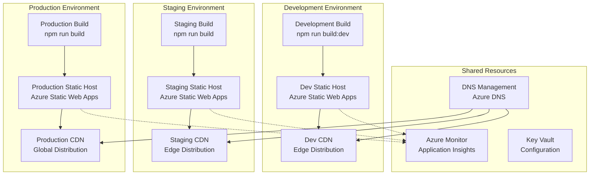

# 🏭 Infrastructure as Code

> **IaC Patterns and Configurations for NogadaCarGuard**
> 
> Infrastructure automation templates and configurations for deploying and managing the multi-portal React application on cloud platforms.

**Stakeholders**: DevOps Engineers, Platform Engineers, Tech Leads, Cloud Architects

## 📋 Overview

This document outlines Infrastructure as Code (IaC) patterns and configurations for the NogadaCarGuard application. As a React/TypeScript/Vite application that builds to static files, the infrastructure focuses on static web hosting, CDN distribution, and supporting services.

## 🎯 Infrastructure Requirements

### Application Characteristics
- **Type**: Single Page Application (SPA)
- **Build Output**: Static files (HTML, CSS, JS)
- **Portals**: 3 distinct interfaces sharing one deployment
- **Routing**: Client-side routing via React Router
- **Dependencies**: No server-side runtime requirements

### Infrastructure Needs
- **Static Web Hosting**: Serve built files with SPA routing support
- **CDN**: Global content distribution
- **SSL/TLS**: HTTPS termination
- **Custom Domains**: Multi-environment domain management
- **Monitoring**: Application performance and availability

## 🏗️ Architecture Overview



## 🔧 Azure Infrastructure (Primary)

### Azure Static Web Apps Configuration

#### ARM Template (staticwebapp.json)
```json
{
  "$schema": "https://schema.management.azure.com/schemas/2019-04-01/deploymentTemplate.json#",
  "contentVersion": "1.0.0.0",
  "parameters": {
    "staticWebAppName": {
      "type": "string",
      "metadata": {
        "description": "Name of the Static Web App"
      }
    },
    "environment": {
      "type": "string",
      "allowedValues": ["dev", "staging", "prod"],
      "metadata": {
        "description": "Deployment environment"
      }
    },
    "repositoryUrl": {
      "type": "string",
      "metadata": {
        "description": "GitHub or Azure DevOps repository URL"
      }
    },
    "branch": {
      "type": "string",
      "defaultValue": "main",
      "metadata": {
        "description": "Repository branch for deployment"
      }
    }
  },
  "variables": {
    "location": "East US 2",
    "skuName": "Standard",
    "resourceTags": {
      "Project": "NogadaCarGuard",
      "Environment": "[parameters('environment')]",
      "Owner": "DevOps Team",
      "CostCenter": "Platform",
      "Application": "CarGuardTipping"
    }
  },
  "resources": [
    {
      "type": "Microsoft.Web/staticSites",
      "apiVersion": "2021-01-15",
      "name": "[parameters('staticWebAppName')]",
      "location": "[variables('location')]",
      "tags": "[variables('resourceTags')]",
      "sku": {
        "name": "[variables('skuName')]"
      },
      "properties": {
        "repositoryUrl": "[parameters('repositoryUrl')]",
        "branch": "[parameters('branch')]",
        "stagingEnvironmentPolicy": "Enabled",
        "allowConfigFileUpdates": true,
        "provider": "DevOps",
        "enterpriseGradeCdnStatus": "Enabled"
      }
    }
  ],
  "outputs": {
    "staticWebAppUrl": {
      "type": "string",
      "value": "[reference(resourceId('Microsoft.Web/staticSites', parameters('staticWebAppName'))).defaultHostname]"
    },
    "deploymentToken": {
      "type": "string",
      "value": "[reference(resourceId('Microsoft.Web/staticSites', parameters('staticWebAppName'))).repositoryToken]"
    }
  }
}
```

#### Bicep Template (staticwebapp.bicep)
```bicep
@description('Name of the Static Web App')
param staticWebAppName string

@description('Environment (dev, staging, prod)')
@allowed(['dev', 'staging', 'prod'])
param environment string

@description('Repository URL')
param repositoryUrl string

@description('Repository branch')
param branch string = 'main'

@description('Resource location')
param location string = resourceGroup().location

var resourceTags = {
  Project: 'NogadaCarGuard'
  Environment: environment
  Owner: 'DevOps Team'
  CostCenter: 'Platform'
  Application: 'CarGuardTipping'
}

var skuName = environment == 'prod' ? 'Standard' : 'Free'

// Static Web App Resource
resource staticWebApp 'Microsoft.Web/staticSites@2021-01-15' = {
  name: staticWebAppName
  location: location
  tags: resourceTags
  sku: {
    name: skuName
  }
  properties: {
    repositoryUrl: repositoryUrl
    branch: branch
    stagingEnvironmentPolicy: 'Enabled'
    allowConfigFileUpdates: true
    provider: 'DevOps'
    enterpriseGradeCdnStatus: environment == 'prod' ? 'Enabled' : 'Disabled'
  }
}

// Custom Domain (Production only)
resource customDomain 'Microsoft.Web/staticSites/customDomains@2021-01-15' = if (environment == 'prod') {
  name: 'app.nogadacarguard.com'
  parent: staticWebApp
  properties: {
    validationMethod: 'dns-txt-token'
  }
}

// Application Settings
resource appSettings 'Microsoft.Web/staticSites/config@2021-01-15' = {
  name: 'appsettings'
  parent: staticWebApp
  properties: {
    ENVIRONMENT: environment
    BUILD_TOOL: 'vite'
    NODE_VERSION: '18'
    NPM_VERSION: '8'
  }
}

output staticWebAppUrl string = staticWebApp.properties.defaultHostname
output deploymentToken string = staticWebApp.properties.repositoryToken
output resourceId string = staticWebApp.id
```

### Static Web App Configuration (staticwebapp.config.json)

```json
{
  "routes": [
    {
      "route": "/car-guard/*",
      "serve": "/index.html",
      "statusCode": 200
    },
    {
      "route": "/customer/*",
      "serve": "/index.html",
      "statusCode": 200
    },
    {
      "route": "/admin/*",
      "serve": "/index.html",
      "statusCode": 200
    },
    {
      "route": "/*",
      "serve": "/index.html",
      "statusCode": 200
    }
  ],
  "navigationFallback": {
    "rewrite": "/index.html",
    "exclude": [
      "/assets/*",
      "/api/*",
      "/*.{css,scss,sass}",
      "/*.{png,jpg,jpeg,gif,svg,webp}",
      "/*.{js,ts}",
      "/*.{woff,woff2,ttf,eot}"
    ]
  },
  "mimeTypes": {
    ".json": "application/json",
    ".woff": "application/font-woff",
    ".woff2": "application/font-woff2"
  },
  "globalHeaders": {
    "X-Content-Type-Options": "nosniff",
    "X-Frame-Options": "DENY",
    "Content-Security-Policy": "default-src 'self' 'unsafe-inline' 'unsafe-eval' https: data: blob:"
  },
  "responseOverrides": {
    "404": {
      "rewrite": "/index.html",
      "statusCode": 200
    }
  }
}
```

## 🌐 Alternative Hosting Configurations

### Netlify Configuration (_redirects)
```
# SPA fallback for React Router
/car-guard/*  /index.html  200
/customer/*   /index.html  200
/admin/*      /index.html  200
/*            /index.html  200

# Security headers
/*
  X-Frame-Options: DENY
  X-Content-Type-Options: nosniff
  Referrer-Policy: strict-origin-when-cross-origin
```

### Netlify Configuration (netlify.toml)
```toml
[build]
  publish = "dist"
  command = "npm run build"

[build.environment]
  NODE_VERSION = "18"
  NPM_VERSION = "8"

[[redirects]]
  from = "/car-guard/*"
  to = "/index.html"
  status = 200

[[redirects]]
  from = "/customer/*"
  to = "/index.html"
  status = 200

[[redirects]]
  from = "/admin/*"
  to = "/index.html"
  status = 200

[[redirects]]
  from = "/*"
  to = "/index.html"
  status = 200

[[headers]]
  for = "/*"
  [headers.values]
    X-Frame-Options = "DENY"
    X-Content-Type-Options = "nosniff"
    Referrer-Policy = "strict-origin-when-cross-origin"

[[headers]]
  for = "/assets/*"
  [headers.values]
    Cache-Control = "max-age=31536000, immutable"
```

### Vercel Configuration (vercel.json)
```json
{
  "buildCommand": "npm run build",
  "outputDirectory": "dist",
  "framework": "vite",
  "rewrites": [
    {
      "source": "/car-guard/(.*)",
      "destination": "/index.html"
    },
    {
      "source": "/customer/(.*)",
      "destination": "/index.html"
    },
    {
      "source": "/admin/(.*)",
      "destination": "/index.html"
    },
    {
      "source": "/(.*)",
      "destination": "/index.html"
    }
  ],
  "headers": [
    {
      "source": "/(.*)",
      "headers": [
        {
          "key": "X-Frame-Options",
          "value": "DENY"
        },
        {
          "key": "X-Content-Type-Options",
          "value": "nosniff"
        },
        {
          "key": "Referrer-Policy",
          "value": "strict-origin-when-cross-origin"
        }
      ]
    },
    {
      "source": "/assets/(.*)",
      "headers": [
        {
          "key": "Cache-Control",
          "value": "max-age=31536000, immutable"
        }
      ]
    }
  ]
}
```

## 🏗️ Terraform Configuration (Alternative)

### Provider Configuration (main.tf)
```hcl
terraform {
  required_version = ">= 1.0"
  required_providers {
    azurerm = {
      source  = "hashicorp/azurerm"
      version = "~> 3.0"
    }
  }
  backend "azurerm" {
    resource_group_name  = "terraform-state-rg"
    storage_account_name = "terraformstatenogada"
    container_name       = "tfstate"
    key                  = "nogada-infrastructure.tfstate"
  }
}

provider "azurerm" {
  features {}
}
```

### Static Web App Resource (staticwebapp.tf)
```hcl
variable "environment" {
  description = "Environment (dev, staging, prod)"
  type        = string
  validation {
    condition     = contains(["dev", "staging", "prod"], var.environment)
    error_message = "Environment must be dev, staging, or prod."
  }
}

variable "repository_url" {
  description = "Repository URL"
  type        = string
}

variable "branch" {
  description = "Repository branch"
  type        = string
  default     = "main"
}

locals {
  resource_tags = {
    Project     = "NogadaCarGuard"
    Environment = var.environment
    Owner       = "DevOps Team"
    CostCenter  = "Platform"
    Application = "CarGuardTipping"
  }
}

resource "azurerm_resource_group" "main" {
  name     = "rg-nogada-${var.environment}"
  location = "East US 2"
  tags     = local.resource_tags
}

resource "azurerm_static_site" "main" {
  name                = "swa-nogada-${var.environment}"
  resource_group_name = azurerm_resource_group.main.name
  location            = azurerm_resource_group.main.location
  tags                = local.resource_tags

  sku_tier = var.environment == "prod" ? "Standard" : "Free"
  sku_size = var.environment == "prod" ? "Standard" : "Free"
}

# Custom domain for production
resource "azurerm_static_site_custom_domain" "main" {
  count           = var.environment == "prod" ? 1 : 0
  static_site_id  = azurerm_static_site.main.id
  domain_name     = "app.nogadacarguard.com"
  validation_type = "dns-txt-token"
}

# Application Insights for monitoring
resource "azurerm_application_insights" "main" {
  name                = "ai-nogada-${var.environment}"
  resource_group_name = azurerm_resource_group.main.name
  location            = azurerm_resource_group.main.location
  application_type    = "web"
  tags                = local.resource_tags
}

output "static_web_app_url" {
  description = "Static Web App URL"
  value       = "https://${azurerm_static_site.main.default_host_name}"
}

output "deployment_token" {
  description = "Deployment token for CI/CD"
  value       = azurerm_static_site.main.api_key
  sensitive   = true
}

output "application_insights_key" {
  description = "Application Insights instrumentation key"
  value       = azurerm_application_insights.main.instrumentation_key
  sensitive   = true
}
```

## 📊 Environment Configurations

### Development Environment
```yaml
# dev.tfvars
environment = "dev"
repository_url = "https://dev.azure.com/ionic-innovations/NogadaCarGuard/_git/NogadaCarGuard"
branch = "develop"

# Resources
resource_group_name = "rg-nogada-dev"
static_web_app_name = "swa-nogada-dev"
sku_tier = "Free"
custom_domain_enabled = false
```

### Staging Environment
```yaml
# staging.tfvars
environment = "staging"
repository_url = "https://dev.azure.com/ionic-innovations/NogadaCarGuard/_git/NogadaCarGuard"
branch = "release/staging"

# Resources
resource_group_name = "rg-nogada-staging"
static_web_app_name = "swa-nogada-staging"
sku_tier = "Standard"
custom_domain_enabled = false
```

### Production Environment
```yaml
# prod.tfvars
environment = "prod"
repository_url = "https://dev.azure.com/ionic-innovations/NogadaCarGuard/_git/NogadaCarGuard"
branch = "main"

# Resources
resource_group_name = "rg-nogada-prod"
static_web_app_name = "swa-nogada-prod"
sku_tier = "Standard"
custom_domain_enabled = true
custom_domain = "app.nogadacarguard.com"
```

## 🔧 Deployment Scripts

### Azure CLI Deployment Script (deploy.sh)
```bash
#!/bin/bash
set -e

# Variables
ENVIRONMENT=${1:-dev}
RESOURCE_GROUP="rg-nogada-${ENVIRONMENT}"
STATIC_WEB_APP_NAME="swa-nogada-${ENVIRONMENT}"
LOCATION="eastus2"

echo "🚀 Deploying to ${ENVIRONMENT} environment..."

# Login to Azure (if not already logged in)
if ! az account show > /dev/null 2>&1; then
    echo "Logging in to Azure..."
    az login
fi

# Create resource group
echo "📦 Creating resource group..."
az group create \
    --name $RESOURCE_GROUP \
    --location $LOCATION \
    --tags Project=NogadaCarGuard Environment=$ENVIRONMENT

# Deploy Static Web App
echo "🏗️ Deploying Static Web App..."
az deployment group create \
    --resource-group $RESOURCE_GROUP \
    --template-file ./infrastructure/staticwebapp.json \
    --parameters \
        staticWebAppName=$STATIC_WEB_APP_NAME \
        environment=$ENVIRONMENT \
        repositoryUrl="https://dev.azure.com/ionic-innovations/NogadaCarGuard/_git/NogadaCarGuard" \
        branch="main"

# Get deployment token
DEPLOYMENT_TOKEN=$(az staticwebapp secrets list \
    --name $STATIC_WEB_APP_NAME \
    --resource-group $RESOURCE_GROUP \
    --query "properties.apiKey" -o tsv)

echo "✅ Deployment completed!"
echo "🌐 URL: https://$(az staticwebapp show --name $STATIC_WEB_APP_NAME --resource-group $RESOURCE_GROUP --query 'defaultHostname' -o tsv)"
echo "🔑 Deployment Token: $DEPLOYMENT_TOKEN"
```

### PowerShell Deployment Script (deploy.ps1)
```powershell
param(
    [Parameter(Mandatory=$false)]
    [ValidateSet("dev", "staging", "prod")]
    [string]$Environment = "dev"
)

$ErrorActionPreference = "Stop"

# Variables
$ResourceGroup = "rg-nogada-$Environment"
$StaticWebAppName = "swa-nogada-$Environment"
$Location = "East US 2"

Write-Host "🚀 Deploying to $Environment environment..." -ForegroundColor Green

# Check Azure CLI login
try {
    az account show | Out-Null
} catch {
    Write-Host "Logging in to Azure..." -ForegroundColor Yellow
    az login
}

# Create resource group
Write-Host "📦 Creating resource group..." -ForegroundColor Blue
az group create `
    --name $ResourceGroup `
    --location $Location `
    --tags Project=NogadaCarGuard Environment=$Environment

# Deploy using Bicep
Write-Host "🏗️ Deploying Static Web App..." -ForegroundColor Blue
az deployment group create `
    --resource-group $ResourceGroup `
    --template-file "./infrastructure/staticwebapp.bicep" `
    --parameters `
        staticWebAppName=$StaticWebAppName `
        environment=$Environment `
        repositoryUrl="https://dev.azure.com/ionic-innovations/NogadaCarGuard/_git/NogadaCarGuard" `
        branch="main"

# Get deployment information
$DeploymentInfo = az deployment group show `
    --resource-group $ResourceGroup `
    --name "staticwebapp" `
    --query "properties.outputs" | ConvertFrom-Json

Write-Host "✅ Deployment completed!" -ForegroundColor Green
Write-Host "🌐 URL: https://$($DeploymentInfo.staticWebAppUrl.value)" -ForegroundColor Cyan
Write-Host "🔑 Use the deployment token from Azure Portal for CI/CD setup" -ForegroundColor Yellow
```

## 🔐 Security & Compliance

### Resource Tagging Strategy
```yaml
Required Tags:
  - Project: "NogadaCarGuard"
  - Environment: "dev|staging|prod"
  - Owner: "DevOps Team"
  - CostCenter: "Platform"
  - Application: "CarGuardTipping"

Optional Tags:
  - CreatedBy: "terraform|arm|manual"
  - Version: "1.0.0"
  - Backup: "required|not-required"
```

### Security Headers Configuration
```yaml
Security Headers:
  - X-Frame-Options: DENY
  - X-Content-Type-Options: nosniff
  - Referrer-Policy: strict-origin-when-cross-origin
  - X-XSS-Protection: "1; mode=block"
  - Content-Security-Policy: "default-src 'self' 'unsafe-inline' 'unsafe-eval' https: data: blob:"

Cache Control:
  - Static Assets: "max-age=31536000, immutable"
  - HTML Files: "max-age=0, must-revalidate"
  - API Responses: "no-cache, no-store, must-revalidate"
```

## 📊 Cost Management

### Resource Optimization
- **Free Tier**: Use for dev environment
- **Standard Tier**: Required for staging/production with custom domains
- **CDN**: Included with Static Web Apps
- **Monitoring**: Basic metrics included, advanced features additional cost

### Cost Estimation (Monthly USD)
| Environment | Static Web App | Application Insights | CDN | Total Est. |
|-------------|----------------|---------------------|-----|------------|
| Development | Free | $0-5 | Included | $0-5 |
| Staging | $9 | $5-20 | Included | $14-29 |
| Production | $9 | $20-50 | Included | $29-59 |

## 🔗 Related Resources

### Documentation Links
- [Azure Static Web Apps Documentation](https://docs.microsoft.com/en-us/azure/static-web-apps/)
- [Azure Resource Manager Templates](https://docs.microsoft.com/en-us/azure/azure-resource-manager/templates/)
- [Bicep Language Reference](https://docs.microsoft.com/en-us/azure/azure-resource-manager/bicep/)
- [Terraform Azure Provider](https://registry.terraform.io/providers/hashicorp/azurerm/latest/docs)

### Internal Links
- [CI/CD Pipelines](./cicd-pipelines.md)
- [Environment Management](./environment-management.md)
- [Monitoring & Alerting](./monitoring-alerting.md)
- [Deployment Guide](../developers/deployment.md)

---
**Document Information:**
- **Last Updated**: 2025-08-25
- **Status**: Active
- **Owner**: DevOps Team
- **Version**: 1.0.0
- **Review Cycle**: Quarterly
- **Stakeholders**: DevOps Engineers, Platform Engineers, Tech Leads, Cloud Architects