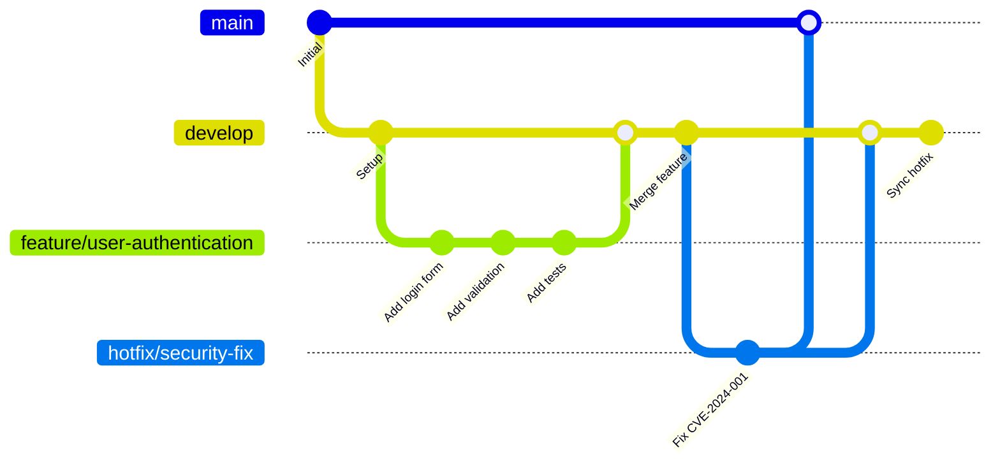
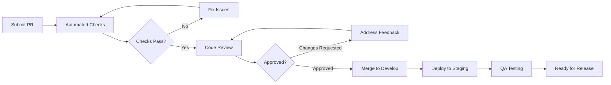

# Contributing to NogadaCarGuard

> **Stakeholder Relevance**: [Developers, Technical Leads, External Contributors]

Welcome to the NogadaCarGuard project! This guide provides everything you need to know to contribute effectively to our multi-portal car guard tipping platform.

## Table of Contents
- [Getting Started](#getting-started)
- [Development Environment](#development-environment)
- [Contribution Workflow](#contribution-workflow)
- [Code Standards](#code-standards)
- [Testing Requirements](#testing-requirements)
- [Documentation Requirements](#documentation-requirements)
- [Pull Request Process](#pull-request-process)
- [Community Guidelines](#community-guidelines)
- [Recognition](#recognition)

## Getting Started

### Prerequisites

#### Required Knowledge
- **React 18+**: Functional components, hooks, context
- **TypeScript 5+**: Interfaces, types, generics
- **Modern JavaScript**: ES6+, async/await, destructuring
- **CSS**: Flexbox, Grid, responsive design
- **Git**: Branching, merging, rebasing

#### Technical Requirements
- **Node.js**: v18.0.0 or higher
- **npm**: v9.0.0 or higher
- **Git**: v2.30.0 or higher
- **VS Code**: Recommended with extensions (see [Development Environment](#development-environment))

#### Understanding the Project
Before contributing, please read:
- [System Overview](../shared/architecture/system-overview.md)
- [Development Standards](../developers/development-standards.md)
- [Architecture Analysis](../analysis/architecture-analysis.md)

### Project Structure

```
NogadaCarGuard/
├── src/
│   ├── components/          # Component library
│   │   ├── admin/           # Admin portal components
│   │   ├── car-guard/       # Car guard app components
│   │   ├── customer/        # Customer portal components
│   │   ├── shared/          # Cross-portal components
│   │   └── ui/              # Base UI components (shadcn/ui)
│   ├── pages/               # Page components by portal
│   ├── data/                # Mock data and interfaces
│   ├── hooks/               # Custom React hooks
│   ├── lib/                 # Utility functions
│   └── App.tsx              # Main application component
├── wiki/                    # Documentation
├── public/                  # Static assets
└── package.json             # Dependencies and scripts
```

## Development Environment

### Initial Setup

```bash
# 1. Fork and clone the repository
git clone https://dev.azure.com/ionic-innovations/NogadaCarGuard/_git/NogadaCarGuard
cd NogadaCarGuard

# 2. Install dependencies
npm install

# 3. Start development server
npm run dev

# 4. Verify setup
# Open http://localhost:8080
# Navigate to each portal to ensure they load
```

### VS Code Configuration

#### Required Extensions
```json
// .vscode/extensions.json
{
  "recommendations": [
    "bradlc.vscode-tailwindcss",
    "ms-vscode.vscode-typescript-next",
    "esbenp.prettier-vscode",
    "dbaeumer.vscode-eslint",
    "ms-vscode.vscode-json",
    "yoavbls.pretty-ts-errors"
  ]
}
```

#### Workspace Settings
```json
// .vscode/settings.json
{
  "editor.formatOnSave": true,
  "editor.codeActionsOnSave": {
    "source.fixAll.eslint": true,
    "source.organizeImports": true
  },
  "typescript.preferences.importModuleSpecifier": "relative",
  "tailwindCSS.experimental.classRegex": [
    ["cn\\(([^)]*)\\)", "[\"'`]([^\"'`]*).*?[\"'`]"]
  ]
}
```

### Development Commands

```bash
# Development
npm run dev          # Start dev server (port 8080)
npm run build        # Production build
npm run build:dev    # Development build
npm run preview      # Preview production build

# Code Quality
npm run lint         # Run ESLint
npm run type-check   # TypeScript type checking

# Testing (when implemented)
npm run test         # Run unit tests
npm run test:e2e     # Run end-to-end tests
npm run test:coverage # Generate coverage report
```

## Contribution Workflow

### Git Workflow

We use a modified Git Flow with feature branches:



### Branch Naming Conventions

| Branch Type | Format | Example |
|-------------|--------|---------|
| **Feature** | `feature/short-description` | `feature/qr-code-scanning` |
| **Bug Fix** | `bugfix/issue-description` | `bugfix/wallet-balance-display` |
| **Hotfix** | `hotfix/critical-issue` | `hotfix/payment-security-fix` |
| **Enhancement** | `enhancement/improvement` | `enhancement/admin-dashboard-ui` |
| **Refactor** | `refactor/component-name` | `refactor/payment-processing` |

### Commit Message Format

```
type(scope): brief description

Detailed explanation of the change, including:
- What was changed and why
- Any breaking changes
- Related issues or tickets

Footer with issue references:
Fixes #123
Closes #456
Refs #789
```

#### Commit Types
- **feat**: New feature
- **fix**: Bug fix
- **docs**: Documentation changes
- **style**: Code style changes (formatting, etc.)
- **refactor**: Code refactoring
- **perf**: Performance improvements
- **test**: Adding or updating tests
- **chore**: Build process or auxiliary tool changes

#### Examples
```bash
# Good commit messages
feat(car-guard): add QR code auto-refresh functionality

Implements automatic QR code regeneration every 30 seconds
to improve security and prevent code reuse attacks.

- Adds useInterval hook for timer management
- Updates QRCodeDisplay component with refresh logic
- Includes offline handling for poor connectivity

Fixes #145

# Another example
fix(customer): resolve wallet balance sync issue

Fixes race condition where wallet balance would show
incorrect amount after rapid tip transactions.

- Adds optimistic updates with rollback
- Improves error handling in payment flow
- Updates React Query cache invalidation

Closes #178
```

### Issue Management

#### Creating Issues

Use our issue templates:

**Bug Report**:
```markdown
## Bug Description
Clear description of what went wrong

## Steps to Reproduce
1. Navigate to...
2. Click on...
3. Enter...
4. Observe error

## Expected Behavior
What should have happened

## Actual Behavior  
What actually happened

## Environment
- Portal: Car Guard/Customer/Admin
- Browser: Chrome 91.0.4472.124
- OS: Windows 10
- Device: Desktop/Mobile

## Screenshots
[Attach relevant screenshots]

## Additional Context
Any other relevant information
```

**Feature Request**:
```markdown
## Feature Description
Clear description of the proposed feature

## Problem Statement
What problem does this solve?

## Proposed Solution
Detailed description of how it should work

## User Stories
- As a [user type], I want [functionality] so that [benefit]
- As a [user type], I want [functionality] so that [benefit]

## Acceptance Criteria
- [ ] Criteria 1
- [ ] Criteria 2
- [ ] Criteria 3

## Design Mockups
[Attach mockups if available]

## Technical Considerations
- Impact on existing features
- Performance considerations
- Security implications
```

## Code Standards

### TypeScript Standards

#### Interface Definitions
```typescript
// Use PascalCase for interfaces
interface CarGuard {
  id: string                    // Use descriptive property names
  name: string                 // Always include JSDoc for complex types
  balance: number              // Use specific types over 'any'
  status: 'active' | 'inactive' // Use union types for limited options
}

// Export interfaces from dedicated files
export interface PaymentMethod {
  id: string
  type: 'wallet' | 'card' | 'bank'
  isDefault: boolean
  metadata: Record<string, unknown> // Use Record for flexible objects
}
```

#### Component Props
```typescript
// Always define props interface
interface QRCodeDisplayProps {
  guardId: string
  size?: number                 // Optional props with defaults
  refreshInterval?: number
  onScan?: (data: string) => void // Event handlers with proper types
  className?: string            // Always allow custom styling
}

// Use React.FC sparingly, prefer function declarations
export function QRCodeDisplay({
  guardId,
  size = 256,
  refreshInterval = 30000,
  onScan,
  className
}: QRCodeDisplayProps) {
  // Implementation
}
```

#### Hook Patterns
```typescript
// Custom hooks should start with 'use'
export function useGuardData(guardId: string) {
  return useQuery({
    queryKey: ['guard', guardId],
    queryFn: () => getGuardById(guardId),
    enabled: !!guardId,          // Guard against invalid IDs
  })
}

// Return objects for multiple values
export function useTipForm(guardId: string) {
  const [amount, setAmount] = useState(0)
  const [loading, setLoading] = useState(false)
  
  const submitTip = async (data: TipFormData) => {
    setLoading(true)
    try {
      await processTip(data)
    } finally {
      setLoading(false)
    }
  }
  
  return {
    amount,
    setAmount,
    loading,
    submitTip,
  }
}
```

### React Component Standards

#### Component Structure
```tsx
import React, { useState, useEffect } from 'react'
import { useQuery } from '@tanstack/react-query'

import { Button } from '@/components/ui/button'
import { Card, CardContent, CardHeader, CardTitle } from '@/components/ui/card'
import { cn } from '@/lib/utils'
import { formatCurrency } from '@/data/mockData'

// 1. Types and interfaces first
interface ComponentProps {
  // Props definition
}

// 2. Main component
export function ComponentName({ prop1, prop2 }: ComponentProps) {
  // 3. Hooks (useState, useEffect, custom hooks)
  const [state, setState] = useState(initialState)
  
  // 4. Queries and mutations
  const { data, loading, error } = useQuery({
    queryKey: ['key'],
    queryFn: fetchData
  })
  
  // 5. Event handlers
  const handleClick = (event: React.MouseEvent) => {
    // Implementation
  }
  
  // 6. Effects
  useEffect(() => {
    // Side effects
  }, [dependencies])
  
  // 7. Early returns for loading/error states
  if (loading) return <LoadingSpinner />
  if (error) return <ErrorMessage error={error} />
  
  // 8. Main render
  return (
    <Card className={cn("w-full", className)}>
      <CardHeader>
        <CardTitle>Component Title</CardTitle>
      </CardHeader>
      <CardContent>
        {/* Component content */}
      </CardContent>
    </Card>
  )
}
```

#### Styling Guidelines
```tsx
// Use Tailwind utility classes
<div className="flex items-center justify-between p-4 bg-white rounded-lg shadow-md">
  <h2 className="text-xl font-semibold text-gray-900">Title</h2>
  <Button size="sm" variant="outline">Action</Button>
</div>

// Use cn() utility for conditional classes
<div className={cn(
  "base-classes",
  isActive && "active-classes",
  className // Always allow override
)}>

// Use tippa theme colors for brand consistency
<div className="bg-tippa-50 border-tippa-200 text-tippa-900">
  Brand colored content
</div>

// Responsive design with mobile-first approach
<div className="text-sm sm:text-base lg:text-lg xl:text-xl">
  Responsive text
</div>
```

### Error Handling Standards

```tsx
// Component-level error boundaries
export function ComponentWithErrorBoundary({ children }: PropsWithChildren) {
  return (
    <ErrorBoundary
      fallback={({ error, resetError }) => (
        <Card className="p-6 text-center">
          <h3 className="text-lg font-semibold text-red-600 mb-2">
            Something went wrong
          </h3>
          <p className="text-muted-foreground mb-4">
            {error.message}
          </p>
          <Button onClick={resetError} variant="outline">
            Try again
          </Button>
        </Card>
      )}
      onError={(error) => {
        console.error('Component error:', error)
        // Log to monitoring service
      }}
    >
      {children}
    </ErrorBoundary>
  )
}

// Async function error handling
export async function processPayment(data: PaymentData) {
  try {
    const result = await paymentAPI.process(data)
    return { success: true, data: result }
  } catch (error) {
    console.error('Payment processing failed:', error)
    
    if (error instanceof APIError) {
      return { success: false, error: error.message }
    }
    
    return { success: false, error: 'Payment processing failed' }
  }
}
```

## Testing Requirements

### Unit Testing (To Be Implemented)

```typescript
// Component testing with React Testing Library
import { render, screen, fireEvent } from '@testing-library/react'
import { QueryClient, QueryClientProvider } from '@tanstack/react-query'

import { TipAmountSelector } from '../TipAmountSelector'

const createTestQueryClient = () => new QueryClient({
  defaultOptions: {
    queries: { retry: false },
    mutations: { retry: false },
  },
})

const renderWithProviders = (component: React.ReactElement) => {
  const queryClient = createTestQueryClient()
  return render(
    <QueryClientProvider client={queryClient}>
      {component}
    </QueryClientProvider>
  )
}

describe('TipAmountSelector', () => {
  it('should render preset tip amounts', () => {
    renderWithProviders(
      <TipAmountSelector guardId="guard_123" onAmountSelect={jest.fn()} />
    )
    
    expect(screen.getByRole('button', { name: 'R 5.00' })).toBeInTheDocument()
    expect(screen.getByRole('button', { name: 'R 10.00' })).toBeInTheDocument()
    expect(screen.getByRole('button', { name: 'R 20.00' })).toBeInTheDocument()
  })
  
  it('should call onAmountSelect when amount is selected', () => {
    const onAmountSelect = jest.fn()
    renderWithProviders(
      <TipAmountSelector guardId="guard_123" onAmountSelect={onAmountSelect} />
    )
    
    fireEvent.click(screen.getByRole('button', { name: 'R 5.00' }))
    
    expect(onAmountSelect).toHaveBeenCalledWith(500) // 500 cents
  })
})
```

### End-to-End Testing (To Be Implemented)

```typescript
// Playwright E2E tests
import { test, expect } from '@playwright/test'

test.describe('Car Guard Portal', () => {
  test('should display QR code for tip collection', async ({ page }) => {
    await page.goto('/car-guard')
    
    // Login as car guard
    await page.fill('[data-testid="email-input"]', 'guard@example.com')
    await page.fill('[data-testid="password-input"]', 'password123')
    await page.click('[data-testid="login-button"]')
    
    // Navigate to dashboard
    await expect(page).toHaveURL('/car-guard/dashboard')
    
    // Verify QR code is displayed
    await expect(page.locator('[data-testid="qr-code"]')).toBeVisible()
    
    // Verify balance is shown
    await expect(page.locator('[data-testid="balance-display"]')).toContainText('R')
  })
})
```

## Documentation Requirements

### Code Documentation

All public functions and components must include JSDoc comments:

```typescript
/**
 * Formats a currency amount for display in the NogadaCarGuard application.
 * 
 * @param amountInCents - The amount in cents (e.g., 1500 = R15.00)
 * @param options - Formatting options
 * @returns Formatted currency string with R symbol
 * 
 * @example
 * ```typescript
 * const formatted = formatCurrency(1500);
 * console.log(formatted); // "R 15.00"
 * ```
 */
export function formatCurrency(
  amountInCents: number,
  options: CurrencyOptions = {}
): string {
  // Implementation
}
```

### Feature Documentation

When adding new features, update relevant documentation:

1. **Component Documentation**: Update component library docs
2. **API Documentation**: Document any new endpoints or data structures
3. **User Documentation**: Add user-facing feature documentation
4. **Architecture Documentation**: Update system overview if architecture changes

### README Updates

Major features should include README updates:
- Installation instructions
- Configuration changes
- New environment variables
- Breaking changes

## Pull Request Process

### Before Submitting

```bash
# 1. Ensure your branch is up to date
git checkout develop
git pull origin develop
git checkout your-feature-branch
git rebase develop

# 2. Run quality checks
npm run lint
npm run type-check
npm run build

# 3. Test your changes
npm run test        # When tests are implemented
npm run test:e2e    # When E2E tests are implemented

# 4. Update documentation if needed
# Check wiki files for any updates required
```

### Pull Request Template

```markdown
## Description
Brief description of changes made.

## Type of Change
- [ ] Bug fix (non-breaking change that fixes an issue)
- [ ] New feature (non-breaking change that adds functionality)
- [ ] Breaking change (fix or feature that would cause existing functionality to not work as expected)
- [ ] Documentation update
- [ ] Performance improvement
- [ ] Refactoring

## Portal Impact
- [ ] Car Guard App
- [ ] Customer Portal  
- [ ] Admin Dashboard
- [ ] Shared Components

## Testing
- [ ] Unit tests pass
- [ ] E2E tests pass
- [ ] Manual testing completed
- [ ] All three portals tested
- [ ] Mobile responsiveness verified

## Documentation
- [ ] Code comments added/updated
- [ ] Component documentation updated
- [ ] Wiki documentation updated
- [ ] README updated (if applicable)

## Screenshots/Videos
[Include screenshots or videos of the changes]

## Checklist
- [ ] Code follows project style guidelines
- [ ] Self-review completed
- [ ] No console errors or warnings
- [ ] Accessibility guidelines followed
- [ ] Performance impact considered
- [ ] Security implications reviewed

## Related Issues
Fixes #123
Closes #456
```

### Review Process



#### Review Criteria

**Functionality**:
- [ ] Code works as intended
- [ ] Edge cases handled
- [ ] Error scenarios covered
- [ ] Performance impact acceptable

**Code Quality**:
- [ ] Follows TypeScript best practices
- [ ] Proper error handling
- [ ] No code duplication
- [ ] Clean, readable code

**Architecture**:
- [ ] Follows established patterns
- [ ] Proper component structure
- [ ] Appropriate use of hooks
- [ ] State management best practices

**Security**:
- [ ] Input validation implemented
- [ ] No sensitive data exposed
- [ ] Authentication/authorization proper
- [ ] XSS/CSRF protections in place

**Testing**:
- [ ] Adequate test coverage
- [ ] Tests are meaningful
- [ ] Manual testing completed
- [ ] All portals tested

## Community Guidelines

### Code of Conduct

We are committed to providing a welcoming and inclusive environment for all contributors.

#### Our Standards

**Positive Behavior**:
- Using welcoming and inclusive language
- Being respectful of differing viewpoints
- Gracefully accepting constructive criticism
- Focusing on what is best for the community
- Showing empathy towards other community members

**Unacceptable Behavior**:
- Harassment of any form
- Discriminatory language or actions
- Personal attacks or insults
- Trolling or deliberately disruptive behavior
- Publishing others' private information without consent

#### Enforcement

Violations of the code of conduct should be reported to the project maintainers. All complaints will be reviewed and investigated promptly and fairly.

### Communication Channels

- **Issues**: Use GitHub issues for bug reports and feature requests
- **Discussions**: Use GitHub discussions for general questions and ideas
- **Email**: Contact maintainers directly for sensitive issues
- **Team Chat**: Internal team communication via Slack/Teams

### Getting Help

1. **Check Documentation**: Search the wiki first
2. **Search Issues**: Look for existing issues or discussions
3. **Ask Questions**: Create a discussion or issue
4. **Contact Maintainers**: Reach out directly if needed

## Recognition

### Contributor Recognition

We value all contributions and recognize contributors in several ways:

#### Contribution Types
- **Code**: Bug fixes, features, refactoring
- **Documentation**: Wiki updates, code comments, guides
- **Design**: UI/UX improvements, mockups
- **Testing**: Bug reports, test cases, QA feedback
- **Community**: Helping others, moderating discussions

#### Recognition Methods
- **Contributors File**: All contributors listed in CONTRIBUTORS.md
- **Release Notes**: Major contributions highlighted in releases
- **Hall of Fame**: Outstanding contributors featured in documentation
- **Swag**: Project stickers/swag for regular contributors

### Becoming a Maintainer

Active contributors may be invited to become maintainers based on:

- **Consistent Quality**: Regular, high-quality contributions
- **Community Engagement**: Helpful in discussions and reviews
- **Technical Expertise**: Deep understanding of the codebase
- **Leadership**: Mentoring other contributors
- **Reliability**: Consistent availability and follow-through

## Quick Reference

### Useful Commands
```bash
# Setup
npm install
npm run dev

# Development
npm run lint
npm run type-check
npm run build

# Testing (when implemented)
npm run test
npm run test:e2e

# Documentation
npm run docs:build
npm run docs:serve
```

### Important Files
- `src/components/` - Component library
- `src/data/mockData.ts` - Data interfaces and mock data
- `wiki/` - Project documentation
- `package.json` - Dependencies and scripts
- `tailwind.config.ts` - Styling configuration

### Key Resources
- [System Overview](../shared/architecture/system-overview.md)
- [Development Standards](../developers/development-standards.md)
- [Troubleshooting Guide](../shared/knowledge/troubleshooting.md)
- [Best Practices](../shared/knowledge/best-practices.md)

---
**Document Information:**
- **Last Updated**: 2025-08-25
- **Status**: Active
- **Owner**: Technical Leadership Team
- **Version**: 1.0.0
- **Next Review**: 2025-11-25