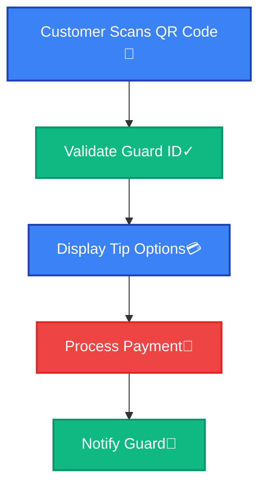
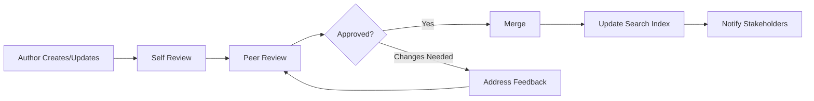

# Documentation Standards

> **Stakeholder Relevance**: [All]

Comprehensive documentation standards and guidelines for the NogadaCarGuard project to ensure consistency, maintainability, and accessibility across all documentation.

## Table of Contents
- [Documentation Philosophy](#documentation-philosophy)
- [Documentation Types](#documentation-types)
- [Writing Standards](#writing-standards)
- [Structure and Format](#structure-and-format)
- [Code Documentation](#code-documentation)
- [Visual Documentation](#visual-documentation)
- [Review Process](#review-process)
- [Maintenance Guidelines](#maintenance-guidelines)
- [Tools and Automation](#tools-and-automation)

## Documentation Philosophy

### Core Principles

1. **User-Centric**: Documentation serves the reader, not the writer
2. **Living Documentation**: Kept current with code and process changes
3. **Accessible**: Clear language, logical organization, multiple skill levels
4. **Actionable**: Provides concrete steps and examples
5. **Discoverable**: Easy to find and navigate

### Documentation Goals

- **Reduce Onboarding Time**: New team members productive within 2 days
- **Enable Self-Service**: 80% of questions answered through documentation
- **Support Decision Making**: Architecture and process decisions documented
- **Ensure Compliance**: Security and business requirements met
- **Facilitate Maintenance**: Clear upgrade and troubleshooting guides

## Documentation Types

### 1. Technical Documentation

#### API Documentation
```markdown
## Endpoint: POST /api/tips

**Purpose**: Create a new tip transaction

**Authentication**: Bearer token required

**Request Body**:
```json
{
  "guardId": "string (required)",
  "customerId": "string (required)", 
  "amount": "number (required, min: 100, max: 100000)",
  "paymentMethod": "wallet|card|cash",
  "message": "string (optional, max: 200 chars)"
}
```

**Response**: 
```json
{
  "success": true,
  "data": {
    "tipId": "tip_123456789",
    "status": "pending",
    "processingFee": 25,
    "estimatedDelivery": "2025-08-25T14:30:00Z"
  }
}
```

**Error Responses**:
- `400`: Invalid request data
- `401`: Authentication required
- `403`: Insufficient funds
- `429`: Rate limit exceeded
```

#### Component Documentation
```typescript
/**
 * QRCodeDisplay Component
 * 
 * Displays a QR code for car guard tip collection with automatic refresh
 * and offline capability.
 * 
 * @example
 * ```tsx
 * <QRCodeDisplay 
 *   guardId="guard_123"
 *   refreshInterval={30000}
 *   size={256}
 *   onScan={(data) => console.log('Scanned:', data)}
 * />
 * ```
 */
interface QRCodeDisplayProps {
  /** Unique identifier for the car guard */
  guardId: string
  /** QR code refresh interval in milliseconds (default: 30000) */
  refreshInterval?: number
  /** QR code size in pixels (default: 256) */
  size?: number
  /** Callback fired when QR code is scanned */
  onScan?: (data: string) => void
  /** Additional CSS classes */
  className?: string
}
```

### 2. Process Documentation

#### Standard Process Format
```markdown
# Process Name

**Purpose**: Brief description of what this process accomplishes

**Frequency**: How often this process runs (daily/weekly/as-needed)

**Stakeholders**: 
- **Owner**: Who is responsible
- **Participants**: Who is involved
- **Approvers**: Who must approve

**Prerequisites**:
- [ ] Requirement 1
- [ ] Requirement 2

**Steps**:
1. **Step Name** - Description with expected duration
   ```bash
   # Code examples where applicable
   npm run build
   ```
   - **Expected Outcome**: What should happen
   - **Troubleshooting**: Common issues and solutions

2. **Next Step** - Continue format

**Quality Gates**:
- [ ] Verification step 1
- [ ] Verification step 2

**Rollback Procedure**:
If something goes wrong, follow these steps...
```

### 3. Decision Documentation

#### Architecture Decision Record (ADR) Format
```markdown
# ADR-001: Multi-Portal Architecture

**Date**: 2025-08-25
**Status**: Accepted
**Deciders**: Architecture Team, Tech Lead

## Context
We need to serve three distinct user types (car guards, customers, admins) 
with different interface requirements and workflows.

## Decision
Implement a single React application with portal-specific routing and components
rather than separate applications.

## Consequences

### Positive
- Shared component library and design system
- Unified build and deployment process
- Easier code sharing and maintenance
- Consistent user experience patterns

### Negative  
- Larger bundle size for each portal
- More complex routing and state management
- Potential for portal-specific bugs affecting others

## Implementation Notes
- Use React Router for portal routing
- Portal-specific layouts and navigation
- Shared components in `src/components/shared/`
- Portal components in `src/components/{portal-name}/`
```

## Writing Standards

### Language and Style

#### Voice and Tone
- **Active Voice**: "Run the command" not "The command should be run"
- **Present Tense**: "The system validates" not "The system will validate"
- **Direct Address**: "You can configure" not "One can configure"
- **Clear and Concise**: Eliminate unnecessary words

#### Terminology
- **Consistent Terms**: Use the same word for the same concept throughout
- **Define Acronyms**: Spell out on first use: "Single Page Application (SPA)"
- **Avoid Jargon**: Explain technical terms when necessary
- **Use Industry Standards**: Follow established conventions

#### Project-Specific Terminology
```markdown
| Term | Definition | Usage |
|------|------------|-------|
| Car Guard | Individual providing parking security services | Always capitalize |
| Tip | Gratuity payment from customer to car guard | Not "donation" or "payment" |
| Portal | One of the three application interfaces | Car Guard Portal, Customer Portal, Admin Portal |
| QR Code | Quick Response code for tip collection | Always "QR Code", not "QR-code" or "qr code" |
| Payout | Transfer of funds from platform to guard | Not "withdrawal" or "cash-out" |
| Wallet | Customer's digital balance storage | Not "account" or "balance" |
```

### Content Organization

#### Document Structure
```markdown
# Document Title

> **Stakeholder Relevance**: [List relevant stakeholders]

Brief description of document purpose and scope.

## Table of Contents
- Auto-generated links to main sections

## Section 1
Content organized in logical progression

### Subsection
Break down complex topics

#### Sub-subsection  
Further detail when needed

## Code Examples
```language
// Well-commented, runnable code
const example = "Clear and practical";
```

## Troubleshooting
Common issues and solutions

## See Also
- Links to related documentation
- External references

---
**Document Information:**
- **Last Updated**: YYYY-MM-DD
- **Status**: Active|Draft|Deprecated
- **Owner**: Team Name
- **Version**: X.Y.Z
```

#### Section Guidelines

1. **Introduction**: Purpose, scope, prerequisites
2. **Overview**: High-level concepts before details
3. **Implementation**: Step-by-step instructions
4. **Examples**: Real, working code samples
5. **Troubleshooting**: Common issues and solutions
6. **Reference**: Links, further reading, appendices

### Code Documentation

#### TypeScript Interface Documentation
```typescript
/**
 * Represents a car guard in the NogadaCarGuard system.
 * 
 * @interface CarGuard
 * @example
 * ```typescript
 * const guard: CarGuard = {
 *   id: "guard_12345",
 *   name: "John Smith", 
 *   email: "john@example.com",
 *   balance: 15000, // Amount in cents (R150.00)
 *   status: "active",
 *   // ... other required fields
 * };
 * ```
 */
interface CarGuard {
  /** Unique identifier for the guard */
  id: string;
  
  /** Full name of the guard */
  name: string;
  
  /** Contact email address */
  email: string;
  
  /** 
   * Current available balance in cents
   * @example 15000 represents R150.00
   */
  balance: number;
  
  /** Current status of the guard account */
  status: 'active' | 'inactive' | 'suspended';
  
  /** 
   * Optional bank account details for payouts
   * @see BankDetails
   */
  bankDetails?: BankDetails;
}
```

#### Component Documentation
```typescript
/**
 * TipAmountSelector - Interactive component for selecting tip amounts
 * 
 * Provides preset tip amounts and custom input with validation.
 * Supports both keyboard and touch interactions.
 * 
 * @param guardId - ID of the guard receiving the tip
 * @param onAmountSelect - Callback when amount is selected
 * @param maxAmount - Maximum allowed tip amount (default: 50000 = R500)
 * 
 * @example
 * ```tsx
 * function TippingPage() {
 *   const handleTipSelect = (amount: number) => {
 *     console.log(`Selected tip: R${amount/100}`);
 *   };
 * 
 *   return (
 *     <TipAmountSelector 
 *       guardId="guard_123"
 *       onAmountSelect={handleTipSelect}
 *       maxAmount={20000} // R200 max
 *     />
 *   );
 * }
 * ```
 */
export function TipAmountSelector({
  guardId,
  onAmountSelect,
  maxAmount = 50000
}: TipAmountSelectorProps) {
  // Implementation
}
```

#### Function Documentation
```typescript
/**
 * Formats currency amounts for display in South African Rand.
 * 
 * Converts amounts from cents to rand with proper formatting.
 * Includes currency symbol and thousand separators.
 * 
 * @param amountInCents - Amount in cents (e.g., 1500 = R15.00)
 * @param showSymbol - Whether to include R symbol (default: true)
 * @returns Formatted currency string
 * 
 * @example
 * ```typescript
 * formatCurrency(1500);      // "R 15.00"
 * formatCurrency(150000);    // "R 1,500.00"
 * formatCurrency(1500, false); // "15.00"
 * ```
 */
export function formatCurrency(amountInCents: number, showSymbol: boolean = true): string {
  const amount = amountInCents / 100;
  const formatted = amount.toLocaleString('en-ZA', {
    minimumFractionDigits: 2,
    maximumFractionDigits: 2
  });
  return showSymbol ? `R ${formatted}` : formatted;
}
```

## Visual Documentation

### Diagrams and Charts

#### Mermaid Diagram Standards
```markdown

```

#### Screenshot Guidelines
- **High Resolution**: Minimum 1920x1080 for desktop, 375x667 for mobile
- **Consistent Browser**: Use Chrome with consistent viewport size
- **Annotations**: Use red arrows and text boxes for important elements
- **File Format**: PNG for UI screenshots, SVG for diagrams
- **Naming Convention**: `component-name_state_viewport.png`

#### UI Component Documentation
```markdown
## Button Component

### Variants

| Variant | Usage | Example |
|---------|-------|----------|
| Primary | Main actions | Save, Submit, Confirm |
| Secondary | Secondary actions | Cancel, Back, Skip |
| Destructive | Dangerous actions | Delete, Remove, Reset |

### States

| State | Description | Visual |
|-------|-------------|---------|
| Default | Normal interactive state |  |
| Hover | Mouse hover state |  |
| Active | Pressed/clicked state |  |
| Disabled | Non-interactive state |  |
| Loading | Processing state |  |
```

## Review Process

### Documentation Review Workflow



### Review Checklist

#### Content Review
- [ ] **Accuracy**: Information is correct and up-to-date
- [ ] **Completeness**: All necessary information is included
- [ ] **Clarity**: Language is clear and understandable
- [ ] **Structure**: Information is logically organized
- [ ] **Examples**: Code examples work and are relevant
- [ ] **Links**: All internal and external links work

#### Technical Review
- [ ] **Code Quality**: Examples follow project standards
- [ ] **Security**: No sensitive information exposed
- [ ] **Compatibility**: Instructions work across environments
- [ ] **Performance**: No performance anti-patterns

#### Editorial Review
- [ ] **Grammar**: Proper grammar and spelling
- [ ] **Style**: Follows documentation style guide
- [ ] **Tone**: Appropriate for target audience
- [ ] **Terminology**: Uses consistent project terminology

### Review Assignments

| Document Type | Primary Reviewer | Secondary Reviewer |
|---------------|------------------|--------------------|
| API Documentation | Backend Lead | Frontend Lead |
| Component Documentation | Frontend Lead | UI/UX Designer |
| Deployment Guides | DevOps Lead | Security Lead |
| Business Requirements | Product Manager | Business Analyst |
| Security Procedures | Security Lead | Compliance Officer |

## Maintenance Guidelines

### Update Triggers

Documentation must be updated when:

1. **Code Changes**:
   - New features added
   - APIs modified
   - Configuration changes
   - Dependencies updated

2. **Process Changes**:
   - Workflow modifications
   - Tool changes
   - Role/responsibility updates
   - Compliance requirements change

3. **Infrastructure Changes**:
   - Environment modifications
   - Deployment process updates
   - Monitoring changes
   - Security policy updates

### Maintenance Schedule

| Frequency | Activities | Responsible |
|-----------|------------|-------------|
| **Weekly** | Review recent code changes for doc updates | Tech Lead |
| **Monthly** | Review analytics for most-accessed docs | Documentation Team |
| **Quarterly** | Comprehensive review of all documentation | All Teams |
| **Annually** | Architecture and standards review | Architecture Team |

### Quality Metrics

```markdown
## Documentation Health Dashboard

### Freshness Metrics
- **Stale Documents**: 0% (updated within 30 days of related code changes)
- **Outdated Screenshots**: <5% (screenshots older than 6 months)
- **Broken Links**: 0% (all internal and external links work)

### Usage Metrics
- **Search Success Rate**: >90% (users find what they're looking for)
- **Documentation Bounce Rate**: <20% (users don't immediately leave)
- **Support Ticket Reduction**: 40% (fewer basic questions in support)

### Content Quality
- **Review Coverage**: 100% (all docs have been peer reviewed)
- **Example Accuracy**: 100% (all code examples work as written)
- **Completeness Score**: >95% (all sections have content)
```

## Tools and Automation

### Documentation Toolchain

#### Core Tools
- **Markdown**: Primary format for all documentation
- **Mermaid**: Diagrams and flowcharts
- **TypeDoc**: Automatic API documentation from TypeScript
- **Git**: Version control for documentation

#### Quality Assurance
```json
// package.json scripts for documentation
{
  "scripts": {
    "docs:lint": "markdownlint wiki/**/*.md",
    "docs:links": "markdown-link-check wiki/**/*.md",
    "docs:spellcheck": "cspell wiki/**/*.md",
    "docs:build": "typedoc src --out docs/api",
    "docs:serve": "docsify serve wiki",
    "docs:validate": "npm run docs:lint && npm run docs:links && npm run docs:spellcheck"
  }
}
```

#### Automation Scripts
```bash
#!/bin/bash
# scripts/update-docs.sh
# Automated documentation maintenance

set -e

echo "🔍 Checking for stale documentation..."

# Find files older than 30 days that haven't been updated
find wiki -name "*.md" -mtime +30 | while read file; do
  echo "⚠️  Stale document found: $file"
  # Could trigger notifications or create issues
done

echo "🔗 Checking for broken links..."
npm run docs:links

echo "📝 Running spell check..."
npm run docs:spellcheck

echo "✅ Documentation health check complete"
```

#### CI/CD Integration
```yaml
# .github/workflows/docs.yml
name: Documentation Quality

on:
  pull_request:
    paths:
      - 'wiki/**/*.md'
      - 'src/**/*.ts'
      - 'src/**/*.tsx'

jobs:
  docs-quality:
    runs-on: ubuntu-latest
    steps:
      - uses: actions/checkout@v3
      
      - name: Setup Node.js
        uses: actions/setup-node@v3
        with:
          node-version: '18'
          cache: 'npm'
          
      - name: Install dependencies
        run: npm ci
        
      - name: Lint documentation
        run: npm run docs:lint
        
      - name: Check links
        run: npm run docs:links
        
      - name: Spell check
        run: npm run docs:spellcheck
        
      - name: Generate API docs
        run: npm run docs:build
        
      - name: Check for API changes
        run: |
          if ! git diff --quiet HEAD -- docs/api; then
            echo "📚 API documentation changes detected"
            echo "Please review and commit the updated API docs"
            exit 1
          fi
```

### Documentation Analytics

```typescript
// Track documentation usage
interface DocAnalytics {
  page: string;
  action: 'view' | 'search' | 'copy' | 'link-click';
  timestamp: Date;
  userId?: string;
  searchQuery?: string;
  duration?: number;
}

function trackDocEvent(event: DocAnalytics) {
  // Send to analytics service
  analytics.track('documentation_event', event);
}
```

## Stakeholder-Specific Guidelines

### For Developers
- **Code First**: Update documentation with code changes
- **Examples**: Include working code samples
- **Troubleshooting**: Document common development issues

### For Product Managers
- **User Focus**: Document from user perspective
- **Requirements**: Link features to business requirements
- **Metrics**: Include success criteria and KPIs

### For QA Engineers
- **Test Scenarios**: Document test cases and procedures
- **Bug Reports**: Use consistent bug report templates
- **Verification**: Include verification steps

### For DevOps Engineers
- **Runbooks**: Operational procedures and troubleshooting
- **Infrastructure**: Document architecture and configurations
- **Monitoring**: Include alerting and response procedures

---
**Document Information:**
- **Last Updated**: 2025-08-25
- **Status**: Active
- **Owner**: Documentation Team
- **Version**: 1.0.0
- **Next Review**: 2025-11-25