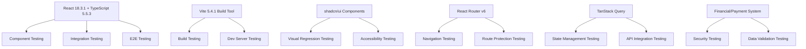
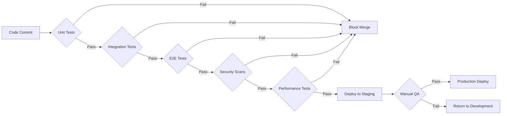

# Quality Assurance (QA)

> **Stakeholder Tags**: QA Engineers, Test Leads, Development Team, Product Managers, DevOps Engineers

## Overview

This section contains comprehensive quality assurance documentation for the NogadaCarGuard multi-portal application. Our QA approach ensures robust testing across all three application portals while maintaining high standards for security, accessibility, and user experience.

## Current State

⚠️ **Testing Framework Status**: The project currently has **NO testing framework or tests configured**. This documentation provides recommendations and implementation guidance for establishing a comprehensive testing strategy.

## Application Architecture for Testing

The NogadaCarGuard application consists of three distinct portals that require specialized testing approaches:

### 1. Car Guard App (Mobile-First)
- **Primary Users**: Car guards on mobile devices
- **Key Features**: QR code scanning, tip reception, payout requests, transaction history
- **Testing Focus**: Mobile responsiveness, QR code functionality, offline behavior

### 2. Customer Portal (Web/Mobile)
- **Primary Users**: Customers tipping car guards
- **Key Features**: Guard discovery, tipping interface, transaction history, profile management
- **Testing Focus**: Payment flow validation, user experience, cross-browser compatibility

### 3. Admin Dashboard (Web Desktop)
- **Primary Users**: System administrators and managers
- **Key Features**: Location management, user administration, analytics, reporting
- **Testing Focus**: Data accuracy, role-based access control, complex workflows

## Technology Stack Testing Considerations

## QA Documentation Structure

| Document | Purpose | Target Audience |
|----------|---------|-----------------|
| [Testing Strategies](testing-strategies.md) | Comprehensive testing methodologies and approaches | QA Engineers, Developers |
| [Test Environment Setup](test-environment-setup.md) | Environment configuration and tooling setup | QA Engineers, DevOps |
| [Bug Tracking](bug-tracking.md) | Issue management workflows and templates | All Team Members |

## Key Testing Areas

### 🔒 Security & Compliance
- Payment processing validation
- Data encryption verification
- Input sanitization testing
- Authentication & authorization flows

### 📱 Mobile & Responsive Testing
- Cross-device compatibility
- Touch interface validation
- Performance on low-end devices
- Network connectivity handling

### ♿ Accessibility Testing
- WCAG 2.1 AA compliance
- Screen reader compatibility
- Keyboard navigation
- Color contrast validation

### 🎨 Visual Testing
- Component library consistency
- Brand compliance (Tippa theme)
- Cross-browser rendering
- Responsive design validation

### ⚡ Performance Testing
- Load time optimization
- Bundle size monitoring
- React Query caching efficiency
- Vite build performance

## Testing Tools Recommendations

Based on the current technology stack (React + TypeScript + Vite), we recommend:

| Category | Primary Tool | Alternative | Justification |
|----------|--------------|-------------|---------------|
| **Unit Testing** | Vitest | Jest | Native Vite integration, faster execution |
| **Component Testing** | React Testing Library | Enzyme | Modern React patterns, accessibility focus |
| **E2E Testing** | Playwright | Cypress | Multi-browser support, mobile testing |
| **Visual Testing** | Chromatic | Percy | Component library integration |
| **API Testing** | MSW (Mock Service Worker) | Nock | Request interception, realistic mocking |

## Quality Gates

## Testing Metrics & KPIs

### Coverage Targets
- **Unit Test Coverage**: 80% minimum
- **Integration Test Coverage**: 70% minimum
- **E2E Test Coverage**: Critical user journeys (100%)

### Performance Benchmarks
- **Page Load Time**: < 2 seconds (3G network)
- **Time to Interactive**: < 3 seconds
- **Bundle Size**: < 1MB (compressed)
- **Lighthouse Score**: 90+ (Performance, Accessibility, Best Practices)

### Quality Metrics
- **Bug Escape Rate**: < 5% (production)
- **Mean Time to Resolution**: < 24 hours (critical bugs)
- **Test Execution Time**: < 15 minutes (full suite)
- **Test Stability**: > 95% (non-flaky tests)

## Getting Started

1. **Set up testing environment**: Follow [Test Environment Setup](test-environment-setup.md)
2. **Review testing strategies**: Read [Testing Strategies](testing-strategies.md)
3. **Configure bug tracking**: Implement [Bug Tracking](bug-tracking.md) workflows
4. **Establish CI/CD integration**: Coordinate with DevOps team

## Continuous Improvement

### Regular Review Schedule
- **Weekly**: Test execution results and flaky test analysis
- **Bi-weekly**: Coverage reports and quality metrics
- **Monthly**: Testing strategy effectiveness review
- **Quarterly**: Tool evaluation and process optimization

### Feedback Loops
- Developer testing feedback sessions
- QA retrospectives with development team
- User feedback integration into test scenarios
- Performance monitoring and optimization

---

**Document Information**
- **Created**: 2025-08-25
- **Last Updated**: 2025-08-25
- **Version**: 1.0
- **Authors**: QA Team
- **Review Schedule**: Monthly
- **Related Documents**: [DevOps Pipeline Documentation](../devops/README.md), [Security Documentation](../security/README.md)