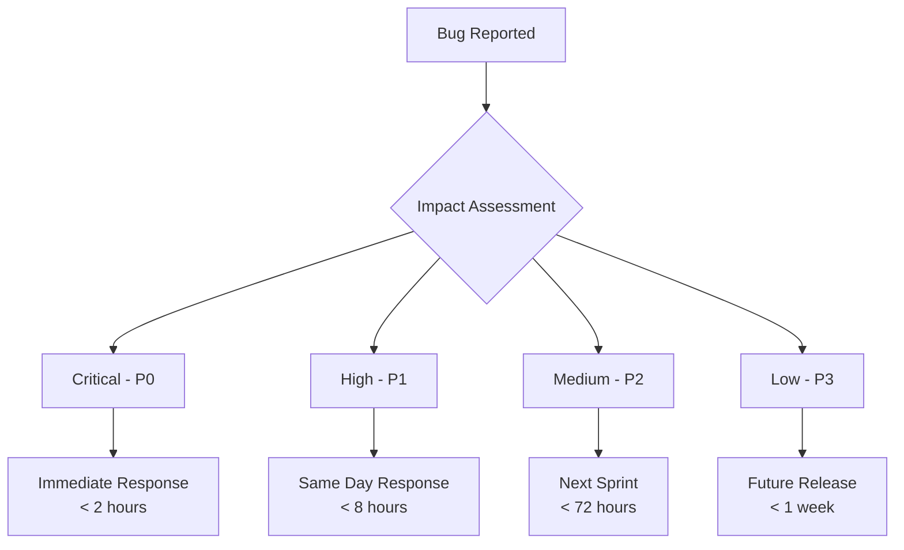
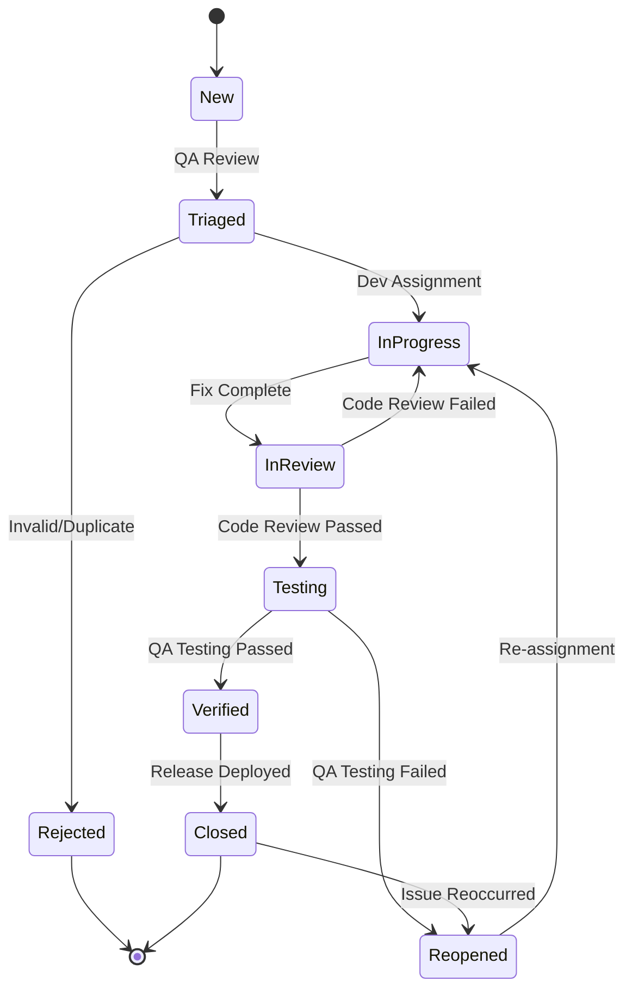
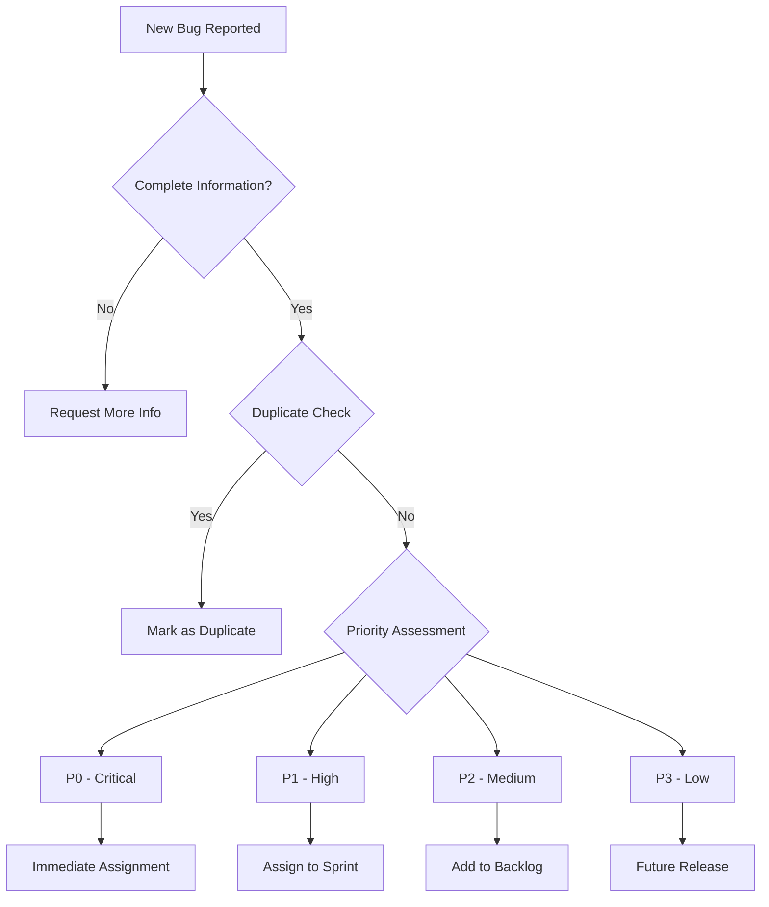
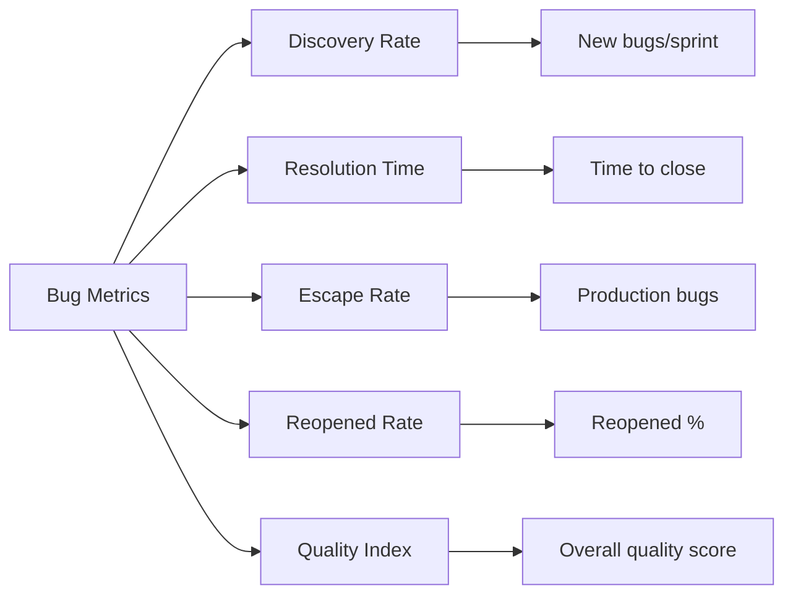

# Bug Tracking and Issue Management

> **Stakeholder Tags**: QA Engineers, Development Team, Product Managers, Support Team, DevOps Engineers

## Overview

This document establishes comprehensive bug tracking workflows, templates, and processes for the NogadaCarGuard application. It covers bug identification, classification, reporting, resolution, and continuous improvement processes.

## Bug Classification System

### Severity Levels



| Priority | Description | Examples | Response Time | Resolution Target |
|----------|-------------|----------|---------------|-------------------|
| **P0 - Critical** | System completely unusable, security breach, data loss | Payment processing failure, login system down, security vulnerability | < 2 hours | < 24 hours |
| **P1 - High** | Major feature broken, significant user impact | QR code not generating, payout system failure, admin dashboard crash | < 8 hours | < 72 hours |
| **P2 - Medium** | Minor feature issues, workaround available | UI display issues, slow loading times, minor calculation errors | < 72 hours | Next sprint |
| **P3 - Low** | Cosmetic issues, enhancement requests | Text formatting, color inconsistencies, minor UX improvements | < 1 week | Future release |

### Bug Categories

#### Functional Bugs
- **Authentication**: Login/logout, password reset, session management
- **Payment Processing**: Tip transactions, payout requests, payment gateway integration
- **QR Code**: Generation, scanning, validation
- **Data Management**: CRUD operations, data synchronization
- **Reporting**: Analytics, dashboard metrics, export functionality

#### Non-Functional Bugs
- **Performance**: Page load times, memory usage, database queries
- **Security**: Authentication bypass, data exposure, injection attacks
- **Accessibility**: Screen reader compatibility, keyboard navigation, color contrast
- **Compatibility**: Browser support, mobile responsiveness, device-specific issues
- **Usability**: User experience, workflow efficiency, error messaging

#### Environment-Specific Bugs
- **Development**: Local development issues, build problems
- **Staging**: Pre-production environment issues
- **Production**: Live system issues affecting users
- **Mobile**: Device-specific issues, app store problems

## Bug Reporting Templates

### Standard Bug Report Template

```markdown
# Bug Report: [Brief Description]

## Summary
**One-line summary of the issue**

## Environment
- **Application**: [Car Guard App / Customer Portal / Admin Dashboard]
- **Version/Commit**: [Version number or commit hash]
- **Environment**: [Development / Staging / Production]
- **Browser**: [Chrome 120.0, Firefox 121.0, Safari 17.0, etc.]
- **Device**: [Desktop / Mobile - specific model if mobile]
- **OS**: [Windows 11, macOS 14, iOS 17, Android 14, etc.]
- **Screen Resolution**: [1920x1080, 390x844, etc.]

## Priority/Severity
- **Priority**: [P0 Critical / P1 High / P2 Medium / P3 Low]
- **Severity**: [Blocker / Major / Minor / Trivial]
- **Category**: [Functional / Performance / Security / Accessibility / Compatibility]

## Steps to Reproduce
1. Navigate to [specific page/section]
2. Perform [specific action]
3. Enter [specific data if relevant]
4. Click [specific button/element]
5. Observe the issue

## Expected Behavior
**Describe what should happen**

## Actual Behavior
**Describe what actually happens**

## Impact
- **Users Affected**: [All users / Specific role / Percentage estimate]
- **Business Impact**: [Revenue impact, user experience impact, etc.]
- **Workaround Available**: [Yes/No - if yes, describe]

## Additional Information
- **Error Messages**: [Any error messages or console logs]
- **Screenshots/Videos**: [Attach visual evidence]
- **Browser Console Logs**: [Relevant console output]
- **Network Logs**: [API responses if relevant]
- **Database State**: [Relevant data state if applicable]

## Test Data
- **Guard ID**: [If applicable]
- **Customer ID**: [If applicable]
- **Transaction ID**: [If applicable]
- **Test Credentials**: [If specific test account needed]

## Acceptance Criteria for Fix
- [ ] Issue is resolved in the reported environment
- [ ] No regression in related functionality
- [ ] Cross-browser compatibility verified
- [ ] Mobile responsiveness maintained
- [ ] Unit/integration tests added to prevent regression

## Related Issues
- **Relates to**: [Link to related bugs/features]
- **Blocks**: [Issues blocked by this bug]
- **Depends on**: [Issues this bug depends on]
```

### Security Bug Report Template

```markdown
# Security Vulnerability Report: [CVE-ID or Brief Description]

## ⚠️ CONFIDENTIAL - SECURITY ISSUE ⚠️

## Vulnerability Summary
**Brief description of the security issue**

## Classification
- **OWASP Category**: [A01:2021 - Injection, A02:2021 - Cryptographic Failures, etc.]
- **CWE Reference**: [CWE-79, CWE-89, etc.]
- **CVSS Score**: [Calculate if applicable]
- **Severity**: [Critical / High / Medium / Low]

## Affected Components
- **Application**: [Car Guard App / Customer Portal / Admin Dashboard]
- **Endpoints**: [Specific API endpoints or pages]
- **Authentication Level**: [Public / Authenticated / Admin only]
- **Data at Risk**: [PII, Payment data, System access, etc.]

## Proof of Concept
```http
[HTTP request example or code demonstrating the vulnerability]
```

## Steps to Reproduce
1. [Detailed steps to exploit the vulnerability]
2. [Include specific payloads or inputs]
3. [Show the security impact]

## Impact Assessment
- **Confidentiality**: [None / Low / Medium / High]
- **Integrity**: [None / Low / Medium / High]
- **Availability**: [None / Low / Medium / High]
- **Scope**: [Unchanged / Changed]

## Business Impact
- **User Data Exposure**: [Type and amount of data at risk]
- **Financial Impact**: [Potential losses, compliance violations]
- **Reputation Risk**: [Brand damage, trust issues]

## Remediation Recommendations
- **Immediate Actions**: [Quick fixes or mitigations]
- **Long-term Solutions**: [Architectural changes needed]
- **Testing Requirements**: [Security tests to add]

## References
- [OWASP guidelines]
- [Security best practices]
- [Vendor documentation]
```

### Performance Bug Report Template

```markdown
# Performance Issue Report: [Brief Description]

## Performance Metrics
- **Page/Feature**: [Specific page or functionality]
- **Load Time**: [Current vs Expected]
- **Time to Interactive**: [Measurement]
- **Lighthouse Score**: [Performance score]
- **Core Web Vitals**: 
  - LCP (Largest Contentful Paint): [measurement]
  - FID (First Input Delay): [measurement]
  - CLS (Cumulative Layout Shift): [measurement]

## Environment Details
- **Device Type**: [Desktop / Mobile / Tablet]
- **Network Conditions**: [Fast 3G / 4G / WiFi / Slow 3G]
- **Device Specifications**: [RAM, CPU if relevant]
- **Browser**: [Version and type]

## Performance Analysis
- **Bundle Size**: [Current size and analysis]
- **Network Requests**: [Number and size of requests]
- **Database Queries**: [Query count and execution time]
- **Memory Usage**: [Peak memory consumption]
- **CPU Usage**: [Processing requirements]

## Impact on User Experience
- **User Frustration Points**: [Where users experience delays]
- **Conversion Impact**: [Effect on user actions]
- **Mobile vs Desktop**: [Comparative performance]

## Benchmarking Data
```javascript
// Performance measurements
{
  "loadTime": "3.2s (target: <2s)",
  "bundleSize": "1.2MB (target: <1MB)",
  "requests": 45,
  "dbQueries": 12
}
```

## Optimization Recommendations
- **Code Splitting**: [Specific recommendations]
- **Image Optimization**: [Compression, lazy loading]
- **Caching Strategy**: [Browser and API caching]
- **Database Optimization**: [Query improvements]
```

## Bug Workflow Process

### Bug Lifecycle



### Bug Triage Process

#### Daily Triage Meeting (15 minutes)
**Attendees**: QA Lead, Development Lead, Product Manager

**Agenda**:
1. Review new bugs (5 min)
2. Re-prioritize existing bugs (5 min)
3. Assignment decisions (5 min)

#### Triage Criteria



### Assignment Guidelines

| Bug Priority | Assignment Rule | Developer Level |
|--------------|----------------|-----------------|
| P0 Critical | Immediately to available senior dev | Senior/Lead |
| P1 High | Within 4 hours to team lead | Mid/Senior |
| P2 Medium | Next sprint planning | Any level |
| P3 Low | Backlog grooming | Junior/Mid |

## Quality Assurance Testing

### Pre-Release Testing Checklist

#### Functional Testing
- [ ] **Authentication flows** tested across all portals
- [ ] **Payment processing** validated with test transactions
- [ ] **QR code generation** and scanning functionality
- [ ] **Data validation** for all input forms
- [ ] **Role-based access control** verification
- [ ] **Error handling** for edge cases
- [ ] **Cross-portal navigation** testing

#### Non-Functional Testing
- [ ] **Performance benchmarks** met on all key pages
- [ ] **Security scans** completed (OWASP ZAP, Snyk)
- [ ] **Accessibility audit** using axe-core
- [ ] **Cross-browser compatibility** (Chrome, Firefox, Safari, Edge)
- [ ] **Mobile responsiveness** on various devices
- [ ] **Load testing** for concurrent user scenarios

#### Regression Testing
- [ ] **Automated test suite** passes 100%
- [ ] **Critical user journeys** manually verified
- [ ] **Previously fixed bugs** re-tested
- [ ] **Integration points** validated
- [ ] **Data migration** scripts tested (if applicable)

### Bug Verification Checklist

When marking a bug as **Verified**:

- [ ] **Original issue** is resolved
- [ ] **Test steps** from bug report pass
- [ ] **No new issues** introduced
- [ ] **Cross-browser testing** completed
- [ ] **Mobile testing** completed (if applicable)
- [ ] **Edge cases** tested
- [ ] **Error scenarios** handled gracefully
- [ ] **Performance impact** assessed
- [ ] **Documentation** updated (if needed)

## Root Cause Analysis

### 5 Whys Analysis Template

```markdown
# Root Cause Analysis: [Bug ID] - [Brief Description]

## Problem Statement
[Clear description of the bug and its impact]

## 5 Whys Analysis

1. **Why did this issue occur?**
   Answer: [First level cause]

2. **Why did [first level cause] happen?**
   Answer: [Second level cause]

3. **Why did [second level cause] happen?**
   Answer: [Third level cause]

4. **Why did [third level cause] happen?**
   Answer: [Fourth level cause]

5. **Why did [fourth level cause] happen?**
   Answer: [Root cause]

## Root Cause Summary
[Final root cause identification]

## Contributing Factors
- [Factor 1]
- [Factor 2]
- [Factor 3]

## Preventive Actions
- **Immediate**: [Short-term fixes]
- **Medium-term**: [Process improvements]
- **Long-term**: [Systemic changes]

## Lessons Learned
- [Key takeaway 1]
- [Key takeaway 2]
- [Key takeaway 3]
```

### Common Root Causes and Prevention

| Root Cause Category | Common Issues | Prevention Strategy |
|-------------------|---------------|-------------------|
| **Insufficient Testing** | Edge cases missed, integration issues | Expand test coverage, better test planning |
| **Requirements Issues** | Unclear specs, changing requirements | Better requirement gathering, stakeholder alignment |
| **Code Quality** | Technical debt, poor architecture | Code reviews, refactoring sprints, coding standards |
| **Process Gaps** | Missed validation steps, poor communication | Process documentation, training, checklists |
| **Environmental** | Configuration issues, deployment problems | Infrastructure as code, automated deployments |

## Bug Metrics and KPIs

### Key Performance Indicators



### Monthly Bug Report Template

```markdown
# Monthly Bug Report - [Month Year]

## Executive Summary
- **Total Bugs**: [Number] ([Change from last month])
- **Critical Issues**: [Number] ([Average resolution time])
- **Quality Trend**: [Improving/Declining/Stable]

## Bug Statistics

### By Priority
- P0 Critical: [Count] ([%])
- P1 High: [Count] ([%])
- P2 Medium: [Count] ([%])
- P3 Low: [Count] ([%])

### By Category
- Functional: [Count] ([%])
- Performance: [Count] ([%])
- Security: [Count] ([%])
- Accessibility: [Count] ([%])
- UI/UX: [Count] ([%])

### By Portal
- Car Guard App: [Count] ([%])
- Customer Portal: [Count] ([%])
- Admin Dashboard: [Count] ([%])
- Shared Components: [Count] ([%])

## Resolution Metrics
- **Average Resolution Time**: [Days]
- **P0 Average Resolution**: [Hours]
- **P1 Average Resolution**: [Hours]
- **Reopened Rate**: [%]
- **Escape Rate**: [%]

## Top Issues
1. [Most critical issue and status]
2. [Second most critical issue and status]
3. [Third most critical issue and status]

## Quality Improvements
- [Process improvements implemented]
- [Testing enhancements]
- [Tool upgrades]

## Action Items for Next Month
- [ ] [Action item 1]
- [ ] [Action item 2]
- [ ] [Action item 3]
```

### Automated Bug Tracking

#### GitHub Issues Integration

```yaml
name: Bug Report
description: File a bug report to help us improve
title: "[BUG] "
labels: ["bug", "triage-needed"]
assignees: []

body:
  - type: markdown
    attributes:
      value: |
        Thanks for taking the time to fill out this bug report!
        
  - type: dropdown
    id: portal
    attributes:
      label: Application Portal
      description: Which portal is affected?
      options:
        - Car Guard App
        - Customer Portal
        - Admin Dashboard
        - All Portals
    validations:
      required: true
      
  - type: dropdown
    id: priority
    attributes:
      label: Priority Level
      description: How severe is this issue?
      options:
        - P0 - Critical (System unusable)
        - P1 - High (Major feature broken)
        - P2 - Medium (Minor issue)
        - P3 - Low (Enhancement/Polish)
    validations:
      required: true
      
  - type: textarea
    id: reproduce
    attributes:
      label: Steps to Reproduce
      description: Clear steps to reproduce the behavior
      placeholder: |
        1. Go to...
        2. Click on...
        3. See error...
    validations:
      required: true
      
  - type: textarea
    id: expected
    attributes:
      label: Expected Behavior
      description: What did you expect to happen?
    validations:
      required: true
      
  - type: textarea
    id: actual
    attributes:
      label: Actual Behavior
      description: What actually happened?
    validations:
      required: true
      
  - type: textarea
    id: environment
    attributes:
      label: Environment
      description: |
        Browser, OS, device details
      placeholder: |
        - OS: [e.g. Windows 11, macOS 13, iOS 16]
        - Browser: [e.g. Chrome 120, Safari 16]
        - Device: [e.g. iPhone 14, Desktop]
    validations:
      required: true
```

#### Slack Integration

```javascript
// Bug notification webhook
const notifySlack = async (bug) => {
  const webhook = process.env.SLACK_WEBHOOK_URL;
  
  const message = {
    text: `🐛 New ${bug.priority} Bug Reported`,
    blocks: [
      {
        type: "section",
        text: {
          type: "mrkdwn",
          text: `*${bug.title}*\n${bug.description}`
        }
      },
      {
        type: "section",
        fields: [
          {
            type: "mrkdwn",
            text: `*Priority:*\n${bug.priority}`
          },
          {
            type: "mrkdwn",
            text: `*Portal:*\n${bug.portal}`
          },
          {
            type: "mrkdwn",
            text: `*Reporter:*\n${bug.reporter}`
          },
          {
            type: "mrkdwn",
            text: `*Environment:*\n${bug.environment}`
          }
        ]
      },
      {
        type: "actions",
        elements: [
          {
            type: "button",
            text: {
              type: "plain_text",
              text: "View Bug"
            },
            url: `${process.env.GITHUB_URL}/issues/${bug.id}`
          }
        ]
      }
    ]
  };
  
  await fetch(webhook, {
    method: 'POST',
    headers: { 'Content-Type': 'application/json' },
    body: JSON.stringify(message)
  });
};
```

## Continuous Improvement

### Retrospective Questions

#### Monthly Bug Review
1. **What types of bugs are we seeing most frequently?**
2. **Are there patterns in our escape rate?**
3. **Which components/features have the highest bug density?**
4. **How effective are our current testing strategies?**
5. **What process improvements can reduce bug count?**

#### Post-Incident Review (P0/P1 bugs)
1. **How could we have caught this earlier?**
2. **What testing scenarios were missing?**
3. **Were there warning signs we missed?**
4. **How can we prevent similar issues?**
5. **What tools or processes need improvement?**

### Process Improvements

#### Quarterly Initiatives
- **Q1**: Implement automated visual regression testing
- **Q2**: Enhance security testing coverage
- **Q3**: Improve mobile testing processes
- **Q4**: Optimize bug triage workflows

#### Tool Evaluations
- **Bug Tracking**: Evaluate GitHub Issues vs Jira vs Linear
- **Test Management**: Consider TestRail or similar
- **Automation**: Explore additional testing tools
- **Monitoring**: Implement better error tracking

---

**Document Information**
- **Created**: 2025-08-25
- **Last Updated**: 2025-08-25
- **Version**: 1.0
- **Authors**: QA Team
- **Review Schedule**: Monthly
- **Related Documents**: [Testing Strategies](testing-strategies.md), [Test Environment Setup](test-environment-setup.md)