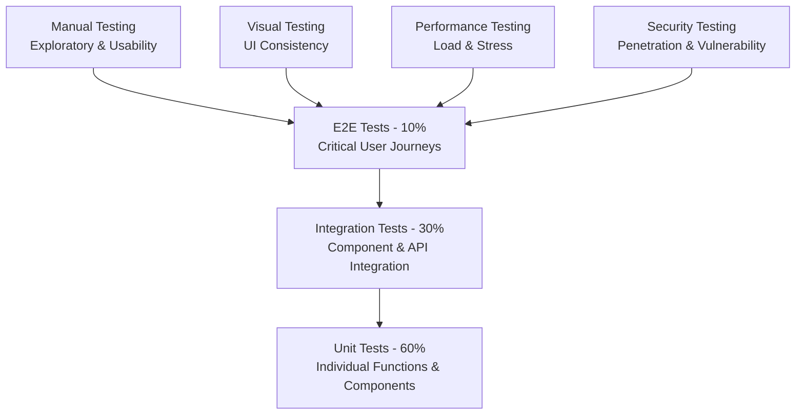
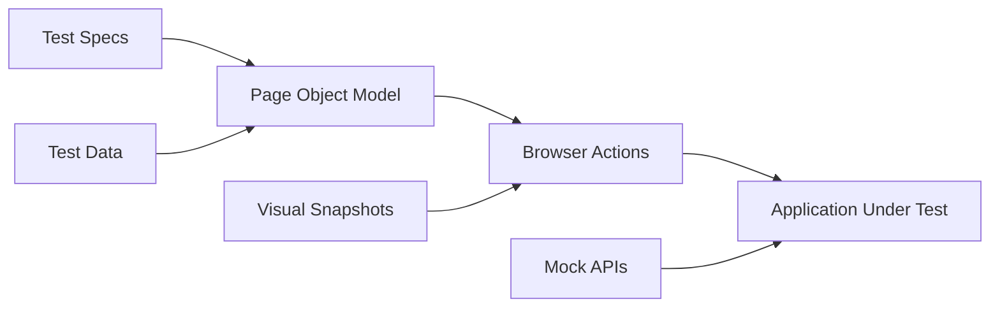

# Testing Strategies

> **Stakeholder Tags**: QA Engineers, Development Team, Test Leads, DevOps Engineers

## Overview

This document outlines comprehensive testing strategies for the NogadaCarGuard multi-portal application, covering unit testing, integration testing, end-to-end testing, and specialized testing approaches for financial applications.

## Testing Pyramid Strategy



## 1. Unit Testing Strategy

### Framework Recommendation: Vitest + React Testing Library

**Why Vitest?**
- Native Vite integration (faster than Jest)
- TypeScript support out-of-the-box
- ES modules support
- Familiar Jest-like API

### Unit Testing Scope

#### Components to Test
```typescript
// Example: CarGuard QR Code Component Test
import { render, screen } from '@testing-library/react'
import { QRCodeDisplay } from '@/components/car-guard/QRCodeDisplay'

describe('QRCodeDisplay', () => {
  it('should render QR code with correct guard ID', () => {
    const mockGuard = { id: 'guard-123', qrCode: 'qr-data-123' }
    render(<QRCodeDisplay guard={mockGuard} />)
    
    expect(screen.getByTestId('qr-code')).toBeInTheDocument()
    expect(screen.getByText(/guard-123/i)).toBeInTheDocument()
  })
  
  it('should handle QR code generation errors', () => {
    const mockGuard = { id: 'guard-123', qrCode: null }
    render(<QRCodeDisplay guard={mockGuard} />)
    
    expect(screen.getByText(/qr code unavailable/i)).toBeInTheDocument()
  })
})
```

#### Utility Functions Testing
```typescript
// Example: Currency Formatting Tests
import { formatCurrency } from '@/data/mockData'

describe('formatCurrency', () => {
  it('should format ZAR currency correctly', () => {
    expect(formatCurrency(1500)).toBe('R1,500.00')
    expect(formatCurrency(0)).toBe('R0.00')
    expect(formatCurrency(-500)).toBe('-R500.00')
  })
})
```

### Coverage Targets
- **Functions**: 85%+ coverage
- **Statements**: 80%+ coverage
- **Branches**: 75%+ coverage
- **Lines**: 80%+ coverage

## 2. Integration Testing Strategy

### API Integration Testing with MSW

```typescript
// Example: Mock API setup
import { setupServer } from 'msw/node'
import { rest } from 'msw'

const server = setupServer(
  rest.post('/api/tips', (req, res, ctx) => {
    return res(
      ctx.json({
        id: 'tip-123',
        amount: 50,
        guardId: 'guard-456',
        status: 'completed'
      })
    )
  })
)

beforeAll(() => server.listen())
afterEach(() => server.resetHandlers())
afterAll(() => server.close())
```

### Component Integration Testing

#### React Query Integration
```typescript
import { QueryClient, QueryClientProvider } from '@tanstack/react-query'
import { render, screen, waitFor } from '@testing-library/react'
import userEvent from '@testing-library/user-event'

const createWrapper = () => {
  const queryClient = new QueryClient({
    defaultOptions: {
      queries: { retry: false },
      mutations: { retry: false },
    },
  })
  
  return ({ children }) => (
    <QueryClientProvider client={queryClient}>
      {children}
    </QueryClientProvider>
  )
}
```

#### Router Integration Testing
```typescript
import { MemoryRouter } from 'react-router-dom'

const renderWithRouter = (component, initialEntries = ['/']) => {
  return render(
    <MemoryRouter initialEntries={initialEntries}>
      {component}
    </MemoryRouter>
  )
}
```

## 3. End-to-End Testing Strategy

### Framework Recommendation: Playwright

**Why Playwright?**
- Multi-browser support (Chromium, Firefox, WebKit)
- Mobile device emulation
- Network interception capabilities
- Parallel execution
- Visual comparisons
- Excellent TypeScript support

### E2E Testing Architecture



### Critical User Journey Tests

#### 1. Car Guard Portal Journey
```typescript
// tests/e2e/car-guard-flow.spec.ts
import { test, expect } from '@playwright/test'
import { CarGuardPage } from '../pages/CarGuardPage'

test.describe('Car Guard Complete Flow', () => {
  test('should complete tip reception and payout request', async ({ page, isMobile }) => {
    const carGuardPage = new CarGuardPage(page)
    
    // Login
    await carGuardPage.login('guard@test.com', 'password123')
    await expect(carGuardPage.dashboard).toBeVisible()
    
    // Verify QR Code Display
    await expect(carGuardPage.qrCode).toBeVisible()
    
    // Check balance updates
    const initialBalance = await carGuardPage.getBalance()
    
    // Simulate tip reception (via API call)
    await carGuardPage.simulateTipReception(50)
    
    // Verify balance update
    await expect(carGuardPage.balanceElement).toContainText('R' + (initialBalance + 50))
    
    // Request payout
    await carGuardPage.requestPayout(100)
    await expect(carGuardPage.successMessage).toContainText('Payout requested')
  })
})
```

#### 2. Customer Tipping Journey
```typescript
// tests/e2e/customer-tipping.spec.ts
test('should complete customer tipping flow', async ({ page }) => {
  const customerPage = new CustomerPage(page)
  
  await customerPage.login('customer@test.com', 'password123')
  await customerPage.navigateToTipping('guard-123')
  
  // Select tip amount
  await customerPage.selectTipAmount(20)
  await customerPage.addTipMessage('Great service!')
  
  // Process payment
  await customerPage.processPayment()
  
  // Verify success
  await expect(customerPage.successMessage).toContainText('Tip sent successfully')
  await expect(customerPage.receiptModal).toBeVisible()
})
```

#### 3. Admin Dashboard Journey
```typescript
// tests/e2e/admin-dashboard.spec.ts
test('should manage locations and guards', async ({ page }) => {
  const adminPage = new AdminPage(page)
  
  await adminPage.login('admin@test.com', 'admin123')
  await adminPage.navigateToLocations()
  
  // Add new location
  await adminPage.addLocation({
    name: 'Test Mall',
    address: '123 Test Street',
    city: 'Cape Town'
  })
  
  // Verify location appears in list
  await expect(adminPage.locationsList).toContainText('Test Mall')
  
  // Assign guard to location
  await adminPage.assignGuardToLocation('guard-456', 'Test Mall')
  await expect(adminPage.successMessage).toContainText('Guard assigned')
})
```

### Mobile-Specific E2E Tests

```typescript
test.describe('Mobile Car Guard App', () => {
  test.use({ 
    viewport: { width: 375, height: 667 }, // iPhone SE
    hasTouch: true,
    isMobile: true 
  })
  
  test('should work on mobile devices', async ({ page }) => {
    // Test touch interactions
    await page.tap('[data-testid="qr-code"]')
    
    // Test mobile navigation
    await page.tap('[data-testid="bottom-nav-history"]')
    await expect(page.locator('[data-testid="transaction-history"]')).toBeVisible()
    
    // Test responsive layout
    await expect(page.locator('.mobile-layout')).toBeVisible()
  })
})
```

## 4. Visual Testing Strategy

### Chromatic Integration

```javascript
// .storybook/main.js
module.exports = {
  stories: ['../src/**/*.stories.@(js|jsx|ts|tsx)'],
  addons: ['@storybook/addon-essentials'],
}

// Example story
export const Default = () => <QRCodeDisplay guard={mockGuard} />
export const Loading = () => <QRCodeDisplay guard={null} />
export const Error = () => <QRCodeDisplay guard={errorGuard} />
```

### Visual Regression Testing

```typescript
// tests/visual/component-snapshots.spec.ts
test('QR Code component visual regression', async ({ page }) => {
  await page.goto('/storybook/iframe.html?id=qrcodedisplay--default')
  await expect(page).toHaveScreenshot('qr-code-default.png')
})
```

## 5. Performance Testing Strategy

### Lighthouse CI Integration

```javascript
// lighthouse.config.js
module.exports = {
  ci: {
    collect: {
      numberOfRuns: 3,
      url: [
        'http://localhost:3000/car-guard',
        'http://localhost:3000/customer',
        'http://localhost:3000/admin'
      ]
    },
    assert: {
      assertions: {
        'categories:performance': ['error', { minScore: 0.9 }],
        'categories:accessibility': ['error', { minScore: 0.9 }],
        'categories:best-practices': ['error', { minScore: 0.9 }],
        'categories:seo': ['error', { minScore: 0.9 }]
      }
    }
  }
}
```

### Bundle Size Monitoring

```javascript
// vite.config.ts
export default defineConfig({
  build: {
    rollupOptions: {
      output: {
        manualChunks: {
          vendor: ['react', 'react-dom'],
          router: ['react-router-dom'],
          ui: ['@radix-ui/react-dialog', '@radix-ui/react-select'],
          charts: ['recharts'],
          forms: ['react-hook-form', 'zod']
        }
      }
    }
  }
})
```

## 6. Security Testing Strategy

### Input Validation Testing

```typescript
describe('Input Validation', () => {
  test('should prevent XSS attacks', async ({ page }) => {
    const maliciousInput = '<script>alert("xss")</script>'
    
    await page.fill('[data-testid="tip-message-input"]', maliciousInput)
    await page.click('[data-testid="send-tip-button"]')
    
    // Verify script is not executed and is properly escaped
    await expect(page.locator('script')).toHaveCount(0)
  })
  
  test('should validate currency amounts', async ({ page }) => {
    const invalidAmounts = ['-50', '0', '999999', 'abc', '50.123']
    
    for (const amount of invalidAmounts) {
      await page.fill('[data-testid="tip-amount-input"]', amount)
      await page.click('[data-testid="send-tip-button"]')
      
      await expect(page.locator('[data-testid="error-message"]')).toBeVisible()
    }
  })
})
```

### Authentication & Authorization Testing

```typescript
describe('Authentication', () => {
  test('should redirect unauthorized users', async ({ page }) => {
    await page.goto('/admin/dashboard')
    
    // Should redirect to login
    await expect(page).toHaveURL(/.*\/admin\/login/)
  })
  
  test('should prevent role escalation', async ({ page }) => {
    // Login as car guard
    await page.goto('/car-guard/login')
    await page.fill('[data-testid="email"]', 'guard@test.com')
    await page.fill('[data-testid="password"]', 'password123')
    await page.click('[data-testid="login-button"]')
    
    // Attempt to access admin routes
    await page.goto('/admin/dashboard')
    
    // Should be denied access
    await expect(page.locator('[data-testid="access-denied"]')).toBeVisible()
  })
})
```

## 7. Accessibility Testing Strategy

### Automated Accessibility Testing

```typescript
import { injectAxe, checkA11y } from 'axe-playwright'

test.describe('Accessibility Tests', () => {
  test.beforeEach(async ({ page }) => {
    await injectAxe(page)
  })
  
  test('should be accessible on car guard dashboard', async ({ page }) => {
    await page.goto('/car-guard/dashboard')
    await checkA11y(page, null, {
      detailedReport: true,
      detailedReportOptions: { html: true }
    })
  })
})
```

### Manual Accessibility Testing Checklist

```markdown
- [ ] Keyboard navigation works throughout the application
- [ ] Screen reader announcements are appropriate
- [ ] Color contrast ratios meet WCAG 2.1 AA standards
- [ ] Form labels are properly associated
- [ ] Error messages are descriptive and accessible
- [ ] Focus indicators are visible
- [ ] Alternative text for images/QR codes
```

## 8. API Testing Strategy

### Contract Testing with Pact

```typescript
// tests/contract/consumer.spec.ts
import { Pact } from '@pact-foundation/pact'

describe('Tip API Consumer', () => {
  const provider = new Pact({
    consumer: 'CarGuardApp',
    provider: 'TipAPI',
    port: 1234,
  })
  
  beforeAll(() => provider.setup())
  afterEach(() => provider.verify())
  afterAll(() => provider.finalize())
  
  test('should send tip successfully', async () => {
    await provider.addInteraction({
      state: 'guard exists',
      uponReceiving: 'a tip request',
      withRequest: {
        method: 'POST',
        path: '/api/tips',
        body: {
          guardId: 'guard-123',
          amount: 50,
          customerId: 'customer-456'
        }
      },
      willRespondWith: {
        status: 201,
        body: {
          id: 'tip-789',
          status: 'completed'
        }
      }
    })
    
    // Test implementation
  })
})
```

## 9. Test Data Management

### Factory Pattern for Test Data

```typescript
// tests/factories/index.ts
export const GuardFactory = {
  build: (overrides = {}) => ({
    id: faker.datatype.uuid(),
    name: faker.name.fullName(),
    email: faker.internet.email(),
    phone: faker.phone.number(),
    location: faker.address.city(),
    balance: faker.datatype.number({ min: 0, max: 1000 }),
    qrCode: faker.datatype.string(),
    ...overrides
  })
}

export const TipFactory = {
  build: (overrides = {}) => ({
    id: faker.datatype.uuid(),
    amount: faker.datatype.number({ min: 5, max: 100 }),
    guardId: faker.datatype.uuid(),
    customerId: faker.datatype.uuid(),
    timestamp: faker.date.recent(),
    status: 'completed',
    ...overrides
  })
}
```

## 10. Continuous Integration Strategy

### GitHub Actions Integration

```yaml
# .github/workflows/test.yml
name: Test Suite

on: [push, pull_request]

jobs:
  unit-tests:
    runs-on: ubuntu-latest
    steps:
      - uses: actions/checkout@v3
      - uses: actions/setup-node@v3
        with:
          node-version: '18'
          cache: 'npm'
      
      - run: npm ci
      - run: npm run test:unit
      - run: npm run test:coverage
      
      - name: Upload coverage
        uses: codecov/codecov-action@v3

  e2e-tests:
    runs-on: ubuntu-latest
    steps:
      - uses: actions/checkout@v3
      - uses: actions/setup-node@v3
      - run: npm ci
      - run: npx playwright install
      - run: npm run test:e2e
      
      - name: Upload test results
        uses: actions/upload-artifact@v3
        if: failure()
        with:
          name: playwright-results
          path: test-results/
```

## Test Execution Strategy

### Local Development
```bash
# Unit tests (watch mode)
npm run test:unit:watch

# Integration tests
npm run test:integration

# E2E tests (headed mode for debugging)
npm run test:e2e:headed

# Full test suite
npm run test:all
```

### CI/CD Pipeline
1. **Pre-commit**: Unit tests + linting
2. **Pull Request**: Full test suite + visual regression
3. **Staging Deploy**: E2E tests + performance tests
4. **Production Deploy**: Smoke tests + monitoring

## Test Reporting & Metrics

### Test Results Dashboard
- Test execution times
- Flaky test identification
- Coverage trends
- Performance benchmarks

### Quality Gates
- All tests must pass before merge
- Coverage must not decrease
- No new accessibility violations
- Performance budgets must be met

---

**Document Information**
- **Created**: 2025-08-25
- **Last Updated**: 2025-08-25
- **Version**: 1.0
- **Authors**: QA Team
- **Review Schedule**: Monthly
- **Related Documents**: [Test Environment Setup](test-environment-setup.md), [Bug Tracking](bug-tracking.md)