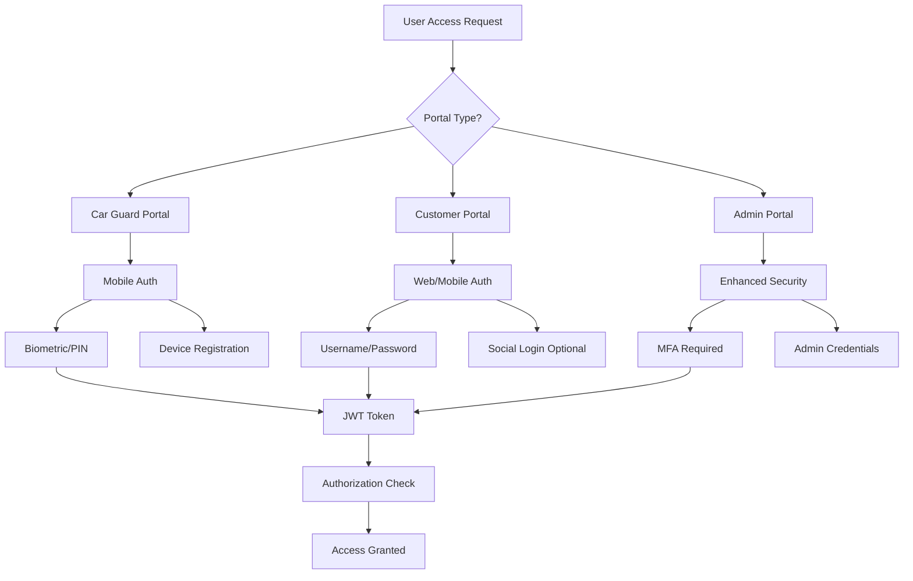
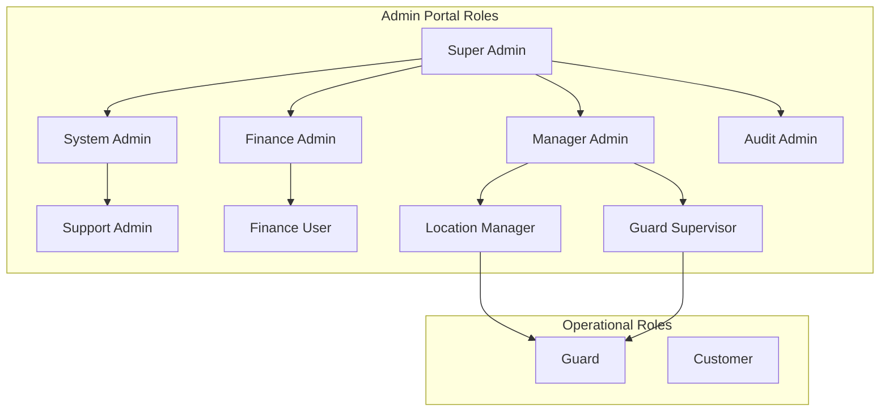
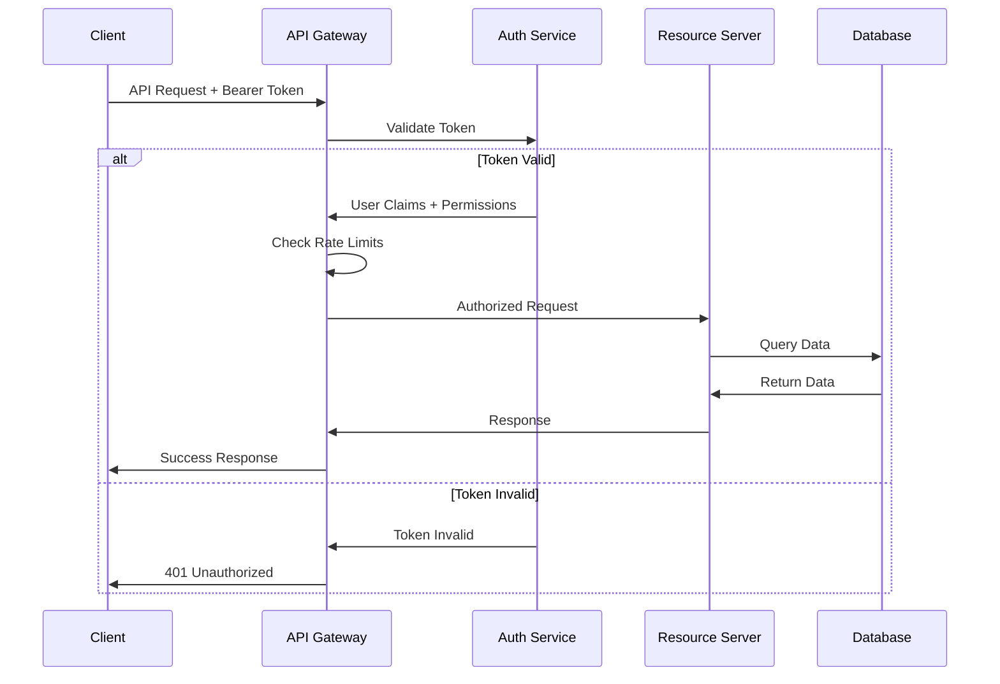

# Access Control and Authentication

## Introduction

This document establishes comprehensive authentication, authorization, and access control mechanisms for the NogadaCarGuard application ecosystem. Given the financial nature of the application and its multi-stakeholder environment, robust access controls are essential for protecting user data, preventing unauthorized transactions, and ensuring regulatory compliance.

## Authentication Architecture

### Multi-Portal Authentication Strategy



### Authentication Methods by Portal

#### Car Guard Portal (Mobile-First)
- **Primary**: Biometric authentication (fingerprint, face recognition)
- **Fallback**: 6-digit PIN with account lockout
- **Device Registration**: Hardware-based device attestation
- **Session Management**: Persistent sessions with periodic re-authentication

#### Customer Portal (Web/Mobile)
- **Primary**: Username/password with optional 2FA
- **Enhanced**: Multi-factor authentication for transactions >R100
- **Social Login**: Optional OAuth with Google/Facebook (future)
- **Remember Device**: Trusted device registration

#### Admin Portal (Web Application)  
- **Mandatory**: Multi-factor authentication for all users
- **Primary Factor**: Complex password requirements
- **Secondary Factor**: Time-based OTP (TOTP) or SMS
- **Session**: Short-lived sessions with re-authentication

### Authentication Implementation

#### JWT Token Structure

```typescript
interface JWTPayload {
  // Standard Claims
  iss: string;           // Issuer
  sub: string;           // Subject (User ID)
  aud: string[];         // Audience (Portal types)
  exp: number;           // Expiration time
  nbf: number;           // Not before
  iat: number;           // Issued at
  jti: string;           // JWT ID (for revocation)
  
  // Custom Claims
  portal: 'car-guard' | 'customer' | 'admin';
  roles: string[];
  permissions: string[];
  deviceId?: string;
  locationId?: string;
  managerId?: string;
  
  // Security Claims
  sessionId: string;
  authLevel: number;     // 1=basic, 2=MFA, 3=enhanced
  lastActivity: number;
  riskScore?: number;
}
```

#### Token Management Implementation

```typescript
// Token service implementation
class TokenService {
  private readonly JWT_SECRET = process.env.JWT_SECRET!;
  private readonly JWT_EXPIRES_IN = '8h';
  private readonly REFRESH_EXPIRES_IN = '30d';
  
  generateTokens(user: User, portal: Portal): TokenPair {
    const payload: JWTPayload = {
      iss: 'nogada-auth',
      sub: user.id,
      aud: [portal],
      exp: Math.floor(Date.now() / 1000) + (8 * 60 * 60),
      nbf: Math.floor(Date.now() / 1000),
      iat: Math.floor(Date.now() / 1000),
      jti: generateUUID(),
      
      portal: portal,
      roles: user.roles,
      permissions: this.getPermissions(user.roles, portal),
      deviceId: user.deviceId,
      locationId: user.locationId,
      
      sessionId: generateSessionId(),
      authLevel: this.calculateAuthLevel(user, portal),
      lastActivity: Date.now()
    };
    
    const accessToken = jwt.sign(payload, this.JWT_SECRET);
    const refreshToken = this.generateRefreshToken(user.id, payload.sessionId);
    
    return { accessToken, refreshToken };
  }
  
  verifyToken(token: string): JWTPayload | null {
    try {
      const payload = jwt.verify(token, this.JWT_SECRET) as JWTPayload;
      
      // Check if token is revoked
      if (this.isTokenRevoked(payload.jti)) {
        return null;
      }
      
      // Check session validity
      if (!this.isSessionActive(payload.sessionId)) {
        return null;
      }
      
      return payload;
    } catch (error) {
      return null;
    }
  }
}
```

### Multi-Factor Authentication

#### TOTP Implementation for Admin Portal

```typescript
import { authenticator } from 'otplib';
import QRCode from 'qrcode';

class MFAService {
  async setupMFA(userId: string, email: string): Promise<MFASetup> {
    // Generate secret
    const secret = authenticator.generateSecret();
    
    // Create service name
    const service = 'NogadaCarGuard Admin';
    const label = `${service}:${email}`;
    const issuer = 'NogadaCarGuard';
    
    // Generate OTP URL
    const otpUrl = authenticator.keyuri(label, issuer, secret);
    
    // Generate QR code
    const qrCodeDataURL = await QRCode.toDataURL(otpUrl);
    
    // Store secret (encrypted)
    await this.storeMFASecret(userId, secret);
    
    return {
      secret,
      qrCode: qrCodeDataURL,
      backupCodes: this.generateBackupCodes()
    };
  }
  
  verifyMFAToken(userId: string, token: string): boolean {
    const secret = this.getMFASecret(userId);
    return authenticator.verify({ token, secret });
  }
  
  private generateBackupCodes(): string[] {
    return Array.from({ length: 8 }, () => 
      Math.random().toString(36).substr(2, 8).toUpperCase()
    );
  }
}
```

#### SMS-based MFA (Backup Method)

```typescript
class SMSMFAService {
  private readonly SMS_PROVIDER = new SMSProvider();
  private readonly CODE_EXPIRY = 5 * 60 * 1000; // 5 minutes
  
  async sendMFACode(phoneNumber: string): Promise<string> {
    // Generate 6-digit code
    const code = Math.floor(100000 + Math.random() * 900000).toString();
    
    // Store code with expiry
    const codeId = generateUUID();
    await this.storeCode(codeId, code, phoneNumber);
    
    // Send SMS
    await this.SMS_PROVIDER.send(phoneNumber, 
      `Your NogadaCarGuard verification code is: ${code}`
    );
    
    return codeId;
  }
  
  async verifyMFACode(codeId: string, inputCode: string): Promise<boolean> {
    const storedData = await this.getStoredCode(codeId);
    
    if (!storedData || Date.now() > storedData.expiry) {
      return false;
    }
    
    return storedData.code === inputCode;
  }
}
```

## Authorization Framework

### Role-Based Access Control (RBAC)

#### Role Hierarchy



#### Role Definitions and Permissions

```typescript
enum Permission {
  // User Management
  USER_CREATE = 'user:create',
  USER_READ = 'user:read',
  USER_UPDATE = 'user:update',
  USER_DELETE = 'user:delete',
  
  // Guard Management
  GUARD_CREATE = 'guard:create',
  GUARD_READ = 'guard:read', 
  GUARD_UPDATE = 'guard:update',
  GUARD_DELETE = 'guard:delete',
  GUARD_APPROVE_PAYOUT = 'guard:approve_payout',
  
  // Financial Operations
  TRANSACTION_VIEW = 'transaction:view',
  TRANSACTION_PROCESS = 'transaction:process',
  PAYOUT_APPROVE = 'payout:approve',
  PAYOUT_REJECT = 'payout:reject',
  FINANCIAL_REPORTS = 'financial:reports',
  
  // System Administration
  SYSTEM_CONFIG = 'system:config',
  AUDIT_VIEW = 'audit:view',
  SECURITY_CONFIG = 'security:config',
  
  // Location Management
  LOCATION_CREATE = 'location:create',
  LOCATION_READ = 'location:read',
  LOCATION_UPDATE = 'location:update',
  LOCATION_DELETE = 'location:delete'
}

interface Role {
  id: string;
  name: string;
  description: string;
  permissions: Permission[];
  portal: 'admin' | 'customer' | 'car-guard';
  level: number; // Hierarchy level
}

const roleDefinitions: Role[] = [
  {
    id: 'super-admin',
    name: 'Super Administrator', 
    description: 'Full system access and user management',
    permissions: Object.values(Permission),
    portal: 'admin',
    level: 1
  },
  {
    id: 'system-admin',
    name: 'System Administrator',
    description: 'System configuration and maintenance',
    permissions: [
      Permission.SYSTEM_CONFIG,
      Permission.AUDIT_VIEW,
      Permission.GUARD_READ,
      Permission.TRANSACTION_VIEW
    ],
    portal: 'admin',
    level: 2
  },
  {
    id: 'finance-admin',
    name: 'Finance Administrator', 
    description: 'Financial operations and reporting',
    permissions: [
      Permission.TRANSACTION_VIEW,
      Permission.TRANSACTION_PROCESS,
      Permission.PAYOUT_APPROVE,
      Permission.PAYOUT_REJECT,
      Permission.FINANCIAL_REPORTS
    ],
    portal: 'admin',
    level: 2
  },
  {
    id: 'location-manager',
    name: 'Location Manager',
    description: 'Manage specific location and guards',
    permissions: [
      Permission.GUARD_READ,
      Permission.GUARD_UPDATE,
      Permission.LOCATION_READ,
      Permission.LOCATION_UPDATE,
      Permission.TRANSACTION_VIEW
    ],
    portal: 'admin',
    level: 3
  }
];
```

#### Permission Evaluation Engine

```typescript
class AuthorizationService {
  private roles: Map<string, Role> = new Map();
  private userRoles: Map<string, string[]> = new Map();
  
  hasPermission(userId: string, permission: Permission, context?: AuthContext): boolean {
    const userRoles = this.getUserRoles(userId);
    
    // Check if user has permission through any role
    for (const roleName of userRoles) {
      const role = this.roles.get(roleName);
      if (role?.permissions.includes(permission)) {
        // Additional context-based checks
        if (this.checkContextualPermissions(userId, permission, context)) {
          return true;
        }
      }
    }
    
    return false;
  }
  
  private checkContextualPermissions(
    userId: string, 
    permission: Permission, 
    context?: AuthContext
  ): boolean {
    // Location-based access control
    if (context?.locationId) {
      const userLocations = this.getUserLocations(userId);
      if (!userLocations.includes(context.locationId)) {
        return false;
      }
    }
    
    // Time-based access control
    if (context?.timeRestrictions) {
      const now = new Date();
      if (!this.isWithinTimeRestrictions(now, context.timeRestrictions)) {
        return false;
      }
    }
    
    // IP-based access control
    if (context?.ipAddress) {
      if (!this.isAllowedIP(context.ipAddress)) {
        return false;
      }
    }
    
    return true;
  }
}
```

### Attribute-Based Access Control (ABAC)

#### ABAC Policy Engine

```typescript
interface ABACAttributes {
  subject: {
    userId: string;
    roles: string[];
    department?: string;
    location?: string;
    clearanceLevel?: number;
  };
  
  resource: {
    type: string;
    id: string;
    sensitivity?: 'public' | 'internal' | 'confidential' | 'restricted';
    owner?: string;
    location?: string;
  };
  
  action: {
    operation: 'create' | 'read' | 'update' | 'delete' | 'approve';
    method?: string;
  };
  
  environment: {
    time: Date;
    ipAddress: string;
    userAgent?: string;
    riskScore?: number;
  };
}

class ABACPolicyEngine {
  evaluatePolicy(attributes: ABACAttributes): PolicyResult {
    const policies = this.getApplicablePolicies(attributes);
    
    for (const policy of policies) {
      const result = this.evaluateRule(policy, attributes);
      
      if (result.decision === 'DENY') {
        return result;
      }
      
      if (result.decision === 'PERMIT') {
        return result;
      }
    }
    
    // Default deny
    return {
      decision: 'DENY',
      reason: 'No applicable policy permits access'
    };
  }
  
  private evaluateRule(policy: Policy, attributes: ABACAttributes): PolicyResult {
    // Example policy: Finance admins can approve payouts during business hours
    if (policy.id === 'finance-payout-approval') {
      const isFinanceAdmin = attributes.subject.roles.includes('finance-admin');
      const isPayoutApproval = attributes.action.operation === 'approve' && 
                              attributes.resource.type === 'payout';
      const isBusinessHours = this.isBusinessHours(attributes.environment.time);
      
      if (isFinanceAdmin && isPayoutApproval && isBusinessHours) {
        return { decision: 'PERMIT', policy: policy.id };
      }
    }
    
    return { decision: 'NOT_APPLICABLE' };
  }
}
```

## Session Management

### Session Security Implementation

```typescript
interface Session {
  id: string;
  userId: string;
  portal: Portal;
  deviceId?: string;
  ipAddress: string;
  userAgent: string;
  createdAt: Date;
  lastActivity: Date;
  expiresAt: Date;
  isActive: boolean;
  riskScore: number;
}

class SessionManager {
  private readonly SESSION_TIMEOUT = 15 * 60 * 1000; // 15 minutes idle
  private readonly ABSOLUTE_TIMEOUT = 8 * 60 * 60 * 1000; // 8 hours max
  private readonly MAX_CONCURRENT_SESSIONS = 3;
  
  async createSession(
    userId: string, 
    portal: Portal, 
    deviceInfo: DeviceInfo
  ): Promise<Session> {
    // Check concurrent session limit
    await this.enforceSessionLimit(userId);
    
    // Calculate risk score
    const riskScore = await this.calculateRiskScore(deviceInfo);
    
    const session: Session = {
      id: generateSecureId(),
      userId,
      portal,
      deviceId: deviceInfo.deviceId,
      ipAddress: deviceInfo.ipAddress,
      userAgent: deviceInfo.userAgent,
      createdAt: new Date(),
      lastActivity: new Date(),
      expiresAt: new Date(Date.now() + this.ABSOLUTE_TIMEOUT),
      isActive: true,
      riskScore
    };
    
    await this.storeSession(session);
    return session;
  }
  
  async updateActivity(sessionId: string): Promise<boolean> {
    const session = await this.getSession(sessionId);
    
    if (!session || !session.isActive) {
      return false;
    }
    
    // Check if session has timed out
    const timeSinceActivity = Date.now() - session.lastActivity.getTime();
    if (timeSinceActivity > this.SESSION_TIMEOUT) {
      await this.invalidateSession(sessionId);
      return false;
    }
    
    // Update activity timestamp
    session.lastActivity = new Date();
    await this.storeSession(session);
    
    return true;
  }
  
  private async enforceSessionLimit(userId: string): Promise<void> {
    const activeSessions = await this.getActiveSessions(userId);
    
    if (activeSessions.length >= this.MAX_CONCURRENT_SESSIONS) {
      // Invalidate oldest session
      const oldestSession = activeSessions
        .sort((a, b) => a.lastActivity.getTime() - b.lastActivity.getTime())[0];
      
      await this.invalidateSession(oldestSession.id);
    }
  }
  
  private async calculateRiskScore(deviceInfo: DeviceInfo): Promise<number> {
    let score = 0;
    
    // New device penalty
    if (!await this.isKnownDevice(deviceInfo.deviceId)) {
      score += 30;
    }
    
    // Unusual location penalty
    if (await this.isUnusualLocation(deviceInfo.ipAddress)) {
      score += 40;
    }
    
    // Tor/VPN detection
    if (await this.isTorOrVPN(deviceInfo.ipAddress)) {
      score += 50;
    }
    
    return Math.min(score, 100);
  }
}
```

### Device Registration and Trust

```typescript
interface DeviceRegistration {
  deviceId: string;
  userId: string;
  deviceName: string;
  deviceType: 'mobile' | 'desktop' | 'tablet';
  platform: string;
  fingerprint: string;
  registeredAt: Date;
  lastSeen: Date;
  trustLevel: 'untrusted' | 'trusted' | 'verified';
  isActive: boolean;
}

class DeviceTrustManager {
  async registerDevice(
    userId: string, 
    deviceInfo: DeviceInfo
  ): Promise<DeviceRegistration> {
    const deviceFingerprint = this.generateDeviceFingerprint(deviceInfo);
    
    const registration: DeviceRegistration = {
      deviceId: deviceInfo.deviceId,
      userId,
      deviceName: deviceInfo.deviceName || 'Unknown Device',
      deviceType: this.detectDeviceType(deviceInfo.userAgent),
      platform: deviceInfo.platform,
      fingerprint: deviceFingerprint,
      registeredAt: new Date(),
      lastSeen: new Date(),
      trustLevel: 'untrusted',
      isActive: true
    };
    
    await this.storeDeviceRegistration(registration);
    
    // Initiate device verification process
    await this.initiateDeviceVerification(userId, registration);
    
    return registration;
  }
  
  private generateDeviceFingerprint(deviceInfo: DeviceInfo): string {
    const components = [
      deviceInfo.userAgent,
      deviceInfo.screenResolution,
      deviceInfo.timezone,
      deviceInfo.language,
      deviceInfo.platform
    ];
    
    return crypto
      .createHash('sha256')
      .update(components.join('|'))
      .digest('hex');
  }
  
  async verifyDevice(userId: string, deviceId: string, verificationCode: string): Promise<boolean> {
    const storedCode = await this.getVerificationCode(deviceId);
    
    if (storedCode && storedCode === verificationCode) {
      await this.updateDeviceTrustLevel(deviceId, 'verified');
      return true;
    }
    
    return false;
  }
}
```

## API Authentication and Authorization

### OAuth 2.0 Implementation

```typescript
// OAuth 2.0 Authorization Server
class OAuthServer {
  async authorize(request: AuthorizationRequest): Promise<AuthorizationResponse> {
    // Validate client
    const client = await this.validateClient(request.client_id);
    if (!client) {
      throw new UnauthorizedClientError();
    }
    
    // Validate redirect URI
    if (!client.redirect_uris.includes(request.redirect_uri)) {
      throw new InvalidRedirectURIError();
    }
    
    // Authenticate user
    const user = await this.authenticateUser(request.credentials);
    if (!user) {
      throw new InvalidCredentialsError();
    }
    
    // Check user consent
    const consent = await this.checkUserConsent(user.id, client.id, request.scope);
    if (!consent) {
      return this.requestUserConsent(user, client, request.scope);
    }
    
    // Generate authorization code
    const authCode = await this.generateAuthorizationCode(
      user.id, 
      client.id, 
      request.scope
    );
    
    return {
      code: authCode,
      state: request.state
    };
  }
  
  async token(request: TokenRequest): Promise<TokenResponse> {
    switch (request.grant_type) {
      case 'authorization_code':
        return this.exchangeAuthorizationCode(request);
      case 'refresh_token':
        return this.refreshAccessToken(request);
      case 'client_credentials':
        return this.clientCredentialsGrant(request);
      default:
        throw new UnsupportedGrantTypeError();
    }
  }
}
```

### API Gateway Authentication



### Rate Limiting and Throttling

```typescript
interface RateLimitConfig {
  windowMs: number;
  maxRequests: number;
  skipSuccessfulRequests?: boolean;
  skipFailedRequests?: boolean;
  keyGenerator?: (req: Request) => string;
}

class RateLimiter {
  private limits: Map<string, RateLimitConfig> = new Map();
  private storage: RedisStorage;
  
  constructor() {
    // Configure rate limits by endpoint and user type
    this.limits.set('payment', {
      windowMs: 60 * 1000, // 1 minute
      maxRequests: 5 // 5 payments per minute
    });
    
    this.limits.set('auth', {
      windowMs: 15 * 60 * 1000, // 15 minutes
      maxRequests: 5 // 5 login attempts per 15 minutes
    });
    
    this.limits.set('api', {
      windowMs: 60 * 1000, // 1 minute
      maxRequests: 60 // 60 API calls per minute
    });
  }
  
  async checkLimit(
    key: string, 
    identifier: string, 
    config: RateLimitConfig
  ): Promise<RateLimitResult> {
    const windowKey = `rate_limit:${key}:${identifier}:${Math.floor(Date.now() / config.windowMs)}`;
    
    const current = await this.storage.increment(windowKey);
    await this.storage.expire(windowKey, config.windowMs / 1000);
    
    const isAllowed = current <= config.maxRequests;
    const remaining = Math.max(0, config.maxRequests - current);
    const resetTime = Math.ceil(Date.now() / config.windowMs) * config.windowMs;
    
    return {
      allowed: isAllowed,
      remaining,
      resetTime,
      retryAfter: isAllowed ? 0 : resetTime - Date.now()
    };
  }
}
```

## Audit Logging and Monitoring

### Comprehensive Audit Logging

```typescript
interface AuditEvent {
  eventId: string;
  timestamp: Date;
  userId?: string;
  sessionId?: string;
  ipAddress: string;
  userAgent: string;
  portal: Portal;
  
  // Event Details
  eventType: AuditEventType;
  action: string;
  resource: string;
  resourceId?: string;
  
  // Context
  success: boolean;
  errorCode?: string;
  errorMessage?: string;
  
  // Additional Data
  metadata?: Record<string, any>;
  riskScore?: number;
}

enum AuditEventType {
  AUTHENTICATION = 'auth',
  AUTHORIZATION = 'authz', 
  DATA_ACCESS = 'data',
  TRANSACTION = 'transaction',
  ADMINISTRATIVE = 'admin',
  SECURITY = 'security'
}

class AuditLogger {
  async logEvent(event: Partial<AuditEvent>, context: RequestContext): Promise<void> {
    const auditEvent: AuditEvent = {
      eventId: generateUUID(),
      timestamp: new Date(),
      userId: context.userId,
      sessionId: context.sessionId,
      ipAddress: context.ipAddress,
      userAgent: context.userAgent,
      portal: context.portal,
      success: true,
      ...event
    };
    
    // Store audit event
    await this.storeAuditEvent(auditEvent);
    
    // Real-time security monitoring
    await this.checkSecurityAlerts(auditEvent);
    
    // Compliance logging
    if (this.isComplianceRelevant(auditEvent)) {
      await this.storeComplianceLog(auditEvent);
    }
  }
  
  private async checkSecurityAlerts(event: AuditEvent): Promise<void> {
    // Multiple failed login attempts
    if (event.eventType === AuditEventType.AUTHENTICATION && !event.success) {
      const recentFailures = await this.getRecentFailedLogins(event.ipAddress);
      if (recentFailures >= 5) {
        await this.triggerSecurityAlert('BRUTE_FORCE_ATTACK', event);
      }
    }
    
    // Privilege escalation attempt
    if (event.eventType === AuditEventType.AUTHORIZATION && !event.success) {
      if (event.action === 'admin_access') {
        await this.triggerSecurityAlert('PRIVILEGE_ESCALATION', event);
      }
    }
    
    // Suspicious transaction patterns
    if (event.eventType === AuditEventType.TRANSACTION) {
      const riskScore = await this.calculateTransactionRisk(event);
      if (riskScore > 80) {
        await this.triggerSecurityAlert('SUSPICIOUS_TRANSACTION', event);
      }
    }
  }
}
```

### Security Monitoring Dashboard

```typescript
interface SecurityMetrics {
  authenticationMetrics: {
    totalLogins: number;
    failedLogins: number;
    mfaUsage: number;
    suspiciousIPs: string[];
  };
  
  authorizationMetrics: {
    accessDenials: number;
    privilegeEscalations: number;
    resourceAccess: ResourceAccessMetric[];
  };
  
  sessionMetrics: {
    activeSessions: number;
    sessionTimeouts: number;
    concurrentSessions: number;
  };
  
  securityAlerts: {
    totalAlerts: number;
    criticalAlerts: number;
    resolvedAlerts: number;
    pendingAlerts: number;
  };
}

class SecurityMonitoringService {
  async generateSecurityReport(timeframe: Timeframe): Promise<SecurityMetrics> {
    const auditEvents = await this.getAuditEvents(timeframe);
    
    return {
      authenticationMetrics: this.calculateAuthMetrics(auditEvents),
      authorizationMetrics: this.calculateAuthzMetrics(auditEvents), 
      sessionMetrics: this.calculateSessionMetrics(auditEvents),
      securityAlerts: this.calculateAlertMetrics(auditEvents)
    };
  }
  
  async detectAnomalies(): Promise<SecurityAnomaly[]> {
    const anomalies: SecurityAnomaly[] = [];
    
    // Unusual login patterns
    const loginPatterns = await this.analyzeLoginPatterns();
    if (loginPatterns.anomalyScore > 0.8) {
      anomalies.push({
        type: 'UNUSUAL_LOGIN_PATTERN',
        severity: 'HIGH',
        description: 'Detected unusual login patterns',
        evidence: loginPatterns
      });
    }
    
    // Geographic anomalies
    const geoAnomalies = await this.detectGeographicAnomalies();
    anomalies.push(...geoAnomalies);
    
    // Behavioral anomalies
    const behavioralAnomalies = await this.detectBehavioralAnomalies();
    anomalies.push(...behavioralAnomalies);
    
    return anomalies;
  }
}
```

---

## Document Information

| Field | Value |
|-------|--------|
| **Document Type** | Access Control and Authentication |
| **Version** | 1.0.0 |
| **Last Updated** | 2025-01-25 |
| **Review Cycle** | Quarterly |
| **Stakeholder Relevance** | Development Team, DevOps Team, Security Team, QA Team, Business Team |
| **Compliance Requirements** | PCI DSS Requirements 7-8, POPI Act Section 19, ISO 27001 A.9, SOC 2 CC6.1-CC6.3 |
| **Related Documents** | security-standards.md, vulnerability-management.md, incident-response.md |