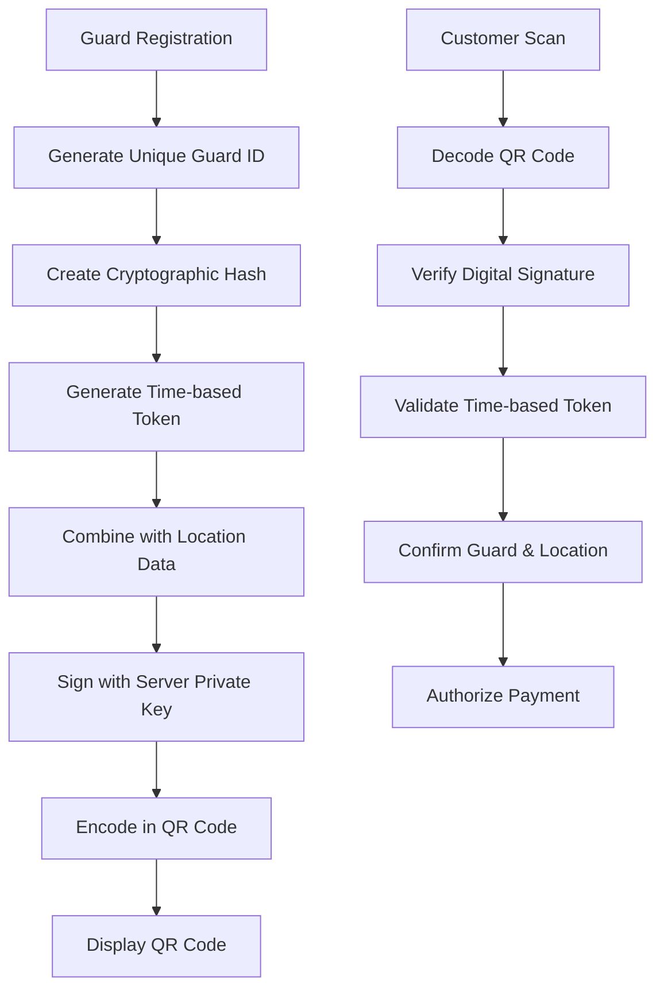
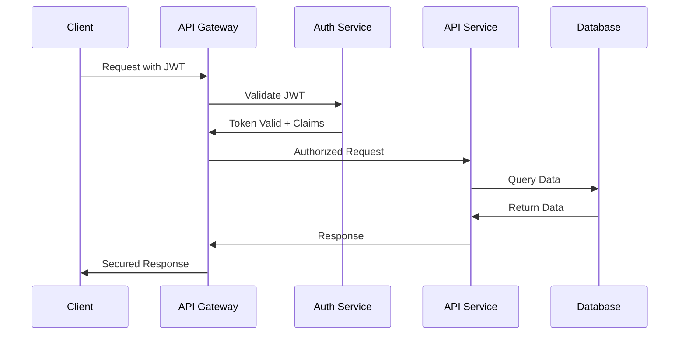

# Security Standards and Compliance

## Introduction

This document establishes comprehensive security standards, requirements, and compliance frameworks for the NogadaCarGuard application. As a financial application handling real monetary transactions, strict security standards are essential to protect users, maintain regulatory compliance, and ensure business viability.

## Regulatory Compliance Framework

### Payment Card Industry (PCI DSS) Compliance

**Applicability**: Mandatory for all payment processing components

#### PCI DSS Requirements Implementation

**Requirement 1 & 2: Network Security**
- Implement firewall configuration standards
- Remove default passwords and security parameters
- Network segmentation for payment processing components

**Requirement 3 & 4: Data Protection**
- Protect stored cardholder data with AES-256 encryption
- Encrypt transmission of cardholder data with TLS 1.3
- Key management procedures and secure key storage

**Requirement 5 & 6: Vulnerability Management**
- Deploy anti-malware software on all systems
- Develop and maintain secure systems and applications
- Regular security testing and code reviews

**Requirement 7 & 8: Access Control**
- Restrict access by business need-to-know
- Identify and authenticate access to system components
- Multi-factor authentication for all administrative access

**Requirement 9 & 10: Physical Security & Monitoring**
- Restrict physical access to cardholder data
- Track and monitor all access to network resources
- Comprehensive audit logging and log management

**Requirement 11 & 12: Testing & Policies**
- Regular security testing including penetration tests
- Maintain information security policy and procedures

### South African Regulatory Compliance

#### Protection of Personal Information Act (POPI)

**Data Processing Principles**:
- **Accountability**: Implement privacy-by-design
- **Processing Limitation**: Collect only necessary data
- **Purpose Specification**: Clear data usage purposes
- **Further Processing**: Compatible secondary uses only
- **Information Quality**: Accurate and up-to-date data
- **Openness**: Transparent data processing practices
- **Security Safeguards**: Appropriate technical and organizational measures
- **Data Subject Rights**: Access, correction, deletion rights

**Implementation Requirements**:
- Privacy policy and consent mechanisms
- Data retention and deletion procedures
- Data breach notification procedures (within 72 hours)
- Data Protection Impact Assessments (DPIAs)
- Data Processing Register maintenance

#### Financial Intelligence Centre Act (FICA)

**Customer Due Diligence (CDD)**:
- Customer identification and verification
- Beneficial ownership identification
- Risk assessment and ongoing monitoring
- Record keeping requirements (5 years minimum)

**Suspicious Transaction Reporting**:
- Automated suspicious activity detection
- Manual reporting procedures
- Staff training on money laundering indicators
- Compliance officer designation

### International Security Standards

#### ISO 27001 Information Security Management

**Security Control Domains**:
- **A.5**: Information Security Policies
- **A.6**: Organization of Information Security  
- **A.7**: Human Resource Security
- **A.8**: Asset Management
- **A.9**: Access Control
- **A.10**: Cryptography
- **A.11**: Physical and Environmental Security
- **A.12**: Operations Security
- **A.13**: Communications Security
- **A.14**: System Acquisition, Development and Maintenance
- **A.15**: Supplier Relationships
- **A.16**: Information Security Incident Management
- **A.17**: Information Security Aspects of Business Continuity
- **A.18**: Compliance

## Application Security Standards

### Authentication Requirements

#### Multi-Factor Authentication (MFA)
- **Admin Portal**: Mandatory MFA for all users
- **Customer Portal**: MFA required for high-value transactions
- **Car Guard Portal**: Biometric authentication preferred

#### Password Policy
- Minimum 12 characters length
- Complex password requirements (uppercase, lowercase, numbers, special characters)
- Password history (last 12 passwords)
- Regular password rotation (90 days for admin, 180 days for users)
- Account lockout after 3 failed attempts

#### Session Management
- Secure session token generation (cryptographically random)
- Session timeout: 15 minutes idle, 8 hours absolute
- Concurrent session limits per user
- Secure session storage and transmission

### Authorization Standards

#### Role-Based Access Control (RBAC)

**Admin Portal Roles**:
- **Super Admin**: Full system access, user management
- **System Admin**: System configuration, no user management  
- **Manager Admin**: Location and guard management
- **Finance Admin**: Payment and payout processing
- **Audit Admin**: Read-only access for compliance monitoring

**Permission Granularity**:
- Create, Read, Update, Delete (CRUD) permissions per resource
- Field-level access controls for sensitive data
- Time-based access restrictions
- IP-based access restrictions for admin roles

### Data Protection Standards

#### Encryption Requirements

**Data at Rest**:
- **Database**: AES-256 encryption for all tables
- **File Storage**: AES-256 encryption for all stored files
- **Configuration**: Encrypted configuration files
- **Logs**: Encrypted audit and application logs

**Data in Transit**:
- **Web Traffic**: TLS 1.3 minimum for all communications
- **API Communications**: Mutual TLS (mTLS) for service-to-service
- **Mobile Apps**: Certificate pinning implementation
- **Database Connections**: Encrypted database connections

#### Data Classification

**Public Data**: Marketing materials, public documentation
**Internal Data**: Business processes, employee information  
**Confidential Data**: Customer information, financial data
**Restricted Data**: Payment card data, authentication credentials

**Handling Requirements by Classification**:
- Public: No special handling required
- Internal: Access control and audit logging
- Confidential: Encryption, strict access control, audit logging
- Restricted: Full PCI DSS controls, encryption, tokenization

### Application Security Requirements

#### Input Validation and Sanitization
- Server-side validation for all inputs
- Parameterized queries to prevent SQL injection
- HTML encoding for output to prevent XSS
- File upload restrictions and scanning
- Input length and format validation

#### Error Handling and Logging
- Generic error messages to users
- Detailed error logging for developers
- No sensitive information in error responses
- Centralized logging infrastructure
- Log integrity protection

#### Security Headers
```
Strict-Transport-Security: max-age=31536000; includeSubDomains
Content-Security-Policy: default-src 'self'; script-src 'self' 'unsafe-inline'
X-Frame-Options: DENY
X-Content-Type-Options: nosniff
Referrer-Policy: strict-origin-when-cross-origin
Permissions-Policy: geolocation=(), microphone=(), camera=()
```

## Mobile Application Security Standards

### React Native / Progressive Web App Security

#### Client-Side Security
- **Code Obfuscation**: JavaScript code minification and obfuscation
- **Anti-Tampering**: Runtime application self-protection (RASP)
- **Certificate Pinning**: SSL certificate validation
- **Root/Jailbreak Detection**: Device integrity verification

#### Data Storage Security
- **Sensitive Data**: Use secure keychain/keystore
- **Local Storage**: Encrypt all local application data
- **Cache Security**: Automatic cache clearing on app backgrounding
- **Database**: SQLCipher for local database encryption

### QR Code Security Standards

#### QR Code Generation Security


#### QR Code Security Controls
- **Digital Signatures**: ECDSA signing of QR content
- **Time-based Validity**: 5-minute QR code expiration
- **Location Verification**: GPS-based location validation
- **Tamper Detection**: Cryptographic integrity checks
- **Replay Protection**: Nonce-based replay prevention

## API Security Standards

### RESTful API Security

#### Authentication and Authorization


#### API Security Controls
- **OAuth 2.0**: Token-based authentication
- **Rate Limiting**: 100 requests per minute per user
- **Input Validation**: Schema-based request validation  
- **Output Encoding**: JSON encoding to prevent injection
- **CORS Policy**: Strict origin validation
- **API Versioning**: Backward compatibility and deprecation

### GraphQL Security (Future Implementation)
- **Query Depth Limiting**: Maximum 10 levels deep
- **Query Complexity Analysis**: Computational cost limits
- **Introspection Disabled**: Production introspection disabled
- **Field-Level Authorization**: Granular permission checks

## Infrastructure Security Standards

### Cloud Security Requirements

#### AWS/Azure Security Controls
- **Identity and Access Management**: Least privilege access
- **Network Security**: VPC/VNet isolation and security groups
- **Encryption**: All services use encryption at rest and in transit
- **Monitoring**: CloudTrail/Activity logging enabled
- **Backup**: Encrypted backup with 30-day retention

#### Container Security (Docker/Kubernetes)
- **Base Images**: Minimal, security-hardened base images
- **Image Scanning**: Vulnerability scanning in CI/CD pipeline
- **Runtime Security**: Container runtime monitoring
- **Network Policies**: Kubernetes network policy enforcement
- **Secrets Management**: Kubernetes secrets or external vault

### Database Security

#### PostgreSQL/MySQL Security
- **Authentication**: Strong password policy, certificate-based auth
- **Authorization**: Database-level role-based access control
- **Encryption**: Transparent data encryption (TDE)
- **Auditing**: Database activity monitoring and logging
- **Backup Security**: Encrypted backup storage

#### NoSQL Security (if applicable)
- **Access Control**: Database-specific authentication mechanisms
- **Encryption**: Collection-level encryption
- **Network Security**: Database firewall rules
- **Monitoring**: Query performance and security monitoring

## Development Security Standards

### Secure Development Lifecycle (SDLC)

#### Security Gates
1. **Requirements Phase**: Threat modeling and security requirements
2. **Design Phase**: Security architecture review
3. **Development Phase**: Secure coding guidelines and reviews
4. **Testing Phase**: Security testing (SAST, DAST, IAST)
5. **Deployment Phase**: Security configuration validation
6. **Maintenance Phase**: Ongoing security monitoring

#### Code Security Requirements
```typescript
// Example secure coding patterns for TypeScript/React

// 1. Input Validation
interface PaymentRequest {
  guardId: string;
  amount: number;
  customerId: string;
}

const validatePaymentRequest = (data: unknown): PaymentRequest => {
  const schema = z.object({
    guardId: z.string().uuid(),
    amount: z.number().min(0.01).max(1000),
    customerId: z.string().uuid()
  });
  
  return schema.parse(data); // Throws if invalid
};

// 2. Secure API Calls
const secureApiCall = async (endpoint: string, data: any) => {
  const token = await getSecureToken();
  
  return fetch(endpoint, {
    method: 'POST',
    headers: {
      'Authorization': `Bearer ${token}`,
      'Content-Type': 'application/json',
      'X-Requested-With': 'XMLHttpRequest' // CSRF protection
    },
    body: JSON.stringify(data)
  });
};

// 3. Secure Local Storage
const secureStorage = {
  setItem: (key: string, value: any) => {
    const encrypted = CryptoJS.AES.encrypt(
      JSON.stringify(value), 
      getStorageKey()
    ).toString();
    localStorage.setItem(key, encrypted);
  },
  
  getItem: (key: string) => {
    const encrypted = localStorage.getItem(key);
    if (!encrypted) return null;
    
    const decrypted = CryptoJS.AES.decrypt(encrypted, getStorageKey());
    return JSON.parse(decrypted.toString(CryptoJS.enc.Utf8));
  }
};
```

### Security Testing Standards

#### Static Application Security Testing (SAST)
- **Tools**: ESLint security rules, SonarQube, CodeQL
- **Coverage**: 100% code coverage for security rules
- **Integration**: Automated in CI/CD pipeline
- **Reporting**: Security findings tracked in JIRA

#### Dynamic Application Security Testing (DAST)
- **Tools**: OWASP ZAP, Burp Suite Professional
- **Frequency**: Weekly automated scans
- **Scope**: All application endpoints and user flows
- **Validation**: Manual validation of high-priority findings

#### Interactive Application Security Testing (IAST)
- **Runtime Monitoring**: Application behavior during testing
- **Coverage**: Security testing during functional testing
- **Real-time Feedback**: Immediate security feedback to developers

## Compliance Monitoring and Reporting

### Security Metrics

#### Key Performance Indicators (KPIs)
- **Mean Time to Detect (MTTD)**: Target <15 minutes
- **Mean Time to Respond (MTTR)**: Target <1 hour for critical
- **Vulnerability Remediation Time**: Target <7 days for high/critical
- **Security Test Coverage**: Target >90% code coverage
- **Compliance Score**: Target 100% for all applicable frameworks

#### Compliance Reporting
- **Monthly**: Security metrics dashboard
- **Quarterly**: Compliance assessment reports  
- **Annually**: External security audits and penetration testing
- **Ad-hoc**: Incident response and breach notifications

### Audit and Certification

#### External Audits
- **PCI DSS**: Annual assessment by Qualified Security Assessor (QSA)
- **ISO 27001**: Annual surveillance audit by certified body
- **SOC 2**: Annual audit for service organization controls
- **Penetration Testing**: Quarterly testing by certified ethical hackers

#### Internal Audits
- **Monthly**: Security control effectiveness reviews
- **Quarterly**: Policy compliance assessments
- **Semi-annual**: Risk assessment updates
- **Annual**: Comprehensive security program review

---

## Document Information

| Field | Value |
|-------|--------|
| **Document Type** | Security Standards |
| **Version** | 1.0.0 |
| **Last Updated** | 2025-01-25 |
| **Review Cycle** | Quarterly |
| **Stakeholder Relevance** | Development Team, DevOps Team, QA Team, Business Team, Compliance Team |
| **Compliance Requirements** | PCI DSS Level 1, POPI Act, FICA, ISO 27001, SOC 2 |
| **Related Documents** | vulnerability-management.md, access-control.md, security architecture documents |