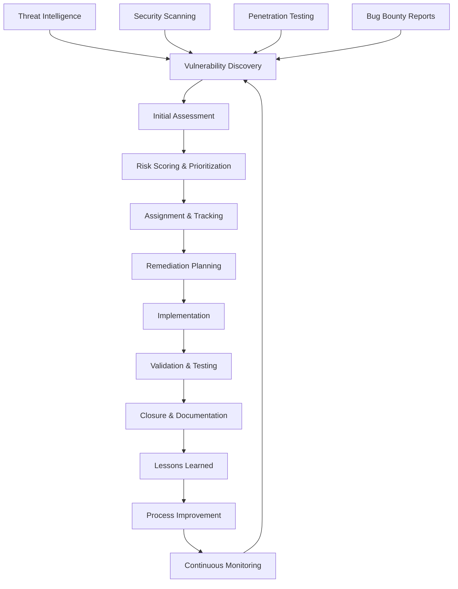
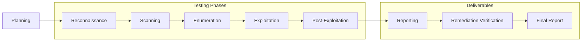
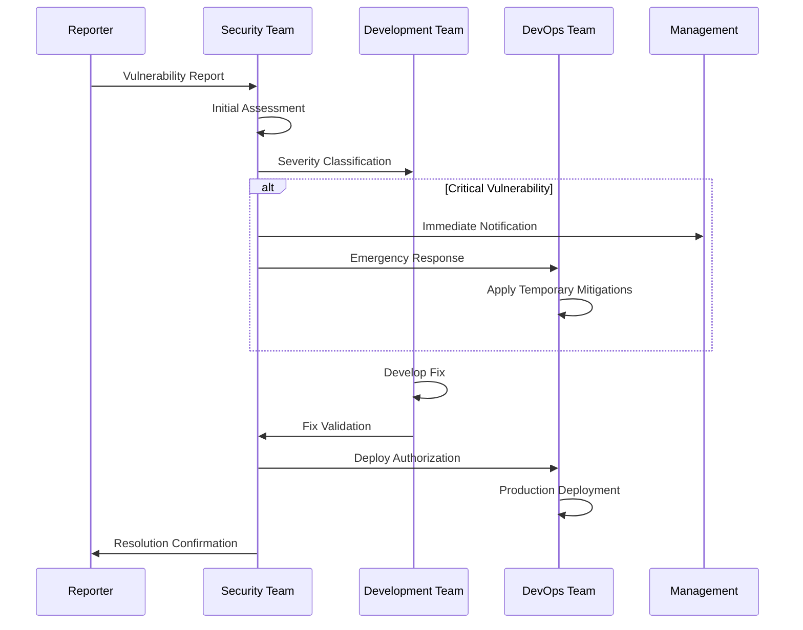

# Vulnerability Management

## Introduction

This document establishes comprehensive vulnerability management procedures for the NogadaCarGuard application. Given the financial nature of the application and its multi-portal architecture, systematic vulnerability identification, assessment, and remediation are critical for maintaining security posture and regulatory compliance.

## Vulnerability Management Framework

### Vulnerability Lifecycle Management



### Vulnerability Sources

#### Automated Security Scanning
- **Static Application Security Testing (SAST)**: Source code analysis
- **Dynamic Application Security Testing (DAST)**: Runtime vulnerability detection
- **Interactive Application Security Testing (IAST)**: Real-time analysis during testing
- **Software Composition Analysis (SCA)**: Third-party dependency scanning
- **Infrastructure Scanning**: Network and system vulnerability assessment

#### Manual Security Assessment
- **Code Review**: Manual secure code review processes
- **Architecture Review**: Security architecture assessments
- **Configuration Review**: Security configuration validation
- **Penetration Testing**: Simulated attack scenarios

#### External Sources
- **Bug Bounty Programs**: Responsible disclosure from security researchers
- **Threat Intelligence**: Industry threat feeds and advisories
- **Vendor Notifications**: Security bulletins from technology vendors
- **Security Research**: Published vulnerabilities and proof-of-concepts

## Risk Assessment and Prioritization

### Vulnerability Severity Classification

#### Critical Vulnerabilities (CVSS 9.0-10.0)
- **Definition**: Vulnerabilities allowing immediate system compromise
- **Response Time**: 24 hours for assessment, 72 hours for remediation
- **Examples**: 
  - Remote code execution vulnerabilities
  - Authentication bypass allowing admin access
  - Payment data exposure vulnerabilities
  - SQL injection in payment processing

#### High Vulnerabilities (CVSS 7.0-8.9)
- **Definition**: Significant security impact with moderate complexity
- **Response Time**: 48 hours for assessment, 7 days for remediation  
- **Examples**:
  - Privilege escalation vulnerabilities
  - Cross-site scripting (XSS) in sensitive contexts
  - Insecure direct object references
  - Sensitive data exposure

#### Medium Vulnerabilities (CVSS 4.0-6.9)
- **Definition**: Moderate security impact requiring specific conditions
- **Response Time**: 7 days for assessment, 30 days for remediation
- **Examples**:
  - Information disclosure vulnerabilities
  - Cross-site request forgery (CSRF)
  - Session management weaknesses
  - Input validation issues

#### Low Vulnerabilities (CVSS 0.1-3.9)
- **Definition**: Limited security impact with high complexity requirements
- **Response Time**: 14 days for assessment, 90 days for remediation
- **Examples**:
  - Security misconfigurations
  - Weak cryptographic algorithms
  - Information leakage in error messages
  - Missing security headers

### Business Impact Assessment

#### Financial Impact Categories
- **Direct Financial Loss**: Potential monetary loss from exploitation
- **Regulatory Penalties**: Fines from compliance violations
- **Business Disruption**: Impact on business operations
- **Reputation Damage**: Brand and customer trust impact

#### Contextual Risk Factors
- **Asset Criticality**: Importance of affected systems
- **Threat Landscape**: Active exploitation in the wild
- **Compensating Controls**: Existing mitigations
- **Attack Complexity**: Skill level required for exploitation

### Prioritization Matrix

| Severity | Financial Systems | Admin Portal | Customer Portal | Car Guard App | Infrastructure |
|----------|------------------|--------------|-----------------|---------------|---------------|
| Critical | P0 (24h) | P0 (24h) | P0 (24h) | P1 (48h) | P0 (24h) |
| High | P1 (48h) | P1 (48h) | P1 (48h) | P2 (7d) | P1 (48h) |
| Medium | P2 (7d) | P2 (7d) | P2 (7d) | P3 (30d) | P2 (7d) |
| Low | P3 (30d) | P3 (30d) | P3 (30d) | P4 (90d) | P3 (30d) |

## Security Testing Methodologies

### Static Application Security Testing (SAST)

#### Implementation for React/TypeScript Applications

**Tools Configuration**:
```yaml
# .github/workflows/security-sast.yml
name: SAST Security Scan
on:
  push:
    branches: [main, develop]
  pull_request:
    branches: [main]

jobs:
  sast:
    runs-on: ubuntu-latest
    steps:
      - uses: actions/checkout@v3
      
      - name: Setup Node.js
        uses: actions/setup-node@v3
        with:
          node-version: '18'
          
      - name: Install Dependencies
        run: npm ci
        
      - name: ESLint Security Scan
        run: |
          npm run lint:security
          
      - name: SonarQube Analysis
        uses: sonarqube-quality-gate-action@master
        env:
          SONAR_TOKEN: ${{ secrets.SONAR_TOKEN }}
          
      - name: CodeQL Analysis
        uses: github/codeql-action/analyze@v2
        with:
          languages: typescript, javascript
```

**Security-focused ESLint Configuration**:
```json
{
  "extends": [
    "@eslint/js/recommended",
    "@typescript-eslint/recommended",
    "plugin:security/recommended"
  ],
  "plugins": ["security", "no-secrets"],
  "rules": {
    "security/detect-object-injection": "error",
    "security/detect-non-literal-regexp": "error",
    "security/detect-unsafe-regex": "error",
    "security/detect-buffer-noassert": "error",
    "security/detect-child-process": "error",
    "security/detect-disable-mustache-escape": "error",
    "security/detect-eval-with-expression": "error",
    "security/detect-no-csrf-before-method-override": "error",
    "security/detect-non-literal-fs-filename": "error",
    "security/detect-non-literal-require": "error",
    "security/detect-possible-timing-attacks": "error",
    "security/detect-pseudoRandomBytes": "error",
    "no-secrets/no-secrets": "error"
  }
}
```

#### SAST Scanning Scope
- **Source Code**: All TypeScript/JavaScript files
- **Configuration Files**: Package.json, environment configs
- **Infrastructure**: Docker files, deployment scripts
- **Documentation**: Inline comments and documentation

### Dynamic Application Security Testing (DAST)

#### OWASP ZAP Integration

**Automated DAST Pipeline**:
```yaml
# .github/workflows/security-dast.yml
name: DAST Security Scan
on:
  schedule:
    - cron: '0 2 * * 1' # Weekly Monday 2 AM
  workflow_dispatch:

jobs:
  dast:
    runs-on: ubuntu-latest
    steps:
      - name: ZAP Baseline Scan
        uses: zaproxy/action-baseline@v0.7.0
        with:
          target: 'https://nogada-staging.example.com'
          
      - name: ZAP Full Scan
        uses: zaproxy/action-full-scan@v0.4.0
        with:
          target: 'https://nogada-staging.example.com'
          
      - name: Upload Results
        uses: actions/upload-artifact@v3
        with:
          name: zap-reports
          path: report_html.html
```

#### DAST Testing Scenarios
- **Authentication Testing**: Login bypass, session management
- **Authorization Testing**: Privilege escalation, access controls
- **Input Validation**: SQL injection, XSS, command injection
- **Business Logic**: Payment flow manipulation, race conditions
- **API Security**: REST API endpoint testing

### Interactive Application Security Testing (IAST)

#### Runtime Security Monitoring

**IAST Integration Example**:
```typescript
// middleware/security-monitor.ts
import { SecurityAgent } from '@security/iast-agent';

export const securityMonitor = (req: Request, res: Response, next: NextFunction) => {
  SecurityAgent.startRequest(req);
  
  res.on('finish', () => {
    SecurityAgent.endRequest(req, res);
  });
  
  next();
};

// Usage in Express app
app.use(securityMonitor);
```

#### IAST Monitoring Capabilities
- **SQL Injection Detection**: Database query analysis
- **XSS Detection**: Output encoding validation
- **Path Traversal**: File access monitoring
- **Command Injection**: System command monitoring
- **Cryptographic Weakness**: Crypto usage analysis

### Software Composition Analysis (SCA)

#### Dependency Vulnerability Scanning

**NPM Audit Integration**:
```json
{
  "scripts": {
    "security:audit": "npm audit --audit-level high",
    "security:fix": "npm audit fix",
    "security:dependencies": "npm-check-updates --doctor",
    "security:snyk": "snyk test",
    "security:retire": "retire --js --exitwith 0"
  }
}
```

**Snyk Integration**:
```yaml
# .github/workflows/security-sca.yml
name: SCA Vulnerability Scan
on: [push, pull_request]

jobs:
  snyk:
    runs-on: ubuntu-latest
    steps:
      - uses: actions/checkout@v3
      - uses: snyk/actions/setup@master
      - uses: snyk/actions/node@master
        env:
          SNYK_TOKEN: ${{ secrets.SNYK_TOKEN }}
        with:
          args: --severity-threshold=high
```

#### SCA Scanning Coverage
- **Direct Dependencies**: NPM packages in package.json
- **Transitive Dependencies**: Dependencies of dependencies
- **License Compliance**: Open source license validation
- **Vulnerability Database**: CVE and proprietary vulnerability data

## Penetration Testing Program

### Testing Methodology

#### OWASP Testing Guide Compliance

**Information Gathering (Phase 1)**:
- Conduct reconnaissance of NogadaCarGuard infrastructure
- Identify attack surface across all three portals
- Map application architecture and data flows
- Enumerate technologies and versions

**Configuration and Deployment Management Testing (Phase 2)**:
- Review network and application configurations
- Test SSL/TLS implementation and certificate management
- Validate security headers and Content Security Policy
- Assess file extension handling and backup files

**Identity Management Testing (Phase 3)**:
- Test user registration and account provisioning
- Validate account lockout and password policy
- Assess remember password functionality
- Test logout and session termination

**Authentication Testing (Phase 4)**:
- Test credentials transport over encrypted channels
- Assess default credentials and dictionary attacks
- Test authentication bypass techniques
- Validate multi-factor authentication implementation

**Authorization Testing (Phase 5)**:
- Test directory traversal and file inclusion
- Assess privilege escalation vulnerabilities
- Validate authorization bypass methods
- Test insecure direct object references

**Session Management Testing (Phase 6)**:
- Test session token strength and randomness
- Assess session fixation vulnerabilities
- Test exposed session variables and CSRF protection
- Validate session timeout and logout functionality

**Input Validation Testing (Phase 7)**:
- Test for SQL, LDAP, and XML injection
- Assess cross-site scripting vulnerabilities
- Test HTTP verb tampering and parameter pollution
- Validate file upload functionality

**Error Handling (Phase 8)**:
- Test error code analysis and stack trace exposure
- Assess information leakage in error messages

**Weak Cryptography (Phase 9)**:
- Test SSL/TLS implementation and cipher suites
- Assess sensitive information encryption
- Test cryptographic implementation weaknesses

**Business Logic Testing (Phase 10)**:
- Test business logic bypass scenarios
- Assess payment flow manipulation
- Test for race conditions in financial transactions
- Validate business rule enforcement

**Client Side Testing (Phase 11)**:
- Test DOM-based cross-site scripting
- Assess client-side URL redirect vulnerabilities
- Test CSS injection and clickjacking
- Validate HTML5 security implementation

### Penetration Testing Schedule

#### Frequency Requirements
- **Quarterly**: Internal penetration testing
- **Annually**: External penetration testing by certified firm
- **Pre-Production**: Testing before major releases
- **Ad-hoc**: After significant security incidents

#### Testing Scope by Portal

**Car Guard Portal**:
- Mobile application security testing
- QR code generation and validation
- Payment processing integration
- Offline data synchronization

**Customer Portal**:
- Web application security testing  
- Payment method management
- Account registration and management
- Transaction history access

**Admin Portal**:
- Privileged access testing
- Administrative function security
- System configuration access
- Audit log manipulation

### Penetration Testing Reporting

#### Executive Summary Requirements
- Risk rating and business impact
- Critical findings and recommendations
- Compliance implications
- Remediation timeline and priorities

#### Technical Report Requirements
- Detailed vulnerability descriptions
- Proof-of-concept exploits
- Risk assessment methodology
- Step-by-step remediation guidance



## Bug Bounty Program

### Program Structure

#### Scope Definition
- **In Scope**: Production applications, staging environments
- **Out of Scope**: Development environments, third-party services
- **Asset List**: Defined domains and IP ranges
- **Testing Guidelines**: Responsible disclosure requirements

#### Reward Structure

| Severity | Financial Systems | Web Applications | Mobile Apps | API Endpoints |
|----------|------------------|------------------|-------------|---------------|
| Critical | R50,000 | R25,000 | R20,000 | R15,000 |
| High | R20,000 | R10,000 | R8,000 | R6,000 |
| Medium | R5,000 | R2,500 | R2,000 | R1,500 |
| Low | R1,000 | R500 | R400 | R300 |

#### Participation Requirements
- **Eligibility**: Security researchers with proven track record
- **Testing Rules**: No social engineering, no DoS attacks
- **Reporting Format**: Standardized vulnerability reports
- **Communication**: Dedicated security email and portal

### Responsible Disclosure Policy

#### Reporting Timeline
1. **Initial Report**: Researcher submits vulnerability
2. **Acknowledgment**: 48-hour response from security team
3. **Assessment**: 5-day initial assessment and triage
4. **Remediation**: Fixes implemented per severity SLA
5. **Verification**: Researcher validates fix effectiveness
6. **Disclosure**: Public disclosure after 90-day coordinated period

#### Communication Guidelines
- **Security Email**: security@nogada.co.za
- **PGP Encryption**: Public key provided for sensitive reports
- **Status Updates**: Regular updates on remediation progress
- **Recognition**: Hall of fame for responsible researchers

## Incident Response for Vulnerabilities

### Security Incident Classification

#### Vulnerability-Related Incidents
- **Zero-Day Exploit**: Previously unknown vulnerability exploitation
- **Data Breach**: Confirmed unauthorized data access
- **System Compromise**: Confirmed system takeover
- **Service Disruption**: Security-related service outages

### Incident Response Workflow



#### Response Team Roles
- **Incident Commander**: Overall incident coordination
- **Security Analyst**: Vulnerability analysis and validation
- **Development Lead**: Fix development and testing
- **DevOps Engineer**: Deployment and infrastructure changes
- **Communications Lead**: Stakeholder communication

### Vulnerability Remediation Tracking

#### Tracking Metrics
- **Discovery to Assessment**: Time from report to initial triage
- **Assessment to Fix**: Time from triage to remediation plan  
- **Fix to Deployment**: Time from fix completion to production
- **Total Remediation Time**: End-to-end vulnerability lifecycle

#### Remediation Quality Metrics
- **Fix Effectiveness**: Successful vulnerability closure rate
- **Regression Rate**: Percentage of vulnerabilities that reoccur
- **Test Coverage**: Security test cases added per vulnerability
- **Documentation**: Knowledge base articles created

## Security Monitoring and Alerting

### Real-time Vulnerability Monitoring

#### Automated Monitoring Systems
- **Continuous SAST**: Code changes trigger security scans
- **Runtime Protection**: IAST monitoring in production
- **Dependency Monitoring**: Real-time vulnerable dependency alerts
- **Threat Intelligence**: Automated threat feed integration

#### Alerting Thresholds
- **Critical Vulnerabilities**: Immediate PagerDuty alert
- **High Vulnerabilities**: Email alert within 1 hour
- **Medium Vulnerabilities**: Daily digest report
- **Low Vulnerabilities**: Weekly summary report

### Security Metrics Dashboard

#### Key Performance Indicators
```typescript
interface SecurityMetrics {
  vulnerabilityMetrics: {
    totalOpenVulnerabilities: number;
    criticalVulnerabilities: number;
    highVulnerabilities: number;
    averageRemediationTime: number;
    vulnerabilitiesBySource: VulnerabilitySource[];
  };
  
  testingMetrics: {
    sastCoverage: number;
    dastCoverage: number;
    testFrequency: TestFrequency;
    falsePositiveRate: number;
  };
  
  complianceMetrics: {
    pciComplianceScore: number;
    iso27001ComplianceScore: number;
    auditFindings: AuditFinding[];
  };
}
```

#### Reporting and Analytics
- **Executive Dashboard**: High-level security posture metrics
- **Technical Dashboard**: Detailed vulnerability analytics
- **Trend Analysis**: Historical vulnerability patterns
- **Benchmark Comparison**: Industry standard comparisons

---

## Document Information

| Field | Value |
|-------|--------|
| **Document Type** | Vulnerability Management |
| **Version** | 1.0.0 |
| **Last Updated** | 2025-01-25 |
| **Review Cycle** | Quarterly |
| **Stakeholder Relevance** | Security Team, Development Team, DevOps Team, QA Team, Executive Team |
| **Compliance Requirements** | PCI DSS Requirement 11, ISO 27001 A.12.6, SOC 2 CC7.1 |
| **Related Documents** | security-standards.md, access-control.md, incident-response.md |