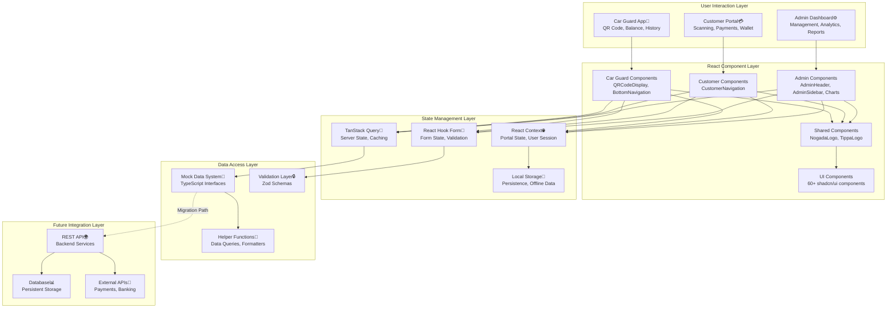
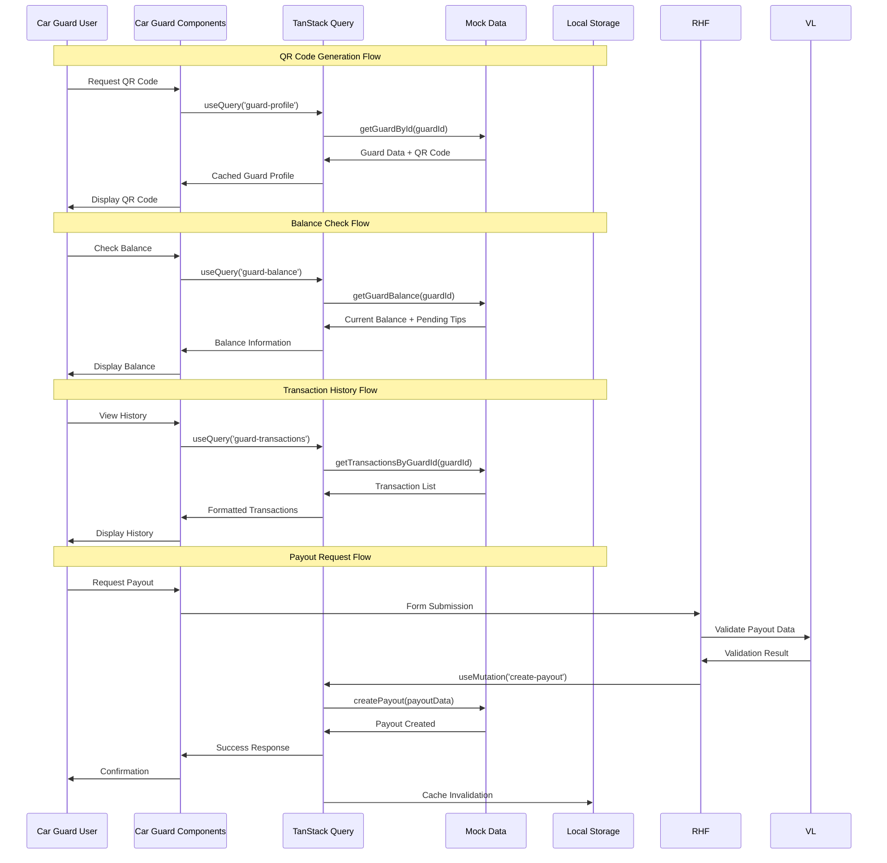
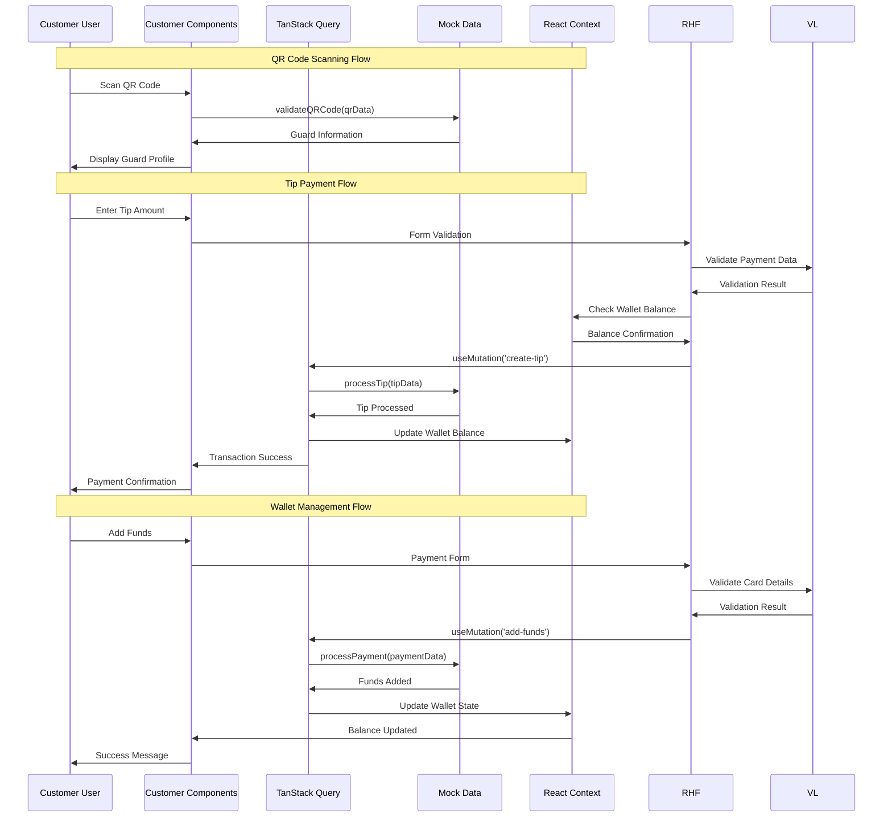
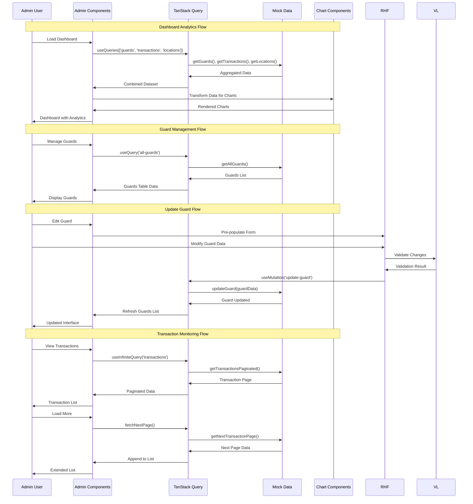

# Data Flow Architecture

> **Stakeholder Relevance**: [Developers, Architects, Technical Leads]

Comprehensive documentation of data flow patterns, state management, and information processing across the NogadaCarGuard multi-portal application.

## Table of Contents
- [Data Flow Overview](#data-flow-overview)
- [Portal Data Flows](#portal-data-flows)
- [State Management Patterns](#state-management-patterns)
- [Mock Data Architecture](#mock-data-architecture)
- [Future API Integration](#future-api-integration)
- [Caching Strategies](#caching-strategies)
- [Error Handling](#error-handling)
- [Performance Optimization](#performance-optimization)

## Data Flow Overview

The NogadaCarGuard application implements a multi-layered data flow architecture that supports three distinct portals while maintaining data consistency and optimal performance.



## Portal Data Flows

### Car Guard App Data Flow

The car guard application focuses on tip collection, balance management, and payout processing.



### Customer Portal Data Flow

The customer portal manages QR code scanning, tip payments, and transaction history.



### Admin Dashboard Data Flow

The admin dashboard aggregates data from multiple sources for management and analytics.



## State Management Patterns

### TanStack Query Pattern

Server state management using TanStack Query for caching, synchronization, and background updates.

```typescript
// Query Key Factory Pattern
const guardKeys = {
  all: ['guards'] as const,
  lists: () => [...guardKeys.all, 'list'] as const,
  list: (filters: GuardFilters) => [...guardKeys.lists(), { filters }] as const,
  details: () => [...guardKeys.all, 'detail'] as const,
  detail: (id: string) => [...guardKeys.details(), id] as const,
  balance: (id: string) => [...guardKeys.detail(id), 'balance'] as const,
  transactions: (id: string) => [...guardKeys.detail(id), 'transactions'] as const,
}

// Query Hook Implementation
export function useGuardProfile(guardId: string) {
  return useQuery({
    queryKey: guardKeys.detail(guardId),
    queryFn: () => getGuardById(guardId),
    staleTime: 5 * 60 * 1000, // 5 minutes
    cacheTime: 30 * 60 * 1000, // 30 minutes
  })
}

// Mutation with Optimistic Updates
export function useUpdateGuardBalance() {
  const queryClient = useQueryClient()
  
  return useMutation({
    mutationFn: updateGuardBalance,
    onMutate: async (variables) => {
      // Cancel outgoing refetches
      await queryClient.cancelQueries({ queryKey: guardKeys.detail(variables.guardId) })
      
      // Snapshot previous value
      const previousGuard = queryClient.getQueryData(guardKeys.detail(variables.guardId))
      
      // Optimistically update
      queryClient.setQueryData(guardKeys.detail(variables.guardId), (old: any) => ({
        ...old,
        balance: old.balance + variables.amount,
      }))
      
      return { previousGuard }
    },
    onError: (err, variables, context) => {
      // Rollback on error
      if (context?.previousGuard) {
        queryClient.setQueryData(guardKeys.detail(variables.guardId), context.previousGuard)
      }
    },
    onSettled: (data, error, variables) => {
      // Always refetch after error or success
      queryClient.invalidateQueries({ queryKey: guardKeys.detail(variables.guardId) })
    },
  })
}
```

### React Hook Form Pattern

Form state management with validation and error handling.

```typescript
// Form Schema Definition
const tipFormSchema = z.object({
  guardId: z.string().min(1, 'Guard ID is required'),
  amount: z.number().min(1, 'Minimum tip is R1').max(1000, 'Maximum tip is R1000'),
  paymentMethod: z.enum(['wallet', 'card', 'cash']),
  message: z.string().optional(),
})

type TipFormData = z.infer<typeof tipFormSchema>

// Form Hook Implementation
export function useTipForm(onSubmit: (data: TipFormData) => void) {
  const form = useForm<TipFormData>({
    resolver: zodResolver(tipFormSchema),
    defaultValues: {
      amount: 0,
      paymentMethod: 'wallet',
      message: '',
    },
    mode: 'onChange', // Validate on change for better UX
  })
  
  const handleSubmit = form.handleSubmit((data) => {
    // Pre-submission validation
    const validatedData = tipFormSchema.parse(data)
    onSubmit(validatedData)
  })
  
  return {
    form,
    handleSubmit,
    isValid: form.formState.isValid,
    errors: form.formState.errors,
    isSubmitting: form.formState.isSubmitting,
  }
}
```

### React Context Pattern

Portal-specific global state management.

```typescript
// Portal Context Definition
interface CarGuardContextType {
  currentGuard: CarGuard | null
  isOnline: boolean
  qrCodeData: string | null
  pendingTransactions: Transaction[]
  actions: {
    setCurrentGuard: (guard: CarGuard) => void
    generateQRCode: () => void
    addPendingTransaction: (transaction: Transaction) => void
    syncPendingTransactions: () => Promise<void>
  }
}

const CarGuardContext = createContext<CarGuardContextType | undefined>(undefined)

// Context Provider Implementation
export function CarGuardProvider({ children }: { children: React.ReactNode }) {
  const [currentGuard, setCurrentGuard] = useState<CarGuard | null>(null)
  const [isOnline, setIsOnline] = useState(navigator.onLine)
  const [qrCodeData, setQrCodeData] = useState<string | null>(null)
  const [pendingTransactions, setPendingTransactions] = useState<Transaction[]>([])
  
  // Online/Offline detection
  useEffect(() => {
    const handleOnline = () => setIsOnline(true)
    const handleOffline = () => setIsOnline(false)
    
    window.addEventListener('online', handleOnline)
    window.addEventListener('offline', handleOffline)
    
    return () => {
      window.removeEventListener('online', handleOnline)
      window.removeEventListener('offline', handleOffline)
    }
  }, [])
  
  // Auto-sync when coming back online
  useEffect(() => {
    if (isOnline && pendingTransactions.length > 0) {
      syncPendingTransactions()
    }
  }, [isOnline, pendingTransactions.length])
  
  const generateQRCode = useCallback(() => {
    if (currentGuard) {
      const qrData = `nogada://tip/${currentGuard.id}?v=${Date.now()}`
      setQrCodeData(qrData)
    }
  }, [currentGuard])
  
  const addPendingTransaction = useCallback((transaction: Transaction) => {
    setPendingTransactions(prev => [...prev, transaction])
    // Store in localStorage for persistence
    const stored = localStorage.getItem('pendingTransactions') || '[]'
    const transactions = JSON.parse(stored)
    transactions.push(transaction)
    localStorage.setItem('pendingTransactions', JSON.stringify(transactions))
  }, [])
  
  const syncPendingTransactions = useCallback(async () => {
    // Sync logic will be implemented with real API
    console.log('Syncing pending transactions:', pendingTransactions)
    // Clear pending after successful sync
    setPendingTransactions([])
    localStorage.removeItem('pendingTransactions')
  }, [pendingTransactions])
  
  const value: CarGuardContextType = {
    currentGuard,
    isOnline,
    qrCodeData,
    pendingTransactions,
    actions: {
      setCurrentGuard,
      generateQRCode,
      addPendingTransaction,
      syncPendingTransactions,
    },
  }
  
  return (
    <CarGuardContext.Provider value={value}>
      {children}
    </CarGuardContext.Provider>
  )
}

// Context Hook
export function useCarGuardContext() {
  const context = useContext(CarGuardContext)
  if (context === undefined) {
    throw new Error('useCarGuardContext must be used within a CarGuardProvider')
  }
  return context
}
```

## Mock Data Architecture

### Data Structure and Relationships

The mock data system implements a relational data model with referential integrity.

```typescript
// Core Data Interfaces (src/data/mockData.ts)
interface CarGuard {
  id: string                    // Primary Key
  name: string
  email: string
  phone: string
  balance: number              // Current available balance
  pendingTips: number          // Tips not yet collected
  qrCode: string              // Unique QR code identifier
  locationId: string          // Foreign Key to Location
  managerId?: string          // Foreign Key to Manager (optional)
  status: 'active' | 'inactive'
  bankDetails?: BankDetails
  joinedDate: string
  profileImage?: string
  preferredLanguage: 'en' | 'af' | 'zu' | 'xh'
}

interface Customer {
  id: string                    // Primary Key
  name: string
  email: string
  phone: string
  walletBalance: number        // Available wallet funds
  totalTipped: number          // Lifetime tipping amount
  joinedDate: string
  profileImage?: string
  paymentMethods: PaymentMethod[]
  preferences: CustomerPreferences
}

interface Tip {
  id: string                    // Primary Key
  guardId: string              // Foreign Key to CarGuard
  customerId: string           // Foreign Key to Customer
  amount: number               // Tip amount in cents
  date: string                 // ISO date string
  time: string                 // Time in HH:MM format
  status: 'pending' | 'completed' | 'failed'
  paymentMethod: 'wallet' | 'card' | 'cash'
  transactionFee: number       // Platform fee (2.5%)
  message?: string             // Optional customer message
  rating?: number              // 1-5 star rating
  location?: GeolocationCoords
}

interface Location {
  id: string                    // Primary Key
  name: string                 // Shopping center/location name
  address: string              // Physical address
  coordinates: GeolocationCoords
  guardCount: number           // Number of active guards
  managerId: string            // Foreign Key to Manager
  operatingHours: OperatingHours
  amenities: string[]
  parkingSpaces: number
  securityLevel: 'low' | 'medium' | 'high'
}
```

### Helper Function Implementation

```typescript
// Efficient Data Queries with Caching
const dataCache = new Map<string, any>()
const CACHE_TTL = 5 * 60 * 1000 // 5 minutes

function getCachedData<T>(key: string, fetchFn: () => T): T {
  const cached = dataCache.get(key)
  if (cached && (Date.now() - cached.timestamp) < CACHE_TTL) {
    return cached.data
  }
  
  const data = fetchFn()
  dataCache.set(key, { data, timestamp: Date.now() })
  return data
}

// Optimized Query Functions
export function getTipsByGuardId(guardId: string): Tip[] {
  return getCachedData(`tips_guard_${guardId}`, () =>
    mockTips.filter(tip => tip.guardId === guardId)
      .sort((a, b) => new Date(b.date + ' ' + b.time).getTime() - new Date(a.date + ' ' + a.time).getTime())
  )
}

export function getGuardsByLocationId(locationId: string): CarGuard[] {
  return getCachedData(`guards_location_${locationId}`, () =>
    mockGuards.filter(guard => guard.locationId === locationId && guard.status === 'active')
      .sort((a, b) => b.balance - a.balance) // Sort by balance descending
  )
}

export function getTransactionAnalytics(guardId: string, period: 'day' | 'week' | 'month' = 'month') {
  return getCachedData(`analytics_${guardId}_${period}`, () => {
    const transactions = getTransactionsByGuardId(guardId)
    const now = new Date()
    let startDate: Date
    
    switch (period) {
      case 'day':
        startDate = new Date(now.getTime() - 24 * 60 * 60 * 1000)
        break
      case 'week':
        startDate = new Date(now.getTime() - 7 * 24 * 60 * 60 * 1000)
        break
      case 'month':
        startDate = new Date(now.getTime() - 30 * 24 * 60 * 60 * 1000)
        break
    }
    
    const filteredTransactions = transactions.filter(t => new Date(t.date) >= startDate)
    
    return {
      totalAmount: filteredTransactions.reduce((sum, t) => sum + t.amount, 0),
      transactionCount: filteredTransactions.length,
      averageAmount: filteredTransactions.length > 0 
        ? filteredTransactions.reduce((sum, t) => sum + t.amount, 0) / filteredTransactions.length 
        : 0,
      dailyBreakdown: groupTransactionsByDay(filteredTransactions),
      topCustomers: getTopCustomersByGuard(guardId, filteredTransactions),
    }
  })
}
```

## Future API Integration

### Migration Strategy

Transition from mock data to real API backend with minimal disruption.

```typescript
// API Client Configuration
const apiClient = {
  baseURL: process.env.REACT_APP_API_URL || 'https://api.nogadacarguard.com',
  timeout: 10000,
  retries: 3,
  headers: {
    'Content-Type': 'application/json',
    'X-API-Version': 'v1',
  },
}

// Gradual Migration Pattern
export function useGuardData(guardId: string) {
  const USE_MOCK_DATA = process.env.NODE_ENV === 'development' || !process.env.REACT_APP_API_URL
  
  return useQuery({
    queryKey: ['guard', guardId],
    queryFn: USE_MOCK_DATA 
      ? () => getGuardById(guardId)  // Mock data
      : () => fetchGuardFromAPI(guardId),  // Real API
    staleTime: USE_MOCK_DATA ? 1000 : 5 * 60 * 1000,
  })
}

// API Integration Layer
async function fetchGuardFromAPI(guardId: string): Promise<CarGuard> {
  const response = await fetch(`${apiClient.baseURL}/guards/${guardId}`, {
    headers: apiClient.headers,
    signal: AbortSignal.timeout(apiClient.timeout),
  })
  
  if (!response.ok) {
    throw new Error(`API Error: ${response.status} ${response.statusText}`)
  }
  
  const data = await response.json()
  return guardSchema.parse(data)  // Zod validation
}
```

### API Error Handling

```typescript
// Centralized Error Handling
class APIError extends Error {
  constructor(
    message: string,
    public status: number,
    public code: string,
    public details?: any
  ) {
    super(message)
    this.name = 'APIError'
  }
}

// Error Boundary for API Errors
export function APIErrorBoundary({ children }: { children: React.ReactNode }) {
  return (
    <ErrorBoundary
      fallback={({ error, resetError }) => (
        <div className="min-h-screen flex items-center justify-center">
          <div className="text-center space-y-4">
            <h2 className="text-2xl font-bold text-red-600">Something went wrong</h2>
            <p className="text-muted-foreground">
              {error instanceof APIError 
                ? `API Error (${error.status}): ${error.message}`
                : 'An unexpected error occurred'
              }
            </p>
            <Button onClick={resetError}>Try again</Button>
          </div>
        </div>
      )}
      onError={(error) => {
        // Log to monitoring service
        console.error('API Error:', error)
      }}
    >
      {children}
    </ErrorBoundary>
  )
}
```

## Caching Strategies

### Multi-Layer Caching

```typescript
// Browser Cache (Service Worker)
self.addEventListener('fetch', (event) => {
  if (event.request.url.includes('/api/')) {
    event.respondWith(
      caches.open('api-cache-v1').then(cache => {
        return cache.match(event.request).then(response => {
          if (response) {
            // Serve from cache, update in background
            fetch(event.request).then(fetchResponse => {
              cache.put(event.request, fetchResponse.clone())
            })
            return response
          }
          // Fetch and cache
          return fetch(event.request).then(fetchResponse => {
            cache.put(event.request, fetchResponse.clone())
            return fetchResponse
          })
        })
      })
    )
  }
})

// Application Cache (TanStack Query)
const queryClient = new QueryClient({
  defaultOptions: {
    queries: {
      staleTime: 5 * 60 * 1000,     // 5 minutes
      cacheTime: 30 * 60 * 1000,    // 30 minutes
      refetchOnWindowFocus: false,
      retry: (failureCount, error) => {
        if (error instanceof APIError && error.status >= 400 && error.status < 500) {
          return false // Don't retry client errors
        }
        return failureCount < 3
      },
    },
  },
})

// Local Storage Cache
class LocalStorageCache {
  private prefix = 'nogada_'
  private maxAge = 24 * 60 * 60 * 1000 // 24 hours
  
  set<T>(key: string, data: T, customMaxAge?: number): void {
    const item = {
      data,
      timestamp: Date.now(),
      maxAge: customMaxAge || this.maxAge,
    }
    localStorage.setItem(this.prefix + key, JSON.stringify(item))
  }
  
  get<T>(key: string): T | null {
    const item = localStorage.getItem(this.prefix + key)
    if (!item) return null
    
    const parsed = JSON.parse(item)
    if (Date.now() - parsed.timestamp > parsed.maxAge) {
      this.remove(key)
      return null
    }
    
    return parsed.data
  }
  
  remove(key: string): void {
    localStorage.removeItem(this.prefix + key)
  }
  
  clear(): void {
    Object.keys(localStorage)
      .filter(key => key.startsWith(this.prefix))
      .forEach(key => localStorage.removeItem(key))
  }
}

export const localCache = new LocalStorageCache()
```

## Performance Optimization

### Data Loading Optimization

```typescript
// Prefetching Strategy
export function useDataPrefetching() {
  const queryClient = useQueryClient()
  const { currentGuard } = useCarGuardContext()
  
  useEffect(() => {
    if (currentGuard) {
      // Prefetch related data
      queryClient.prefetchQuery({
        queryKey: ['guard-transactions', currentGuard.id],
        queryFn: () => getTransactionsByGuardId(currentGuard.id),
        staleTime: 10 * 60 * 1000, // 10 minutes
      })
      
      queryClient.prefetchQuery({
        queryKey: ['guard-payouts', currentGuard.id],
        queryFn: () => getPayoutsByGuardId(currentGuard.id),
        staleTime: 10 * 60 * 1000,
      })
    }
  }, [currentGuard, queryClient])
}

// Virtual Scrolling for Large Lists
export function VirtualizedTransactionList({ guardId }: { guardId: string }) {
  const { data: transactions = [] } = useQuery({
    queryKey: ['transactions', guardId],
    queryFn: () => getTransactionsByGuardId(guardId),
  })
  
  const rowVirtualizer = useVirtualizer({
    count: transactions.length,
    getScrollElement: () => parentRef.current,
    estimateSize: () => 80, // Estimated row height
    overscan: 5, // Render 5 extra items outside viewport
  })
  
  const parentRef = useRef<HTMLDivElement>(null)
  
  return (
    <div
      ref={parentRef}
      className="h-96 overflow-auto"
    >
      <div
        style={{
          height: `${rowVirtualizer.getTotalSize()}px`,
          width: '100%',
          position: 'relative',
        }}
      >
        {rowVirtualizer.getVirtualItems().map((virtualItem) => (
          <div
            key={virtualItem.key}
            style={{
              position: 'absolute',
              top: 0,
              left: 0,
              width: '100%',
              height: `${virtualItem.size}px`,
              transform: `translateY(${virtualItem.start}px)`,
            }}
          >
            <TransactionItem transaction={transactions[virtualItem.index]} />
          </div>
        ))}
      </div>
    </div>
  )
}
```

---
**Document Information:**
- **Last Updated**: 2025-08-25
- **Status**: Active
- **Owner**: Architecture Team
- **Version**: 1.0.0
- **Next Review**: 2025-09-25