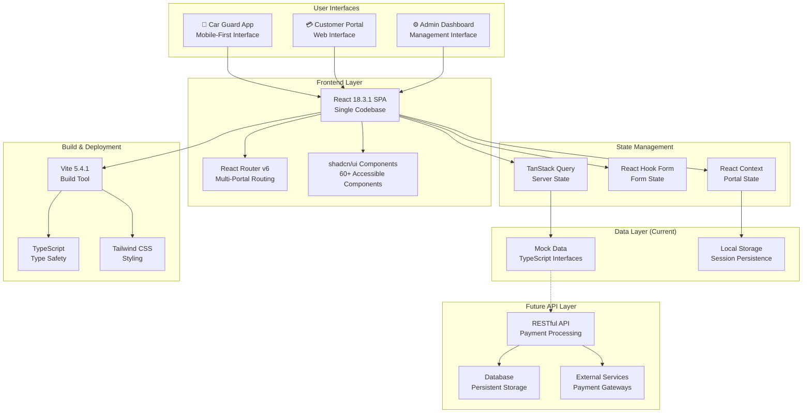
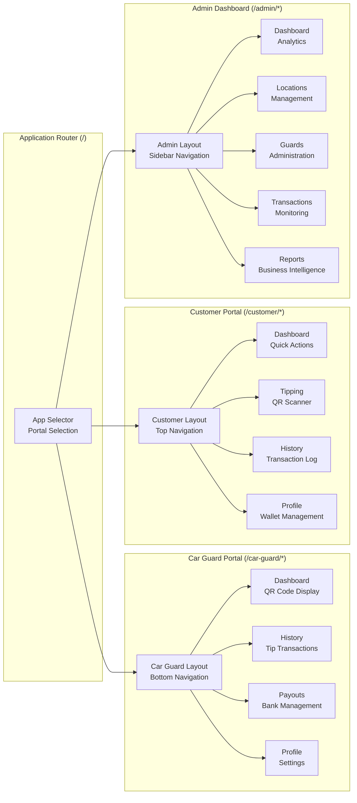
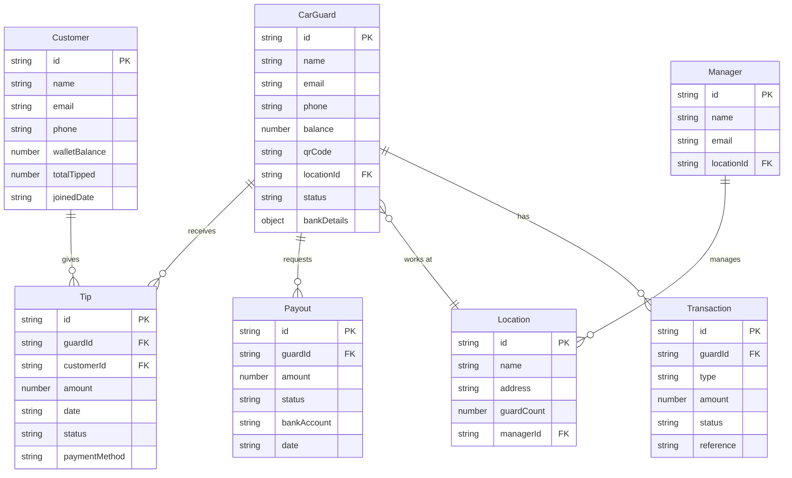
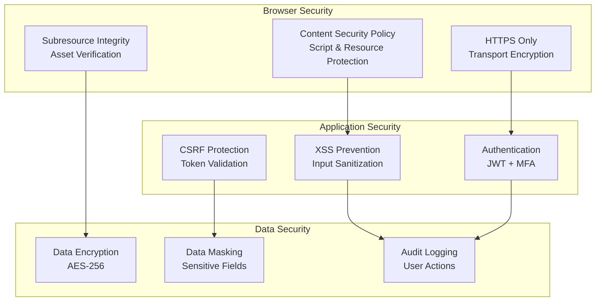
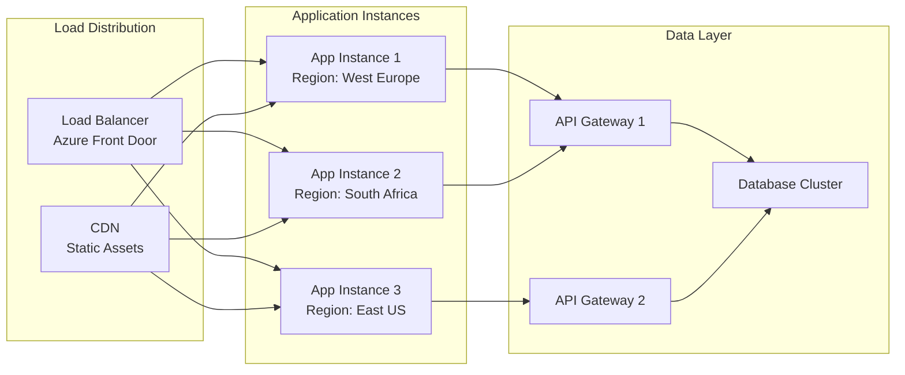
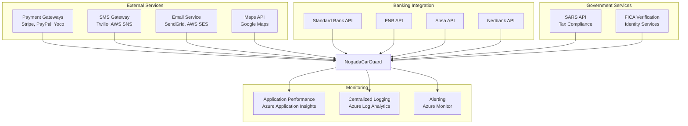

# System Overview

> **Stakeholder Relevance**: [All]

Comprehensive overview of the NogadaCarGuard system architecture, components, and integrations.

## Table of Contents
- [System Overview](#system-overview)
- [High-Level Architecture](#high-level-architecture)
- [Portal Architecture](#portal-architecture)
- [Technology Stack](#technology-stack)
- [Data Architecture](#data-architecture)
- [Security Architecture](#security-architecture)
- [Performance Considerations](#performance-considerations)
- [Scalability Design](#scalability-design)
- [Integration Points](#integration-points)

## High-Level Architecture

NogadaCarGuard is a multi-portal Single Page Application (SPA) built on modern React architecture, serving three distinct user interfaces through a unified codebase.



## Portal Architecture

### Multi-Portal Design Pattern

The application implements a sophisticated multi-portal architecture that provides three distinct user experiences while maintaining code reusability and consistency.



### Portal-Specific Features

#### 🚗 Car Guard App
- **Target Device**: Mobile phones and tablets
- **Key Features**: QR code generation, tip collection, payout management
- **Navigation**: Bottom navigation for thumb-friendly interaction
- **Offline Capability**: Local data persistence for poor connectivity areas

#### 💳 Customer Portal  
- **Target Device**: Desktop and mobile browsers
- **Key Features**: QR code scanning, payment processing, transaction history
- **Navigation**: Traditional top navigation with responsive design
- **Security Focus**: Payment data protection and transaction integrity

#### ⚙️ Admin Dashboard
- **Target Device**: Desktop computers and tablets
- **Key Features**: Location management, analytics, user administration
- **Navigation**: Sidebar navigation with hierarchical menu structure
- **Data Focus**: Business intelligence and operational management

## Technology Stack

### Frontend Framework
```typescript
// Core React Architecture
React: 18.3.1          // Concurrent features, improved performance
TypeScript: 5.5.3       // Full type safety across codebase
Vite: 5.4.1             // Fast build tool with HMR
```

### UI Framework
```typescript
// Component Library Stack
shadcn/ui               // 60+ accessible, customizable components
Radix UI                // Primitive components foundation
Tailwind CSS: 3.4.11    // Utility-first styling with tippa theme
Lucide React            // Consistent icon system
```

### State Management
```typescript
// State Management Strategy
TanStack Query: 5.56.2  // Server state and caching
React Hook Form: 7.53.0 // Form state management
Zod: 3.23.8             // Schema validation
React Context           // Portal-specific global state
```

### Development Tools
```typescript
// Development Experience
ESLint: 9.9.0           // Code quality and consistency
PostCSS                 // CSS processing
SWC                     // Fast TypeScript compilation
Path Aliases (@/)       // Clean import statements
```

## Data Architecture

### Current Mock Data System

The application currently operates with a comprehensive mock data system that simulates a complete backend.



### Helper Functions
```typescript
// Data Access Layer (src/data/mockData.ts)
getTipsByGuardId(guardId: string): Tip[]
getTipsByCustomerId(customerId: string): Tip[]
getPayoutsByGuardId(guardId: string): Payout[]
getGuardsByManagerId(managerId: string): CarGuard[]
getGuardsByLocationId(locationId: string): CarGuard[]
getTransactionsByGuardId(guardId: string): Transaction[]

// Utility Functions
formatCurrency(amount: number): string      // "R 123.45"
formatDate(date: string): string           // "Aug 25, 2025"
formatTime(time: string): string           // "2:30 PM"
```

## Security Architecture

### Frontend Security Layers



### Security Considerations by Portal

#### Car Guard App Security
- **QR Code Security**: Signed QR codes with expiration
- **Device Security**: Biometric authentication
- **Offline Security**: Encrypted local storage

#### Customer Portal Security
- **Payment Security**: PCI DSS compliance
- **Session Security**: Secure token management
- **Transaction Security**: End-to-end encryption

#### Admin Dashboard Security
- **Role-Based Access**: Hierarchical permissions
- **Audit Logging**: Complete action tracking
- **Data Protection**: Granular access controls

## Performance Considerations

### Build Performance
```bash
# Vite Build Optimization
Build Time: ~30 seconds
HMR Updates: <100ms
Bundle Size: ~2MB (compressed)
Code Splitting: Route-based chunks
```

### Runtime Performance
```typescript
// Performance Optimizations
React.memo()              // Component memoization
useMemo() / useCallback() // Hook optimization
React.lazy()              // Code splitting
Virtual Scrolling         // Large list optimization
```

### Loading Performance
- **First Contentful Paint**: <1.5s target
- **Largest Contentful Paint**: <2.5s target  
- **Time to Interactive**: <3.5s target
- **Cumulative Layout Shift**: <0.1 target

## Scalability Design

### Horizontal Scaling


### Component Scalability
- **Modular Architecture**: Independent portal deployment
- **Shared Components**: Reusable UI library
- **Lazy Loading**: Portal-specific code splitting
- **Caching Strategy**: Multi-layer caching approach

## Integration Points

### Current Integrations
- **Mock Data Layer**: TypeScript interfaces and helper functions
- **Local Storage**: Session persistence and offline capability
- **Browser APIs**: Geolocation, camera (QR scanning), notifications

### Planned Integrations


## System Boundaries

### Current System Scope
- ✅ Multi-portal frontend application
- ✅ Mock data system with TypeScript interfaces
- ✅ Responsive design for all device types
- ✅ Component library and design system
- ✅ Build and development toolchain

### Future System Scope
- 🔄 RESTful API backend
- 🔄 Real payment processing
- 🔄 Database integration
- 🔄 Authentication and authorization
- 🔄 Monitoring and analytics
- 🔄 CI/CD pipeline

### Out of Scope
- ❌ Native mobile applications (using PWA approach)
- ❌ Real-time chat/messaging
- ❌ Video calling or conferencing
- ❌ Inventory management beyond basic location tracking
- ❌ Third-party marketplace integration

---
**Document Information:**
- **Last Updated**: 2025-08-25
- **Status**: Active
- **Owner**: Architecture Team
- **Version**: 1.0.0
- **Next Review**: 2025-09-25