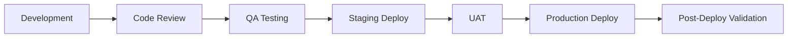

# Workflows Documentation

This section contains comprehensive workflow documentation for the NogadaCarGuard application, covering development processes, release management, and operational procedures.

## 📁 Contents

### Development Workflows
- **[Development Workflow](development-workflow.md)** - Development process and Git flow
- **[Release Process](release-process.md)** - Release management and versioning
- **[Incident Response](incident-response.md)** - Emergency procedures and escalation

## 🎯 Workflow Overview

### Development Process
Our development workflow is designed around a multi-portal React application with three distinct user interfaces:
- **Car Guard App** - Mobile-optimized tipping interface
- **Customer Portal** - Customer-facing web application
- **Admin Application** - Management dashboard

### Key Process Areas

#### 1. Code Development
- **Feature Branch Strategy** - Git flow with feature branches
- **Code Review Process** - Mandatory peer review for all changes
- **Quality Gates** - Automated and manual quality checks

#### 2. Release Management
- **Semantic Versioning** - Structured version numbering
- **Environment Promotion** - Development → Staging → Production
- **Rollback Procedures** - Safe deployment rollback strategies

#### 3. Incident Management
- **Response Procedures** - Structured incident response
- **Escalation Matrix** - Clear escalation paths
- **Communication Protocols** - Stakeholder notification procedures

## 🏗️ Application Context

### Technology Stack
- **Frontend**: React 18.3.1 with TypeScript 5.5.3
- **Build Tool**: Vite 5.4.1 with SWC
- **Repository**: Azure DevOps Git
- **Deployment**: Static web application hosting

### Portal-Specific Considerations
Each portal has unique workflow considerations:

| Portal | Workflow Focus | Key Stakeholders |
|--------|---------------|------------------|
| **Car Guard** | Mobile UX, Offline capability | Guards, Support Team |
| **Customer** | Payment flows, Security | Customers, Finance Team |
| **Admin** | Data integrity, Reporting | Managers, Operations |

## 🚀 Quick Start Workflows

### For Developers
```bash
# 1. Create feature branch
git checkout -b feature/tip-flow-enhancement

# 2. Develop and test locally
npm run dev

# 3. Run quality checks
npm run lint
npm run build

# 4. Submit for review
git push origin feature/tip-flow-enhancement
```

### For Releases
```bash
# 1. Create release branch
git checkout -b release/v1.2.0

# 2. Update version
# Update package.json version

# 3. Build and test
npm run build
npm run preview

# 4. Deploy and tag
git tag v1.2.0
```

## 📋 Workflow Standards

### Branch Naming Convention
- `feature/` - New features
- `bugfix/` - Bug fixes
- `hotfix/` - Critical production fixes
- `release/` - Release preparation
- `chore/` - Maintenance tasks

### Commit Message Format
```
type(scope): description

- feat: new feature
- fix: bug fix
- docs: documentation
- style: formatting
- refactor: code restructuring
- test: testing
- chore: maintenance
```

### Review Requirements
- **Minimum 1 reviewer** for feature branches
- **2 reviewers** for release branches
- **Architecture review** for major changes
- **Security review** for payment-related changes

## 🔄 Process Integration

### Development → QA → Production


### Continuous Quality
- **Pre-commit hooks** - Code formatting and basic validation
- **Build validation** - Successful compilation required
- **Security scanning** - Dependency and code security checks
- **Performance testing** - Bundle size and runtime performance

## 🎯 Stakeholder Relevance

| Stakeholder | Primary Workflows | Secondary Interest |
|-------------|------------------|-------------------|
| **Development Team** | Development, Code Review | Release, Incident Response |
| **QA Team** | Testing, Release | Development, Incident Response |
| **DevOps Team** | Release, Infrastructure | Development, Incident Response |
| **Product Team** | Release Planning | Development, Incident Response |
| **Operations Team** | Incident Response | Release, Monitoring |

## 📞 Emergency Contacts

### Primary Contacts
- **Development Lead**: [TBD]
- **DevOps Lead**: [TBD]
- **Product Owner**: [TBD]

### Escalation Path
1. **Level 1**: Team Lead
2. **Level 2**: Technical Manager
3. **Level 3**: Engineering Director

## 🔗 Related Documentation

### Internal Links
- [Architecture Analysis](../analysis/architecture-analysis.md)
- [Testing Strategies](../qa/testing-strategies.md)
- [CI/CD Pipelines](../devops/cicd-pipelines.md)
- [Security Standards](../security/security-standards.md)

### External Resources
- [Azure DevOps Documentation](https://docs.microsoft.com/en-us/azure/devops/)
- [React Best Practices](https://reactjs.org/docs/thinking-in-react.html)
- [TypeScript Guidelines](https://www.typescriptlang.org/docs/)

---

## Document Information
- **Version**: 1.0.0
- **Last Updated**: August 2025
- **Next Review**: September 2025
- **Owner**: Development Team
- **Stakeholders**: All Engineering Teams

**Tags**: `workflows` `development` `process` `documentation`