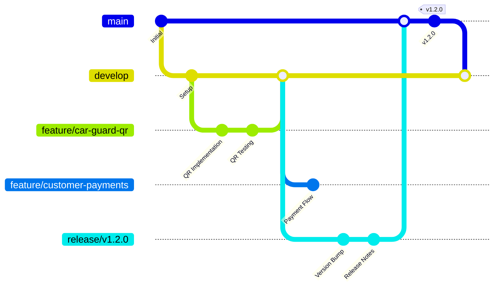

# Development Workflow

This document outlines the development workflow for the NogadaCarGuard multi-portal application, including Git flow, code review processes, and quality gates.

## 🎯 Overview

Our development workflow is designed to support a React/TypeScript/Vite application with three distinct portals while maintaining code quality, security, and reliability for a financial application handling car guard tipping transactions.

### Workflow Principles
- **Safety First** - Multiple quality gates for financial application
- **Portal Isolation** - Testing specific to each user interface
- **Continuous Integration** - Automated quality checks
- **Collaborative Development** - Peer review and knowledge sharing

## 🌊 Git Flow Strategy

### Branch Strategy
We use a modified Git Flow strategy optimized for continuous deployment:



### Branch Types and Naming

#### Main Branches
- **`main`** - Production-ready code
- **`develop`** - Integration branch for features

#### Supporting Branches
- **`feature/*`** - New features and enhancements
- **`bugfix/*`** - Non-critical bug fixes
- **`hotfix/*`** - Critical production fixes
- **`release/*`** - Release preparation
- **`chore/*`** - Maintenance and refactoring

#### Naming Conventions
```bash
feature/portal-functionality-description
├── feature/car-guard-qr-code-enhancement
├── feature/customer-payment-validation
├── feature/admin-transaction-reporting
└── feature/shared-authentication-improvement

bugfix/portal-issue-description
├── bugfix/car-guard-balance-display
├── bugfix/customer-tip-calculation
└── bugfix/admin-dashboard-loading

hotfix/critical-issue-description
├── hotfix/payment-gateway-timeout
└── hotfix/security-vulnerability-fix
```

## 👨‍💻 Development Process

### 1. Feature Development Workflow

#### Step 1: Create Feature Branch
```bash
# Update develop branch
git checkout develop
git pull origin develop

# Create feature branch
git checkout -b feature/customer-tip-validation
```

#### Step 2: Development Setup
```bash
# Install dependencies
npm install

# Start development server
npm run dev
# Server runs on http://localhost:8080, accessible on all interfaces
```

#### Step 3: Portal-Specific Development
Test functionality across relevant portals:

```bash
# Car Guard Portal
http://localhost:8080/car-guard

# Customer Portal  
http://localhost:8080/customer

# Admin Application
http://localhost:8080/admin
```

#### Step 4: Quality Checks
```bash
# Run linting
npm run lint

# Build for production
npm run build

# Build for development environment
npm run build:dev

# Preview production build
npm run preview
```

### 2. Code Review Process

#### Pre-Review Checklist
- [ ] Feature branch up to date with develop
- [ ] All quality checks passing
- [ ] Portal-specific testing completed
- [ ] Security considerations documented
- [ ] Performance impact assessed

#### Review Requirements

| Change Type | Reviewers Required | Special Requirements |
|-------------|-------------------|---------------------|
| **Feature** | 1+ developer | Portal owner approval |
| **Bug Fix** | 1+ developer | QA validation |
| **Hotfix** | 2+ senior developers | Security team approval |
| **Release** | 2+ developers + lead | Full regression testing |
| **Security** | 1+ security engineer | Penetration testing |

#### Review Criteria
1. **Functionality** - Feature works as specified
2. **Code Quality** - Follows TypeScript/React standards
3. **Security** - No financial data exposure risks
4. **Performance** - Bundle size and runtime impact
5. **Portal Integration** - No cross-portal interference
6. **Accessibility** - WCAG compliance for public interfaces

### 3. Testing Strategy

#### Local Testing Requirements
```bash
# Portal-specific smoke tests
# Car Guard Portal
curl http://localhost:8080/car-guard/

# Customer Portal
curl http://localhost:8080/customer/

# Admin Application
curl http://localhost:8080/admin/
```

#### Quality Gates
1. **Linting** - ESLint TypeScript rules
2. **Type Checking** - TypeScript compilation
3. **Build Validation** - Successful Vite build
4. **Bundle Analysis** - Size and performance metrics
5. **Security Scan** - Dependency vulnerability check

## 🔄 Continuous Integration (Recommended)

### Azure DevOps Pipeline (Recommended Setup)

```yaml
# azure-pipelines.yml (Recommended)
trigger:
  branches:
    include:
    - main
    - develop
    - feature/*
    - bugfix/*

variables:
  nodeVersion: '18.x'

stages:
- stage: Quality
  jobs:
  - job: CodeQuality
    pool:
      vmImage: 'ubuntu-latest'
    steps:
    - task: NodeTool@0
      inputs:
        versionSpec: $(nodeVersion)
    
    - script: npm ci
      displayName: 'Install dependencies'
    
    - script: npm run lint
      displayName: 'Run ESLint'
    
    - script: npm run build
      displayName: 'Build application'
    
    - script: npm run build:dev  
      displayName: 'Build for development'

- stage: Security
  jobs:
  - job: SecurityScan
    steps:
    - script: npm audit
      displayName: 'Security audit'
```

### Pre-commit Hooks (Recommended)

```json
{
  "husky": {
    "hooks": {
      "pre-commit": "lint-staged",
      "commit-msg": "commitlint -E HUSKY_GIT_PARAMS"
    }
  },
  "lint-staged": {
    "src/**/*.{ts,tsx}": [
      "eslint --fix",
      "prettier --write"
    ]
  }
}
```

## 📝 Commit Standards

### Commit Message Format
```
type(scope): description

[optional body]

[optional footer]
```

### Types
- **feat** - New feature
- **fix** - Bug fix
- **docs** - Documentation changes
- **style** - Code style changes (formatting)
- **refactor** - Code refactoring
- **test** - Test additions/modifications
- **chore** - Maintenance tasks

### Scopes (Portal-specific)
- **car-guard** - Car Guard App changes
- **customer** - Customer Portal changes
- **admin** - Admin Application changes
- **shared** - Shared component changes
- **build** - Build system changes

### Examples
```bash
feat(car-guard): add QR code refresh functionality
fix(customer): resolve tip amount validation error
docs(admin): update transaction report documentation
refactor(shared): optimize authentication hook performance
```

## 🚀 Deployment Workflow

### Development Environment
```bash
# Automatic deployment on develop branch merge
# URL: https://dev-nogada.example.com
```

### Staging Environment  
```bash
# Manual deployment from release branches
# URL: https://staging-nogada.example.com
```

### Production Environment
```bash
# Manual deployment from main branch
# URL: https://nogada.example.com
```

### Portal-Specific Validation
After each deployment, validate all portals:

| Portal | Validation URL | Key Functionality |
|--------|---------------|------------------|
| **Car Guard** | `/car-guard/dashboard` | QR code display, balance |
| **Customer** | `/customer/tip/test-guard` | Tip flow, payment |
| **Admin** | `/admin/dashboard` | Analytics, reports |

## 🛡️ Security Workflow

### Security Review Triggers
- Payment flow modifications
- Authentication changes
- Data handling updates
- Third-party integrations
- API endpoint changes

### Security Checklist
- [ ] No hardcoded credentials
- [ ] Input validation implemented
- [ ] XSS protection in place
- [ ] CSRF tokens for forms
- [ ] Secure data transmission
- [ ] Audit trail for transactions

## 📊 Performance Monitoring

### Bundle Size Monitoring
```bash
# Check bundle size after build
npm run build
# Review dist/ folder size

# Analyze bundle composition
npx vite-bundle-analyzer dist/
```

### Performance Metrics
- **Bundle Size** - < 500KB gzipped
- **Initial Load** - < 3 seconds
- **Portal Switch** - < 1 second
- **Payment Flow** - < 5 seconds end-to-end

## 🎯 Portal-Specific Considerations

### Car Guard App
- **Mobile-first testing** required
- **Offline functionality** validation
- **QR code generation** testing
- **Balance accuracy** verification

### Customer Portal
- **Payment security** validation
- **Cross-browser testing** required
- **Transaction verification** mandatory
- **User data protection** compliance

### Admin Application
- **Data integrity** checks
- **Report accuracy** validation
- **User permissions** testing
- **Audit trail** verification

## 🔧 Development Tools

### Required Tools
- **Node.js** 18.x or higher
- **npm** 9.x or higher
- **Git** 2.30 or higher
- **VS Code** (recommended)

### Recommended Extensions
- **TypeScript** language support
- **ESLint** integration
- **Prettier** code formatting
- **GitLens** Git integration
- **Vite** tooling support

## 🆘 Troubleshooting

### Common Issues

#### Build Failures
```bash
# Clear node_modules and rebuild
rm -rf node_modules package-lock.json
npm install
npm run build
```

#### TypeScript Errors
```bash
# Check TypeScript configuration
npx tsc --noEmit

# Update type definitions
npm update @types/*
```

#### Development Server Issues
```bash
# Clear Vite cache
npx vite --force

# Check port availability
netstat -ano | findstr :8080
```

### Portal-Specific Issues

#### Car Guard App
- **QR Code not displaying**: Check react-qr-code package
- **Balance incorrect**: Verify mock data calculations
- **Mobile layout broken**: Test responsive design

#### Customer Portal  
- **Payment flow errors**: Validate form schemas
- **Routing issues**: Check React Router configuration
- **Authentication problems**: Verify token handling

#### Admin Application
- **Dashboard not loading**: Check data fetching
- **Charts not rendering**: Verify Recharts integration
- **Sidebar collapsed**: Check SidebarProvider state

## 📞 Support and Escalation

### Development Support
- **Primary**: Development Team Lead
- **Secondary**: Senior Developer
- **Escalation**: Engineering Manager

### Technical Issues
1. **Check documentation** and troubleshooting guides
2. **Search existing issues** in Azure DevOps
3. **Create detailed issue** with reproduction steps
4. **Escalate if blocking** critical development

## 🔗 Related Documentation

### Internal Links
- [Architecture Analysis](../analysis/architecture-analysis.md)
- [Testing Strategies](../qa/testing-strategies.md)
- [CI/CD Pipelines](../devops/cicd-pipelines.md)
- [Release Process](release-process.md)

### External Resources
- [React Development Guidelines](https://reactjs.org/docs/thinking-in-react.html)
- [TypeScript Best Practices](https://www.typescriptlang.org/docs/)
- [Vite Documentation](https://vitejs.dev/guide/)
- [Azure DevOps Git](https://docs.microsoft.com/en-us/azure/devops/repos/git/)

---

## Document Information
- **Version**: 1.0.0
- **Last Updated**: August 2025
- **Next Review**: September 2025
- **Owner**: Development Team
- **Stakeholders**: Development Team, QA Team, DevOps Team

**Tags**: `development` `git-flow` `code-review` `quality-gates` `multi-portal`