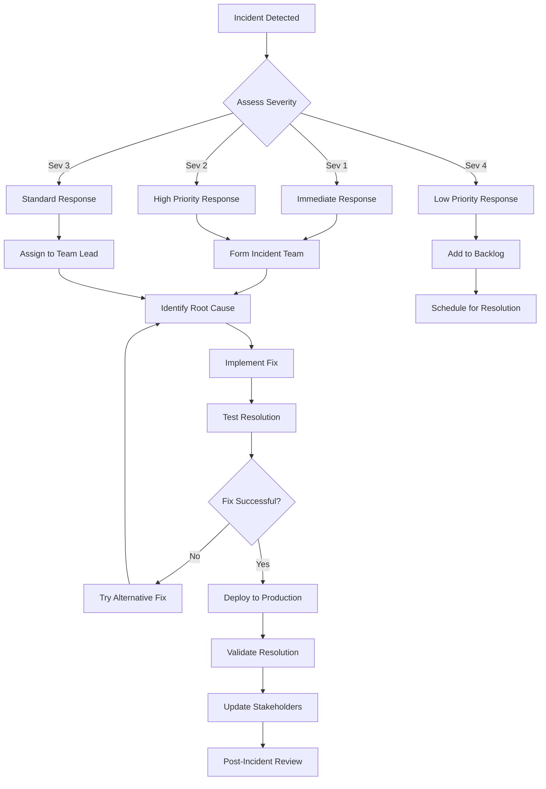
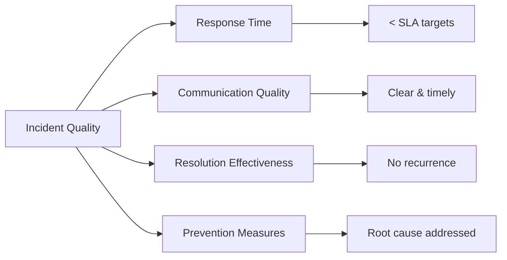

# Incident Response

This document outlines the incident response procedures for the NogadaCarGuard application, including emergency protocols, escalation procedures, and recovery processes for financial service disruptions.

## 🚨 Overview

NogadaCarGuard handles financial transactions for car guard tipping, making incident response critical for maintaining user trust and regulatory compliance. Our incident response process ensures rapid identification, containment, and resolution of issues affecting system availability or data integrity.

### Incident Response Principles
- **Financial Data Protection** - Prevent transaction data loss or corruption
- **Rapid Response** - Minimize service disruption time
- **Clear Communication** - Keep stakeholders informed
- **Learn and Improve** - Post-incident analysis and improvement
- **Regulatory Compliance** - Meet financial service requirements

## 🎯 Incident Classification

### Severity Levels

#### **Severity 1 (Critical)** ⚠️
- **Response Time**: Immediate (< 15 minutes)
- **Resolution Target**: < 4 hours
- **Escalation**: Automatic to executives

**Examples:**
- Complete system unavailability
- Payment processing failures
- Data corruption or loss
- Security breaches
- Financial calculation errors

#### **Severity 2 (High)** 🔥
- **Response Time**: < 30 minutes
- **Resolution Target**: < 8 hours
- **Escalation**: Department heads

**Examples:**
- Single portal unavailability
- Performance degradation > 50%
- Authentication system issues
- Critical feature failures
- Database connectivity issues

#### **Severity 3 (Medium)** ⚡
- **Response Time**: < 2 hours
- **Resolution Target**: < 24 hours
- **Escalation**: Team leads

**Examples:**
- Non-critical feature failures
- Minor performance issues
- UI/UX problems
- Report generation delays
- Third-party integration issues

#### **Severity 4 (Low)** 📝
- **Response Time**: < 8 hours
- **Resolution Target**: < 72 hours
- **Escalation**: Standard workflow

**Examples:**
- Cosmetic issues
- Documentation errors
- Minor usability improvements
- Non-blocking enhancement requests

## 🔄 Incident Response Workflow



## 🚀 Detection and Alerting

### Automated Monitoring (Recommended Setup)

#### Application Health Checks
```bash
# Health check endpoints (Recommended)
GET /health/live        # Application availability
GET /health/ready       # Database connectivity
GET /health/car-guard   # Car Guard portal status
GET /health/customer    # Customer portal status
GET /health/admin       # Admin portal status
```

#### Alert Triggers
1. **System Availability** - Health check failures
2. **Performance** - Response time > 5 seconds
3. **Error Rates** - Error rate > 2% over 5 minutes
4. **Transaction Volumes** - Unusual transaction patterns
5. **Security** - Failed authentication attempts

### Manual Detection Sources
- **User Reports** - Customer service tickets
- **Team Monitoring** - Developer observations
- **Business Stakeholders** - Operations team alerts
- **Third-party Services** - Payment gateway notifications

## 📞 Incident Team Structure

### **Incident Commander** 
- **Role**: Overall incident coordination
- **Responsibilities**: Decision making, communication, resource allocation
- **Primary**: Engineering Manager
- **Backup**: Senior Technical Lead

### **Technical Lead**
- **Role**: Technical investigation and resolution
- **Responsibilities**: Root cause analysis, fix implementation
- **Primary**: Senior Developer
- **Backup**: Lead Developer

### **Communications Lead**
- **Role**: Stakeholder communication
- **Responsibilities**: Status updates, external communication
- **Primary**: Product Manager
- **Backup**: Customer Success Manager

### **Subject Matter Experts**
- **Frontend Engineer** - Portal-specific issues
- **Security Engineer** - Security-related incidents
- **DevOps Engineer** - Infrastructure and deployment
- **QA Engineer** - Testing and validation

## 🔧 Response Procedures

### Immediate Response (Severity 1 & 2)

#### Step 1: Initial Assessment (5 minutes)
```bash
# Quick system health check
curl https://nogada.example.com/health/live
curl https://nogada.example.com/health/ready

# Check all portals
curl https://nogada.example.com/car-guard/
curl https://nogada.example.com/customer/
curl https://nogada.example.com/admin/

# Review recent deployments
git log --oneline -10
```

#### Step 2: Incident Declaration (10 minutes)
```
Incident Notification Template:

INCIDENT ALERT - Severity [1/2/3/4]

Summary: Brief description of the issue
Impact: User-facing impact description  
Start Time: [Timestamp]
Incident Commander: [Name]
Initial Response Team: [Names]

Status Page: [URL if applicable]
Communication Channel: #incident-response

Next Update: [Time]
```

#### Step 3: Containment (15 minutes)
- **Isolate affected components**
- **Prevent further damage**
- **Implement temporary workarounds**
- **Document all actions taken**

### Portal-Specific Response Procedures

#### Car Guard Portal Incidents
```bash
# Check QR code service
curl https://api.nogada.example.com/qr/generate

# Verify balance calculations
# Test with known guard ID
curl https://api.nogada.example.com/guards/test-guard/balance

# Check mobile responsiveness
# Use browser dev tools for mobile simulation
```

**Common Issues:**
- QR code generation failures
- Balance calculation errors
- Mobile layout problems
- Payout processing delays

#### Customer Portal Incidents
```bash
# Test payment flow
curl -X POST https://api.nogada.example.com/payments/test

# Check tip processing
# Verify with test transaction
curl https://api.nogada.example.com/tips/recent

# Validate customer authentication
curl https://api.nogada.example.com/auth/validate
```

**Common Issues:**
- Payment gateway timeouts
- Tip calculation errors
- Authentication failures
- Cross-browser compatibility

#### Admin Application Incidents
```bash
# Check reporting system
curl https://api.nogada.example.com/reports/daily

# Verify user management
curl https://api.nogada.example.com/admin/users

# Test data exports
curl https://api.nogada.example.com/admin/export/transactions
```

**Common Issues:**
- Report generation failures
- Data integrity problems
- User permission errors
- Dashboard loading issues

## 🛠️ Technical Resolution

### Root Cause Analysis Process
1. **Gather Evidence**
   - Error logs and stack traces
   - Recent deployments and changes
   - System metrics and performance data
   - User reports and reproduction steps

2. **Timeline Construction**
   - When did the issue start?
   - What changed before the incident?
   - How did the issue propagate?

3. **Hypothesis Formation**
   - Potential root causes
   - Test scenarios
   - Expected outcomes

4. **Resolution Testing**
   - Implement fixes in isolated environment
   - Validate fix effectiveness
   - Test for side effects

### Common Resolution Patterns

#### Application Rollback
```bash
# Rollback to previous version
git checkout main
git reset --hard [previous-commit-hash]

# Deploy previous version
npm run build
# Deploy to production

# Validate rollback
curl https://nogada.example.com/health
```

#### Configuration Fix
```bash
# Update environment variables
# Fix configuration settings
# Restart services if needed

# Validate configuration
npm run build
npm run preview
```

#### Database Issues
```sql
-- Check transaction integrity
SELECT COUNT(*) FROM transactions 
WHERE created_date = CURRENT_DATE;

-- Verify recent changes
SELECT * FROM audit_log 
WHERE timestamp > NOW() - INTERVAL '1 hour'
ORDER BY timestamp DESC;
```

#### Third-Party Integration
```bash
# Test external service connectivity
curl https://payment-gateway.example.com/health

# Check API credentials and limits
curl -H "Authorization: Bearer $API_KEY" \
  https://api.external-service.com/status
```

## 📢 Communication Protocols

### Internal Communication

#### Status Updates
```
Incident Update - [Timestamp]

Current Status: [Investigating/Mitigating/Resolved]
Impact: [Description of user impact]
Actions Taken: [Brief summary]
Next Steps: [What's happening next]
ETA: [Estimated resolution time]

Incident Commander: [Name]
```

#### Escalation Triggers
- **15 minutes**: No progress on Severity 1
- **30 minutes**: No resolution plan for Severity 1  
- **1 hour**: No resolution for Severity 1
- **2 hours**: Pattern of recurring issues
- **Any time**: Data integrity concerns

### External Communication

#### Customer Notification
```
System Status Update

We are currently experiencing [brief issue description]. 
Our team is actively working on a resolution.

Impact: [User-facing impact]
Expected Resolution: [Time estimate]

We will provide updates every 30 minutes until resolved.
Status page: https://status.nogada.example.com
```

#### Stakeholder Updates
- **Every 30 minutes** for Severity 1 incidents
- **Every hour** for Severity 2 incidents  
- **Daily** for Severity 3 incidents
- **As needed** for Severity 4 incidents

## 🔒 Security Incident Response

### Security-Specific Procedures
1. **Immediate Containment**
   - Isolate affected systems
   - Revoke compromised credentials
   - Block suspicious IP addresses
   - Preserve evidence for forensic analysis

2. **Assessment and Investigation**
   - Determine scope of compromise
   - Identify affected data
   - Analyze attack vectors
   - Document timeline of events

3. **Notification Requirements**
   - Internal security team (immediate)
   - Legal team (within 1 hour)
   - Regulatory bodies (as required)
   - Affected users (within 72 hours if data breach)

4. **Recovery and Hardening**
   - Implement additional security controls
   - Update access controls
   - Patch vulnerabilities
   - Enhance monitoring

### Financial Data Protection
- **Transaction Data**: Encrypted and access-logged
- **User PII**: Minimal collection and retention
- **Payment Information**: PCI DSS compliance required
- **Audit Trails**: Immutable logging of all access

## 📊 Incident Metrics and KPIs

### Response Time Metrics
- **Mean Time to Detect (MTTD)**: < 5 minutes
- **Mean Time to Acknowledge (MTTA)**: < 15 minutes  
- **Mean Time to Resolve (MTTR)**: < 4 hours (Sev 1)
- **Mean Time to Recovery (MTTR)**: < 2 hours (Sev 1)

### Quality Metrics


### Availability Targets
- **Overall System**: 99.9% uptime
- **Payment Processing**: 99.95% uptime
- **Individual Portals**: 99.5% uptime
- **API Services**: 99.9% uptime

## 🔍 Post-Incident Process

### Post-Incident Review (PIR)
**Timeline**: Within 72 hours of resolution

#### PIR Agenda
1. **Incident Summary**
   - Timeline of events
   - Impact assessment
   - Response effectiveness

2. **Root Cause Analysis**
   - Contributing factors
   - System weaknesses
   - Process gaps

3. **Action Items**
   - Technical improvements
   - Process enhancements
   - Preventive measures

4. **Documentation Updates**
   - Runbooks and procedures
   - Monitoring and alerting
   - Training materials

### PIR Template
```markdown
# Post-Incident Review - [Incident ID]

## Executive Summary
- **Start Time**: [Timestamp]
- **Resolution Time**: [Timestamp]
- **Duration**: [Time]
- **Impact**: [User/business impact]

## Timeline
| Time | Event | Actions Taken |
|------|-------|---------------|
| ... | ... | ... |

## Root Cause
[Detailed root cause analysis]

## What Went Well
- [Positive aspects of response]

## What Could Be Improved  
- [Areas for improvement]

## Action Items
| Action | Owner | Due Date | Status |
|--------|-------|----------|---------|
| ... | ... | ... | ... |
```

### Lessons Learned
- **Technical Debt**: Identify system improvements needed
- **Process Gaps**: Update procedures and documentation  
- **Training Needs**: Team skill development areas
- **Tool Requirements**: Monitoring and alerting improvements

## 🏃‍♂️ Runbooks

### Quick Reference Runbooks

#### Complete System Outage
1. Check cloud provider status
2. Verify DNS resolution
3. Test load balancer health
4. Check application logs
5. Restart services if needed
6. Validate recovery

#### Payment Processing Issues
1. Test payment gateway connectivity
2. Check API rate limits and quotas
3. Verify merchant account status  
4. Review transaction logs
5. Test with small transaction
6. Monitor transaction success rate

#### Database Performance Issues
1. Check database connection pool
2. Review slow query logs
3. Check disk space and IOPS
4. Review recent schema changes
5. Analyze query execution plans
6. Consider read replica failover

#### Authentication System Problems
1. Check OAuth provider status
2. Verify JWT token validation
3. Test session management
4. Review rate limiting rules
5. Check user database connectivity
6. Validate permission systems

## 📱 Emergency Contacts

### Primary On-Call Rotation
| Role | Primary | Secondary | Emergency |
|------|---------|-----------|-----------|
| **Incident Commander** | [Name] [Phone] | [Name] [Phone] | [Name] [Phone] |
| **Technical Lead** | [Name] [Phone] | [Name] [Phone] | [Name] [Phone] |
| **DevOps Engineer** | [Name] [Phone] | [Name] [Phone] | [Name] [Phone] |
| **Security Engineer** | [Name] [Phone] | [Name] [Phone] | [Name] [Phone] |

### Executive Escalation
- **Engineering Director**: [Name] [Phone]
- **CTO**: [Name] [Phone]
- **CEO**: [Name] [Phone] (Severity 1 only)

### External Contacts
- **Cloud Provider Support**: [Contact Info]
- **Payment Gateway Support**: [Contact Info]
- **Legal Counsel**: [Contact Info] (Security incidents)
- **PR/Communications**: [Contact Info] (Public incidents)

### Communication Channels
- **Primary**: Slack #incident-response
- **Secondary**: SMS/Phone chain
- **Emergency**: Conference bridge [Number]
- **Status Page**: https://status.nogada.example.com

## 🔧 Tools and Resources

### Incident Management Tools (Recommended)
- **PagerDuty**: Incident alerting and escalation
- **Slack**: Communication and coordination
- **Jira**: Issue tracking and documentation
- **Confluence**: Runbook and procedure documentation

### Monitoring and Observability
- **Application Metrics**: Azure Application Insights
- **Infrastructure Monitoring**: Azure Monitor
- **Log Aggregation**: Azure Log Analytics
- **Uptime Monitoring**: External service (Pingdom/UptimeRobot)

### Recovery Tools
```bash
# Emergency deployment script
#!/bin/bash
# emergency-deploy.sh

COMMIT_HASH=$1
if [ -z "$COMMIT_HASH" ]; then
    echo "Usage: ./emergency-deploy.sh <commit-hash>"
    exit 1
fi

echo "Emergency deployment of $COMMIT_HASH"
git checkout main
git reset --hard $COMMIT_HASH
npm ci
npm run build

# Deploy to production
echo "Deploying to production..."
# Add deployment commands here

echo "Emergency deployment complete"
```

## 🔗 Related Documentation

### Internal Links
- [Development Workflow](development-workflow.md)
- [Release Process](release-process.md)
- [Security Standards](../security/security-standards.md)
- [Monitoring & Alerting](../devops/monitoring-alerting.md)

### External Resources
- [NIST Incident Response Guide](https://csrc.nist.gov/publications/detail/sp/800-61/rev-2/final)
- [Azure Service Health](https://azure.microsoft.com/en-us/features/service-health/)
- [PCI DSS Incident Response](https://www.pcisecuritystandards.org/)

---

## Document Information
- **Version**: 1.0.0
- **Last Updated**: August 2025
- **Next Review**: September 2025
- **Owner**: Operations Team
- **Stakeholders**: All Engineering Teams, Product Team, Executive Team

**Tags**: `incident-response` `emergency-procedures` `financial-services` `multi-portal` `security`