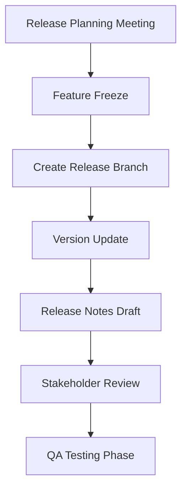
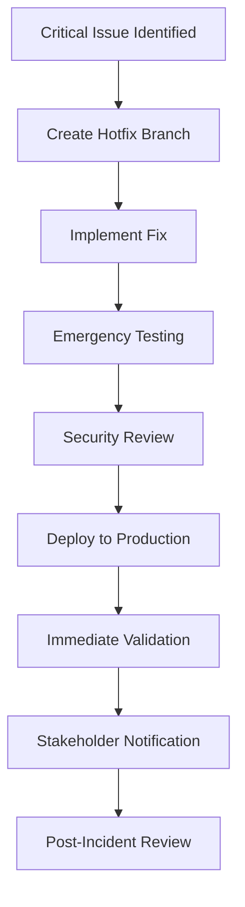
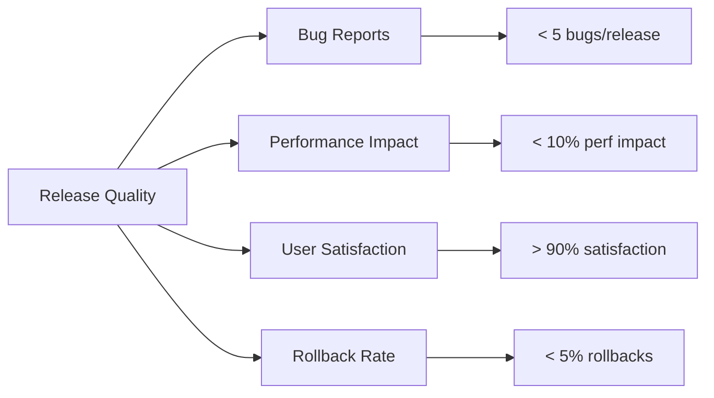

# Release Process

This document outlines the release management workflow for the NogadaCarGuard multi-portal application, including versioning strategy, deployment procedures, and rollback processes.

## 🎯 Overview

Our release process ensures safe, reliable deployments of the NogadaCarGuard application across three portals while maintaining system stability and minimizing downtime for a financial application.

### Release Principles
- **Zero-Downtime Deployments** - Continuous availability
- **Rollback Capability** - Quick recovery from issues
- **Portal Validation** - All three portals tested
- **Financial Data Integrity** - Transaction safety paramount
- **Stakeholder Communication** - Clear release communication

## 📦 Versioning Strategy

### Semantic Versioning (SemVer)
We follow semantic versioning: `MAJOR.MINOR.PATCH`

```
Version Format: X.Y.Z
├── X (Major) - Breaking changes, major features
├── Y (Minor) - New features, backward compatible
└── Z (Patch) - Bug fixes, security patches
```

#### Version Examples
- **v1.0.0** - Initial production release
- **v1.1.0** - New customer payment features
- **v1.1.1** - Bug fix for tip calculations
- **v2.0.0** - Major portal redesign

### Portal-Specific Versioning
All portals share the same version number but may have different feature sets:

| Version | Car Guard Portal | Customer Portal | Admin Application |
|---------|-----------------|-----------------|------------------|
| v1.2.0 | QR enhancements | Payment options | Advanced reports |
| v1.1.0 | Balance display | Tip history | Transaction logs |
| v1.0.0 | Basic features | Basic features | Basic features |

## 🚀 Release Types

### 1. Regular Release
**Frequency**: Bi-weekly
**Purpose**: New features and non-critical fixes

### 2. Patch Release  
**Frequency**: As needed
**Purpose**: Bug fixes and minor improvements

### 3. Hotfix Release
**Frequency**: Emergency only
**Purpose**: Critical security or data integrity issues

### 4. Security Release
**Frequency**: As needed
**Purpose**: Security vulnerabilities and patches

## 🔄 Release Workflow

### Pre-Release Phase

#### 1. Release Planning


#### 2. Release Branch Creation
```bash
# Create release branch from develop
git checkout develop
git pull origin develop
git checkout -b release/v1.2.0

# Update version in package.json
npm version 1.2.0 --no-git-tag-version

# Commit version update
git add package.json
git commit -m "chore(release): bump version to 1.2.0"
git push origin release/v1.2.0
```

### Release Preparation

#### 3. Quality Assurance
```bash
# Install dependencies
npm ci

# Run full test suite
npm run lint
npm run build
npm run build:dev

# Portal-specific validation
npm run dev
# Test all three portals manually
```

#### 4. Build Validation
```bash
# Production build
npm run build

# Verify build output
ls -la dist/
du -sh dist/

# Test production build
npm run preview
```

#### 5. Release Notes Generation
Create comprehensive release notes in `RELEASE_NOTES.md`:

```markdown
# Release v1.2.0 - August 2025

## 🚀 New Features

### Car Guard Portal
- Enhanced QR code refresh functionality
- Real-time balance updates
- Improved mobile responsiveness

### Customer Portal  
- Multiple payment method support
- Transaction history filtering
- Tip amount suggestions

### Admin Application
- Advanced analytics dashboard
- Bulk payout processing
- Enhanced user management

## 🐛 Bug Fixes
- Fixed tip calculation rounding errors
- Resolved mobile layout issues
- Corrected timestamp formatting

## 🔒 Security Updates
- Updated dependency vulnerabilities
- Enhanced input validation
- Improved session management

## 📊 Performance Improvements
- Reduced bundle size by 15%
- Faster initial load times
- Optimized chart rendering
```

### Deployment Phase

#### 6. Staging Deployment
```bash
# Deploy to staging environment
# (Assuming CI/CD pipeline deployment)

# Manual verification steps
curl https://staging-nogada.example.com/health
curl https://staging-nogada.example.com/car-guard/
curl https://staging-nogada.example.com/customer/
curl https://staging-nogada.example.com/admin/
```

#### 7. User Acceptance Testing (UAT)
Portal-specific UAT checklist:

**Car Guard Portal UAT**
- [ ] QR code generation and display
- [ ] Balance retrieval and updates
- [ ] Payout request functionality
- [ ] Mobile device compatibility
- [ ] Offline mode handling

**Customer Portal UAT**
- [ ] Tip flow end-to-end
- [ ] Payment processing
- [ ] Transaction history accuracy
- [ ] Cross-browser compatibility
- [ ] Responsive design validation

**Admin Application UAT**
- [ ] Dashboard analytics accuracy
- [ ] Report generation functionality
- [ ] User management operations
- [ ] Data export capabilities
- [ ] Permission controls

#### 8. Production Deployment
```bash
# Merge release branch to main
git checkout main
git pull origin main
git merge release/v1.2.0
git push origin main

# Create and push tag
git tag -a v1.2.0 -m "Release version 1.2.0"
git push origin v1.2.0

# Deploy to production
# (Trigger production deployment pipeline)
```

### Post-Release Phase

#### 9. Post-Deployment Validation
```bash
# Production health checks
curl https://nogada.example.com/health

# Portal availability checks
curl https://nogada.example.com/car-guard/
curl https://nogada.example.com/customer/  
curl https://nogada.example.com/admin/

# Functional validation
# - Test critical user journeys
# - Verify transaction processing
# - Confirm data integrity
```

#### 10. Release Communication
Send release notification to stakeholders:

```
Subject: NogadaCarGuard v1.2.0 Released Successfully

The NogadaCarGuard v1.2.0 release has been deployed to production.

Key Updates:
- Enhanced QR code functionality in Car Guard app
- New payment options in Customer portal  
- Advanced reporting in Admin application

All systems are operational and functioning normally.

Next release scheduled: [Date]
```

#### 11. Cleanup
```bash
# Merge back to develop
git checkout develop
git merge main
git push origin develop

# Delete release branch
git branch -d release/v1.2.0
git push origin --delete release/v1.2.0
```

## 🔥 Hotfix Process

### Emergency Hotfix Workflow


### Hotfix Steps
```bash
# 1. Create hotfix branch from main
git checkout main
git pull origin main
git checkout -b hotfix/payment-gateway-timeout

# 2. Implement fix and test
# ... make necessary changes ...
npm run lint
npm run build

# 3. Update version (patch increment)
npm version patch --no-git-tag-version

# 4. Commit and deploy
git add .
git commit -m "hotfix: resolve payment gateway timeout issue"
git push origin hotfix/payment-gateway-timeout

# 5. Merge to main and deploy
git checkout main
git merge hotfix/payment-gateway-timeout
git tag v1.2.1
git push origin main v1.2.1

# 6. Merge back to develop
git checkout develop
git merge main
git push origin develop
```

### Hotfix Criteria
- **Payment system failures**
- **Security vulnerabilities** 
- **Data corruption risks**
- **System unavailability**
- **Critical user-blocking bugs**

## 🔄 Rollback Procedures

### Automatic Rollback Triggers
- **Health check failures** for > 5 minutes
- **Error rate increase** > 5% baseline
- **Payment processing failures** > 1%
- **Critical functionality unavailable**

### Manual Rollback Process
```bash
# 1. Identify last known good version
git tag -l | tail -5

# 2. Create rollback branch
git checkout -b rollback/v1.1.9-to-v1.1.8
git reset --hard v1.1.8

# 3. Deploy previous version
# (Trigger rollback deployment)

# 4. Validate rollback success
curl https://nogada.example.com/health
# Test critical functionality

# 5. Communicate rollback
# Notify stakeholders of rollback and next steps
```

### Rollback Validation Checklist
- [ ] All portals accessible
- [ ] Payment processing functional
- [ ] Database integrity maintained
- [ ] User sessions preserved
- [ ] Analytics tracking active

## 📊 Release Metrics

### Key Performance Indicators
- **Deployment Success Rate**: > 95%
- **Rollback Frequency**: < 5% of releases
- **Time to Deploy**: < 30 minutes
- **Mean Time to Recovery**: < 15 minutes
- **Post-Release Issues**: < 3 per release

### Release Quality Metrics


## 🎯 Portal-Specific Release Considerations

### Car Guard Portal
- **Mobile device testing** across Android/iOS
- **QR code functionality** validation
- **Offline mode** behavior verification
- **Balance accuracy** after deployments

### Customer Portal
- **Payment gateway integration** testing
- **Cross-browser compatibility** validation
- **SSL certificate** verification
- **Transaction logging** accuracy

### Admin Application  
- **Data integrity** validation
- **Report generation** functionality
- **User permission** verification
- **Audit trail** continuity

## 🛡️ Security Release Process

### Security Patch Workflow
1. **Vulnerability Assessment** - Impact and severity analysis
2. **Patch Development** - Fix implementation and testing
3. **Security Review** - Independent security validation
4. **Expedited Testing** - Focused security testing
5. **Emergency Deployment** - Out-of-band release if critical
6. **Post-Patch Validation** - Security posture verification

### Security Communication
```
Subject: Security Update - NogadaCarGuard v1.2.3

A security update has been applied to the NogadaCarGuard application.

Details:
- Security patch for dependency vulnerability
- No user data compromised
- No user action required

All systems remain operational.
```

## 📅 Release Calendar

### Regular Release Schedule
- **Week 1**: Feature development
- **Week 2**: Feature completion and testing
- **Week 3**: Release preparation and QA
- **Week 4**: Release deployment and validation

### Release Windows
- **Primary**: Tuesday 10:00 AM - 2:00 PM
- **Secondary**: Thursday 10:00 AM - 2:00 PM
- **Emergency**: Any time with approval

### Blackout Periods
- **Month-end processing** (Last 2 days of month)
- **Holiday periods** (Major holidays ±2 days)
- **Peak usage times** (Friday evenings, weekends)

## 🔧 Release Tools and Automation

### Recommended CI/CD Pipeline
```yaml
# Azure DevOps Release Pipeline (Recommended)
stages:
- stage: Build
  jobs:
  - job: BuildApplication
    steps:
    - task: NodeTool@0
      inputs:
        versionSpec: '18.x'
    
    - script: |
        npm ci
        npm run lint
        npm run build
      displayName: 'Build and validate'
    
    - task: PublishBuildArtifacts@1
      inputs:
        pathToPublish: 'dist'
        artifactName: 'nogada-build'

- stage: Deploy_Staging
  dependsOn: Build
  jobs:
  - deployment: DeployStaging
    environment: 'staging'
    strategy:
      runOnce:
        deploy:
          steps:
          - task: AzureStaticWebApp@0
            inputs:
              app_location: '/'
              api_location: ''
              output_location: 'dist'

- stage: Deploy_Production
  dependsOn: Deploy_Staging
  condition: and(succeeded(), eq(variables['Build.SourceBranch'], 'refs/heads/main'))
  jobs:
  - deployment: DeployProduction
    environment: 'production'
    strategy:
      runOnce:
        deploy:
          steps:
          - task: AzureStaticWebApp@0
            inputs:
              app_location: '/'
              api_location: ''
              output_location: 'dist'
```

### Release Automation Scripts
```bash
#!/bin/bash
# release-deploy.sh

set -e

VERSION=$1
ENVIRONMENT=$2

if [ -z "$VERSION" ] || [ -z "$ENVIRONMENT" ]; then
    echo "Usage: ./release-deploy.sh <version> <environment>"
    exit 1
fi

echo "Deploying NogadaCarGuard $VERSION to $ENVIRONMENT"

# Build application
npm ci
npm run lint
npm run build

# Deploy to target environment
case $ENVIRONMENT in
    "staging")
        echo "Deploying to staging..."
        # Add staging deployment commands
        ;;
    "production")
        echo "Deploying to production..."
        # Add production deployment commands
        ;;
    *)
        echo "Unknown environment: $ENVIRONMENT"
        exit 1
        ;;
esac

echo "Deployment complete: $VERSION to $ENVIRONMENT"
```

## 📞 Release Support

### Release Team Contacts
- **Release Manager**: [TBD]
- **QA Lead**: [TBD]  
- **DevOps Engineer**: [TBD]
- **Security Engineer**: [TBD]

### Escalation Matrix
1. **Release Issues**: Release Manager
2. **Technical Problems**: DevOps Engineer
3. **Quality Concerns**: QA Lead
4. **Security Issues**: Security Engineer
5. **Business Impact**: Product Owner

### Release Communication Channels
- **Primary**: Email notifications
- **Secondary**: Slack #releases channel
- **Emergency**: Phone/SMS escalation
- **Stakeholders**: Weekly release reports

## 🔗 Related Documentation

### Internal Links
- [Development Workflow](development-workflow.md)
- [Incident Response](incident-response.md)
- [CI/CD Pipelines](../devops/cicd-pipelines.md)
- [Testing Strategies](../qa/testing-strategies.md)

### External Resources
- [Semantic Versioning](https://semver.org/)
- [Azure DevOps Releases](https://docs.microsoft.com/en-us/azure/devops/pipelines/release/)
- [React Deployment Best Practices](https://create-react-app.dev/docs/deployment/)

---

## Document Information
- **Version**: 1.0.0
- **Last Updated**: August 2025
- **Next Review**: September 2025
- **Owner**: Release Management Team
- **Stakeholders**: Development Team, QA Team, DevOps Team, Product Team

**Tags**: `release-management` `deployment` `versioning` `rollback` `multi-portal`